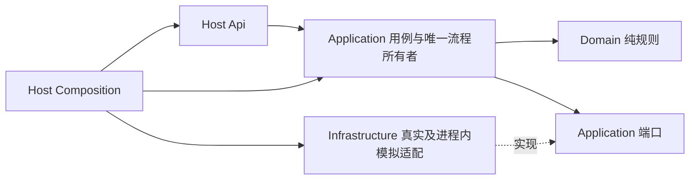

> 2026-09-21 用户授权增量：外部PLC、XYZ、PC_Start_Cmd按钮、15/15及F后独立配方按 `specs/002-plc-xyz-recipes` 执行。下文XY-only及仅进程内模拟是原001基线，保留用于FullSimulation回归；不得用于否决002的新要求。第一工位移交前仍无配方调用。

# 技术方案：第一工位公共准备、3D高度采集与F料盘扫码

2026-09-26夜间008依赖实施细化：复用Coordinator/ControlLatch及RunExecution保存，在公共夹紧完成、3D/F结束与后继动作之前消费正常暂停安全边界；观察已在途动作时不因普通PauseRequested跳过反馈/期限。008检测和盘末消费同一边界能力，正常continue仍走现有授权/核验API，故障保持新run规则。必要同run至Final对照见008 T069，不另建页面恢复包。

T090增量由现有PublicPreparationHandoffV2Consumer解析成员resolvedObjects；S2源点按成员键，S3物理预期按整体键，检测部位仍独立；依据[多对象合同](../008-recipe-driven-inspection/contracts/test-multi-object.md)，完成本轮相关对象翻转放回后统一复查3D姿态，F不重绑、不用父目标补缺。

**功能标识**：001-station01-public-preparation  
**方案版本 / 日期**：1.3.0 / 2026-09-24  
**规格**：[spec.md](spec.md) 1.3.0；[规格质量清单](checklists/requirements.md)  
**当前适用宪章版本**：3.2.0；历史设计与证据保留产生时版本；[宪章](../../.specify/memory/constitution.md)、[对齐记录](../../.specify/memory/constitution-alignment.md)  
**模板**：[plan-template.md](../../.specify/templates/plan-template.md)  
**状态**：本方案在已有M1代码和现有任务清单基础上更新；后端模拟闭环及部分启动/查询接口已有代码，前端联调所需的暂停、取消、恢复、配置校验、统一错误、事件通知和媒体持久索引等接口仍有实现缺口。该结论不表示完整第一工位、真实相机/算法、真实设备或生产兼容性已验证。  
**范围**：当前项目后端及面向前端的公开接口合同；前端页面、桌面壳及独立虚拟下位机不在本功能实现范围内。

## 1. 方案摘要

采用一个ASP.NET Core Host、本地模块化单体、唯一公共流程状态所有者及统一运动准入。公共配置和固定点位先校验冻结；完成启动夹紧、3D、F、计划生成和配方绑定后，原子保存版本化移交。`s01-handoff/1.0` 保留兼容查询；第一工位连续主流程使用 `s01-handoff/2.0`，提交后由同一 Host 自动续接 003 Detection，不新增启动入口，也不把 handoff 当作最终完成。

本方案设计可替换端口、短事件流转、有界资源及独立保存回执；全模拟由后端进程内设备/算法替身驱动同一业务逻辑。七环节模拟耗时独立于业务预算，实际时间和可控时钟通过同一期限机制产生超时。算法异常可有限收敛并按安全条件继续；动作未知、必要保存失败不能套用该规则。

依据：[REQ V1.1](../../软件需求规格说明书/软件需求规格说明书_V1.1_开发范围版.md) TASK-002/003、CTL-004/007/010、ID-001/005、ALG-013/014、DAT-007、SAF-011；[ARCH V1.3](../../../gaode/s01-upper/docs/architecture/architecture-v1.3.md) §3/6/7/9/12/13兼容部分；P01–P12及spec CL-01至CL-09。冲突继续按spec C01–C11裁决，研究解释见[research.md](research.md)。

**排除**：产品配方查找/匹配/加载/冻结、后续计划、E及缺陷采集、翻面/旋转/分拣/卸料、自动回零/对焦/Z扫描、完整配方平台、前端/WPF、独立模拟服务、完整数据库维护工具、合同验收及人员分工。

## 2. 技术上下文（Technical Context）

| 事项 | 本阶段开发选择 | 决策来源与状态 | 尚缺证据/OPEN |
| --- | --- | --- | --- |
| 后端运行时 | C# net10.0 / ASP.NET Core；SDK10.0.401 | ARCH建议及本机只读证据；D01开发选择；M1已构建 | OPEN-22，未验证生产OS/SDK |
| 算法运行 | Python3.12.10常驻Worker候选；模拟绑定进程内IAlgorithmPort | D06，NDJSON控制+媒体引用；保留算法调用 | 算法包、依赖、GPU/SDK及真实输入格式OPEN-22/26 |
| 数据 | SQLite/EF Core10.0.12，单写通道、媒体文件、独立查询 | D05；M1已完成SQLite/媒体软件验证 | 原生加载、保存/断电能力、路径及容量OPEN-20/22 |
| 设备采集 | IPlcStatePort/IPlcActionPort、IMotionPort、ICapturePort | D07；真实地址不填；模拟自身维护状态 | OPEN-05/08/09/10/11/13/24/26 |
| 时钟 | TimeProvider.System / FakeTimeProvider10.0.0，共用DeadlineScheduler | D04；边界响应必须早于deadline；M1已验证 | 真实时间口径OPEN-18 |
| 软件验证 | xUnit2.9.3、Test SDK18.10.1、Mvc.Testing10.0.12候选 | M1规则/合同/集成验证已完成 | 不证明真机通过；M2矩阵仍未执行 |
| 容量 | 显式s01-budget-dev/1.0.0测试配置 | 本次团队定义，可检查；非生产默认 | OPEN-18/20 |
| API/权限 | REST、SignalR、后端策略；先冻结公开DTO、统一错误、ETag、权限和事件语义，再补齐路由 | D09、CL-07至CL-09；四类角色测试授权 | 当前代码仅有runs、查询、status、handoff、media和基础Hub；pause/cancel/recovery/continue/config validate及合同事件/ETag/媒体持久索引仍待实现；OPEN-23及S01-Q02 |

Vue/TypeScript/Pinia及WPF/WebView2只作外部表示层背景，不生成其工程。详细工具链和版本证据在research §1。

## 3. 宪章检查（Constitution Check）

“符合”仅评价本方案约束及证据覆盖，不表示实现/测试已通过。设计前以实际spec、宪章、环境扫描检查；设计后以本次设计资产复核。待补充只限制表列真实依赖。

| 原则 | 本功能检查点 | 设计前 | 设计后 | 证据/受限范围与可继续部分 |
| --- | --- | --- | --- | --- |
| P01 | 来源优先及冲突可追溯 | 符合 | 符合 | spec C01–C11、research §3；已重新读取最新资料，不复制旧工艺 |
| P02 | 仅后端及NotIntegrated扩展边界 | 符合 | 符合 | 本文§1/4；公共合同、API不提供范围外业务；完整配方/维护不适用 |
| P03 | 公共3D有无/姿态/F XY、检测XYZ取配置、固定对焦 | 待补充，仅限制所列部分 | 待补充，仅限制所列部分 | 配置合同§1和公共Test样例满足设计；真实坐标/范围/光学OPEN-09/22/26；A/B、产品配方生命周期不适用 |
| P04 | 算法有限终态与真实安全 | 待补充，仅限制所列部分 | 待补充，仅限制所列部分 | device、configuration-time合同及SV映射；真实停止/互锁反馈OPEN-08/10/11/24/26，不限制模拟 |
| P05 | Domain纯规则、端口、唯一Host/状态/控制权 | 符合 | 符合 | 本文§4依赖及所有者；流程无寄存器、SDK、直接磁盘I/O |
| P06 | 有界并发与媒体所有权 | 待补充，仅限制所列部分 | 待补充，仅限制所列部分 | 本文§7及预算示例给测试容量/保留终态路径；生产OPEN-18/20；A/B配对不适用 |
| P07 | 身份/状态分离及未知动作 | 待补充，仅限制所列部分 | 待补充，仅限制所列部分 | data-model、common/device；PLC关联OPEN-24，后续高度绑定S01-Q01；本阶段质量未判定，OPEN-16融合不适用 |
| P08 | 意图/事实保存、快照及维护互斥 | 待补充，仅限制所列部分 | 待补充，仅限制所列部分 | persistence-handoff合同、data-model §5；测试库独立准备且Host不迁移，生产保留/恢复参数OPEN-20 |
| P09 | 同一流程、来源标记及可验证诊断 | 符合（历史范围） | 待补充（FR-041） | 历史verification矩阵不证明新增启动失败可定位；T087待实现验证 |
| P10 | OPEN局部限制及测试值用途 | 待补充，仅限制所列部分 | 待补充，仅限制所列部分 | research、本文§10完整保留12项OPEN及2项S01；工具链仅开发证据 |
| P11 | 配置驱动、注册能力、无脚本旁路 | 符合 | 符合 | configuration-time §1、三个schema、SV-14/15/21/35；未注册算法不执行但不阻独立动作 |
| P12 | 后端只能向前端提供API/状态通知，不改变客户确认原型 | 不适用并说明 | 不适用并说明 | 本功能只实现后端合同；原型和前端页面由006独立规格维护，不创建页面或修改原型 |

没有已知“违反待修正”项。参数待补充不被写成全部通过；真实动作依赖未满足时只能保留相应适配及模拟验证。详情可在[设计检查记录](checklists/design.md)核对。

## 4. 结构与职责（Project Structure）

当前已有后端工程和M1实现；以下结构是本功能后续接口补齐及验证涉及的工程范围，不新增前端工程、桌面壳或独立虚拟下位机：

```text
backend/
  src/
    Gaode.Domain/                 纯模型、状态转换、完成门、F候选规则
    Gaode.Application/
      Station01/                  Coordinator与用例
      Ports/                      设备、采集、算法、保存、配置、身份、时钟
      Motion/                     统一资源准入、设备请求关联
      Capabilities/               注册能力合同与受限策略
    Gaode.Infrastructure/
      Configuration/ Devices/ Algorithms/ Media/ Persistence/
      Diagnostics/ Simulation/    进程内适配器，不是独立服务
    Gaode.Host/
      Api/                        REST、鉴权及SignalR
      Composition/                唯一组合根、生命周期及Provider绑定
  tests/
    Gaode.Rules.Tests/
    Gaode.Contracts.Tests/
    Gaode.Integration.Tests/       含离线Test库准备夹具及恢复验证
```

依赖：Domain不引用其他工程；Application→Domain；Infrastructure→Application/Domain实现端口；Host.Api→Application（不直接访问Infrastructure），Host.Composition→以上工程完成装配。API DTO限接口模块，共享端口类型放Application，不为文件组织多建Contracts工程。真实Python进程为算法执行适配的被管理组件，不拥有业务流程；模拟算法不依赖Python安装。



### 4.1 状态和资源所有权

| 模块/端口 | 唯一所有者 | 依赖方向/边界 |
| --- | --- | --- |
| Station01Coordinator | 运行聚合、步骤及动作/采集/算法/保存的业务状态；发布不可变快照 | 短事件归约Domain规则；发端口命令，不直接I/O |
| MotionCoordinator | 设备级控制资格、XY租约、位置保持及Unknown/Held资源 | 调用设备动作端口；真实/模拟和未来工程入口共用 |
| PLC/相机适配器 | 连接、实际观察及连接代次、SDK缓冲；模拟适配器拥有独立模拟物理状态 | 回传事实，不修改Run；实际协议内部封装 |
| Acquisition协调 | 采集预约、触发与帧关联 | 调用ICapturePort/MediaStore；不运行推理 |
| AlgorithmRuntime | 待派发请求、执行槽/Worker、输入租约及隔离 | 只回事实/期限事件，业务终态由Coordinator归约 |
| OperationIngress / DeadlineScheduler | 小型操作等待窗口、入站时间和仲裁结果 | 不写业务库或运行状态，截止后晚到仅证据 |
| MediaStore | 缓冲/文件/租约及配额 | 接管一次、引用分发，不能把保存与算法竞争消费 |
| TraceWriter / TraceQuery | 单写工作单元/独立短读连接；持久条件事务执行器 | AlgorithmIntent提交门；Run版本/终态前置原子裁决并保持Run/Handoff一致；回执驱动流程，不持事务等设备 |
| Api / 状态投影 | DTO、权限/命令受理及不可变查询视图 | 不决定运动、不自行写业务表；通知可合并 |
| Host | 进程生命周期、单实例锁、组合根/模式 | 不把Host健康与算法就绪等同；不自动迁移 |

ARCH五层/15责任模块作为索引：L1 Desktop外部；L2 Api在Host；L3 Jobs/Workflow/Motion/Acquisition使用上表，Recipes只承载公共配置消费职责；L4 Quality仅本阶段纯数据有效性/F规则、无缺陷融合，AlgorithmRuntime按应用调度/基础设施进程拆职责；L5 Traceability/Media/DeviceAdapters；横向Diagnostics及ModelManagement/MES空扩展。样本空接口归既有扩展，不新增第16模块。三个扩展端口只报告NotIntegrated，不联网、不发业务操作，也不成为启动/完成门；不建设管理平台。

### 4.2 Host生命周期

启动：取得设备实例与数据根互斥→只读核验结构/维护状态→装配选定端口和有界通道→发布诊断→读取已有运行/设备状态。存在未完成记录进入RecoveryRequired，不自动发设备动作。模拟端口可就绪，Worker未就绪独立展示，不阻合法公共启动。仅Test+全模拟允许Controlled时钟，Production不自动回退。

退出：关闭新准入→优先处理所需受控停止/物理核对→有限收敛算法及必要保存→确认在用媒体/Worker及设备回调退出→关闭连接/释放锁。未知机械状态写明留给下次核对，不能把Host退出当卸料或完成。

## 5. 数据、契约与状态

- [data-model.md](data-model.md)：记录/约束、六类状态、转换、完成门及复用证据。
- [common.md](contracts/common.md)：身份、幂等、版本、技术终态、取消、错误分类。
- [api.md](contracts/api.md)：启动/查询/暂停/取消/核对/继续及权限/通知。
- [device.md](contracts/device.md)：状态观察、PLC启动、固定XY、停止与Unknown/Held。
- [acquisition-algorithm.md](contracts/acquisition-algorithm.md)：3D/F采集、媒体、高度/读码及Worker。
- [persistence-handoff.md](contracts/persistence-handoff.md)：必要提交、独立开发库准备、恢复和移交。
- [configuration-time.md](contracts/configuration-time.md)：结构、策略、七环节延迟及同一期限仲裁。
- [sequences.md](sequences.md)：正常、算法超时、动作未知、保存失败及恢复时序。

内部UUID、字段和接口名称是设计，不冒充PLC有序号寄存器或S01-Q02外部接口已冻结。当前领域记录以Run/Capture/Call及范围关联为主，公开API投影仍按合同补齐；质量未判定、配方未匹配、分拣未开展。

2026-09-23有限授权只增加 `s01-handoff/2.0` producer 接线：复用现有单写短事务，在同一提交事实中保存身份、冻结计划、证据和绑定引用；提交后由同一 Host 内部消费者续接。v1 查询保持兼容。实际 producer/consumer 实现和验证由 active feature 003 的 T024/T026 跟踪，未完成前不得把本段写成接线已通过。

2026-09-24 T087实施核验修正：原 `StartupNotReady` 只公开概括码，不能从正式GET查询判定细节；故先修订001/003提供方合同及006消费者规格/合同，再新增可空 `startupDiagnostic`。受理后就绪阻断保存可靠反馈、连接代次、观察时间、停止阶段和未派发动作；入口拒绝使用既有 `ErrorContract` 并明确 `runCreated=false`。Host/Modbus原始异常保留在受控日志，页面不接触堆栈。此处记录实现设计，不宣告SV-36/SC-011通过；实际结果以本轮validation及保存证据为准。

## 6. 配方共用逻辑与动作隔离

完整配方新增/复制/修改/发布/回滚及产品计划不适用本功能；相应模板测试不生成任务。这里消费独立公共配置，不匹配后配方，加载配置也不读取上盘残留。

公共正式/测试配置共用结构、加载、能力校验和固定流程；Test标记与真实运动准入分开校验。已冻结配置修改只影响后续运行；正式参数在现有能力支持时仅通过配置替换，不改调度。

### 配置与策略扩展设计（P11）

采用ICapabilityPolicy统一接口：输入配置/只读上下文，输出校验及受限操作描述/结果解释；Host.Composition显式注册版本。公共3D有无/姿态/F定位、整盘采集、F单帧、原始码及已定义字段解析各有能力元数据。未知/不兼容运动采集能力阻止PLC启动；仅算法能力缺失形成调用异常。策略没有PLC、SDK或DbContext句柄，不能绕开公共互锁与保存。不会按具体产品型号堆叠分支。

三个JSON schema及八份JSON示例是方案资产，全部Test；不代表现场参数。其检查边界和用途见[examples/README.md](examples/README.md)。

## 7. 并发、资源与异常出口

采用有界Channel与明确消费者，不建立全局事件总线。异步提交后立即让出流程消费者；关键保存也通过回执续推。下表容量全为budgets.test.json开发值，生产值待OPEN-18/20。

| 路径 | 所有者/开发容量 | 期限来源 | 失败出口 | 资源释放/保留 |
| --- | --- | --- | --- | --- |
| 流程事件 | 单Coordinator；普通64、控制8、终态保留16 | 已接受操作的冻结预算 | 普通满载拒绝新工作；先预留回执再接收 | 终态不丢；已接受控制由锁存信号保留 |
| 停止/安全/心跳 | Motion/PLC独立控制路径；stop/cancel/fault锁存且幂等合并 | 独立设备预算，50ms轮询/3s断联基线 | 立即关闭新准入，不等磁盘/算法 | 未可靠停止保留Held；高频心跳只存最新观察，安全故障不能被覆盖 |
| 运动 | 同设备最多1个在途整体动作，无第二竞争命令 | 受理300ms、XY总1500ms测试值 | 超时Unknown，禁止采集/盲重发 | 到位并满足移交给采集保持许可；未知不释放 |
| 采集/媒体 | 每相机串行，媒体I/O并发2，内存/磁盘显式预约 | 3D1500ms、F1000ms | 硬件未知受限；已结束内容异常可收敛 | SDK回调不等待；F保留容量；租约/保存后释放内存 |
| 算法 | 每角色1执行槽、候选队列1；共用期限机制 | 高度1000ms、F700ms（含意图保存及排队） | 明确终态；高度异常后安全F；F异常可移交 | 业务窗口关闭，实际Worker/文件租约异步核对回收 |
| 保存 | 单写32槽；每项预留回执位置 | 从提交起2000ms测试值 | Failed/CommitUnknown阻止后继，查询继续 | 不重做动作；晚回执核对但不自动恢复 |
| 查询/通知 | 查询并发2、分页≤200；通知每客户端16、最多8 | 请求取消与有界查询期限 | 慢客户端合并最新状态/断开，GET重取 | 通知不决定业务完成 |

准入时必须为在途动作/采集/调用/保存的唯一终态保留位置，控制槽不被普通消息占满；重复非终态可合并，终态只按原身份幂等接收。若预留容量不足不接受新工作。即使普通Channel满，停止锁存、通信故障及状态查询仍可处理。保存严重故障不能无限把结果压在内存。

本阶段无A/B批采和输入汇合，不设计其队列；但3D的超时Worker不能占满F输入缓存，媒体预算及独立执行槽保证已有F步骤的容量。真正容量不足保持受限，不能以“算法非阻塞”删除必要证据。

## 8. 保存与恢复

顺序为运行/快照→关键动作意图→匹配完成事实→采集文件及元数据→登记原算法期限并独立提交AlgorithmIntent→Committed且未到期才派发→算法原始结果/规范化终态→完成/移交条件事务。AlgorithmIntent保存完整身份/关联、输入引用、配置/算法版本、尝试和调用依据；保存Failed/CommitUnknown不派发，保存等待不重置或延长算法预算。中断三窗口按保存合同§1.1核对，未知不重算/重拍。

取消即时关闭新准入，物理停止、审计与最终取消分离；完成与取消采用同一Run.Revision/TerminalOutcome=None的持久条件提交裁决。Run完成与Handoff在同一事务提交，胜出终态不可回退；未知提交先核对WriteId，再处理竞争候选。五个竞争/恢复窗口及API未决展示见保存合同§1.2，实际SQLite交叉提交/回执验证必须执行。移交前所有必要记录Commit，取消/安全停止可优先提出并明确审计未保存，不借此绕过生产动作意图。

数据库单写、短事务；查询独立；SQLite异步I/O的局限通过执行通道隔离。文件与数据库、设备之间没有原子事务。恢复按持久意图、完整文件、操作/提交ID和真实观察逐项核对，不自动重发物理动作或重拍。

开发测试库用独立于正式Host的测试准备入口及同一EF模型/迁移建立，空目标显式指定；Host只核验存在/兼容/维护锁，不自动建库或改表。完整维护工具不属于本功能；协议边界详见保存合同§4。任何真实迁移/搬迁/恢复仍须备份、版本核验和共同互斥，本次没有执行。

## 9. 软件验证与证据计划

既有[verification.md](verification.md)按当时范围逐项映射40项FR、35项SV、10项SC到具体合同、方法及预期证据；新增FR-041/SV-36/SC-011在本计划及T087列明，verification.md本次未获修改范围，后续核对。新增场景尚未执行，历史证据保持原范围。

| 分类 | 输入/验证 | 主要证据 |
| --- | --- | --- |
| 纯规则与可控时钟 | 配置、状态、候选、期限D-1/D/D+1、取消/乱序 | 状态序列、时间依据、动作计数、终态唯一性 |
| 端口契约 | 相同真实/模拟合同，假传输输入，不连接设备 | 受理/完成分离、关联/版本错误、超时及媒体租约 |
| 进程内模拟/实际时间 | 八份JSON样例和测试驱动的按钮/安全输入 | 七环节延迟中间状态、非阻塞查询/停止、移交输出 |
| 保存/媒体/恢复 | 隔离Test库和媒体根；算法意图三窗口；取消/完成五窗口可控提交及回执交叉 | 实际提交/文件/WriteId、Run/Handoff唯一终态、API及重启一致性，无盲重放；T048/T053/T054 |
| 真实依赖验证 | PLC/SDK/光源/算法/磁盘环境到位后 | 当前未覆盖；不能把模拟证据当真机精度/节拍/安全通过 |

所有路径都检查无产品配方操作、F最多一次触发、无额外机械动作、无下一阶段启动；设备/采集异常不冒充算法异常。Quickstart仅描述未来步骤。

## 10. OPEN、外部依赖与决策记录

保留spec原12项OPEN和S01-Q01/S01-Q02，不新增阻断整个模拟开发的前置。来源均追溯spec §11及REQ §10。

| 编号 | 缺失与影响 | 补充时机 | 当前独立开发 |
| --- | --- | --- | --- |
| OPEN-05 | 公共点位同步/缓存/区域握手；若强制产品区域会与本阶段冲突 | 真实PLC握手接入前 | 公共快照、语义端口；不提前匹配配方 |
| OPEN-08 | 地址/类型/字序/单位、XY及安全反馈、心跳翻转 | 真实通信/运动前 | 保留已给通信基线，模拟独立反馈及编解码合同测试 |
| OPEN-09 | 公共配置来源/字段、范围、料盘格式及区域次序 | 正式配置/解析规则使用前 | Test JSON、整盘scope、原始候选、未解析状态 |
| OPEN-10 | 实体按钮、启动/复位真实反馈 | 真实启动/停止适配前 | Start/Accepted/按钮/夹紧分离；不新增复位动作 |
| OPEN-11 | 真实停机/持件/恢复顺序 | 相应真实安全处置前 | StopPending、Unknown；正常暂停核对继续，故障双端初始后新轮；禁止猜回位 |
| OPEN-13 | PLC错误码/报警等级及恢复条件 | 正式报警接入前 | 统一中文错误，模拟算法/设备分类 |
| OPEN-18 | 生产超时、容量、时间/性能口径 | 对应生产参数生效前 | 独立测试预算、两个时钟、边界/迟到测试 |
| OPEN-20 | 生产存储路径、容量/留存及恢复目标 | 生产保存/维护前 | Test根、保存门、单写、受控测试准备与恢复 |
| OPEN-22 | OS/硬件/SDK/算法包/运行环境兼容 | 具体真实适配/部署前 | 本机候选开发栈、同一端口与模拟验证 |
| OPEN-23 | 正式账户/授权/审计保留策略 | 正式身份接入及控制启用前 | 四类测试角色、后端策略、审计；无匿名真机控制 |
| OPEN-24 | 命令/应答标识或等效旧反馈防护 | 真实动作确认前 | 内部ID、代次、重复/迟到拒绝与Unknown |
| OPEN-26 | 正式XY/限值、整盘覆盖、高度单位/基准及失败安全分支 | 对应真实参数/高度用途前 | 合法Test固定XY，保留原始高度，无Z动作/替代高度 |
| S01-Q01 | 后续高度绑定工件/面规则 | 后续消费者需要绑定前 | 当前仅Run/Capture/Call/scope及原始元素标识 |
| S01-Q02 | 外部入口字段格式和ExternalTask关联 | 具体调用方对接前 | 拟定内部API、幂等、显式测试工单/批次/场景 |

方案技术选择及替代理由见research D01–D12。无须修改长期原则或业务规格。设计前后检查已完成，文档静态检查见checklists/design.md；进入tasks条件是以本方案/规格及受限清单为基线，任务只覆盖已定义后端能力，明确未执行验证和所需包/适配验证。当前具备条件，无需先提供全部现场数据。

## 11. 当前实现与公开合同对齐

本次设计复核同时检查了 `backend/src/Gaode.Host/Api`、`Composition`、模拟适配器和现有集成测试。下面的差异是实现缺口，不是对缺失能力的默认批准；必须在后续任务中先更新共享合同，再修改代码。

| 合同区域 | 当前代码事实 | 计划处置 | 是否阻塞模拟前端联调 |
| --- | --- | --- | --- |
| 启动/查询 | 已有 `POST /runs`、运行/命令查询、handoff、status 和受控 media 读取；`StartPublicRequest` 仍以 `ContextJson` 字符串承载上下文 | 冻结DTO、错误映射、ETag和S01-Q02字段边界；保留002/003的PLC和配方行为 | 基础页面可先联调；合同冻结前不得作为正式版本 |
| 暂停/取消/恢复/配置校验 | 合同已定义，当前Host路由和授权策略尚未全部提供 | 按现有Application控制/保存语义补齐公开路由、权限、expectedRevision和统一错误；不得在Api旁路改Run或设备 | 是，完整控制页面依赖这些接口 |
| 状态通知 | 当前服务仅向 `Clients.All` 发送 `RunSnapshot`，与合同的事件名/摘要/版本引用不一致 | 冻结事件载荷、revision/persistedRevision、断线重查和有界合并语义 | 基础轮询可用；通知联调需补齐 |
| 状态与ETag | status ETag当前未覆盖全部PLC事实；command/media合同语义不完整 | 按状态快照事实生成ETag；媒体和命令查询补齐统一错误/缓存语义 | 查询一致性和断线恢复依赖 |
| 测试身份 | 四类测试令牌和权限声明已有，但部分策略尚未注册到路由 | 先保持Test模式四角色；正式身份继续OPEN-23，不开放匿名接口 | 不阻塞测试联调 |
| 模拟媒体 | `SimulatedCapture`生成受控合成媒体，不读取任意文件 | 将媒体来源/用途/版本写入公开结果，必要时增加受控本地fixture索引；前端只用`mediaId`读取 | 不阻塞，但不能宣称真实相机结果 |
| 真实相机/算法 | `Production`当前仍注册模拟采集/算法，真实适配器和Worker尚未接入 | 先明确Production拒绝或受限，不自动回退模拟；真实适配单独按OPEN-22/26 | 不阻塞模拟联调，阻塞真机结论 |

当前设计门禁：公开合同和任务清单必须同步后，才允许实现缺失接口。现有代码中的 `/reset`、配方规划/绑定和002/003专属PLC行为不因本计划扩展为001的前端接口；它们继续由所属规格管理。

## 12. 产物与工作流实际状态

初版1.0.0生成本功能设计资产；当前已有tasks.md，不能再把初版“未生成tasks”作为现状。1.0.1按2026-09-20用户明确决定仅修正H01调用前保存、H02终态事务和M01阶段责任，更新受影响设计/任务/验证及检查记录；1.2.0承接spec1.2.0和CL-07至CL-09；1.2.1仅承接用户对 `s01-handoff/2.0` producer 的有限授权，实际代码和测试仍由003任务状态决定。

M1仍为T001至T025、T030至T038共34项，仅证明带延迟、真实SQLite/媒体的最小正常闭环。T031/T032只验查询及T014控制信号边界，完整CancelRun和配置受限取消后新建/等待按钮取消由T044/T048落实；完整取消、竞争及恢复证据归M2，不增加反向依赖。

本次未生成业务代码，未执行构建、产品测试、数据库或设备操作；本次只完成设计资产和任务清单更新。`tasks.md`现已通过T068-T077承接CL-07至CL-09及第11节接口缺口；实现仍未开始，需先审阅任务依赖，再执行implement。

## 2026-09-24 FR-041最小诊断设计增量

2026-09-24共享配置设计补充：`public-config.schema.json`的`motion.points`仅增加可选`unload`固定点结构（id/version/XYZ/unit/frame）；原3D/F点位和历史证据不改。003读取启动冻结快照并负责下料安全准入；007提供单独版本化Test点，生产值无批准时阻断。此共享schema扩展不计作001 T087重新完成。

在既有启动入口和运行状态所有者内记录`requestId→commandId→runId`，就绪检查每一实际决策带阶段、检查项、观察时间、配置/组件版本、判定依据和是否已派发PLC请求；拒绝建运行时记任务未创建。PLC通信、明确互锁拒绝、配置非法和保存失败各保持原业务出口，不新增安全判断。异常边界保留原始异常链及适用底层错误，公开`ErrorContract`只给脱敏的已知限制和处置；原因未知不得自动归因为设备不安全。使用现有本地持久日志路径与关联查询，不预建集中平台；心跳/轮询重复日志聚合但保留首末时间、次数和状态变化。日志不得代替运行/动作事实的数据库提交。

验证只新增SV-36/SC-011的一次受理后首次通信失败及明确不安全对照；保存回执、日志、查询和无后继动作证据，重启/退出后仍能按关联定位。旧SV-22及T037/T056等证据按原范围保留，不回填通过；T087未完成前P09本增量为待补充。公开字段已能表达现有已知状态，本轮不改contracts；若实现发现字段缺口，先同步共享合同和006消费者规格。

## 2026-09-24 最新需求与008完整执行对齐

当前增量适用宪章6.0.0。复用StartPublicPreparation、RunExecution和PublicPreparationHandoffV2；specs/001-station01-public-preparation T090承接前端期望/F比较及真实对象移交，specs/002-plc-xyz-recipes T11提供版本目录/计划，specs/003-plc-latest-protocol T067接已定义F握手，specs/008-recipe-driven-inspection T052消费。公共点位不改为产品配方求值；外部VirtualPlc、worker及真实存储按002/003/007链参与。B01-E只限制E；B04只限制未定义产品轴/高度等实际使用点。Q/C/F证据归008，不沿用两配方门槛。

设计前/后检查：P03/07/08/09/11/13符合目标设计，相关OPEN只限制使用点；前端额外P12。阶段/用例/必要失败/完成门禁统一引用[008方案](../008-recipe-driven-inspection/plan.md)，本功能只承担上述边界，不复制完整执行计划。

# 008 第五批移交增量（2026-09-25）

specs/001-station01-public-preparation T090公共移交在虚拟 Test Q01/Q02 中消费已保存的本轮3D高度结果及冻结配方映射，按[008 Test合同](../008-recipe-driven-inspection/contracts/test-virtual-mapping.md)解析显式目标；缺失、错关联或超限拒绝产品派发。原公共3D/F、F码绑定及必要保存要求保持，现场高度标定仍待确认。

> 第八批历史接线按新提交3D解析后续轮。新版T090须保留初始真实测量并按独立逐面配置解析目标，不采第二轮3D；任务原完整条件不因历史组件通过而关闭。


当前公共XYZ、3D/F对应轴复位、有效F绑定与非终态v2移交按[派生软件时序](sequences.md)；来源差异与任务追溯见[008本轮记录](../008-recipe-driven-inspection/sequence-alignment-20260926.md)。

## USR-20260926-D直接共享设计增量

现行故障恢复以[双端复位与完整新轮合同](../003-plc-latest-protocol/contracts/recovery-test-execution.md)为准；旧日期的实现/缺口列表是当时快照，不代表2026-09-26当前能力。数据库提交核验/查询重建不等于从已提交业务边界续跑。正常暂停保留原run，人工换面采用命令默认面；故障关闭旧轮并真实初始核验后新启动，完整重新公共准备与绑定。

本功能复用原职责：001提供新公共准备及原请求幂等、持久控制基础，不生成故障步骤复用资格；公共handoff须由新run新测量/扫码/绑定产生。

设计前旧故障续跑与P01/P07有冲突；本次合同替换后设计符合P01/P04/P06/P07/P08/P12/P13。实际实现和C07/F5证据仍待后续任务阶段调整与实施；生产未知特殊占用/初始安全范围仅限制对应分支，Test可按既有范围实施。tasks只读，具体唯一归属和依赖见[008计划交接](../008-recipe-driven-inspection/plan-restart-alignment-20260926.md)。

## USR-E最小共享设计（2026-09-26）

当前直接增量依据宪章7.0.0及[动作/采证设计](../003-plc-latest-protocol/contracts/plc-stage-action-port.md)。复用已有公共3D/F、设备适配、独立VirtualPlc与保存，不凭源码关闭用户问题；两端XYZ/关键握手诊断与实际运行包摘要先核对。当前四面仅3＋1，代表性验证与历史Q事实分列，不恢复全Q实跑义务。源码/配置/tasks本轮未修改，USR-D链路不变。

## 009 / AL08 预算共享接口对齐

先完成configuration-time及budget.schema对齐，再由009 T030修改BusinessBudget、PublicConfigurationValidator、ConfigurationLoader/Freezer，T031发布新版本Test实例并更新实际引用；T032/037/038/039统一业务窗口、三入口与通信后台资格关闭，T040验证BA。业务传稳定语义绝对期限，通信不读取业务配置重算预算。完整快照及新字段一起冻结，设备完成与必要业务提交分开。严格链原三截止、旧链handoff后起点、独立API已有handoff边界不变。实现责任：配置/公共流程；复核：架构、时间保存及测试。实际本轮文档执行/复核者Codex，未冒称客户或其他人员批准；代码及运行验收尚未完成。

## 009 / AL01 当前共享接口（2026-10-01）

本节为2026-10-01已授权009共享接口定向对齐，规范性优先于本文件此前冲突的接口表达；历史记录/任务勾选仍只证明原范围。线缆地址、原值及ACK条款保留给通信实现和通信测试，不能再成为Application/Domain、业务端口、业务断言或API控制字段。业务含义、真实动作、安全、必要保存节点和原期限保持；实现/运行验收另按009任务，文档修改不代表通过。

正式接线保持原Host与运动/保存所有者，按以下已对齐职责实施：

业务只消费业务语义观察、动作请求/结果和不透明证据引用；地址、寄存器、原值、位运算、内部ACK/清零阶段不得公开。MotionCoordinator/ResourceLease和同一LatestProtocolPlcDevice保持唯一所有权，IntegratedDetection也消费同一语义端口；原值解释和内部握手完全由通信负责。结果核当前run/operation/action/attempt、对象/物理槽/面、epoch、实际位置/来源/可靠性及原期限；未知或旧反馈不生成完成，不将目标当实际。

区域A严格保留在夹紧可靠成立后、公共3D/F之前，使用本轮运行配置NG/Pending容量和独立PlcAcceptance窗口；通信内部完成Ready0/Ack0/分别写容量/Ready1/Ack1，业务只得RegionPrepared，再保存夹紧事实后进入公共准备。启动Accepted仅为真实写序列受理，后续夹紧期限独立；Host不发送额外夹紧命令。A不是F唯一配方绑定。正常采集保存成立后关闭语义窗口；公共3D在安全/取消许可仍有效时保留失败清理，但不得将失败变成功、不得派后继；F不继承该放宽。

运行/冻结配置、启动/运动意图及各原必要结果先真实提交，再派依赖动作。三入口（严格连续链、旧连续链、独立绑定）使用001 schema1.1独立recipeApplication完整冻结来源，Test10000ms；Production未批准拒绝且无回退。绑定意图真实提交取得有效回执后，在端口/排队前唯一t0；D=t0+预算，T取D与已有适用绝对截止最早者。011当前软件绑定的RecipePlanBound及本次适用handoff真实提交/回执共窗，不再含旧配方设备应用或raw前置，每次保存另取CriticalSave和剩余T较小者。Bound仅由当前有效RecipeBindingReceipt形成，不能补造DeviceApplied；取消/超期原子关闭后台后继派发和成功资格，已发I/O/已开始提交如实保存，晚记录不复活。严格链原绑定前三截止起点/值不变；旧链仍handoff后首次Detection；独立API无已有后段不虚构、不重复已有handoff。

非终态s01-handoff/2.0行存在不是当前续接许可；PublicPreparationHandoffV2消费者还须本次不可变有效RecipeBindingReceipt及当前准入（定义见011 RC05.1）。ReceiptObserved由提交后有界语义Audit记录，原事务不预填自身未来回执时刻，Audit不递归审批。

startupDiagnostic删除source和reliableFeedback原镜像，新增executionOrigin:{provider,componentVersion?,quality}及semanticObservation?；仅同代次可靠观察才非null。保留reasonCodes/safetyAssessment(Other/ExplicitUnsafe/Unconfirmed)/stopStage/disposition/connectionEpoch?/observedAtUtc?，新增schemaVersion/recordNature/rawAvailability/diagnosticEvidenceReference?。semanticObservation仅connection/operatingMode/safetyAssessment/语义alarms等，不含alarmBits/alarmSeverity/plcSystemFault。原始诊断仅受权独立只读查询，缺历史raw不补造；历史startup无完整事实则null。运行其余字段不变。

代码前置：009 T012实际跨功能对齐复核完成，随后严格按tasks各项依赖；不把本节当代码已经交付。

## 009 / AL07 当前共享接口（2026-10-01）

本节优先于此前冲突的公开字段、职责和当前完成声明；历史证据只适用于原构建，不改原任务勾选。具体实现及运行待009任务，不能用文档对齐代替交付。

本次只做s01-store/1→2单项受控Test副本升级。Host及其他同库/媒体写者停止，维护进程全程持StoreAccessGuard独占.station01.store.lock。源核唯一Manifests StoreId/Profile=Test/版本、准确三个旧迁移及全部实际表/列/类型/可空/键/索引；拒未知/混合态、活动写者和journal OFF/MEMORY、synchronous OFF。以SQLite BackupDatabase含WAL一致备份，重新打开核完整性、身份、结构、旧表逐行payload摘要与媒体引用/文件摘要，失败不启动升级。Manifests位于同一SQLite库，不存在外部控制manifest。

从唯一EF UpOperations生成并限制为新增PlcCommunicationEvidence表和指定索引，同一SqliteConnection显式非deferred事务执行DDL、精确本次迁移记录和条件更新同StoreId/Profile的Manifests，恰一行；只最后一次Commit，不单独SaveChanges manifest、不改旧payload、不接受事务外PRAGMA/VACUUM或旧表重建。

U1始终是提交结果未知：任何中断/异常后保持维护隔离，SQLite自行恢复，独占重开核真实结构/精确迁移/同库manifest及原数据后归类U0/U2/UX；未归类不开放Host、不重跑DDL。U0完整源态且原事务结束、源/备份重新核验后才可重做。U2完整目标态经integrity_check/foreign_key_check及旧payload/媒体引用不变核验后开放，不重复DDL。UX拒绝且不自动修复，只能独占用已核同StoreId备份受控恢复归U0；无可信备份保持受限。异常、退出码、回执缺失或一次查无新表不证明回滚。

Host不启动自动迁移；维护成功释放锁后Host取得同锁并再次完整目标Probe才可读写。新空库也必须目标结构/manifest齐备。SU01三真实提交前中断、SU02 commit后回执前真实中断(U2且下一维护DDL0)、SU03未分类期间真实重入/Host拒绝、SU04不一致拒绝与受控恢复全部必需；不能用fake异常或版本字符串代替状态核查。

实施先实际完成本功能共享合同对齐，再经009 T012职责复核，才修改对应共享代码。当前只完成文档接口决定，新增生产/消费能力和真实验收未完成。


### 009 独立绑定保存的实施细化（2026-10-01）

依据009 B03.2/FR-035—039：独立绑定读取关联运行已提交的冻结配置和既有handoff，不创建新运行或重建handoff。旧v1公共准备的Completed/CompletedWithExceptions连同Run.State/Revision/TerminalRevision及旧handoff/payload保持不可变；不改TR_Run_TerminalImmutable，不扩大本次schema升级。独立入口的RecipePlanAndBindingIntent、RecipePlanBound及ReceiptObserved使用既有IStageEventStore的有限RecipeApplication业务分类，真实EventId/Sequence/PersistedAt作为本次保存回执；沿用当前run/tray/plan/绑定动作身份。该分类仅记录本次配方应用，不是新的工艺阶段或动作端口。无完整已存身份时拒绝，不合成tray。取消运行拒绝；记录提交不恢复旧动作或生成产品续接许可。

连续链仍使用原Run保存通道；独立入口由业务保存适配提交真实StageEvent事务，不让通信接管数据库。窗口包含这次意图后设备、raw和绑定事实；每次保存同受CriticalSave/剩余总窗，ReceiptObserved仍非递归批准链。实际EventId也是历史引用的明确类型，不能拿它冒称Writes表行。重复本次WriteId只核原事件，不自动重发设备。

实施与验证归属009 T032/T037/T039/T040/T043—045：Codex执行，真实SQLite核三类新记录及原Run/旧handoff字节不变；历史查询须同时读RecipeApplication分类并明确event引用。首次试作Run追加被实际TerminalImmutable拒绝（binding-terminal-01，2失败）；该试作已撤回，约束未放宽。文档对齐不表示最终实现或运行通过；不改变历史任务勾选。

### 009联合闭合：当前组件来源由生产者给出（2026-10-02）

本节细化既有真实来源与混合来源矩阵义务（009 FR-016/020—022，EC E04，T034/T035/T039/T043—T046），不增加工艺、页面或新恢复流程。实施者/复核者为Codex；不是客户或其他人员批准，不改历史勾选。

现源码WholeTrayWorkflowOrchestrator按SourcePolicy/Test推定Camera/Light，且硬编码PLC协议版本；IntegratedDetection按固定字符串保存媒体来源。以上不能作为新事实来源依据。共享代码修改前，本节在001/003/008 spec、contracts、plan、tasks实际同步：

- 复用现有ComponentEvidenceSource，新增有限元数据ComponentExecutionOrigin（Source可空、VersionRef可空、Quality可空）；Unknown不自动补默认来源。ICapturePort由实际实例公开CameraOrigin/LightOrigin，IAlgorithmPort公开Origin；不含地址、协议编码或设备内部阶段。
- FileBackedCapture声明Test文件相机/仅配置光源，不能声称真实光源SDK已执行；SimulatedCapture/Algorithm声明实际模拟profile版本；PythonWorkerAdapter声明本次Test独立Worker适配器身份，并保持真实WorkerSession/call引用。NotIntegrated和未给元数据的替身为Unknown，不批准完整来源矩阵。
- DetectionPortResult的AlgorithmOrigin随实际生产者返回并随Completed或有限Pending事实保存；Host派生Pending保留已知失败尝试来源，不因Test目的猜来源。原Source/Quality分类不改写历史，完整来源以本次实际Origin及可关联事实为准。
- WholeTray矩阵的Camera/Light取本次实际capture实例元数据及已保存输入媒体/检测事实；Algorithm取已提交检测事实的AlgorithmOrigin；PLC取已提交stage-action/1的ExecutionOrigin。Host汇总标Derived，不在Application写协议版本常量。缺失/未知来源仍Missing/Unknown并阻断所需完成，不能合成Verified；历史旧payload保持原样，历史无新Origin不推造。
- 实施/验证由009 T034/T035/T039承接生产消费，T043—T047承接持久查询和既有消费者；先补语义正反例（同Test请求不同真实来源、缺失来源拒绝）再改正式生产者与消费者。独立进程证据仍另行验证，文档对齐本身不算实现通过。

### 009 必要通信证据的真实保存回执（实施前接口细化，2026-10-02）

本节执行/复核者为Codex，依据009 FR-019/020/036/038、E02.2及影响矩阵§5.5；不代表客户批准或运行通过，不改变既有任务勾选。

原009旧设备绑定的历史字段：RecipeApplicationEvidence及RecipeApplicationReceipt增加可空RequiredEvidenceCommit（复用RequiredCommitEvidence）。当时正式生产者必须携实际必要通信证据保存回执：同一Correlation、真实WriteId、ActualCommit/Validity、CommittedUtc及通信适配器实际收到存储回执的Host单调ReceivedTick；SavePurpose固定RequiredCommunicationEvidence。BusinessCommitRecordKind在末尾增加CommunicationEvidence，只标实际表身份，不暴露raw；无修订号则PersistedRevision=null，不伪称RunWrite或StageEvent。该证据不包含地址、报文、协议码或内部握手，业务不得据诊断原文补造它。 此段只解释旧payload/回执，不是011当前F绑定前置；当前定义见[011 RC05.1](../011-plc-interaction-update/contracts/recipe-contract.md#rc051-业务绑定回执11定向修订)。

旧LatestProtocol/FullSimulation设备绑定回执仅供有限历史读取，按真实WriteId/Correlation及不透明引用核验，原payload不改、缺失为null/NotRecorded。011当前RecipeBindingReceipt只记录实际意图、绑定及适用handoff的业务提交；型号随实际翻转动作下发，其设备反馈仍必须真实。所有适用必要保存保原总窗/CriticalSave、关联及取消约束，自身回执不得预填，不新增成功审批或递归批准。

原009设备绑定资格包含上述通信回执，原T037—T045/T047及失败证据保持历史范围。011当前按[011 RC05.1](../011-plc-interaction-update/contracts/recipe-contract.md#rc051-业务绑定回执11定向修订)核必要业务提交，不因旧行存在恢复资格，不伪造设备成功。实际机械动作继续核自己的真实通信证据及保存；旧绑定专项只定向迁移仍有效的保存、取消、期限断言，不重跑009全部验收。

### 009 Host汇总与执行来源（实施前定向细化，2026-10-02）

依据009 FR-016/020—022、E04及已对齐组件矩阵合同，由Codex实际执行/复核。ResultSource在既有值末尾增加HostDerived，仅用于Host汇总事实；旧值与历史原文不变。WholeTrayCompleted、FinalUnloadCompleted的事件来源为HostDerived、质量Derived，保持完整组件矩阵和各实际provider，不能将混合来源压成Real/Simulated。独立配方应用业务保存也是HostDerived/Derived，实际设备执行来源仍由同次DeviceEvidence提供。

ManualTrayRemovalConfirmed单独保留本次操作者事实：明确Test来源记Test/Derived，AuthenticatedHuman记Real/Measured；Final的Host汇总不沿用操作者或某一设备来源。此项不批准Production、不新增业务输入/页面/恢复流程，006只绑定既有来源区域实际值，不改变结构/静态文字/控件。新枚举值是记录来源分类而非PLC数值映射。实施归009 T043—T047，运行证据仍单独取得；本段不勾选其他功能历史任务，不冒称他人批准。


### 009 采集完成业务事实对齐（2026-10-02，代码修改前）

本次由Codex执行并核对实际生产者和消费者，不代表客户或其他人员批准。009 T033/T035/T049/T050继续承担实施与运行证据，历史任务勾选不变。
业务的采集完成/释放仍要求原来的实际采集、必要业务保存及通信端完成确认，之后才允许后继动作；通信内部复位与清零仍由原通信协议和wire测试约束。新业务事实使用`schemaVersion=device-semantics/1`、`kind=AcquisitionReleased`，携原当前动作/步骤/epoch关联；不把复位成功码或内部阶段暴露给业务。现有已保存`DetectionResetConfirmed`、`RescanResetConfirmed`原文只供历史读取，禁止回写或补造。
ThreeDAndFRecipeGate的两个输入表达“公共3D/F采集业务已完成”，拒绝原因分别为ThreeDAcquisitionIncomplete/FAcquisitionIncomplete；原先“Handshake”字样不再作为新的业务状态。判据、顺序、必要保存、10秒配方应用预算及后段起点均不变，实际3D/F步骤成功后才传入完成值。
当前生产者为StartPublicPreparation及IntegratedDetectionPort；业务集成断言和summarize-q01-q02-evidence.py按当前语义事实计数(acquisitionReleaseCount)，原始复位/ACK次数及顺序在通信断言/探针中保留。客户页面无新增字段或文字变化。历史报告不被重新解释为新版本通过；实现后须重新取得当前源码证据。

### 010实施定向对齐 A07（2026-10-02）

本节落实010已审查设计，优先于此前冲突的测试执行结构；历史记录和任务勾选保持原义。只调整以下共享接口及消费者，不宣称实现/运行通过。

- **A07**：context/2.0仍绑定前冻结原Detection/Unload/Sorting起点和值；context/1.0仍handoff后首次Detection建立；独立bind只读已有截止，不造下游窗口。配方应用意图真实提交后、排队/调用前唯一t0，Test10000ms及更早截止/必要回执门保持。ExecutionCostProfile从本轮批准预算形成语义额度/引用/摘要，共同公式不解释PlcIo/PlcPoll或17/16通信次数，生产未批局部拒绝且不回退。
  生产/消费与010实施承接：Start/预算/RecipeApplicationCoordinator→Handoff/ThreeStage/独立绑定→frontend/src/runtime.js、模拟脚本、BA06；T008—T010/T016/T020/T027。

完整字段和判据见[IB](../010-recipe-execution-isolation/contracts/input-boundaries.md)、[CE](../010-recipe-execution-isolation/contracts/common-execution.md)、[VG](../010-recipe-execution-isolation/contracts/verification.md)。原反馈、真实保存、取消、期限、未知占用、来源真实性及生产局部限制保持。不新增页面/真实SDK/工艺/历史数据库升级。

## 013实施前定向同步（2026-10-04）

013预算迁移：AL08当前新运行budget schema为2.0，删除businessMs.plcPoll/BusinessDurations.PlcPoll，额外字段仍拒绝。代表预算s01-budget-011-joint/2、模拟s01-sim-011-joint/2引用预算2，模拟schema仍1.0；HeartbeatFlip及全部业务预算值保持。加载/准入/冻结和所有活动构造/引用消费者在首次新构建前迁移，不增加旧运行模式或忽略废字段。原1.0/1.1及已冻结BudgetSource只读历史不重判；改前B自身原schema1.1/预算1/模拟1保持。实际两侧路径、摘要与批准差异按013 V02.1，不能宣称字节相同。共享模型/加载/准入改动由013 T009承接，历史任务事实不变。

本节为本轮授权的现行条款对齐，软件完成由[013任务](../013-plc-polling-optimization/tasks.md)及实际证据判定；不改历史完成/失败记录，不表示已运行通过。

### 010实施定向对齐 A02/A05（2026-10-02）

本节落实010已审查设计，优先于此前冲突的测试执行结构；历史记录和任务勾选保持原义。只调整以下共享接口及消费者，不宣称实现/运行通过。

- **A02**：边界提供DecodedTrayCode（F料盘编号及真实解码依据；不编码配方身份），FCodePolicy保持唯一匹配，删除TestTrayCodePolicy业务固定码。公共3D/F、单图/融合/E需求绑定实际能力，无Test默认能力/版本。F实际IAlgorithmPort.Origin关联Run/Capture/Call并随必要算法事实提交；WorkerSession/ExpectedComponentVersion不能代来源。
  生产/消费与010实施承接：解码/能力注册/实际算法事实→FScan/FCodePolicy/检测→冻结/Worker/F选择；T008/T013/T015/T016/T024。
- **A05**：采集适配器产当前Request/Capture/epoch、RequestedSettingsDigest、CameraOrigin/LightOrigin/MediaSource、ApplicationState、可选ActualSettings与重放事实。Unknown不从fixture补，固定图只ConfiguredOnly不声称SDK应用。共同层核关联、Ended+media/首owned buffer，必要事实真实保存；请求/实际设置分别投影，缺实际保持未提供。既有API/source枚举和006页面保持。
  生产/消费与010实施承接：capture/algorithm/协调→TraceWriter/共同检测→Handoff/RunMediaCatalog/CommittedResultProjection/006；T008/T014/T015/T020/T028/T029。

完整字段和判据见[IB](../010-recipe-execution-isolation/contracts/input-boundaries.md)、[CE](../010-recipe-execution-isolation/contracts/common-execution.md)、[VG](../010-recipe-execution-isolation/contracts/verification.md)。原反馈、真实保存、取消、期限、未知占用、来源真实性及生产局部限制保持。不新增页面/真实SDK/工艺/历史数据库升级。

### 010实施定向对齐 A06（2026-10-02）

本节落实010已审查设计，优先于此前冲突的测试执行结构；历史记录和任务勾选保持原义。只调整以下共享接口及消费者，不宣称实现/运行通过。

- **A06**：typed冻结输入保存在既有RecipePlanAndBindingIntent版本payload，经RunExecution.SaveAsync(ActionIntent)→ITraceWriter/RunWrite回执，ITraceQuery按Run/Tray/Plan/引用/摘要读取；独立绑定仍用原IStageEventStore。v2字段/旧摘要不改，Source仅取当前Call匹配且已提交F Origin.Source，多组件各读实际事实。缺提交/错Call/Unknown拒续接；历史reader/Rescan保留不回填、不恢复许可。
  生产/消费与010实施承接：RunExecution/StageHandoffBuilder→ITraceWriter/RunWrite/ITraceQuery/consumer→独立绑定/历史/状态API；T008/T015/T016/T019/T020/T028/T029。

完整字段和判据见[IB](../010-recipe-execution-isolation/contracts/input-boundaries.md)、[CE](../010-recipe-execution-isolation/contracts/common-execution.md)、[VG](../010-recipe-execution-isolation/contracts/verification.md)。原反馈、真实保存、取消、期限、未知占用、来源真实性及生产局部限制保持。不新增页面/真实SDK/工艺/历史数据库升级。


## 新016直接相关增量（2026-10-06）

本次仅承接[新016共同合同](../016-public-preparation-tray-check-unload/contracts/public-tray-flow.md)的直接相关边界。公共上下料与3D位置沿整机公共配置，配方不重复坐标；初次3D完整观察后空盘/介入可不执行F并合法下料、人工确认和结束；正常首次继续才F绑定。姿态异常是独立处置依据，跳过后续检测，最终从原槽真实Pending分拣，不伪造算法结果；复查保留已完成事实。组内每实际零件有独立位置。后端拥有单次10秒决策及原始截止，前端只显示/提交；本盘结束不表示全部检测完成。协议/实际取料提交门/反馈/保存及未知保护不变。
