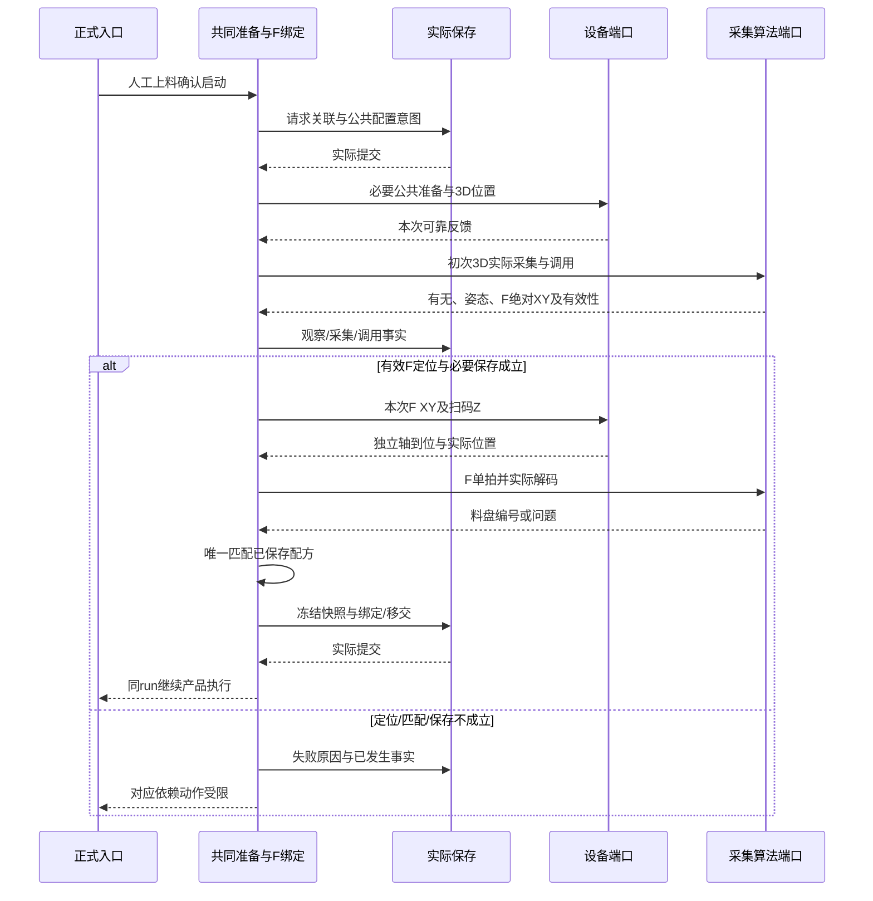
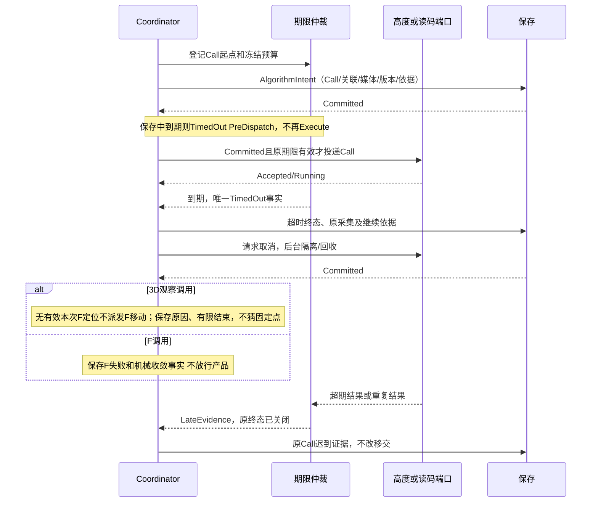
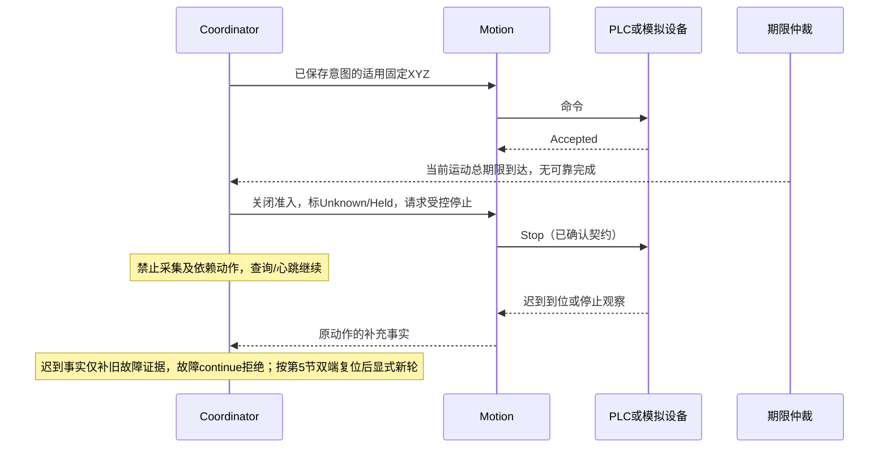
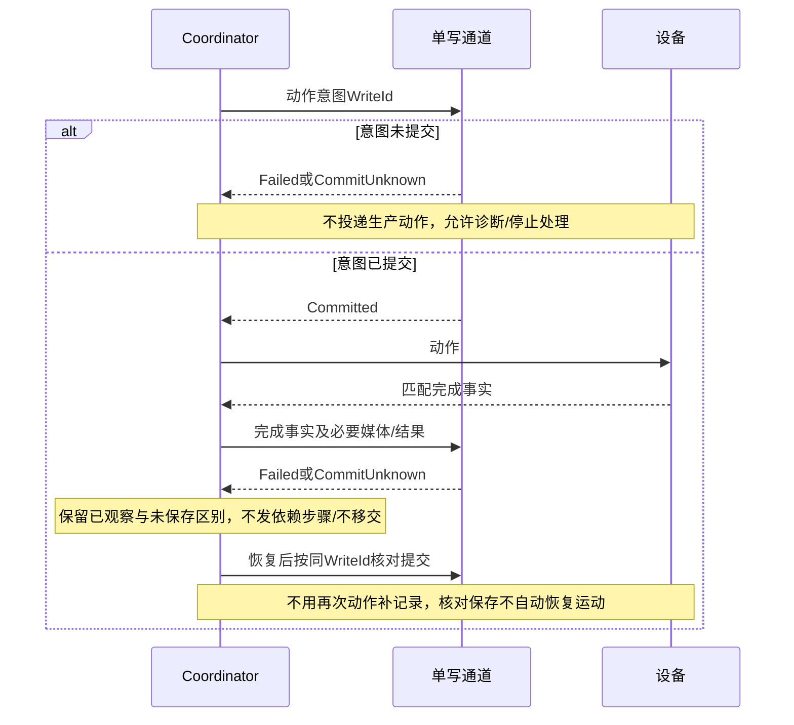
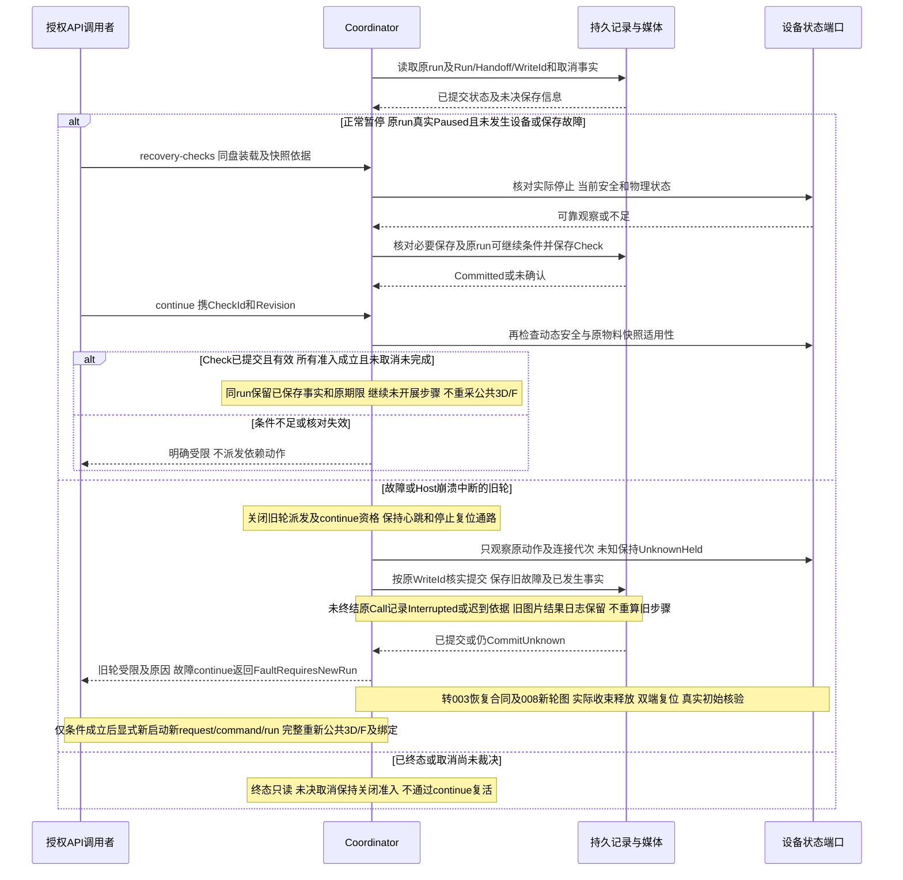
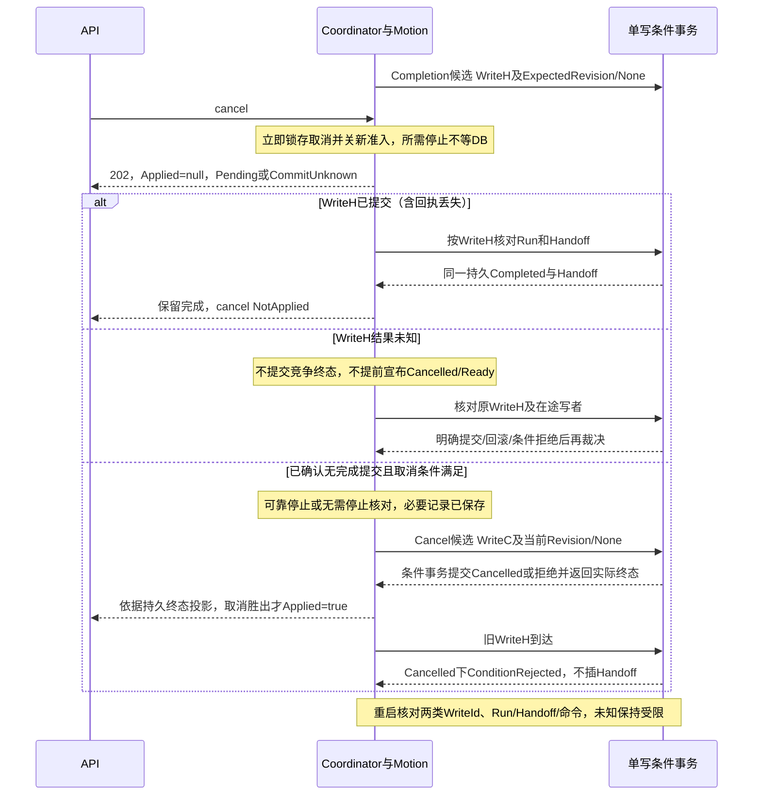

# 关键时序

**版本**：1.1.0　**日期**：2026-09-26　**状态**：派生软件设计时序，不是原始设备时序图或运行记录。008正式虚拟链使用外部VirtualPlc、实际采集/独立worker和存储；其他适配仅在其声明环境内使用。每个长操作都先注册期限/终态容量，投递后返回，Coordinator不等待完整操作。

图中省略重复的容量预约与Capture意图提交；每次采集仍须按保存合同先保存触发关联，再调用采集端口，不能以图示简写绕过保存门。

## 1. 正常公共流程

F内容就是料盘编号，不同配方不能占同一码；保存并校验成功的新内容供后续F，已冻结运行保持原内容。公共准备不依赖未绑定配方。图中省略内部通信步骤，不能将地址、原码、ASCII或内部ACK放入业务DTO。001不重复实现产品检测/翻转/分拣。

## 2. 算法期限及迟到

意图保存失败/CommitUnknown时禁止投递Call；原算法窗口仍有限收敛，保存门未满足不能推进F或移交。晚Committed不会重置期限。意图提交前、提交后未派发、派发后结果未保存三窗口按保存合同§1.1核对；已提交意图却无Dispatch记录时不假定未发出。

Worker退出与媒体释放不由“超时”推断。实际时间和可控时钟均由T触发，不能由G直接设置运行超时。

## 3. 动作完成未知

若停止不响应仍Unknown；设备内部移动结束但回执丢失也不能自动完成工位。

## 4. 必要保存失败

## 5. 正常暂停核对与故障旧轮收束

操作分界以[003恢复合同](../003-plc-latest-protocol/contracts/recovery-test-execution.md)为准。客户端断线只影响响应传输；重连先查询后端实际状态，不能把断线直接判为设备故障或把运行中的流程当作Paused。Host崩溃/故障后重建的是历史查询及受限状态，不恢复旧故障步骤。

故障后续只引用[008完整新轮时序](../008-recipe-driven-inspection/sequences.md#usr-20260926-d派生软件设计故障双端复位后完整新轮)，不在本图另建恢复接口。原WriteId核对只解决旧事实保存，不授权原故障轮运动；已知未派发也不构成例外。人工换面按既有manual-flip-confirmations、占用与确认清零及安全/保存条件同run继续，采用命令目标面并标明来源；不走故障新轮，也在完成放回后复查3D姿态，F不重绑。请求幂等及合法局部重试不变。

以上路径共同断言：当前正常盘F单次触发；公共3D使用检测Z、F使用扫码Z及各自复位；F失败或保存未确认不放行产品。001只提交公共事实和非终态移交，F唯一绑定及冻结按共享职责完成后由008续接；产品翻面/旋转/分拣/下料由对应所有者执行。不能以001公共完成为Final。

## 6. 取消与移交交叉提交

完成候选排队未提交不等于已完成；取消请求也不等于最终取消。两个有效候选以第一个实际条件提交为准；完成提交与Run/Handoff同事务，取消提交与最终取消命令结果同事务。仅Run revision变化时重新核对条件，不能把版本冲突当作已取消；CommitUnknown必须先核对，不能盲重投。五个窗口的停止、API展示和重启行为逐项见[保存合同§1.2](contracts/persistence-handoff.md)。

## 7. 修订记录

- 2026-09-20，1.0.1：H01在正常/超时时序加入调用意图提交门和恢复三窗口；H02加入取消/完成条件事务与回执交叉。M1只覆盖正常序列，完整取消/恢复为M2必做。图为设计，尚未执行或渲染验证。

## 8. 当前适用依据与门禁

本轮修正原1.0.1的XY-only、无Z、停在配方前及异常即放行描述；算法期限/动作未知/必要保存/取消竞争图继续适用，不新增恢复业务。公共3D固定XYZ与检测Z沿用[002 FR05用户确认记录](../002-plc-xyz-recipes/spec.md)；公共3D的1/2复位沿用[003既有验收链记录](../003-plc-latest-protocol/differences.md)，不是从当前代码反推。F及检测详细清零按分区协议§3.1.7。原图的“仅XY无Z”与此确有差异，见[来源追溯](../008-recipe-driven-inspection/sequence-alignment-20260926.md)。

Inspection、XY、Z、ZReset为图中信号简称，方向/地址见[008信号表与后继时序](../008-recipe-driven-inspection/sequences.md)。反馈属于当前operation和连接代次，PLC没有软件operationId寄存器；下一有效移动受理清旧反馈。任何到位/复位失败、动作未知或必要保存失败均阻断依赖动作。3D失败不能造零高度；只有F独立目标和安全/复位门禁成立才可收敛到F，后继产品还须各面合法Z依据。

2026-09-26，1.1.0：本轮仅补派生时序与现行边界，任务归specs/001-station01-public-preparation T090和specs/003-plc-latest-protocol T067/T070；渲染与保护检查见008本轮记录。

## USR-20260926-D公共准备边界

故障后的全链派生软件时序见[008故障双端复位新轮](../008-recipe-driven-inspection/sequences.md#usr-20260926-d派生软件设计故障双端复位后完整新轮)。新run重新StartClamp、公共3D/F及移交，不消费旧测量/扫码/完成记录。前文同WriteId核实提交属于旧事实保存，不代表故障从旧步骤续跑；正常暂停同run受控继续仍适用。原图及历史证据不变。
