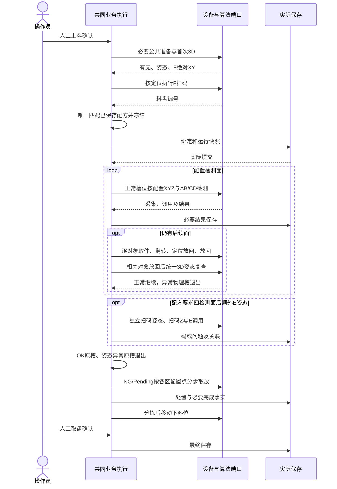

# 008派生软件设计时序

**2026-09-26业务确认增量**：以[USR-20260926-D：当前用户业务确认](business-decisions-20260926.md)为现行规则（故障新轮替代旧USR-C单指令重发）；下方带日期的实施状态为历史快照，实际进度见运行证据。本次仅同步文档，不变更任务编号、勾选、代码或既有运行结果。

日期：2026-09-26。**派生软件设计，尚待实现，不替代原始流程图或PLC协议，不是运行证据。** 以普通OK Q03（AB→AB、自动逐实体翻面、无E）为首个完整链；其他Q编号/历史证据保留，当前一面两面及四面3＋1适用性按USR-E/SC-001；C01—C08及必要F保留。原图步骤、协议、确认依据、消费者及任务见[本轮追溯记录](sequence-alignment-20260926.md)。公共步骤细节见[001派生时序](../001-station01-public-preparation/sequences.md)。

## 1. 当前语义、身份与共同门禁

本图按2026-10-03统一澄清及011 CR修订；原始协议图及历史运行证据只读。业务时序不携地址、原码或内部ACK；通信映射依据20261001 Word及信号表。每个动作/采集/调用使用当前run、对象、槽位、面和原期限，意图与必要保存先于依赖动作。

## 2. 同一运行主链

任何依赖的定位、F绑定、可靠反馈、保存或取消门不成立，不派发该后继动作；图不表示设备、算法和数据库存在共同事务。

## 3. 当前面AB/CD采集与融合

普通A整批后B整批，C整批后D整批；特殊对象按已确认逐对象顺序。每个图像经实际采集、单图算法、媒体及结果保存；同对象/槽/面/相机组输入齐备后实际融合。有限失败保存Pending及原原因，机械/身份/保存未知不能用Pending放行。

## 4. 逐实体翻转与放回

使用分别配置的取件/放回点：定位取件→型号/目标面翻转→定位放回→放回。相关实体全部放回后统一3D复查姿态，异常留原槽退出后续检测、翻面和分拣；正常使用下一面配置，F不重绑。整体实体不按内部部位重复抓取，已完成对象不重复翻面；不强加旧实际面号/Flip_OK。

## 5. 同盘分步分拣

OK原槽不搬；NG/Pending各用本盘区域配置点；姿态异常不进入分拣。真实源槽号不同于步骤序号。源XY→下降→取料反馈及必要在途保存→抬升→目标XY→下降→放料反馈→再抬升及完成保存。未确认取料、取消、保存失败或未知物理状态时不派发依赖动作、不释放占用、不盲重发。原码、地址和内部握手只由通信层处理。

## 6. 特殊路线、验证与实施边界

总图76—121及特殊闭环图仍约束取至旋转工位→批准姿态→当前实体AB/CD→OK原槽或NG/Pending目标→占用可靠释放。旋转角度/方向及内部机械过程按本次U03由下位机负责；Host发动作并等模拟结果。003先明确Test请求/结果接入，不从普通Flip/Sorting命令推导生产地址；现场反馈映射留待联调。特殊出口已处置实体不重复盘末搬运。此处只保留边界，不虚构特殊寄存器或全项目重绘。

当前核对只覆盖受影响代表链和必要失败：实际保存/F匹配/快照、更多面/额外E、翻转放回姿态复查、三区处置、分拣后下料，以及共同执行/通信隔离。图示不证明代码或运行通过。

## 历史USR-20260926-D：旧协议故障整轮重启设计

以下原流程只保留20260926设计背景；011新接口恢复/安全控制保持延期，原始信号与顺序不再用于正常链开发或新验收。当前正常链已在第1—5节重写。

以下仅软件派生设计，不替换协议原文或来源原图；尚未实现/运行。判据来源及字段以[003恢复合同](../003-plc-latest-protocol/contracts/recovery-test-execution.md)为准。

本图复用[001正常公共子时序](../001-station01-public-preparation/sequences.md#1-正常公共流程)的动作/采集意图保存及区域配置握手；下图展开检测1/2与扫码3/4的不同复位，不新增设备信号。每次可靠到位、对应复位、必要提交均是后继动作门禁；失败/未知按原合同停止依赖步骤，不沿成功路径穿过。普通路线的盘末分拣在下料之后，特殊路线的实体出口处置在其既有路线内完成，不强制套用普通批采顺序。

```mermaid
sequenceDiagram
    participant UI as 正式页面
    participant H as Host执行与控制
    participant P as PLC或VirtualPlc
    participant W as 相机与独立Worker
    participant S as SQLite与媒体
    UI->>H: 授权复位旧故障run和原因
    H->>H: 关闭旧轮派发与继续资格
    H->>W: 停止旧任务并核验输入实际释放
    W-->>H: 旧身份释放或未知
    H->>S: 保存旧故障和已发生事实
    S-->>H: 提交确认或CommitUnknown核验
    H->>P: 既有System_Reset请求
    P->>P: 实际复位及特殊Test任务代次隔离
    P-->>H: 本次Ready及XYZ和占用等实际观察
    H->>P: 清请求并回读初始命令和ACK状态
    P-->>H: 本次初始观察
    H->>H: 检查Host收敛和设备真实初始状态
    alt 初始不足 或资源未释放 或必要保存未确认
        H->>S: 记录InitialBlocked及逐项原因
        H-->>UI: 受限并禁止新启动 保存未确认如实显示
    else 真实初始及资源释放和旧事实保存均成立
        H->>S: 保存reset和initialCheck及旧轮关闭
        S-->>H: Committed或失败未知
        break 检查及旧轮关闭未持久确认
            H-->>UI: 保持受限 不提供新启动资格
        end
        H-->>UI: InitialReady且允许有权限的新启动
        UI->>H: 既有启动控件提交新requestId及restartFrom
        H->>P: 再核验当前动态初始状态
        P-->>H: 本次可靠观察或条件变化
        break 检查失效 或动态初始和资源条件不足
            H-->>UI: 拒绝新启动 不派发PLC动作
        end
        H->>S: 短事务提交新request/command/run 旧故障关联和检查消费
        S-->>H: Committed或Failed或CommitUnknown
        break 新轮关联及幂等事务未持久确认
            H-->>UI: 禁止物理启动 按原WriteId核实 不另造一轮
        end
        H->>H: 新run取得新租约与独立预算
        H->>P: PCReady及PCStart真实启动
        P-->>H: 本次PalletLock为1
        Note over H,S: 按001第1节保存各动作及采集算法意图 必须Committed才派发
        H->>P: 本轮公共区域配置握手
        P-->>H: 本次Zone_Config_Ack
        H->>P: Inspection=0 公共XYZ及检测Z 后Move=2
        P-->>H: 本次XY=1 检测Z到位2及ActualXYZ
        H->>H: 核验本次目标安全及可靠到位
        H->>P: Inspection=1 后Move=0
        H->>W: 新公共3D采集与高度分析 按001保存媒体和算法意图
        W-->>H: 新测量身份与结果
        H->>S: 保存新测量结果及媒体关联
        S-->>H: Committed
        H->>P: Inspection=2 请求本次检测Z复位
        P-->>H: 本次检测Z复位状态1到2
        H->>P: 核验复位成功后Inspection=0
        H->>S: 保存检测Z复位事实及F动作意图
        S-->>H: Committed
        H->>P: F本次3D定位XY及ScanZ 后Move=5
        P-->>H: 本次XY=1 扫码Z到位2及ActualXYZ
        H->>H: 核验本次F目标及安全
        H->>P: Inspection=3 后Move=0
        H->>W: 新F采集解码 按001保存媒体和算法意图
        W-->>H: 新F解码依据
        H->>S: 保存解码结果及操作结束事实
        S-->>H: Committed
        H->>P: Inspection=4 请求本次扫码Z复位
        P-->>H: 本次扫码Z复位状态1到2
        H->>P: 核验复位成功后Inspection=0
        break 公共到位复位不可靠 或必要保存未确认 或F唯一绑定条件不足
            H-->>UI: 阻断依赖动作及产品路线 保留本轮事实
        end
        H->>H: 有效F唯一绑定且匹配页面期望 冻结新轮计划
        Note over H,P: 绑定后区域更新如适用 仍按001第1节完成实际ACK
        H->>S: 保存扫码复位 F绑定 冻结计划及新handoff
        S-->>H: Committed
        loop 按冻结配方的适用步骤及依赖推进 不预设统一批采顺序
            Note over H,S: 普通AB或CD按第3节逐图运动反馈 采集分析 必要保存 对应Z复位及同面融合
            Note over H,P: 自动换面按第4节逐实体实际面及Flip_OK清零 人工按同节占用和确认条件
            Note over H,W: E及特殊旋转按第6节和既有执行合同 真实请求反馈及适用出口 不是Host自报完成
            Note over H,S: 每步意图与完成事实须按合同提交 缺合法目标 反馈未知或保存未确认不发依赖动作
            Note over H,P: 正常换面完成放回后统一复查3D姿态，F不重绑 后续面使用本轮初始测量和该面合法目标
        end
        break 必检未完成 或路线内必要处置和保存不足 或仍有未知在途
            H-->>UI: 保持受限 不进入成功盘末及Final
        end
        Note over H,P: 按第2节及执行合同进入适用盘末 普通先适用同盘分拣再下料
        H->>S: 保存本轮下料意图
        S-->>H: Committed
        H->>P: 按既有下料子链执行并核验实际XYZ和命令清零
        P-->>H: 本次可靠下料定位事实
        H->>S: 保存UnloadPreparation
        S-->>H: Committed
        alt 本盘仍有应分拣实体
            Note over H,P: 按第5节逐实体取料 放料和Sorting_OK清零后保存处置 不重复搬运特殊已处置实体
            H->>S: 保存实际分拣完成和占用事实
            S-->>H: Committed
        else 有可靠无需搬运依据
            H->>S: 保存同run无需搬运依据及Sorting完成
            S-->>H: Committed
        end
        break 检测下料处置未收敛 或有未知在途 或必要保存未确认
            H-->>UI: 保持受限 不解锁 不允许取盘或Final
        end
        H->>S: 提交WholeTrayCompletion
        S-->>H: Committed
        H->>P: LockCmd=0
        P-->>H: 本次实际LockStatus=0
        H->>S: 保存ObservedUnlocked及实际来源
        S-->>H: Committed
        H-->>UI: 新run等待取盘及后端allowedActions
        UI->>H: 实际页面取盘确认 requestId及revision
        H->>S: 保存确认事实并提交新run Final
        S-->>H: Committed
        H-->>UI: 新run持久Final及旧故障关联
    end
    Note over H,S: 旧反馈和晚到Worker只记旧身份 不推进新轮 旧故障图片结果日志保留
```

图中Committed及可靠反馈是成功分支的必要条件，不表示所有请求必然成功；包括WholeTrayCompletion、ObservedUnlocked与Final在内，任何必要提交失败/未知均阻止其依赖动作或成功展示，按原WriteId核实，不能跳过等待。检测1/2仅对应检测Z，扫码3/4仅对应扫码Z；抓取/翻面/分拣不额外套用该Z复位。路线步骤的精确执行与差异继续由[执行合同](contracts/execution.md)、[E合同](../003-plc-latest-protocol/contracts/e-test-execution.md)、[人工合同](../003-plc-latest-protocol/contracts/manual-test-execution.md)及[旋转Test合同](../003-plc-latest-protocol/contracts/rotation-test-execution.md)限定。

## USR-E动作观测补充

既有Mermaid握手及USR-D/RST-01/RST-02时序不变，本次仅正文引用。完整XYZ/轴/反馈/清零遵守[003动作观测增量](../003-plc-latest-protocol/contracts/plc-stage-action-port.md#usr-e完整坐标与动作观测)。取料后安全抬升的实时Z不能直接当目标到位Z；状态2仍仅取料成功，之后才提交槽号/放料数据。四面成员/整体适用性见[多对象合同](contracts/test-multi-object.md)。
