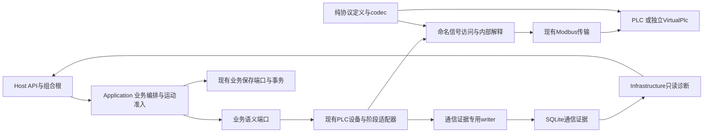

# 技术方案：通信代码边界最小收敛

## 2026-10-02 当前正式范围：通信代码边界最小收敛

本轮目标是在约4小时内使协议知识退出业务代码、业务端口、业务合同和相关业务测试，并形成可执行的边界防回归。不是临时少跑测试；这是用户批准的当前正式完成定义。保留正式通信、命名信号/编解码、语义迁移及有效业务保护义务。

当前活动31 FR（FR-001—029、033/034）、16 AC（AC-006—021）、6 SC（SC-001/002/005/007/008/010）。原FR-030—032、AC-001—005、SC-003/004/006/009的动态演练或完整证据验收进一步转出；原FR-035—039、AC-022—028、SC-011/012继续转出。已接受Test10000ms、三入口、期限/取消、安全、动作关联、未知占用及真实保存门禁不失效。

任务ID T001—T069及历史勾选保留。当前49项含活动义务，20项整体转出；全部原义务和本次拆分见scope-adjustment。原勾选不能证明本轮通过；拆分项的完成只指本轮义务。

完成条件：受影响工程及必要依赖构建成功；正式入口和全部直接消费者语义/接线闭合；当前源码/合同/相关断言的C#、JS/CJS、Python、有限PowerShell内容检查与同入口正负例通过；事先固定的检查和直接语义测试实际发现、执行且有当前源码证据。缺失、未执行、零发现、过滤、Skip、解析失败或旧报告均不得Passed。合法通信诊断raw可保留，不得回流业务控制。

36条完整动态场景、整套PD运行、M01—M05/MC动态演练、完整历史/升级/预算/保存故障、全配方/页面/相机/算法/媒体/整机及性能工作不作本轮完成前置；保留编号、实现和旧证据。直接改动若影响既有保存/期限/安全规则，须增加对应最小真实验证，不能借转出绕过；保存门禁验证使用真实数据库。

本轮直接实施和验证；在新结果齐备前状态为未通过。只可声明本范围通过，不声明完整通信动态验收、全系统、生产或旧库通过。

**功能标识**：009-plc-protocol-isolation  
**日期**：2026-10-01  
**规格**：[spec.md](spec.md)，以本轮实际条款为准；活动31 FR / 16 AC / 6 SC
**宪章版本**：7.0.0  
**状态**：当前最小边界范围同步；已有成果待本轮新证据。完整动态/冻结/变体验收转出，DESIGN-OPEN-01保持关闭
**实际目录**：`E:/dzk/gaode-1/specs/009-plc-protocol-isolation`  
**Git状态**：当前目录未见`.git`标记；本轮按约束未执行任何Git命令，不查询实际分支。setup返回BRANCH=`009-plc-protocol-isolation`是功能目录回退标识，不作为实际Git分支证明。

## 方案摘要

保留既有纯协议模块、命名信号、正式设备/阶段适配器与VirtualPlc架构。业务语义端口及全部直接消费者一次性迁移，Application/Domain/业务合同/断言禁止解释协议。正式Host同实例DI与全部签名必须闭合，不引入仅测试包装层。
最小保留链：Host组合根 → Application语义请求 → LatestProtocolPlcDevice/LatestProtocolStageActionAdapter → 命名访问/原transport → 独立VirtualPlc；取料完成 → 必要raw真实保存 → Application回调 → StageEventStore真实InTransit提交及当前有效回执 → 放料。必要证据专用writer/只读读回和新建受控Test库保留；旧库升级完整验收转出，Host仍不得自动迁移。
稳定配方期限与取消由业务传给通信；后台资格关闭和迟到不复活是通信验收义务，配置发布/三入口完整业务预算功能不是专项前置。IntegratedDetection等直接消费者保留既有流程，通过编译、接口/语义和边界扫描证明迁移闭合，不要求启动完整相机/Worker/页面来证明通信隔离。
T053在发现前固定BoundaryMinimum检查/数据行，保留原完整清单；T054仅复用既有TRX读取、脚本检查及生产validate_required_ledger。构建、完整源码内容检查/正负例、直接语义测试与人工接线核查完成T061/T069；不新建通信动态平台，T062—068转出。

## 技术上下文（Technical Context）

| 事项 | 实际基线/选定设计 | 依据与限制 |
| --- | --- | --- |
| 后端 | .NET 10，SDK10.0.401且rollForward disabled，ASP.NET Core；C#现有设置 | `global.json`、`backend/Directory.Build.props`，不升级生产运行时。 |
| 数据 | EF Core Sqlite10.0.12、现有Test SQLite/媒体存储；目标新增一张通信证据表及schema2 | `Directory.Packages.props`、Station01DbContext/TraceWriter/StageEventStore；不是全库单写者，保留短事务。StorePrep已有单项升级实现及旧证据；完整升级验收已转出，专项用受控新Test库，Host不自动迁移。 |
| 通信 | 现有Modbus TCP、business/heartbeat受控连接、HexOneBased工程约定；当前四种Float32排列 | `ProtocolLatestMap.cs`、ModbusTcpClient、VirtualPlc；真实PLC约定未由Test确认。 |
| 协议共享 | 拟增`Gaode.Plc.Protocol`，纯定义/codec，BCL依赖，无业务/网络/DB | 有真实双点表/codec重复，采用有限模块，无引擎或产品热切换。 |
| 算法/相机 | 保留实际WorkerProcessSupervisor/PythonWorkerAdapter、文件相机及既有输入/媒体租约 | 解释器及输入版本从实际manifest/进程来源记录，不改变算法选型或宣称精度。Production未接入能力仍受限。 |
| 测试 | xUnit2.9.3、现有Rules/Contracts/Integration；新增Communication套件与有限边界检查 | 现有混合测试按文件/断言归属，未受影响基础设施测试不为目录纯化搬迁。 |
| 检查器 | C#用固定SDK内Roslyn5.9.0.0；脚本复用锁定TypeScript5.9.2、Python ast及PS自带AST | Roslyn引用/检查器已有实现与旧证据，新范围正式扫描仍须本轮执行；解析器缺失失败。A08—A10限定断言及来源闭包，不引入通用跨语言平台。 |
| 验证入口 | 复用`verify.ps1`及workflow/runner；独立进程复用virtual-loop启动脚本，新增有限009采证入口 | 当前无云CI事实；固定完整清单与入口已有实现，新专项模式/清单调整待T053/T054，旧子集不等同专项通过。 |
| 期限/容量 | 保留1秒I/O、3秒心跳、Test50ms轮询及原阶段截止；目标budget schema1.1新增businessMs.recipeApplication，Test10000ms，随完整BusinessBudget冻结 | 起算到设备及本次必要保存共用一个总窗；各保存受CriticalSave及剩余窗约束。Production未批准局部拒绝，变体不放宽；不编造生产节拍。 |
| 前端/宿主 | 只评估现有API版本消费者，页面不实施 | 006批准区域/原型只读；不宣称逐页审阅或页面运行通过。 |

保留D01—D10及R02—R07已成立决定；D11落实spec已接受的独立预算、总窗口及Test10000ms，设计复核见[review-remediation §7](review-remediation.md#7-本轮已接受期限澄清的设计同步)。这是初次修复前明确批准的业务契约增量，不重开策略选择，也不把修复前无界等待冻结为基线。

## 宪章检查（Constitution Check）

“设计后符合”仅评价目标方案，没有声称源码已修复或运行门禁已通过。设计前现状违反项均有明确修复设计，不以复杂度豁免；实施前跨功能对齐仍是依赖。

| 原则 | 检查点 | 设计前 | 设计后 | 证据/受限范围 |
| --- | --- | --- | --- | --- |
| P01 | 来源优先级/冲突可追溯 | 符合 | 符合 | 009基线、Word SHA、research来源及D10；USR-D/E覆盖旧冲突，不采用讨论稿。 |
| P02 | 正式组件和真实接入 | 待补充，仅限制所列部分 | 待补充，仅限制所列部分 | research R01；当前Virtual正式链可设计/验证；真实采集/算法NotIntegrated及实机映射不被本功能补造。 |
| P03 | 合法配方/动作顺序 | 符合 | 符合 | quickstart L01—L10按实际catalog；一/二面保留、四面只四面3CD＋1AB与新增配置，未增加排列门槛。 |
| P04 | 有限等待/安全/未知 | 违反待修正：B缺总期限 | 符合 | A原PlcAcceptance独立保留；B03.2/P04.1/D11按已接受新预算覆盖三入口、必要保存及后台取消，BA01—07规定拒绝判据；BD05及F05/F06真实提交/回执分离不变。代码及验证待实现。 |
| P05 | 分层及唯一所有权 | 违反待修正 | 符合 | R05业务raw泄漏；D01—03直接改正式入口，纯协议不进业务，V-BOUND防回流。现状代码仍待改。 |
| P06 | 资源/心跳/媒体 | 符合 | 符合 | 保留ResourceLease与现有设备单在途；证据写不占心跳/停止，媒体/Worker释放不变；不造第二客户端。 |
| P07 | 身份/事实与来源 | 违反待修正 | 符合 | R06/R07硬写来源/原值；data-model§1/3/4、EC04保留当前动作/面/槽/epoch和实际来源，历史不篡改。 |
| P08 | 真实保存/配置冻结 | 待补充，仅限制所列部分 | 符合 | BD05/模型§4.1四态、EC02.1最小UnknownHeld事实；模型§6.1结构/迁移/同库manifest单事务及U0—UX，不以超时当回滚。原保存节点不变。 |
| P09 | 可关联持久诊断 | 待补充，仅限制所列部分 | 符合 | R08现有部分日志但raw引用不足；EC01—05与V-DIAG/F06补足必要保存，不全量抓包。 |
| P10 | OPEN局部限制 | 符合 | 符合 | OPEN-009-01—04及生产取放观察窗口保持未确认；05/06仓内设计已完成；07生产配方应用值未批准仅限制Production，不阻塞已确定Test。 |
| P11 | 配方扩展/适度架构 | 符合 | 符合 | 保留现有线性执行/加载与Test配方，物理槽业务含义不丢；仅提取真实重复协议，不新增引擎。 |
| P12 | 原型/前后端边界 | 不适用并说明 | 不适用并说明 | 本阶段不实施页面/宿主、不读取改写原型；仅列006 API绑定影响，后续仍经后端。 |
| P13 | 代表验证与真实证据 | 待补充，仅限制所列部分 | 符合 | 当前无009运行证据；quickstart及VG明确独立进程/真实保存/有限失败；历史证据不计本轮通过。 |

## 结构、依赖与正式装配

图是调用/数据流；项目编译依赖如下。诊断流回Host只供受权查询，不接回业务控制。

| 模块/文件范围 | 状态/资源所有者 | 依赖与边界 |
| --- | --- | --- |
| Gaode.Domain | 业务规则/身份/业务投影 | 不引用Application/Infrastructure/协议；无raw报警字段。 |
| Gaode.Application | 流程、配方冻结、MotionCoordinator/ResourceLease、真实保存前置 | 仅Domain及自身语义端口；持久化仍由业务发起，不能从raw恢复判据。 |
| 拟增Gaode.Plc.Protocol | 唯一现行信号/codec定义 | 无业务/传输/存储依赖；Infrastructure通信和VirtualPlc引用。 |
| Infrastructure/Devices/Plc | 连接/轮询、内部动作关联和握手、编解码与原始捕获 | 实现Application语义端口；使用纯协议，复用原会话/阶段Transport与互斥。 |
| Infrastructure/Simulation/IntegratedDetectionPort | 现有实际Detection执行 | 按职责是编排消费者，改用语义能力；保留文件相机/Worker/DB调用，冻结后不随协议变化。 |
| Infrastructure/Persistence与Diagnostics | SQLite短事务、媒体/业务保存、通信证据读写 | 诊断writer/reader不进入业务端口。TraceWriter只扩内部通信job，不改全库事务模型。 |
| VirtualPlc | 独立设备状态、代次、动作序号与反馈 | 只共享定义/codec，不共享上位机状态机/数据库，不能由Host写反馈造成功。 |
| Host | 唯一装配/API授权/序列化 | 引用Application/Infrastructure；状态从语义端口来，不自行解报警位；新诊断只读路由。 |

具体受影响文件/所有生产者消费者见[impact-matrix.md](impact-matrix.md)。新生产结构只需纯协议程序集、通信侧命名访问/解释能力、证据实体/专用读写和有限历史投影；不创建新服务或通用平台。

正式迁移必须覆盖Station01Registration的所有PLC绑定、AdapterBindings的阶段动作保存回调，以及IntegratedDetectionPort的具体设备调用。配方应用在Application统一三入口的当前意图、冻结窗口、保存及授权，独立RecipeEndpoints从直调PLC转到该能力，保留其既有handoff和容量回退；通信仍用现Binding/AdvanceBinding，接稳定语义绝对期限和请求取消资格。旧PlcAdapter/PlcConnectionPump不在正式Host装配链，不能只改这些未使用入口交差。FullSimulation语义替身同步以维持契约，但不用于隔离演练。

## 数据、契约与状态

- [data-model.md](data-model.md)：关联动作、语义观察、采集会话、位置/面来源、取料证据与提交回执、raw批次和历史生命周期。每个公开状态有实际业务用途。
- [business-device.md](contracts/business-device.md)：业务仅语义、动作/采集窗口、取料提交回调、整盘最终完成及变更分类。
- [protocol-maintenance.md](contracts/protocol-maintenance.md)：当前点位/方向/类型/布局和内部握手职责；全正式路径覆盖。
- [diagnostics-history.md](contracts/diagnostics-history.md)：真实原始捕获、同次观察、提交后引用、只读API/历史、不伪造来源。
- [verification-gates.md](contracts/verification-gates.md)：测试归属、A/N/P/G门禁、冻结范围、M01—M05变体、独立oracle与必要失败。

业务API目标一次性版本化：status使用`s01-status/2.0`，run/evidence显式deviceSchemaVersion及设备事实payload使用`device-semantics/1`，通知`s01/notification/2.0`改固定业务摘要；精确字段/类型/null/历史及消费者按影响矩阵§5。新增诊断查询待实现。禁止raw业务影子字段；旧payload原形只读、缺完整诊断null，不重写或授权当前动作。

## 配方共用逻辑与动作隔离

不新增配方管理、引擎或策略插件；复用现有目录加载、验证、计划和执行。此前已接受并已接入的配方应用预算保留，其完整业务验收正式转出，Production值未批准不开放。物理槽、业务容量、显示配方号脱离wire整数宽度，既有配方载荷/点位及含义保持。运行预算随原完整配置先冻结，严格后段期限在绑定前冻结，旧路径保持原起点；协议变体不能编辑预算、配方或素材使其通过。

完整配方与流程基线已转出；当前仅核配方计划/执行直接消费者的接口语义，不启动配方/相机/算法/媒体链。既有配方覆盖义务不删除，由后续原功能承接。生产逐面位置/单位/高度/容量仍待现场，不用虚拟数值批准生产动作。不存在新增工艺能力，因此无需通用策略接口或注册框架。

## 并发、资源与异常出口

| 路径 | 所有者/容量 | 期限来源 | 失败出口与后续 |
| --- | --- | --- | --- |
| F后配方应用（三入口） | Application当前绑定协调、原设备辅助占用；不新增连接所有者 | 意图有效回执后唯一t0/D，T取D与已有适用截止；所有必要保存另受CriticalSave | 同一资格关闭阻止后台新派发/新成功链保存/有效Bound及产品动作；已发I/O/已开始提交真实记录，不撤销事实或复活旧请求。 |
| 移动/夹紧/翻面/取放/下料/解锁 | 原Motion租约与同一设备在途互斥，不新增发令者 | 冻结动作预算、阶段绝对deadline；机械和ACK子预算分别保留 | 可能派发且不可信即UnknownHeld，保持占用/no replay；不会由旧反馈解除。 |
| 心跳/状态/停止 | 原独立心跳连接与受控通道 | 原3秒/1秒及轮询/新鲜度 | 失联立即关闭新准入；不等待算法/磁盘队列；重连不自动续跑。 |
| 采集/Worker/媒体 | 原有限调度、位置保持和媒体租约 | 原采集/算法/释放预算 | 有限算法结果或Pending按原业务处理；机械、身份或保存未确认仍阻断。 |
| 取料业务提交 | SortingTargetAllocator→原StageEventStore短事务 | CriticalSave与剩余阶段deadline | 非Committed/错身份/超期不能放料；提交未知只核查、不重派。 |
| 必要通信证据 | 现有TraceWriter实例的内部有界队列/专用job | 原CriticalSave；不刷新动作期限 | 保存失败/未知无有效引用及可靠完成；关闭后继、保留占用；实际错误日志不冒充持久回执。 |

没有扩大重试次数或拉长I/O/心跳/机械期限；传输派发前有限重试不叠加成业务/通信双重重试。动作源/目标及采样时刻分别保存，完成时安全抬升不使本轮目标证据失效。

启动Accepted仅确认当前请求的完整真实写序列提交，保存该事实后另等物理夹紧，两个现有期限不合并。采集正常结束要求原必要保存；公共3D保留无取消/安全故障时的失败清理分支，清理不解除原失败、不放行后继，F/E/Detection不因此放宽保存门禁。具体语义见BD03/04和research R17。

夹紧成立之后、公共3D/F之前保留A运行容量区域准备及单独PlcAcceptance窗口；F唯一绑定之后B按实际计划输入执行适用容量及显示应用。B连续链null容量与独立API回退分别保留。B03.2/P04.1/模型§3.1规定唯一总窗：意图有效提交后、端口排队前起算；设备确认只是中间事实，必要raw、RecipePlanBound及适用handoff全部有效回执在T前才完成。严格链原后段起点/值不动，旧链handoff后首次Detection起点不动。后台每次写派发与取消/超期原子仲裁，不能只超时调用方。

## 保存与恢复

保留计划、意图、采集/算法、媒体、动作事实、取料InTransit、放料Occupied、WholeTray、ObservedUnlocked、人工Final全部必要节点。可靠取料后的必要协议处理与raw提交完成后，业务实际提交InTransit；通信核对回执及安全/epoch/期限才允许任何放料字段写入。通信不直接操作业务事务。

新增raw批次与业务事务不组成虚构共同事务。引用只在实际提交后生成；存储失败继续心跳/停止能力并使依赖动作受限。数据结构只增本功能必要表/索引/manifest，既有JSON/来源不改写。StorePrep建新库能力复用；旧库受控升级是已存在实现、完整验收转出的明确维护步骤，需要Host停止、互斥、备份和核验，Host启动不自动改表。本轮没有数据库操作。

实际提交与有效回执按模型§4.1 A—D分开：A确认回滚、B已提交但失效回执、C未知均不放料/不重发，晚查到记录不恢复旧动作。取料已观察但raw未确认时走独立语义失败通知，由业务尽可能提交UnknownHeld，禁止假InTransit；库不可写时只尽力日志，重启按已存预留/意图保守占用。转出旧库升级的既有规则继续要求结构/EF历史/同库Manifests在单个显式事务提交，U0/U1/U2/UX及完整结构核验限定重新开放，不存在另一个外部manifest切换（模型§6.1）。

故障恢复保留USR-D完整新轮：双端复位及真实初始状态，显式新启动；旧照片、日志、结果和运行关联保留。历史查询不借新语义反推原始反馈。正常暂停与人工换面继续按原合同，不能混同故障恢复。

## 实施先后顺序（当前实施授权）

1. 保留T001—032/T035等已有成果与证据；核当前正式链、分类和直接消费者，不重复技术研究。
2. 对应共享签名如确需改变，先核T004—012实际跨功能文档并定向补齐，再改代码；未改变接口不机械重做对齐。
3. T033—039、T043/T045及T048—052仅核/修边界与接线，构建及同入口内容检查先暴露当前违规；不以任务未勾选推断代码尚无。
4. T053先固定BoundaryMinimum集合及范围版本；T054复用已有报告/生产账本校验，不更改原673行完整清单、不启动原完整Baseline。
5. T055受影响工程构建；T056当前C#/JS/Python/有限PS扫描、合法正例/违规负例与G01—07；T057固定直接端口语义测试。改动触及保存/取消等再补适用最小真实验证。
6. 完整性及人工公共端口/正式装配/典型消费者核查齐备形成T061当前收敛基线、T069当前范围结项。T058/059、T062—068及完整历史/预算/整机验收保留转出，绝不改为Passed。

## 软件验证与证据计划

| 当前组 | 必需内容 | 证据/任务 |
| --- | --- | --- |
| V-BOUND | 正式仓库4扫描、2项目依赖、PinnedRoslyn、全部既有C#正负例；三语言源码、分类、解析器及42脚本case | T052/T056；相同checker/配置，零正式违规/errors |
| V-SEM | StagePortContractTests、PlcStageActionPortContractTests、DeviceMessageContractTests全部固定数据行；少量已接入绑定语义 | T057；真实发现/TRX，不是TCP或SQLite故障事实 |
| V-LEDGER | 固定当前清单独立于发现、真实构建、源码/清单/报告身份；同生产账本G01—07拒绝 | T053/T054/T056/T061；过滤/缺行/Skip/旧报告拒绝 |
| 人工边界/接线 | Application/Domain公共端口、Host同设备及保存回调、IntegratedDetection/配方消费者、合法诊断和相关业务断言 | T033—039/T043/T045/T048—051；具体路径/调用及核查结论 |

V-WIRE/PD全运行、36CS、V-MUT/V-NC、完整V-PICK/V-FAIL/V-DIAG/V-BIND/BA/V-HISTORY/SU/V-MAIN不作本轮完成条件，现有测试/真实失败与后续承接保留。涉及保存门禁的本轮新增验证必须真实SQLite，不能从组件模拟回执推定提交事实。

## OPEN与当前限制

DESIGN-OPEN-01仍需求/设计关闭；既有Test10000ms及三入口/后台取消不改。Production预算和实机地址/轴/单位/字序OPEN仅限制相应生产路径，不阻断Test边界核查。原跨功能对齐成果可复用，但不能用009矩阵当其他文档已对齐。

本轮只有当前完成条件证据齐备才签T061/T069；旧Passed只是线索。握手超时部分报文既有失败先分类，若无本轮修改因果或直接路径风险则记录后续，不降条件、删例或把未判明当已解决。

## 原plan轮执行边界与产物（历史记录；本轮以正式范围修订为准）

通过进程级`SPECIFY_FEATURE_DIRECTORY=specs/009-plc-protocol-isolation`选择现有功能，在执行前以`Get-FeaturePathsEnv -NoPersist`核对路径并确认现有feature.json值相同，然后实际执行未改写的`setup-plan.ps1 -Json`。返回FEATURE_DIR/FEATURE_SPEC/IMPL_PLAN均指009；setup只复制缺失plan模板，feature.json摘要与时间未改变。实际模板已读取并按其结构完成本方案。

`.specify/extensions.yml`当前`hooks: {}`；没有before_plan/after_plan可执行hook，不通过扩展进入下一阶段。未运行会自动推进阶段的workflow。

本次为已有plan同步：setup实际报告已有plan并跳过模板复制，返回三条路径均为009；plan及feature.json在setup前后hash/时间一致。未执行Git命令，目录无.git标记，BRANCH仅目录回退值。只更新获准12份既有设计文档（含review-remediation.md）；spec、两份checklist及勾选、其他功能/来源/代码/脚本/模板只读，不生成tasks。文档复核不计作业务验证；本轮未运行构建、测试、设备或数据库操作。

### 009联合闭合：当前组件来源由生产者给出（2026-10-02）

本节细化既有真实来源与混合来源矩阵义务（009 FR-016/020—022，EC E04，T034/T035/T039/T043—T046），不增加工艺、页面或新恢复流程。实施者/复核者为Codex；不是客户或其他人员批准，不改历史勾选。

现源码WholeTrayWorkflowOrchestrator按SourcePolicy/Test推定Camera/Light，且硬编码PLC协议版本；IntegratedDetection按固定字符串保存媒体来源。以上不能作为新事实来源依据。共享代码修改前，本节在001/003/008 spec、contracts、plan、tasks实际同步：

- 复用现有ComponentEvidenceSource，新增有限元数据ComponentExecutionOrigin（Source可空、VersionRef可空、Quality可空）；Unknown不自动补默认来源。ICapturePort由实际实例公开CameraOrigin/LightOrigin，IAlgorithmPort公开Origin；不含地址、协议编码或设备内部阶段。
- FileBackedCapture声明Test文件相机/仅配置光源，不能声称真实光源SDK已执行；SimulatedCapture/Algorithm声明实际模拟profile版本；PythonWorkerAdapter声明本次Test独立Worker适配器身份，并保持真实WorkerSession/call引用。NotIntegrated和未给元数据的替身为Unknown，不批准完整来源矩阵。
- DetectionPortResult的AlgorithmOrigin随实际生产者返回并随Completed或有限Pending事实保存；Host派生Pending保留已知失败尝试来源，不因Test目的猜来源。原Source/Quality分类不改写历史，完整来源以本次实际Origin及可关联事实为准。
- WholeTray矩阵的Camera/Light取本次实际capture实例元数据及已保存输入媒体/检测事实；Algorithm取已提交检测事实的AlgorithmOrigin；PLC取已提交stage-action/1的ExecutionOrigin。Host汇总标Derived，不在Application写协议版本常量。缺失/未知来源仍Missing/Unknown并阻断所需完成，不能合成Verified；历史旧payload保持原样，历史无新Origin不推造。
- 实施/验证由009 T034/T035/T039承接生产消费，T043—T047承接持久查询和既有消费者；先补语义正反例（同Test请求不同真实来源、缺失来源拒绝）再改正式生产者与消费者。独立进程证据仍另行验证，文档对齐本身不算实现通过。

当前来源分类的有限补齐：ResultSource在末尾新增Test，保留既有Real/Virtual/Simulated/Fallback的值和历史含义；仅由明确声明Test的实际算法生产者产生，不从RunPurpose猜测。IntegratedDetection的Source与意图来源来自IAlgorithmPort.Origin，未知仍Fallback/Unknown；完整矩阵继续使用AlgorithmOrigin与实际事实。该变化用于消除把独立Test Worker写成Simulated的固定标签，归009 T034/T035/T039及T043—T046，旧记录不重写、现有页面仅绑定来源。

## process356 后定向闭合（2026-10-02，实施记录）

F02-position 真实失败证明初始偶合坐标可残留：WaitTransfer 现在遇到后续矛盾XY撤销候选，允许合同已确认的目标采样后Z抬升。red357先失败，fix360对应负例/合法抬升与翻面共6项通过；尚待当前独立进程复验，不提前恢复T025完成。

F04-handshake 证明原始机械失败在Detection截止判断处被改为Pending并尝试下料。IntegratedDetection保留本动作超期为Failed，协调器不再用截止覆盖Failed；fix363的17项协调器检查通过。原算法专属Pending/重试义务保留。长握手必要原始数据按diagnostics-history E02有限分段保存，不伪称翻面完成，不改原截止；red359先失败，fix360组件通过，process356旧失败保留。

T040/T054新增有限Test调度缝只延迟现有绑定前/续接前边界及已开始的真实保存回执，验证BA06及独立API输入；不改时钟/预算，不生产成功回执。fix363的3个调度组件通过；独立入口/旧链/原截止各过程证据尚待执行。固定清单新增逐方法/数据行，仍需实际发现、执行和核证。测试与内容门禁通过范围见joint-closure-progress-30.md，不等于T061。

### 010实施定向对齐 A07（2026-10-02）

本节落实010已审查设计，优先于此前冲突的测试执行结构；历史记录和任务勾选保持原义。只调整以下共享接口及消费者，不宣称实现/运行通过。

- **A07**：context/2.0仍绑定前冻结原Detection/Unload/Sorting起点和值；context/1.0仍handoff后首次Detection建立；独立bind只读已有截止，不造下游窗口。配方应用意图真实提交后、排队/调用前唯一t0，Test10000ms及更早截止/必要回执门保持。ExecutionCostProfile从本轮批准预算形成语义额度/引用/摘要，共同公式不解释PlcIo/PlcPoll或17/16通信次数，生产未批局部拒绝且不回退。
  生产/消费与010实施承接：Start/预算/RecipeApplicationCoordinator→Handoff/ThreeStage/独立绑定→frontend/src/runtime.js、模拟脚本、BA06；T008—T010/T016/T020/T027。

完整字段和判据见[IB](../010-recipe-execution-isolation/contracts/input-boundaries.md)、[CE](../010-recipe-execution-isolation/contracts/common-execution.md)、[VG](../010-recipe-execution-isolation/contracts/verification.md)。原反馈、真实保存、取消、期限、未知占用、来源真实性及生产局部限制保持。不新增页面/真实SDK/工艺/历史数据库升级。

### 010实施定向对齐 A04（2026-10-02）

本节落实010已审查设计，优先于此前冲突的测试执行结构；历史记录和任务勾选保持原义。只调整以下共享接口及消费者，不宣称实现/运行通过。

- **A04**：AuxiliaryHandlingRequest用CoordinateEvidenceReference替代TestSourceReference/固定来源白名单。文件解码只转换格式，保人工占用观察/授权确认/清零、共享实体一次动作、E缺码错误处置、旋转姿态/出口。适配用途准入可识别Test但不能推进业务；009地址/原始码/ACK/协议槽知识仍只在通信层。
  生产/消费与010实施承接：typed依据→LatestProtocolPlcDevice.Acquisition/辅助适配→Wire/动作证据/查询；T008/T012/T018—T020/T030。

完整字段和判据见[IB](../010-recipe-execution-isolation/contracts/input-boundaries.md)、[CE](../010-recipe-execution-isolation/contracts/common-execution.md)、[VG](../010-recipe-execution-isolation/contracts/verification.md)。原反馈、真实保存、取消、期限、未知占用、来源真实性及生产局部限制保持。不新增页面/真实SDK/工艺/历史数据库升级。

### 010实施定向对齐 A06（2026-10-02）

本节落实010已审查设计，优先于此前冲突的测试执行结构；历史记录和任务勾选保持原义。只调整以下共享接口及消费者，不宣称实现/运行通过。

- **A06**：typed冻结输入保存在既有RecipePlanAndBindingIntent版本payload，经RunExecution.SaveAsync(ActionIntent)→ITraceWriter/RunWrite回执，ITraceQuery按Run/Tray/Plan/引用/摘要读取；独立绑定仍用原IStageEventStore。v2字段/旧摘要不改，Source仅取当前Call匹配且已提交F Origin.Source，多组件各读实际事实。缺提交/错Call/Unknown拒续接；历史reader/Rescan保留不回填、不恢复许可。
  生产/消费与010实施承接：RunExecution/StageHandoffBuilder→ITraceWriter/RunWrite/ITraceQuery/consumer→独立绑定/历史/状态API；T008/T015/T016/T019/T020/T028/T029。

完整字段和判据见[IB](../010-recipe-execution-isolation/contracts/input-boundaries.md)、[CE](../010-recipe-execution-isolation/contracts/common-execution.md)、[VG](../010-recipe-execution-isolation/contracts/verification.md)。原反馈、真实保存、取消、期限、未知占用、来源真实性及生产局部限制保持。不新增页面/真实SDK/工艺/历史数据库升级。

### 010实施定向对齐 A09（2026-10-02）

本节落实010已审查设计，优先于此前冲突的测试执行结构；历史记录和任务勾选保持原义。只调整以下共享接口及消费者，不宣称实现/运行通过。

- **A09**：所有验收profile无条件L，统一verify/runner、auto-dev/step及009 boundary_minimum/protocol_isolation旁接共用执行/凭证核验。_run_verify passed、verify_entry退出、assess/finish及旁接ledger/result/subsetPassed最终点拒漏跑/Skip/旧身份/解析失败/伪Passed。L含职责闭包B/N/P、G/C、受影响009静态，不开Host/PLC/Worker/DB、不递归完整验收。010按B→冻结→E/S→T，009动态范围及SelectedCasesOnly overall009Passed=false保持；D10先迁活动映射，历史证据不改。
  生产/消费与010实施承接：Rules/manifest/migration→verify及workflow/旁接aggregator→最终凭证/结论；T033—T042；009活动JSON映射属于T033，历史快照/报告只读。

完整字段和判据见[IB](../010-recipe-execution-isolation/contracts/input-boundaries.md)、[CE](../010-recipe-execution-isolation/contracts/common-execution.md)、[VG](../010-recipe-execution-isolation/contracts/verification.md)。原反馈、真实保存、取消、期限、未知占用、来源真实性及生产局部限制保持。不新增页面/真实SDK/工艺/历史数据库升级。

### 010 S修复定向对齐：取放料通信证据接续（2026-10-02）

010实际S暴露取料至放料完成超过有界通信缓冲覆盖期，必要保存按gap拒绝。沿用E02的已提交分段引用：MaterialPicked原始证据真实提交后，通信内部记录从该批次截取点开始的下一段；MaterialTransferred必须关联同一Run/Operation/Action/Epoch的已提交取料段，保留两个实际位置与取放反馈/ACK。分段不重开期限，不产生新的业务许可，不把取料已存等同于业务InTransit已存；放料仍等待当前有效CommitPick回执。任何段缺失、gap、错关联或保存失败保持UnknownHeld并禁止自动重放，失败诊断保留已提交前段引用。业务端口仍只接收语义结果/不透明引用，历史plc-evidence/1 reader不改写旧记录。

010 T030/T044/T047承接此直接阻断：原取放真实SQLite/反馈组件增加两段关联检查，原取料保存失败负例保留；S验证原慢动作输入下完整一次搬运。受影响构建/组件纳入当前B必需清单，旧失败/冻结/E保留原身份；修复后重新B→冻结→E/S→T。此处不重开009动态全集，也不调整轮询、预算或预期。

## 013实施前定向同步（2026-10-04）

SY-02/03：FR-008、P03/P04当前由013 A01—08承接：合法有限读计划在不可变映射准入后生成/校验/复用，非法映射与未知地址扩读仍拒绝；两连接、通信内部单源/有限PDU仲裁，不把协议知识或轮询参数放入业务。E01/E02/E04的基础与Position各自真实采样起止/代次/可靠性，不能用新心跳续旧值、拼接成原子快照；普通位置陈旧不等于断线，关键准入按需实读，完成后实际位置先发布。Domain观察形状及plc-evidence/1保持；Host device-semantics/1.2位置新增SampleStartedUtc、SampleEndedUtc、ConnectionEpoch、Reliability，Axis消费者使用Position.Identity.Reliability。保留8192窗口、gap拒绝、1024分段、真提交/保存门及旧历史原文。T022/观察/证据历史勾选不变；新实现归013 T011—T025。

本节为本轮授权的现行条款对齐，软件完成由[013任务](../013-plc-polling-optimization/tasks.md)及实际证据判定；不改历史完成/失败记录，不表示已运行通过。

013 T024定向补充：现行Host/012已消费的axisObservations按011 execution-and-state EX状态表逐字段登记语义字段，不把业务消费者改归通信。Python内建isinstance(value, dict)仅作已知JSON对象类型谓词，不能授权动态键、原始字段或任意helper逃逸；同名重绑定仍拒绝。未知profile显式拒绝，原C01拒绝义务保持，C03合格当前凭据沿显式Default009验证，不允许未知profile回落。

## 2026-10-05确认需求的本功能承接

当前来源为高德_文档/new-1/PLC与上位机通信接口协议.docx及同目录信号表，摘要见014 basis-receipt；旧来源只作历史，空白正式地址仍不补。014规格定义场景1特殊两组绝对旋转/逐件立即分拣、两用途抓手有效同号复用/换号或失效重建；翻面无选择握手。012定义所有配方手动10×10实际格位、各区独立号、OK检测序、稳定关联与完整保存。普通面/成员顺序和整盘统一分拣保持，特殊OK需从工位到本件原始OK槽的放料关联，姿态异常跳过后续检测，最后从原槽实际分拣到Pending。

本轮仅确认需求同步，不生成新设计或任务；旧ID/勾选/失败/归档及旧实现限制保留其时点。共享字段/序列化/接口、消费者和后续任务必须在改码前实际对齐；业务层无原码/地址/内部握手，复用唯一校验/执行/公共取放，保原期限/取消/代次/真实取料保存门和日志。014主责必要共同/通信增量，012主责界面保存消费。验证限一条多件特殊、一条受影响普通及必要组件/持续L/受影响通信/原型与执行完整性，不扩大历史专项或重启013性能研究；013-acceptance/2及性能偏差保持。

## 新016直接相关增量（2026-10-06）

本次仅承接[新016共同合同](../016-public-preparation-tray-check-unload/contracts/public-tray-flow.md)的直接相关边界。公共上下料与3D位置沿整机公共配置，配方不重复坐标；初次3D完整观察后空盘/介入可不执行F并合法下料、人工确认和结束；正常首次继续才F绑定。姿态异常是独立处置依据，跳过后续检测，最终从原槽真实Pending分拣，不伪造算法结果；复查保留已完成事实。组内每实际零件有独立位置。后端拥有单次10秒决策及原始截止，前端只显示/提交；本盘结束不表示全部检测完成。协议/实际取料提交门/反馈/保存及未知保护不变。

新016 T018/T020门禁清单修订：依据当前源码显式登记CurrentCompositionOptionsRemainAcceptedWithoutRetiredPollingKnob及CommunicationCollectionPolicyCannotEnterTheCommonBusinessLayer；四个旧绑定方法对应到BoundReceiptCannotAuthorizeBindingWithoutActualRequiredSave、FailedIntentNeverRegistersTotalWindowOrCreatesBound及LateOrCancelledBoundReturnDoesNotCreateHandoff两数据行。原caseId和保护语义保留，新增两项，不减少必跑项、不放宽失败/Skip/身份规则。StagePortContractTests保留全部断言，用显式完整XYZ/ExpectedObjects及实际阶段枚举修正旧夹具；声明组件输入不冒硬件。生产存储准入不变，新016测试支持层只读其专属运行库，不调用离线兼容性入口。
