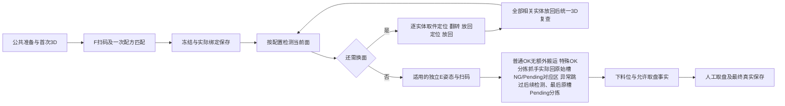

# 运行、动作与状态合同 station01-execution/1.0

人工取盘实施落位（W §2.4最后一段、D16/EX03）：在Detection、Sorting、UnloadPreparation真实完成及WholeTrayCompletion必要提交后，由共同业务核同盘/计划/下料完成事实并实际追加ManualRemovalAllowed事件，才输出允许人工取盘；不再调用旧解锁设备指令或把解锁观察伪造为完成。状态ReadyForRemoval/ManualRemovalAllowed、RunSnapshot.ManualRemovalAllowedEventId和ManualTrayRemovalConfirmationRequest.ManualRemovalAllowedEventId承接当前引用，最终人工确认必须匹配此已提交事件再形成Final。当前Stage使用ManualRemovalAdmission，有限窗口/取消/持久化失败门继续成立。原Unlock/ReadyForUnlock枚举与旧历史Final/快照字段只留读取原记录，不能授当前执行或推断安全控制完成；新Final使用ManualRemovalAllowedEventId，旧UnlockObservedEventId仅保留原JSON读取。012仅消费状态/通知和现有ConfirmManualTrayRemoval操作，不新增页面、传感器或安全屏蔽假反馈；没有真实提交不开放人工确认。

启动实施落位（W §1.2/§3.1、CR D16及关闭旧信号确认）：人工上料后的正式启动请求承接已提交StartIntent和运动租约；StartPreparationStep只确认同连接代次的实际设备就绪/自动/安全观察，保原PlcAcceptance窗口、取消和真实ActionFact保存。PC_System_Ready/PLC_Ready_State用于就绪握手，不再发送旧PC_Start_Cmd触发夹紧，不要求或伪造Clamp/PhysicalButton/ZoneConfigACK。新StartPreparationEvidence(Accepted,DeviceReady,DeviceEpoch,Observation及Operation/Action/Intent身份)替代当前StartClampEvidence；V1历史StageHandoff字段仍只读。共同移动/独立绑定/当前V2移交消费实际Ready和有效租约，不再以旧Clamp作为准入。无需新增页面或第二个人工按钮前置；新源Start_Button作为真实外部输入未被观察时不能伪称已按。012不需改共同类型，消费新运行批后仅接既有真实阶段。旧StartClampStep、ClampObservationPolicy及无用区域准备端口/当前装配删除；有效保存、动作互斥、有限等待和暂停/取消/未知保持。

日期：2026-10-03；Phase 1目标设计，未实现/验证。011唯一维护和生产，012消费既有API/通知与界面。共同配方字段只引用[recipe-contract/1.3](recipe-contract.md)，通信细节只见[通信合同](plc-communication.md)。本文件不产生新的机械反馈或恢复规则。

## EX01 观察与对象关联

首次公共3D和翻转放回后的复查都走实际采集→算法调用→事实保存，扩展现有CaptureAlgorithmMessages/AlgorithmRequirement，新增语义用途TrayPose（旧Height仅供仍有效历史读取）。目标结果TrayObservation包含：

实施落位：Domain/Station01/TrayObservation.cs定义观察及Presence/Pose/Purpose枚举，SlotParticipation.cs唯一形成参与集合。AlgorithmRole.TrayPose、AlgorithmRequest.ObservationContext(TrayId,Purpose,CheckRound,RelatedTransitionId)与AlgorithmEvent.Observation传递本次调用关系；Worker消息携同一context，响应只从实际媒体生成Slots/FLocation，适配验证后补实际请求Run/Capture/Call及真实provider来源。PublicConfiguration.Algorithms.TrayPose为可空AlgorithmConfiguration，缺失明确NotConfigured，不拿旧Height能力代替。RunExecution记录必要保存后的InitialObservation及写入引用；F点只用其实际XY，Z/单位/基准承接公共扫码配置。旧Height负载可读，不写伪高度完成。

| 字段 | 约束 |

| --- | --- |

| ObservationId、RunId、TrayId、CaptureId、CallId、ObservedAt、Source/证据引用、提交引用 | 来自本轮实际输入与输出；算法结果、来源与必要保存分别核实 |

| Purpose | InitialPreparation或PostPlacementCheck；不得从面号推测测量用途 |

| CheckRound / RelatedTransitionId | 初次与复查轮次及对应动作轮关联；不是旧HeightRound，也不是PLC连接代次 |

| Slots[] | 每项PhysicalSlotIndex、Presence=Present/Absent/Unknown、Pose=Normal/Abnormal/Unknown、Reason及适用物理实体关联 |

| FLocation | 仅InitialPreparation提供绝对X/Y、Unit、Frame/Datum、定位依据；复查不重新F绑定，不能取其结果改旧料盘身份 |

有料/姿态判断不得从高度、质量判定或请求目标生成。缺少可靠初次观察/F定位阻断对应动作；无料不能由算法失败推出。首次观察按实际公共采集范围记录，F绑定后核对配方物理槽映射；没有身份对应关系不得凭列表顺序补齐。

运行SlotParticipation从真实观察形成：Absent不参与；Present+Normal可参与；Present+Abnormal为PoseExcluded，仍有料则保持后续检测终止，最后从原穴位真实分拣到配置Pending目标；保留已有检测事实，不转换为NG/Pending质量结论。复查异常只退出该实际槽对应对象，先前检测/动作保留。组成员/整体沿冻结关系映射，不虚构新组处置。Unknown表示没有足够依据，不能当作Normal或空异常集合。

### EX01.1 新3D观察的生产、适配、消费与验证责任

| 环节 / 实际落点 | 唯一负责人 | 设计输入、输出及承接 |

| --- | --- | --- |

| 共同结果合同：backend/src/Gaode.Application/Ports/CaptureAlgorithmMessages.cs；TrayObservation领域值 | 011 | 新增TrayPose语义及EX01字段，保Capture/Call/Run/物理槽/轮次/用途关联；不把HeightSamples默认换成正常姿态 |

| 测试算法生产者：scripts/010-content-sample-worker.py | 011 | 根据实际接收媒体/明确Test输入实现新观察输出并标真实来源；不按图片路径、Q编号、worker特征选择业务，不固定返回正常/F目标 |

| 真实3D算法生产者：现配置绑定的外部算法进程 | 011负责接入与合同验收 | 当前未取得满足EX01的实际输出，需该生产者提供观察及F定位；不虚构仓库中已有实现。缺口只限制依赖新观察的真实链 |

| 结果适配：backend/src/Gaode.Infrastructure/Algorithms/PythonWorkerAdapter.cs、WorkerProcessSupervisor.cs | 011 | 解析实际返回并关联调用/来源；拒绝缺必需观察，不从请求目标补结果；保有界等待、输入释放和取消事实 |

| 能力注册：backend/src/Gaode.Host/Composition/CapabilityRegistration.cs | 011 | 按明确合同/能力登记，不凭版本字符串或测试worker特征批准姿态能力 |

| 初次消费：backend/src/Gaode.Application/Station01/Steps/ThreeDStep.cs、FScanStep.cs | 011 | 必要保存后用实际首次观察确定参与槽及F XY，公共准备不借未知配方解释观察 |

| 复查与状态：backend/src/Gaode.Application/Workflow/RecipeDetectionExecutor.cs及既有运行保存/查询 | 011 | 全部相关实体放回后统一复查；异常跳过后续检测、最后原槽Pending分拣，保此前结果，不重绑F；输出真实异常槽号 |

| 验证与界面 | 011负责M03及M06/M07算法/媒体/观察证据；012消费EX04状态 | 同次真实调用证明观察，不用组件预置结果代替算法；012只作既有区域绑定，不实现姿态判断 |

以上为任务拆解的明确责任，不代表生产者已实现或验证通过。正式地址/型号承载缺口不阻止观察合同、独立保存和无依赖组件设计；新观察未交付时，相关完整链如实未验证。

## EX02 唯一执行链

公共准备由StartPublicPreparation调用RecipeApplicationCoordinator并持久handoff；随后由WholeTrayWorkflowOrchestrator统一调度ThreeStageWorkflowExecutor，其Detection阶段经IDetectionPort调用RecipeDetectionExecutor。复用这一实际调用关系，不重复执行同一阶段。F绑定按RC05.1仅做共同软件绑定/真实提交，型号在相关翻转动作内部下发；不制造DeviceApplied或重新要求旧配方ACK。

图中E为流程判断节点，不是E相机；独立扫码步骤仅配置需要时存在。检测面上的既有E时机继续按配方执行，不能与额外姿态重复扫码。图不替代实际动作/保存/期限门。

批采保留当前“同面按相机批采、同对象同面配对”顺序，AB/CD由配置选择。更多面复用循环与对象过滤，不按编号、产品名、图片或worker选择执行器。整体物理实体共享换面一次，不能按部位重复抓取。

### 放回与复查

每个需要转姿的物理实体：

1. 从冻结用途点位定位取件，取得当前动作关联的真实到位依据。

2. 以产品型号和目标检测面/独立扫码姿态发起共同翻转能力；PLC执行内部机械程序。

3. 翻转可靠完成后按该实体放回点定位，调用放回能力，分别记录完成事实。

4. 本轮所有相关实体均放回且必要事实提交后，统一3D检查；正常对象进入后续检测或适用E扫码，异常槽退出；F不重绑。

复用IPhysicalHandlingPort，FlipRequest改为包含Model、目标姿态语义及取件到位证据；新增PutBackRequest/PutBackAsync，包含同TransitionId、实体/物理槽、放回点与窗口。两动作各自ActionCorrelation及意图/结果，不能以一个Flip结果推定全部完成。普通移位继续MoveRequest，但明确轴用途/所需目标集合；不再用同一FixedPoint.Z隐含三个不同Z。阶段执行器不操作寄存器、原码或内部清零。

实施字段落位：FlipRequest(Correlation, TransitionId:Guid, Model:string, TargetPose:RecipeTargetPose, PositionEvidence, Window, IntentWriteId)；PutBackRequest(Correlation, TransitionId:Guid, PositionEvidence, Window, IntentWriteId)。DeviceActionEvidence新增可空TransitionId，完成语义分别FlipCompleted、PutBackCompleted，不伪造ActualFace；原FaceObservation仅历史/原用途读取。新检测目标DetectionStepTarget保留LocalFace为int?，将HeightRound替换CoordinateEpoch，附StageId/ScanPoseId；独立E以ScanPoseId关联且LocalFace=null。RecipeBindingReceipt记录RecipeId/RecipeVersion/DefinitionDigest及原相关身份、预算、窗口、IntentCommit/RequiredCommits/Registration，WasCompletedInWindow仅核真实业务提交与原窗口，不需要旧设备ACK。旧RecipeApplicationReceipt仅历史读取，不授新续接。

复查实现承接：同一轮相关实体共享TransitionId，各自Action/物理槽仍独立；全部成功放回后才以该轮ID调用TrayPose。冻结负载的可空TrayPoseCapability保存公共配置形成的已绑定能力，仅含复查的计划必需；RecipeAdmission.Freeze额外接收公共TrayPose配置，不将它定义成第二套配方参数。DetectionRequest携从当前移交引用和运行库核实的InitialObservation/InitialObservationWriteId，DetectionPortResult携LastObservation与按物理槽键的SlotParticipation；分拣只消费仍Participating实体，先前采集结果不删除。旧Height可读，但不再作为当前handoff消费者入参。

新增工作预算从已冻结BusinessDurations的可空FlipCompletion、PutBackCompletion、TrayPoseAlgorithm毫秒值读取；只有实际含对应工作的计划要求显式正值。当前旧预算未声明这些值时明确缺失，不用HeightAlgorithm或固定大值冒充新姿态预算，不影响无依赖的保存。运动沿已有XyCompletion有限窗；新增取放各自窗口不得晚于原检测总截止。参数批准与Test输入仍分别记录。

独立E需要建立额外姿态时复用上述取放与复查能力；TargetPose由有效配置映射，未定映射仅限制实际派发，不赋固定5。E采集使用扫码Z，实际解码/释放/保存规则保留。

动作定位承接：MoveRequest.FlipPreparation（FlipMovePreparation）将同一翻转的业务身份送到取件定位，由通信层在XY触发前完成程序映射；没有程序映射不得移动后再失败。XY用途的PositionObservation.ActualZ留空，AxisPurpose=XY；DeviceObservation.AxisPositions分别输出X/Y/DetectionZ/ScanZ/GrabZ实际值，缺输入留空，不把请求位置回显成观察。

## EX03 分拣、下料与关键保存

- 仍正常参与的物理实体按已提交质量/完整性及有效处置规则规划；姿态异常独立剔除，并保存退出依据。

- 普通OK保存NoMoveRequired依据、保持原槽；特殊旋转OK已离盘，必须使用分拣抓手从工位实际放回本件原始OK槽，不消费普通免搬依据。NG与Pending分别引用同盘各区配置目标、容量/预留与物理实体关联。

- 需搬运对象的实际顺序：源XY→抓取Z取件高度→取件→抓取Z安全高度→目标XY→抓取Z放件高度→放件→抓取Z安全高度。各高度与容差取有效配置，不在此给数值。

- 复用SortingTargetAllocator及Reserved/InTransit/Completed/UnknownHeld。真实取料后必要在途提交；当前有效提交回执未取得前不授权放料。可靠放料和要求的后续完成事实、占用提交齐备才Completed。

- 所有适用分拣及必要保存完成后进入UnloadPreparation，再记录到下料位、允许取盘、人工取盘及Final；沿WholeTray/ManualRemovalAllowed/Removal/Final事实区分（旧ObservedUnlocked仅历史），不能把其中任一单独当最终完成。

- 允许人工取盘必须有新协议下已确认的可靠条件，不能因旧字段已删而补真。未知控制按DEP局部受限。

- 取消关闭后续动作准入；保存失败、过期或反馈未知不生成成功，已发生取料/未知持件按既有UnknownHeld保留，不盲重试。取消回执不证明机械已停止；新恢复/自动回位延期。

## EX04 当前运行查询投影（011生产，012消费）

复用GET /api/v1/station01/runs/{runId}、/media、/evidence；HTTP路径及授权不新建。以下是现有recipeExecution等结构的目标增量，字段的已提交事实来源必须一致。

| 公开字段 | 形状与来源 | 空值/读取规则 |

| --- | --- | --- |

| recipeSelection | 已保存选择意图及ObservedVersion/ObservedCatalogDigest | 未选择/未记录为null，不当实际绑定 |

| recipeExecution | recipeId、recipeVersion、definitionDigest、catalogDigest、planRevision、fCode、model、snapshotRef、scenarioId/route | 仅实际绑定/冻结事实；尚未绑定为null，不从活动目录填充 |

| recipeExecution.stage | 现有Detection / Sorting / UnloadPreparation及尾段阶段 | 顺序源于实际阶段事件，不能固定按旧枚举序号排序 |

| recipeExecution.executionPhase | kind、state、stepSequence、transitionId?、entityId?、physicalSlotIndex?、localFace?、scanPoseId?、observationRef? | kind为Initial3D/FScan/RecipeBinding/InspectFace/PositionForFlip/Flip/PositionForPutBack/PutBack/PoseRecheck/EntityCode/Sorting/Unload/ManualRemoval/FinalSave；非适用关联为null |

| phase所在位置 | F前公共状态中同形executionPhase，绑定后置于recipeExecution | 尚无recipeExecution时不能伪造配方；同形对象由011一个投影函数生成，不双写不同事实 |

| executionPhase.state | Waiting/Running/Completed/Restricted/Failed/Cancelled/UnknownHeld | 从当前已提交阶段与动作事实映射；受理不是Completed；停止/取消不推断设备状态 |

| slotStates[] | physicalSlotIndex、presence、poseState、participation、observationRef、entityRefs[]、reasonCodes[] | Unknown保留；按真实物理槽展示，不压缩编号 |

| abnormalPhysicalSlotIndices | 去重、按物理槽号排序的异常集合 | 未取得有效覆盖观察时为null；已知异常配合slotStates与observationCoverage，不用空数组宣称全正常 |

| observationCoverage | NotObserved/Partial/Complete、最后有效observationRef | Complete只表当前所需检查覆盖齐备，不表示质量OK或整盘完成 |

| results[] | 沿008已有分层质量、completeness、technicalState、保存/来源/结果引用；新增poseState/participation及关联 | 未判定/未提交与Pending分开，异常不抹除此前结果；不在页面汇总代替后端 |

| movements[] | 沿既有实体/物理槽、sourcePointRef/targetPointRef、操作/保存引用与物理状态 | 无搬运依据为空/NoMoveRequired；不以OK/NG或Final推断动作 |

| axisObservations[] | axis=X/Y/CameraZ/ScanZ/GrabZ、position?、unit?、reliability、observedAt、connectionEpoch、evidenceRef | 每轴实际采样，缺值null；target不填actual，不公开原码/地址/位 |

| restriction / allowedActions | 当前原因、受限部分、真实允许的已有业务操作 | 只限制依赖动作；页面不自己启用恢复或设备动作 |

公开轴用途只是业务语义；信号名与编码不进DTO。新schema增量应随现有运行/结果schema版本显式记录，由011投影、012消费；不是新HTTP接口。引用真实保存事件构造投影，页面查询不重运行业务、不补写历史数据库。

实施落位：Domain/Station01/RunSnapshot.cs承载ExecutionPhaseProjection、SlotStateProjection、ObservationCoverageProjection及同形公开字段；Application/Station01/RuntimeObservationProjection.cs从同run已提交Write和StageEvent构造唯一投影，Host查询与通知共同消费。RecipeExecution保留既有Version字段并以RecipeVersion只读别名承接接口名称，新增DefinitionDigest/Model/FCode/SnapshotRef/Stage/ExecutionPhase；未绑定不创建该对象。结果schema增量为station01-result-display/1.1。对当前保存事件变化通知使用现有有界通知队列；TraceWriter与StageEventStore只在确认提交后提示Host重新读取，不把通知回调失败改写为保存失败，不新增执行入口或数据库。

历史run缺新配方/姿态/轴字段保持null及Unavailable；原始高度和来源按原记录只读展示，不能重新解释成新姿态正常或新轴反馈。ETag/resultRevision涵盖这些实际持久投影变化，避免304隐藏新结果。

实施轴输出落实：RunSnapshot增加AxisObservations（AxisObservationProjection列表），DeviceObservationApi同名列表；每项Axis、Position?、Unit?、Reliability、ObservedAt?、ConnectionEpoch?、EvidenceRef?。名字X/Y/CameraZ/ScanZ/GrabZ，不带原始报文。运行投影只从同run已提交ActionFact的实际DeviceObservation或相关DeviceActionEvidence.Positions取值；未保存/目标值/其他run不进入实测。位置用途XY只贡献X/Y；单位未有直接来源为null。状态子schema及当前Run.DeviceSchemaVersion显式为device-semantics/1.1，结果仍station01-result-display/1.1；旧记录不回填。012消费新增列表，不按一个ActualZ填三个轴，不增加页面。

## EX05 通知、日志、期限

沿既有s01/notification/2.0，changedFields使用真实变化的业务路径：recipeSelection、recipeExecution、executionPhase、slotStates、abnormalPhysicalSlotIndices、observationCoverage、results、movements、stage及最终保存引用。通知只提示同run GET重取；不复制整份配方、原始协议或完整RunSnapshot。

Run/Tray/RecipeVersion/PlanRevision/物理槽/实体/面或扫码姿态/Transition/Action/Capture/Call及WriteId按已建立身份关联；首次F前没有的身份保持未建立。命令受理、阶段变化、设备动作、阻断/超时/失败用分级分类结构化日志并持久可查，沿现有日志设施，不造新平台。

RecipeWorkload/RecipeExecutionBudget按实际配置面、相机、翻转放回、复查、独立E、适用分拣及保存次数计成本；不以旧图数隐藏新增步骤，不在阶段重排、重试或配置更新时刷新绝对截止。沿原起点及更早deadline规则，设备内部I/O计数留通信预算边界。无有效动作成本/期限只限制相关动作，不能手填任意宽松值。

## EX06 联合消费与未决

011输出上述真实状态，012负责已有运行界面所需字段绑定和授权配方弹窗，归档只读、无关页面不变。状态/通知生产与消费必须一同迁移后才声明接口闭合。实际代码由D011-runtime-state-1.0（011 T015）交012 T021；软件绑定与注册由D011-runtime-binding-1.3（T011/T012）交012 T020，不包含在T003—T005的D011-common-code-1.3中。基础字段替换所需直接编译迁移随共同基础批先交，不能等待完整运行验证；源码/构建/已验证能力分开记录。

012 T017只先交真实保存/完整重读/版本及必要证据，T019适配迁移、T020运行接线另核。011 T025准备唯一联合驱动；代码/页面/API/输入及必要清理就绪后由T027启动，012 T022同期采证。运行后的D012-ui-joint-evidence只作为页面完成判据，不是启动前置。

更多面、额外E、分拣及姿态退出的业务规则已确认；地址/型号承载/速度/报警/恢复/安全按spec DEP限制。没有真实算法新输出或通信映射时，只报告对应链未验证，不用默认正常、假反馈或删除必要步骤补齐。

尾段资源承接：允许取盘事件不释放运行运动租约；只有同盘ManualTrayRemovalConfirmation与Final真实提交成功后，共同WholeTrayWorkflowOrchestrator才释放已核无活动/未知动作的原运行租约，供下一轮人工上料启动。失败、取消、未知或未提交保持占用。复用既有ResourceLease，不引入恢复平台。

执行预算/旧出口实施承接（T018—T022）：DetectionRequest增加FrozenBusinessDurations（现有BusinessDurations），只由当前run已冻结Budget.BusinessMs形成；派生动作窗口取各项冻结期限与原阶段截止较早者，翻转/放回、复查3D各用对应项，无固定3s/10s或通用算法预算替代。预算按实际XY/用途Z移动、复查移动采集/释放及保存义务计数；不刷新外层绝对截止。RequiredForOk为true时缺少有效E码不能形成OK，沿已确认DEC-06/OPEN-16缺结果Pending且NG优先，并保码失败原因/内部身份。

旧特殊旋转语义及MappingUnavailable保留为集成基线事实；最新new-1协议已确认两组绝对旋转/抓手/逐件分拣语义，014须实际贯通后才解除对应执行限制，尚未确认地址/安全等仍局部阻断，不使用Test机械HTTP或假动作证明。删除检测期SpecialExit与noAdditionalSorting当前执行豁免，现行分拣不接受旧SpecialHandlingCompleted作为免搬依据；旧字段只读取原历史，实际三区规则依当前姿态/质量。此限制仅该缺映射路线，普通更多面/额外E继续推进。

### 初次姿态退出的真实来源承接（T017/T018/T021）

当已冻结计划中全部配置工件都因首次已提交3D观察退出时，检测、翻转、E、分拣不再派发；仍沿共同整盘/下料和人工确认流程。不能因为没有产品拍照而捏造检测算法/相机来源，也不能将异常件补为OK或Pending。

DetectionPortResult新增EvidenceBasis业务枚举（Unspecified、ProductInspection、InitialPoseExclusion）。共同执行器只在实际复核同run/观察write/Call/Capture、原始摘要及关联已保存3D媒体/采集事实后，复用首次3D的真实Camera/Light/Algorithm来源；CaptureFacts保真实原始操作身份，不改成检测采集。完成事件同步EvidenceBasis，状态和历史可区分实际检测与仅姿态退出。缺必要初次保存事实继续拒绝，不能补正常或授权人工取盘。正常路径沿实际检测调用来源。

这是既有姿态退出/真实来源保护的实现细化；recipe-contract/1.3不变，不新增恢复或边界平台。最小新增验证为现有配置执行组件两行：全部首次异常且真实初次保存存在时无产品调用；缺相关采集事实时拒绝；复用已证更多面/E/取消。012不需编辑此共同字段。

检测期限转Pending的现行承接：保留最后同运行/动作已关联结果的姿态观察及物理槽参与状态，正常故障槽沿既有技术Pending规则；姿态异常保留独立3D依据和实际Pending处置，排在正常处置后；无料槽不生成任何移动。没有有效观察覆盖则真实暂停并记PendingObservationCoverageUnknown，不把姿态异常伪装为检测质量结论，实际Pending处置独立承接、不重新F绑定，不据过期检测结果冒称OK。分拣仍先于下料，未知反馈不得进入下料；原重试次数/截止/取消和必要提交不变。

T025当前输入结构补齐：001公共配置schema定向增加algorithms.trayPose，预算schema增加trayPoseAlgorithm/flipCompletion/putBackCompletion；与已交Domain字段一致。旧height/clampCompletion保历史读取字段但不再是当前启动必需，当前不回退测高或夹紧。缺TrayPose及对应预算仍按既有准入拒绝依赖准备流程，翻转/放回预算在冻结计划处验证。011维护这两份后端schema，当前产品/配置变更仅独立副本、随稳定批交付；不写主项目运行配置。单面/多面具名输入在本功能examples/joint准备，全部明确Test来源及预期，未运行不称联合通过。

T026旧测高调度承接：只读核AlgorithmRuntime公开Invoke的Height已无现行业务调用，实际调用仅算法租约/期限/SQLite保存保护测试。将这些有效用例迁移为TrayPose及已加载的明确姿态配置/预算，再删除Runtime的Height派发分支与Height预算选择；保旧原始payload/字段的历史读取。当前ThreeDStep/复查仍消费真实Observation，不提供测高回退。SimulatedAlgorithm/旧worker独立测试等剩余消费者单独核查，不能据本次Runtime迁移宣称全部旧算法代码已清理。

M10当前收敛：机械载荷解析必须在Infrastructure通信叶适配中，Host Composition只转交文件路径，不调用含原码的解析器。LatestProtocolPlcDevice构造的可空mechanicalConfigurationPath参数承接已交Host路径，由通信适配器内部读取；不向原始PlcRuntimeOptions增添业务可访问属性；无第二来源或缺值兜底。联合驱动只依赖具体持久事实读类型，不导入含原始通信证据的整个Persistence命名空间。保持原架构规则/分类/负例，不扩大白名单；本次先改设计再改源码。

多面01实证修正（T010/T019/T024）：第二面受理2秒期限先到，后台整表轮询尚未让出动作推进；旧MoveAndBegin失败后只标租约Unknown，未取消设备请求，导致期限后仍下发轴触发。保持原期限，运动请求在准入后由同一串行动作任务及时推进，不等待下一整表轮询；仍等上一动作结束且核当前身份/代次/安全，不新增并行动作或回执假成功。每次业务移动持独立链接取消令牌，超时/取消立即取消未完成请求并保持Unknown。共同DetectionResultKind增UnknownHeld（当前执行合同修订，recipe-contract/1.3不变），失去运动确认以此返回并持久化UnknownHeld，不得显示可重试或转Pending分拣；未派发/纯算法失败按原语义。

T015实际页面对账修正：single05实际已提交Sorting后，RunSnapshot.SortingState仍沿初值NotStarted，不能接受该显示作为正确分拣状态。共同RuntimeObservationProjection只从同run/tray/冻结Plan且摘要有效的已提交Sorting事件形成状态；多个预留操作全部有完成事实才显示Completed，未知保持及失败不得显示成功。查询与通知共用投影，sortingState纳入changedFields/修订摘要。保原单面失败字段证据，仅对新投影组件和同一多面代表复核；012不新增工艺判断。

T026测高生产端最终承接：AlgorithmRuntime当前只派发TrayPose/FDecode等现行能力，PythonWorkerAdapter、ContentSampleWorker和SimulatedAlgorithm旧Height产出不再是历史读取所需，删除其生产/解析分支。保Height枚举、旧payload及历史数据库读取原值；无当前执行回退。SimulatedAlgorithm仅支持其实际具备的FDecode，未接TrayPose等在受理前明确拒绝，不发布空Result或正常姿态；NotIntegratedAlgorithm按实际Role记录调用。原模拟取消/有限退出/F原始码和worker真实媒体/关联/InputReleased义务保留，旧Height独立断言迁移为现行内容能力和明确拒绝；复用已有011真实TrayPose媒体/进程测试。当前单面/多面证据按其实际代码摘要保留，清理后只补受影响组件/完整构建/当前边界，不再次跑代表链。

T015/M11真实重启读取修正：multi03同库页面补读发现内存snapshot缺失时配方绑定/整盘状态使用初值，不能当正常终态显示。共同RuntimeObservationProjection必须依同run/冻结Plan的真实已提交Intent/Bound/Handoff/Receipt和Final事件构造当前读取；校验摘要、关联、必要回执及提交依据，不凭运行State单值补Bound或Final，不读取新活动目录，也不授历史运行续接。增补必要历史投影组件和同一库仅GET复核，不重开代表链；原未通过显示/报告保留。

T026孤立人工翻面交互清理：以当前recipe-contract/1.3的动作定义、实际共同执行无ManualFlipInteraction.WaitAsync消费者、旧手工确认通信线圈已被替代为依据，删除当前孤立服务/注册/manual-flip GET及confirm POST/ConfirmManualFlip许可生成和其两项失效整链断言。旧批准工艺、原操作者/面来源和证据仍按历史适用范围读取；本轮不为其增加替代机械信号或宣布现场恢复。RunSnapshot.WaitingManualFlip/ManualFlipProjection保留历史JSON字段，不生成当前续接许可。保真实人工区域安全阻断；有效权限、对象关联、保存、期限、取消分别由当前翻放/UnknownHeld及人工取盘组件承接。012独占清理运行页面此孤立消费分支，保原型和当前人工取盘。删除前消费者表与旧摘要在retired-manual-consumers-before.json，产品服务无当前调用；不因测试失败删除有效保护。

## 013实施前定向同步（2026-10-04）

SY-05/06：FR-001/013/016—023、PC02—05及执行状态沿013 A01—08/D02—07：两连接、单源用途采集；H300、B200/500、动作200、位置500/1000ms，首Moving/Executing局部50ms齐备后恢复200；原期限/取消/未知及中间态→完成→到位后实坐标因果保持。各块真实身份，基础与位置独立可靠性；最终位置发布后才返回完成，关键准入/采集释放即时核查。Host位置增加SampleStartedUtc、SampleEndedUtc、ConnectionEpoch、Reliability并升live/1.2，Domain和持久原格式不变。预算schema2.0/代表预算2/模拟2（模拟schema1.0）及Start/Host/fixture引用先迁移。实际取料、原始证据与有效在途提交后才Place不弱化。正常HeldFlip原5秒失败保存不强求未达1024的段；自动阈值真提交接续另用通信证据组件，原缺口拒绝独立保持。013每侧一次同run-2+空闲及必要组件/完整L/受影响009；真实只读API观察器只替013后端负载前置，011/012页面证据义务与历史报告不改。原T009/T010正式PLC缺口仍局部限制，历史任务勾选不变。

本节为本轮授权的现行条款对齐，软件完成由[013任务](../../013-plc-polling-optimization/tasks.md)及实际证据判定；不改历史完成/失败记录，不表示已运行通过。

本副本2026-10-04增量：运行深冻结携入局部采集参数引用及SortingGripperId，既有请求按实际项引用取设置；历史空保持真实，不重写013冻结输入。见012 contracts/capture-and-gripper.md，执行/通信顺序不变。

## 2026-10-05确认需求的本功能承接

当前来源为高德_文档/new-1/PLC与上位机通信接口协议.docx及同目录信号表，摘要见014 basis-receipt；旧来源只作历史，空白正式地址仍不补。014规格定义场景1特殊两组绝对旋转/逐件立即分拣、两用途抓手有效同号复用/换号或失效重建；翻面无选择握手。012定义所有配方手动10×10实际格位、各区独立号、OK检测序、稳定关联与完整保存。普通面/成员顺序和整盘统一分拣保持，特殊OK需从工位到本件原始OK槽的放料关联，姿态异常跳过后续检测，最后从原槽实际分拣到Pending。

前轮specify仅确认需求同步；本次014 Phase 1及012配套设计见当前设计引用，不生成新tasks；旧ID/勾选/失败/归档及旧实现限制保留其时点。共享字段/序列化/接口、消费者和后续任务必须在改码前实际对齐；业务层无原码/地址/内部握手，复用唯一校验/执行/公共取放，保原期限/取消/代次/真实取料保存门和日志。014主责必要共同/通信增量，012主责界面保存消费。验证限一条多件特殊、一条受影响普通及必要组件/持续L/受影响通信/原型与执行完整性，不扩大历史专项或重启013性能研究；013-acceptance/2及性能偏差保持。

原始料盘、OK区域、实际物理格位及实体身份在取料前明确并冻结，后续旋转/采集/判定/回放沿用同一关联；区域号只用于展示/检测顺序，不能代替原始槽身份。特殊OK原槽回放使用分拣抓手，不切成上料抓手或NoMoveRequired；实际取料及必要保存、转运、放料和安全位确认后才推进下一件，失败不记录完成。

操作者不得为OK选择其他目标槽，不增加“是否回原槽/OK处理方式”开关；原型任意OK目标配置含义退出。若已有明确必要的原槽放料参数，归该原槽取放配置；同槽不推导全部取放坐标、高度/抓手补偿相同，不自动复制全部取料值、不编造新参数。

历史读取保持原记录事实，不把旧任意OK目标/旧完成标记重解释成已按本次原槽规则执行。当前显示与执行必须区分普通无需搬运事实和特殊实际原槽回放事实；缺实际保存/动作证据时不补造完成。具体共同字段、序列化/版本、历史编辑限制和接口签名在后续设计实际对齐，不能宣称仅文意同步即结构交付。

## 2026-10-05当前Phase 1消费

共同字段/序列化唯一定义见011 recipe-contract RC10（设计1.5、正文4/冻结3；实际代码仍1.4）。执行增量见014 contracts/execution.md EX14-01—05，012界面/HTTP见layout-design与recipe-authoring-api；均为本会话统一设计，无第二模型/校验/身份/执行器。本轮不代码/构建/测试、不新增tasks；后续代码前须准确任务/消费者/注册扫描承接，不能称待同步已完成。旧source、任务勾选、历史验证和013单源降频/性能偏差保持。

### EX14-P 新增事实投影（station01-execution/1.1设计，实际实现1.0）

原EX04/05字段含义不改，新增可空业务字段：slotStates追加`cellId,row,column,region,regionOrdinal`取同run冻结布局/映射；无映射/历史负载缺项保持null。movements追加`origin`（RC10 OriginalSlotReference同形）、`handlingPurpose`（ReturnToOrigin或已有普通Sorting用途）、`safeEvidenceRef`与原actual放料引用。拍照/算法结果追加`stageId`用于两组隔离；executionPhase追加当前`scopeUnitId/scopeSlotId`，仅实际件执行事件时有值。

Origin的EntityId是真实体，成员/部位仍沿原entityRefs不混。一个scope检测结束不是全盘stage completed；全盘完成必须全部参与scope与排除事实聚合及原保存门成立后才投影。普通OK只在实际NoMoveRequired时显示；特殊OK须真实ReturnToOrigin且placement/safe已提交，不从quality或配置推断。历史缺事实Unavailable，不用活动目录补。changedFields通知沿同一查询投影触发重读，不另建状态副本/页面。
