# 功能任务清单：011 PLC交互与共同检测流程更新

人工取盘实施落位（W §2.4最后一段、D16/EX03）：在Detection、Sorting、UnloadPreparation真实完成及WholeTrayCompletion必要提交后，由共同业务核同盘/计划/下料完成事实并实际追加ManualRemovalAllowed事件，才输出允许人工取盘；不再调用旧解锁设备指令或把解锁观察伪造为完成。状态ReadyForRemoval/ManualRemovalAllowed、RunSnapshot.ManualRemovalAllowedEventId和ManualTrayRemovalConfirmationRequest.ManualRemovalAllowedEventId承接当前引用，最终人工确认必须匹配此已提交事件再形成Final。当前Stage使用ManualRemovalAdmission，有限窗口/取消/持久化失败门继续成立。原Unlock/ReadyForUnlock枚举与旧历史Final/快照字段只留读取原记录，不能授当前执行或推断安全控制完成；新Final使用ManualRemovalAllowedEventId，旧UnlockObservedEventId仅保留原JSON读取。012仅消费状态/通知和现有ConfirmManualTrayRemoval操作，不新增页面、传感器或安全屏蔽假反馈；没有真实提交不开放人工确认。

启动实施落位（W §1.2/§3.1、CR D16及关闭旧信号确认）：人工上料后的正式启动请求承接已提交StartIntent和运动租约；StartPreparationStep只确认同连接代次的实际设备就绪/自动/安全观察，保原PlcAcceptance窗口、取消和真实ActionFact保存。PC_System_Ready/PLC_Ready_State用于就绪握手，不再发送旧PC_Start_Cmd触发夹紧，不要求或伪造Clamp/PhysicalButton/ZoneConfigACK。新StartPreparationEvidence(Accepted,DeviceReady,DeviceEpoch,Observation及Operation/Action/Intent身份)替代当前StartClampEvidence；V1历史StageHandoff字段仍只读。共同移动/独立绑定/当前V2移交消费实际Ready和有效租约，不再以旧Clamp作为准入。无需新增页面或第二个人工按钮前置；新源Start_Button作为真实外部输入未被观察时不能伪称已按。012不需改共同类型，消费新运行批后仅接既有真实阶段。旧StartClampStep、ClampObservationPolicy及无用区域准备端口/当前装配删除；有效保存、动作互斥、有限等待和暂停/取消/未知保持。

**输入**：[spec.md](spec.md)、[plan.md](plan.md)、[research.md](research.md)、[data-model.md](data-model.md)、contracts/四份现行合同及[交接](tasks-handoff-20261003.md)。  

**宪章**：8.0.0。**日期**：2026-10-03。**共同定义**：recipe-contract/1.3（RC08补齐G-01）；station01-execution/1.0、plc-interaction/1.0、011-verification/1.1。  

**状态**：011最终交接已按005共同006实际接收回执闭合，当前26/28；T009/T010正式输入/互通子范围保持未勾。01225/25软件条件已交付并接收。产品主项目集成本轮另行授权，完成状态和验证见当前交接及本轮integration记录，任务勾选不代表代码已经合入或现场通过。

所有下述相对产物路径均位于完整独立根 `E:/dzk/gaode-1/workcopies/011-plc-interaction-update`；T001已按清单补齐源码。源码基线只读自 `E:/dzk/gaode-1`。主项目文档集成归011；原实施阶段仅授权副本，2026-10-04本轮明确授权已验证成果逐文件合主项目并作最小集成验证，不在主项目重新开发功能。T编号是本功能新增编号，不回填历史任务。

## 拆解规则与交付责任

每项唯一负责人均为011；012工作只列具名交付依赖，不在011任务内重复实现。每行包含真实文件、依赖、完成判据及最小验证义务；“验证Mxx”引用现有最小集合，不要求每项再跑一条完整链。测试编写项先明确有效预期，相关实现完成后才判运行通过；最终T027复用同次已有有效结果，只补未覆盖项，不重复运行已通过且未再改的检查。

新字段由共同类型/唯一序列化落地，不逐字段拆任务。必要异常仅保存、匹配、关联、取消、期限、反馈/姿态未知与架构拒绝。旧实现替代、消费者核对及实际删除附在对应功能项，不能另建兼容旁路。复杂恢复、性能、完整边界矩阵记待办，不成为全局门禁。

### 跨会话交付（当前012任务ID来自实际交付，禁止猜造）

| 交付名称 | 唯一提供方 / 内容 | 状态及消费范围 |

| --- | --- | --- |

| D011-G01-design-1.3 | 011共同合同RC08、精确字段/版本/引用/迁移及结构示例 | 已补并提前合入主项目；012设计消费回执及本次7份增量已接收合入 |

| D012-G01-receipt-1.3 | 012明确消费1.3及其API/data-model/editor-ui等实际修订清单 | 设计消费回执及7份文档已接收；随后共同代码已分批发布，实际接收/构建/运行状态见当前交接，不把设计接收当实现 |

| D011-common-code-1.3 | T003—T005共同类型、唯一校验/身份/摘要/序列化、IRecipeStore/IRecipeCatalog、Matcher及深冻结，附首次构建必要消费者迁移 | 优先交012 T002及保存任务，T018消费Matcher/冻结；源码、可构建范围及已验证能力分开记录，不包含绑定/状态交付 |

| D011-runtime-binding-1.3 | T011/T012协调器、真实Intent/Bound/适用Handoff及回执、注册调用清单 | 012 T020消费；代码交付不等最终联合证据，实际运行证明单列 |

| D011-runtime-state-1.0 | T015真实运行/姿态/异常物理槽输出及同源查询/通知 | 012 T021消费；不新增页面，不含在共同基础交付 |

| D012-store-api-1.3 | 012 T017真实保存、完整重读、版本和相关必要证据，正式源为单一SQLite | 保存先交不等联合验证；不自动包含T019适配迁移或T020运行接线 |

| 012 T019适配迁移交付 | 两输入适配文件及目录工厂等按原任务分批交文件；首次构建必需部分先交 | 基础源码收到后即可迁移；正式联合运行前核全部适用迁移，不以T017代替 |

| 012 T020运行接线交付 | RecipeEndpoints/Program调用绑定服务、同实例来源及保护；基础签名早批另列 | 完整批消费D011-runtime-binding-1.3并先于T027启动；早批先于相关首次构建 |

| D012-ui-joint-evidence | 012 T022在011统一启动后同期采集页面/API及状态证据 | T027运行后的完成判据，绝不是启动前置；共用同次构建/run，未交付不称页面通过 |

012唯一编辑：`backend/src/Gaode.Host/Api/RecipeEndpoints.cs`、`backend/src/Gaode.Host/Program.cs`、`backend/src/Gaode.Infrastructure/Recipes/RecipeEnvironmentDecoder.cs`、`SemanticRecipeInputProvider.cs`、`RecipeCatalogFactory.cs`、`JsonRecipeCatalog.cs`、其新增SqliteRecipeStore/RecipeStoreDbContext、`backend/tools/Gaode.StorePrep/Program.cs`、保存权限适配、对应目录/存储测试及frontend文件。011只交付语义/消费者/有效保护要求，接收其完成版本；不存在共同代码双写。完整分工沿plan路径表。

## 基础源码、首次构建与分批任务

交付批次不改变recipe-contract/1.3，不新增任务编号。T003可先交字段源码与消费者清单；T005基础批承接原T007/T011/T012/T016—T019/T024/T025中因共同类型替换而影响首次构建的直接迁移，其他完整运行义务仍按原依赖。具体字段、路径和负责人见[交接记录消费者表](tasks-handoff-20261003.md#首次构建所需消费者迁移只读源码核查未改代码)。

T005基础源码交付不等待012保存或联合验证；012以实际收到的源码/字段清单开展其T019及T010/T020必要直接迁移早批，不能以T009验证或T017完成为这批迁移前置。相关首次构建/组件运行须先收齐该工程全部直接消费者迁移，不能拿类型已交付声称Host可用。T005自身必要组件若引用Infrastructure也遵守此门；源码接收不等于整个任务完成，尚未验证据实记录。

Application真实点位解析、执行器/预算直接输入、旧目录调用及必要测试构造器由011随基础批迁移；两个012适配文件、Host两入口和工具只交要求，由012唯一修改。Infrastructure引用Application，Host/StorePrep又引用Infrastructure；所选测试工程的全部编译消费者同样要迁移，窄测试过滤不能消除编译依赖。保历史读取，不保错误当前字段、兼容旁路，不排除正式源码编译或伪造返回值。完整动作/外部输入未交付仍真实受限，不提前扩大运行范围。

每批分别登记源码文件/签名/摘要、实际已构建项目与组合、已验证能力。基础批同文件串行，后续任务只完成剩余功能/验证，不重复实施；所有编号和复选框保持，原义务未全完成不因早批已交而勾选。

## Phase 1：必要准备

- [X] T001 负责人011；准备完整独立源码副本并登记基线。产物：`specs/011-plc-interaction-update/implementation-baseline.md`（新增），副本内`backend/src/Gaode.Host/Gaode.Host.csproj`、`VirtualPlc/VirtualPlc.csproj`及其实际工程/脚本依赖。依赖：后续实施授权。完成：逐文件保留当前文档，核源摘要/独立路径/引用及012已交共享改动；排除嵌套workcopies、Git元数据、bin/obj、运行库/实例和历史大证据，不整目录覆盖。验证：M01准备检查；无Git时记录源码清单摘要，目录回退标识不作真实分支。（FR-017/022，P02/10/13）

- [X] T002 负责人011；固定合同接收、局部外部输入和最小用例清单。产物：`specs/011-plc-interaction-update/tasks-handoff-20261003.md`、`specs/011-plc-interaction-update/quickstart.md`、`specs/011-plc-interaction-update/contracts/verification.md`。依赖：T001。完成：接收具名交付或注明待收，维护每个M项实际class/method/dataRow与发现数量期望；新增方法标“待创建”，不由实际发现反推必需集合。记录正式协议与新3D输出来源，缺项只标依赖子项Blocked。验证：M01—M11映射/责任核对；不提前声称软件通过。（FR-021/022，P01/10/13）

## Phase 2：共同基础，优先交012

- [X] T003 负责人011；实现共同类型和唯一正文序列化。产物：`backend/src/Gaode.Application/Recipes/RecipeContracts.cs`、`backend/src/Gaode.Application/Recipes/ExecutionInputs.cs`、`backend/src/Gaode.Application/Recipes/RecipeDefinitionSerialization.cs`（新增）、`backend/tests/Gaode.Contracts.Tests/Recipes/RecipeDefinitionSerializationTests.cs`（新增）。依赖：T002。完成：按RC08准确落地检测配置XYZ、用途点/Flip.Stages/ExtraPose/TargetPose、身份关联及三层schema；显式必填值不补0，业务枚举不接受原码；当前删除CoordinateRule、PointRefs/测高等被替代字段，旧负载留有限reader。交付：字段源码和消费者清单可先交012；双方直接迁移齐备前不声称相关项目可构建。验证：M04/M08/M11一个相关字段完整往返及必要缺输入拒绝，不以RC08片段当可执行配方。（FR-004/007/009/010/014/023，P03/05/07/11）

- [X] T004 负责人011；实现唯一身份摘要与保存/运行共同业务校验。产物：`backend/src/Gaode.Application/Recipes/RecipeDefinitionIdentity.cs`（新增）、`backend/src/Gaode.Application/Recipes/RecipeDefinitionValidator.cs`、`backend/src/Gaode.Application/Recipes/RecipeAdmission.cs`、`backend/tests/Gaode.Contracts.Tests/Recipes/RecipeDefinitionValidatorTests.cs`（新增）。依赖：T003。完成：服务端RecipeId/Version、不透明ExpectedVersion、唯一DefinitionDigest规范化；全目录FCode唯一、四面恰1AB+3CD、更多面不套组合、E及用途点完整；保存不要求设备在线、不授生产批准。删除旧3AB四面合法和无用途PlcRecipeId/测高必填断言。验证：M04/M08少量合法及必要拒绝代表，摘要字典顺序稳定/业务数组顺序有意义。（FR-003/009/010/014/015/023，P03/04/07/11）

- [X] T005 负责人011；交付目录/保存结果、一次匹配及深冻结公共能力。产物：`backend/src/Gaode.Application/Recipes/RecipeContracts.cs`、`backend/src/Gaode.Application/Recipes/RecipeRunPlanner.cs`、`backend/src/Gaode.Application/Recipes/RecipeMatcher.cs`（新增）、`backend/src/Gaode.Application/Recipes/ExecutionInputs.cs`、`backend/tests/Gaode.Contracts.Tests/Recipes/RecipeMatchSnapshotTests.cs`（新增）及交接记录；基础迁移还含`backend/src/Gaode.Application/Recipes/CoordinateResolver.cs`、`backend/src/Gaode.Application/Workflow/RecipeExecutionCoordinator.cs`、`RecipeDetectionExecutor.cs`、`RecipeExecutionBudget.cs`（后二者同Workflow目录）及交接消费者表中实际受本批签名影响的011绑定、装配、投影和测试文件。依赖：T004。完成：RC04唯一IRecipeStore/IRecipeCatalog和结果类型，当前snapshot digest与正文保存来源分清；F精确唯一匹配及身份/用途拒绝；先将BuildExecutable入口改为消费Matched完整定义并承接既有单面计划；冻结正文/已解析输入/预算不引用可变集合，新保存不刷新旧run；先交D011-common-code-1.3基础源码和消费者说明，不得代写012提供者；原后续任务中维持保存链及所选项目编译所需的直接迁移前移本批，不等运行故事或最终验证。完整绑定/动作/状态仍按各自交付；本批源码交付不等012 T019迁移或T017验证，构建/必要组件证据则等双方对应直接消费者齐备，状态分开登记。验证：M08必要匹配/快照组件；真实保存留D012/T027证明。（FR-003/014/015/019，P05/07/08）

- [X] T006 负责人011；更新共同设备动作语义和保存门接口。产物：`backend/src/Gaode.Application/Ports/DeviceMessages.cs`、`backend/src/Gaode.Application/Ports/StagePortContracts.cs`、`backend/src/Gaode.Application/Ports/IMotionPort.cs`、`backend/tests/Gaode.Contracts.Tests/Ports/PlcStageActionPortContractTests.cs`。依赖：T005。完成：按EX02/PC保轴用途，新增MoveRequest.FlipPreparation在取件XY前交通信映射，XY实测Z为空且独立五轴输出不串用；翻转Model/TargetPose与PutBack分立关联，取料实存后才放料；设备原码/ASCII/内部握手不进DTO。有效期限/取消/未知保护保持，缺输入拒依赖动作。验证：M02/M09语义合同及后续M10负例，不以动作受理当完成。（FR-001/007/008/013/016/019，P04/05/07/08）

### 当前独立plan/bind入口落实（实施增量，不改recipe-contract/1.3正文版本）

011提供`CommittedRecipePlanReader(ITraceQuery,IStageHandoffQuery).ReadAsync(Guid runId,string scenarioId,IReadOnlyList<string> occupiedSlots,CancellationToken)`，返回可空`FrozenExecutionInputs`：无当前可靠V2返回null；有V2则核同run/tray、场景/槽范围、绑定引用、真实已提交Intent的摘要及其execution-inputs/2内容/PlanRevision/FCode/用途。不重新读取活动目录、不重新匹配或生成旧run计划，不以V1执行续接。旧V1只留历史查询。读取不授产品动作许可。

012唯一修改RecipeEndpoints的plan/bind装配：共同reader替换BuildPlan内V1/活动catalog/LoadPublic当前用途分支；两端使用reader返回的Plan，容量取该Plan的完整配置，不能补options默认值。IndependentRecipeApplication仍使用已冻结Public/Budget/Simulation、原截止、运行互斥及取消、实际Intent/Bound保存；核提供Plan等于既有冻结Plan，独立bind回执仍productContinuationAuthorized=false，不改变原run冻结或允许重复检测。正常F主链继续只匹配一次，不经过独立端点。

实施轴输出落实：RunSnapshot增加AxisObservations（AxisObservationProjection列表），DeviceObservationApi同名列表；每项Axis、Position?、Unit?、Reliability、ObservedAt?、ConnectionEpoch?、EvidenceRef?。名字X/Y/CameraZ/ScanZ/GrabZ，不带原始报文。运行投影只从同run已提交ActionFact的实际DeviceObservation或相关DeviceActionEvidence.Positions取值；未保存/目标值/其他run不进入实测。位置用途XY只贡献X/Y；单位未有直接来源为null。状态子schema及当前Run.DeviceSchemaVersion显式为device-semantics/1.1，结果仍station01-result-display/1.1；旧记录不回填。012消费新增列表，不按一个ActualZ填三个轴，不增加页面。

分拣实施落位：通信配置PlcRuntimeOptions.SortingSafePosition使用PlcGrabSafetyPosition(GrabZ,Unit,Frame,Purpose,SourceReference)，没有默认高度；只有来源/用途/单位/坐标系匹配目标才允许依赖分拣。Test组件显式提供自己的值，现场仍待有效配置。主机按PC04逐轴驱动；Sorting_Exec_Status按源0空闲/1取料完成/2放料完成/3失败，不保旧Executing/4失败/5满位或Sorting_OK。取料确认及IPickCommitPort真实提交先于抬升和搬运；放料完成后再抬升，最终清命令不以清零充动作反馈。下一次取料核非持件及新位置/当前指令关联，不能把上次取料完成当本次反馈。Unload仅XY，不写GrabZ/旧XY命令。普通槽身份只在业务事实关联，新源不下发旧Sorting_Part_Index。未知或取消不派发后续动作，未确认输入不补安全高度。

## Phase 3：US1 首次识别料盘并按配置开始检测（P1）

目标：公共3D产生可靠观察与F定位，F后唯一读取/冻结配方，配置XYZ进入共同检测。独立完成条件：AC-01—03及单面链相应段有实际媒体/调用/保存和无匹配阻断证据；完整链终点复用T027，不额外复制驱动。

- [X] T007 [US1] 负责人011；先迁移首次观察、F及配置坐标必要验证。产物：`backend/tests/Gaode.Contracts.Tests/Station01/ThreeDStepTests.cs`、`backend/tests/Gaode.Contracts.Tests/Station01/FScanStepTests.cs`、`backend/tests/Gaode.Contracts.Tests/Recipes/PublicPreparationTargetResolutionTests.cs`（后者同测试工程）。依赖：T006。完成：受共同字段/签名替换直接影响的首次构建迁移由T005基础批前移承接；这里的依赖约束剩余功能/验证，不倒挂基础交付。预期区分旧高度与姿态/F定位、检测配置XYZ，缺观察/坐标/必要保存不得动作；保FailedAlgorithmFactSave等有效保护。验证：M03/M09，T008—T012完成后运行这些受影响用例；旧测高预期定向替代，不删失败证据。（FR-002/003/004/021，P01/07/08）

- [X] T008 [P] [US1] 负责人011；实现新3D观察生产、适配及能力注册。产物：`backend/src/Gaode.Application/Ports/CaptureAlgorithmMessages.cs`、`backend/src/Gaode.Domain/Station01/TrayObservation.cs`（新增）、`backend/src/Gaode.Infrastructure/Algorithms/PythonWorkerAdapter.cs`、`backend/src/Gaode.Infrastructure/Algorithms/WorkerProcessSupervisor.cs`、`backend/src/Gaode.Host/Composition/CapabilityRegistration.cs`、`scripts/010-content-sample-worker.py`、`backend/tests/Gaode.Contracts.Tests/Algorithms/WorkerProtocolTests.cs`。依赖：T007。完成：实际媒体/明确Test输入形成EX01观察和来源，初次/复查用途与Capture/Call关联，注册按合同不按worker名字；禁止固定正常或F目标回显。外部真实算法输出列待交付，不能伪称仓库已实现。验证：M03真实worker输出及缺字段拒绝/释放，M06/07复用；缺外部输出仅阻其真实链。（FR-002/017/018/019/020，P02/04/05/07/09）

- [ ] T009 [P] [US1] 负责人011；迁移协议定义与独立通信预期。产物：`backend/src/Gaode.Plc.Protocol/Signals.cs`、`backend/src/Gaode.Plc.Protocol/SignalCodes.cs`、`backend/src/Gaode.Plc.Protocol/ProtocolDefinition.cs`、`backend/tests/Gaode.Communication.Tests/ProtocolOracle/ProductionDefinitionTests.cs`、`backend/tests/Gaode.Communication.Tests/Devices/SignalConformanceTests.cs`及`backend/tests/Gaode.Communication.Tests/ProtocolOracle/confirmed-011.json`（新增明确用途依据）。依赖：T007。完成：新分轴/翻转放回/分拣语义有独立来源；正式地址、ASCII承载等未定保持Incomplete，不采用旧地址/数值填空；显式Test映射与正式映射区分。替代后删除无用旧原码/ACK定义，保有效访问计划保护。验证：M02受影响独立预期，不从被测定义生成oracle、不跑009全部突变。（FR-001/016/021/023，P01/05/10）

- [ ] T010 [US1] 负责人011；实现正式PLC适配与独立VirtualPlc的新动作事实。产物：`backend/src/Gaode.Infrastructure/Devices/Plc/LatestProtocolPlcDevice.cs`、`backend/src/Gaode.Infrastructure/Devices/Plc/LatestProtocolPlcDevice.Stages.cs`、`backend/src/Gaode.Infrastructure/Devices/Plc/LatestProtocolPlcDevice.Acquisition.cs`、`backend/src/Gaode.Infrastructure/Devices/Plc/LatestProtocolStageActionAdapter.cs`、`backend/src/Gaode.Infrastructure/Devices/Plc/LatestProtocolStageActionAdapter.Transfer.cs`、`VirtualPlc/VirtualPlcEngine.cs`、`VirtualPlc/DeviceActionAudit.cs`、`backend/tests/Gaode.Communication.Tests/Devices/ActionHandshakeTests.Flip.cs`、`backend/tests/Gaode.Communication.Tests/Devices/ActionHandshakeTests.Pick.cs`、`backend/tests/Gaode.Communication.Tests/Devices/VirtualPlcLatestProtocolTests.cs`。依赖：T009。完成：分轴实际位置独立，翻转/放回分别可靠反馈，NG/Pending分拣新顺序且IPickCommitPort有效；VirtualPlc自身状态推进，无请求回显假反馈。新动作已替代处删除旧单Z/ACK分支；型号/正式编码待有效输入才派发。验证：M02/M09当前反馈关联、保存失败不放料；局部未定互通Blocked。（FR-001/007/008/011/013/018/019/023，P02/04/05/08）

- [X] T011 [US1] 负责人011；接通首次3D、F一次绑定及配置检测目标。产物：`backend/src/Gaode.Application/Station01/Steps/ThreeDStep.cs`、`backend/src/Gaode.Application/Station01/Steps/FScanStep.cs`、`backend/src/Gaode.Application/Station01/StartPublicPreparation.cs`、`backend/src/Gaode.Application/Station01/StartRunContext.cs`、`backend/src/Gaode.Application/Recipes/CoordinateResolver.cs`、`backend/src/Gaode.Application/Recipes/RecipeApplicationCoordinator.cs`、`backend/src/Gaode.Application/Recipes/IndependentRecipeApplication.cs`。依赖：T008、T010、T005。完成：受共同字段/签名替换直接影响的首次构建迁移由T005基础批前移承接；这里的依赖约束剩余功能/验证，不倒挂基础交付。必要观察保存后取实际F XY；一次GetSnapshot→Match→准入/规划/冻结/真实软件绑定，无三次Resolve或旧展示版本锁；删除固定F、当前测高偏移、旧BeginSpecialAction假绑定及设备ACK依赖，保原t0/取消/互斥。作为D011-runtime-binding-1.3向012 T020交共同协调器和端点接线要求，不改RecipeEndpoints/Program。验证：T007/M03/M08/M09；独立bind不授权产品续接，正式保存联调依赖D012-store-api-1.3，此证据依赖不阻止绑定源码和调用清单先交。（FR-002/003/004/014/015/019/023，P03/04/07/08）

- [X] T012 [US1] 负责人011；承接绑定提交、移交、装配与真实历史投影。产物：`backend/src/Gaode.Application/Station01/PublicPreparationHandoffV2.cs`、`backend/src/Gaode.Application/Station01/StageHandoffBuilder.cs`、`backend/src/Gaode.Application/Station01/RunExecution.cs`、`backend/src/Gaode.Host/Composition/AdapterBindings.cs`、`backend/src/Gaode.Host/Composition/Station01Registration.cs`、`backend/src/Gaode.Infrastructure/Persistence/RecipeApplicationProjection.cs`、`backend/src/Gaode.Infrastructure/Persistence/RecipeApplicationHistoryReader.cs`。依赖：T011。完成：受共同字段/签名替换直接影响的首次构建迁移由T005基础批前移承接；这里的依赖约束剩余功能/验证，不倒挂基础交付。Intent/Bound/Handoff实际当前回执和冻结2续接，保持原截止；去DeviceApplied=true和无用旧端口装配，旧v1/设备历史原值可读且不授续跑。验证：M09/M11既有Receipt/Deadline和一个历史代表，由T024统一迁移检查；交D011-runtime-binding-1.3的绑定/移交源码及注册清单供012 T020接线；源码、构建范围和联调证据分别记。（FR-013/015/019/020/023，P07/08/09）

## Phase 4：US2 异常槽位退出，正常槽位继续（P1）

目标：首次或翻后异常只退出对应原物理槽，不混成NG/Pending搬运。独立完成条件：AC-04/05混合无料/正常/异常代表保槽号、已得结果及日志，正常对象继续；实际复查时序在US3同链证明。

- [X] T013 [US2] 负责人011；定义姿态参与和结果保留的必要断言。产物：`backend/tests/Gaode.Contracts.Tests/Station01/TrayObservationParticipationTests.cs`（新增）、`backend/tests/Gaode.Contracts.Tests/Recipes/RecipeExecutionCoordinatorTests.cs`（同测试工程）。依赖：T012。完成：首次/复查异常、无料和Unknown分开，原槽稳定且此前结果不消失；异常后检测/翻面/分拣授权为0。验证：M03/M05，US3复查用同组规则，不扩全盘组合矩阵。（FR-005/006/021，P04/07/13）

- [X] T014 [US2] 负责人011；实现参与状态与共同执行过滤。产物：`backend/src/Gaode.Domain/Station01/SlotParticipation.cs`（新增）、`backend/src/Gaode.Application/Workflow/RecipeExecutionCoordinator.cs`、`backend/src/Gaode.Application/Workflow/RecipeDetectionExecutor.cs`、`backend/src/Gaode.Application/Station01/StartPublicPreparation.cs`。依赖：T013。完成：按真实观察/冻结物理关联形成Absent/PoseExcluded/Unknown，异常跳过后续检测、最后原槽Pending分拣且不自动重新加入；保物理实体/成员区别、已发生动作/检测和取消保护。验证：T013/M03/M05；观测失败不变正常，运行事实真实保存。（FR-005/006/019/020，P04/07/08/09）

- [X] T015 [US2] 负责人011；交付真实阶段和异常槽的查询/通知。产物：`backend/src/Gaode.Host/Api/Station01ApiContracts.cs`、`backend/src/Gaode.Host/Api/QueryEndpoints.cs`、`backend/src/Gaode.Host/Api/DeviceSemanticProjection.cs`、`backend/src/Gaode.Host/Api/CommittedResultProjection.cs`、`backend/src/Gaode.Host/Api/RunMediaCatalog.cs`、`backend/src/Gaode.Host/Api/Station01NotificationService.cs`，`backend/tests/Gaode.Contracts.Tests/Station01/RuntimeObservationProjectionTests.cs`（新增）；共同字段及唯一事实投影落Domain/Station01/RunSnapshot.cs、Application/Station01/RuntimeObservationProjection.cs（新增），TraceWriter.cs/StageEventStore.cs只提供提交后通知。依赖：T014。完成：按EX04/05同一投影生成状态/媒体关联、异常槽/覆盖，缺事实null/Unavailable；真实投影变化进入revision/ETag/changedFields。输出D011-runtime-state-1.0，不修改012前端。验证：M03/M05/M11正常/异常/未观察最少投影代表及后续012同run重读。（FR-006/012/016/020，P05/07/09）

## Phase 5：US3 按配方换面、放回并复查（P1）

目标：任意已支持面序仍只AB/CD，四面1AB3CD；每轮对象放回齐备才统一3D，独立E按配置建立姿态且用扫码Z。独立完成条件：AC-06—08/15，一条多面代表加更多面和四面E开/关必要组件，有实际动作/调用关联，不能仅展开planner。

- [X] T016 [US3] 负责人011；迁移面序、取放和独立E必要验证。产物：`backend/tests/Gaode.Contracts.Tests/Recipes/RecipeRunPlannerTests.cs`、`backend/tests/Gaode.Contracts.Tests/Recipes/RecipeExecutionCoordinatorTests.cs`、`backend/tests/Gaode.Contracts.Tests/Recipes/FlipFeedbackCorrelationTests.cs`。依赖：T014。完成：受共同字段/签名替换直接影响的首次构建迁移由T005基础批前移承接；这里的依赖约束剩余功能/验证，不倒挂基础交付。旧“翻后不复查/HeightRound恒1”断言被定向替代；固定一个更多面合法代表、四面1AB3CD/E开关、全体放回屏障及不重F绑定预期，保错误关联拒绝。验证：M04/M09；面数组合不穷举，组件必须驱动共同动作接口。（FR-007/008/009/010/021，P01/03/04/07/11）

- [X] T017 [US3] 负责人011；更新共同规划与用途点解析。产物：`backend/src/Gaode.Application/Recipes/RecipeRunPlanner.cs`、`backend/src/Gaode.Application/Recipes/CoordinateResolver.cs`。依赖：T016、T005。完成：受共同字段/签名替换直接影响的首次构建迁移由T005基础批前移承接；这里的依赖约束剩余功能/验证，不倒挂基础交付。BuildExecutable只消费一次Matched定义，阶段/检测面/ScanPoseId分离；按RC08解析逐实体Pick/PutBack及E，更多面配置循环、整件只搬一次；额外E不使用数值5/产品名分支；无重复Resolve和旧相机PointRefs。验证：T016/M04/M08稳定冻结与实际配置差异。（FR-004/007/008/009/010/014/015/023，P03/05/07/11）

- [X] T018 [US3] 负责人011；执行真实翻转放回、统一复查及E采集保存。产物：`backend/src/Gaode.Application/Workflow/RecipeDetectionExecutor.cs`、`backend/src/Gaode.Application/Workflow/RecipeExecutionCoordinator.cs`、`backend/src/Gaode.Application/Recipes/ExecutionInputs.cs`（仅实际冻结承接）。依赖：T017、T010、T008、T014。完成：受共同字段/签名替换直接影响的首次构建迁移由T005基础批前移承接；这里的依赖约束剩余功能/验证，不倒挂基础交付。取件定位→翻转→放回定位→放回的不同动作和实存依据，相关实体全部放回后真实3D；新异常退出不抹历史，复查不F绑定；按配置执行独立E及扫码Z/实际解码/释放，缺映射局部受限。删除PostFlipRescanNotSupported及已替代特殊出口/noAdditionalSorting跳过逻辑，历史旋转有效语义不误删。验证：T016/M03/M04/M07实际执行，失败不补动作或E码。（FR-007/008/009/010/017/019/023，P02/03/04/07/08）

- [X] T019 [US3] 负责人011；按新增实际工作承接冻结预算和取消保护。产物：`backend/src/Gaode.Application/Workflow/RecipeExecutionBudget.cs`、`backend/src/Gaode.Application/Workflow/RecipeDetectionExecutor.cs`、`backend/tests/Gaode.Contracts.Tests/Recipes/RecipeExecutionCoordinatorTests.cs`。依赖：T018。完成：受共同字段/签名替换直接影响的首次构建迁移由T005基础批前移承接；这里的依赖约束剩余功能/验证，不倒挂基础交付。翻转/放回/复查/E及保存次数计入有来源成本，原绝对截止不刷新；取消/过期无新动作、输入真实释放才回收。旧Q03无复查预算断言替换但保护不放宽。验证：M04/M09选最少受影响取消/期限用例，缺动作预算不得填大值凑通过。（FR-019/020/021，P04/06/07/09）

## Phase 6：US4 完成适用分拣后人工下料（P1）

原普通任务目标：OK原槽不搬；本次特殊OK实际回本件原始OK槽、逐件立即分拣归014新义务，不能用旧勾选证明；NG/Pending到对应配置区，姿态异常退出；取料实存保护不变，分拣后才到下料位。独立完成条件：AC-09—11正确对象/目标/真实反馈、保存失败不放料、分拣未完不下料，人工取盘与Final分开。

- [X] T020 [US4] 负责人011；保留并补齐三区/顺序/保存门必要断言。产物：`backend/tests/Gaode.Contracts.Tests/Workflow/RecipeSortingMapperTests.cs`、`backend/tests/Gaode.Contracts.Tests/Workflow/ThreeStageWorkflowExecutorTests.cs`、`backend/tests/Gaode.Communication.Tests/Devices/ActionHandshakeTests.SaveFailure.cs`。依赖：T019。完成：保既有OK不派发及NG/Pending分离，补姿态剔除、分拣后下料；原InvalidPickReceiptNeverDispatchesAnyPlaceField等保护按新报文迁移。验证：M05/M09，小范围失败代表，不因测试失败删除有效保存门。（FR-011/012/013/021，P01/04/07/08）

- [X] T021 [US4] 负责人011；更新分拣目标和实体参与规则。产物：`backend/src/Gaode.Application/Workflow/RecipeSortingMapper.cs`、`backend/src/Gaode.Application/Workflow/SortingTargetAllocator.cs`、`backend/src/Gaode.Domain/Station01/SortingMappingContracts.cs`。依赖：T020。完成：正常参与实体才按已存质量搬运；OK记录NoMoveRequired，姿态异常独立退出；NG/Pending配置区域/容量预留与原槽身份不混，检测/翻面/分拣点不合并。保正确旧OK过滤，删除已替代无用特殊出口豁免。验证：T020/M05。（FR-005/006/011/013/023，P03/04/07/08）

- [X] T022 [US4] 负责人011；接通分拣后下料与真实最终保存。产物：`backend/src/Gaode.Application/Workflow/ThreeStageWorkflowExecutor.cs`、`backend/src/Gaode.Application/Workflow/RecipeExecutionBudget.cs`、`backend/src/Gaode.Infrastructure/Devices/Plc/LatestProtocolStageActionAdapter.Transfer.cs`、`backend/src/Gaode.Application/Station01/RunExecution.cs`。依赖：T021、T015。完成：Sorting实物/占用提交后才UnloadPreparation，保IPickCommitPort当前回执/UnknownHeld、人工取盘和Final；去旧先Unload顺序及失效完成聚合，不伪造旧解锁/安全信号。验证：T020/M05/M09及T027同盘阶段/写入证据；未有可靠允许取盘输入的依赖结束段明确受限。（FR-011/012/013/019/023，P04/07/08）

## Phase 7：US5 真实与Test共同执行，失败可定位（P1）

目标：正式入口实际调用共同业务/设备/worker/保存；原码及Test知识隔离，真实保存及冻结生效、必要失败和架构拒绝可证明。独立完成条件：AC-12—14，一单面/一多面联合链加必要组件，各必需项当次证据可追溯，Blocked/失败/漏跑不写Passed。

- [X] T023 [P] [US5] 负责人011；承接受影响架构正负例及正式源码扫描。产物：`backend/tests/Gaode.Rules.Tests/Architecture/RecipeExecutionBoundaryChecker.cs`、`backend/tests/Gaode.Rules.Tests/Architecture/RecipeExecutionBoundaryTests.cs`、`backend/tests/Gaode.Rules.Tests/Architecture/ProtocolBoundaryTests.cs`、`backend/tests/Gaode.Rules.Tests/Architecture/ProtocolRepositoryBoundaryTests.cs`。依赖：T022。完成：新共同序列化/保存可达路径仍受同一检查器约束，拒业务DTO包装原码/ASCII、Test编号/媒体/worker特权和第二执行器，合法通信/存储叶适配通过；012提供新路径不授豁免。验证：M10实际正负例及发现数，不能零发现、删规则或扩大白名单。（FR-016/017/022，P01/05/13）

- [X] T024 [P] [US5] 负责人011；迁移真实绑定保存、取消/期限及有限历史读取验证。产物：`backend/tests/Gaode.Integration.Tests/Storage/RecipeApplicationReceiptTests.cs`、`backend/tests/Gaode.Integration.Tests/Station01/RecipeApplicationDeadlineTests.cs`、`backend/tests/Gaode.Integration.Tests/Station01/ExpectedRecipeMismatchTests.cs`、`backend/src/Gaode.Infrastructure/Persistence/DeviceEvidenceHistoryReader.cs`（只在受影响读取需要时修改）。依赖：T022。完成：受共同字段/签名替换直接影响的首次构建迁移由T005基础批前移承接；这里的依赖约束剩余功能/验证，不倒挂基础交付。旧BA容量写/设备ACK故障期望转向真实Intent/Bound/Handoff提交，失败/未知不授续接，独立bind无产品许可；保取料提交及原截止，一个旧记录不补新姿态/DeviceApplied。验证：M08/M09/M11；不跑旧BA全部专项，原失败证据不动。（FR-013/015/019/020/021/023，P01/07/08/09）

- [X] T025 [US5] 负责人011；准备唯一联合代表驱动和当前输入预期。产物：`backend/tests/Gaode.Integration.Tests/Support/RecipeExecution010RunHarness.cs`、`backend/tests/Gaode.Integration.Tests/Support/RecipeExecution010Expectations.cs`、`backend/tests/Gaode.Integration.Tests/Station01/ThreeStageMainFlowIntegrationTests.cs`、`scripts/collect-station01-page-facts.ps1`、`specs/011-plc-interaction-update/quickstart.md`。依赖：T023、T024、D012-store-api-1.3及012 T019/T020分别交付的适用接口、D012-G01-receipt-1.3。完成：所选测试工程必要构造器/调用的编译迁移随T005早批；当前完成唯一驱动、012实际保存/重读输入和独立预期准备。正式启动统一在T027，T026清理不等联合成功。驱动支持单面/多面各独立run、当前批次更多面/E组件、Save→新F/旧冻结及正常重启重读对账，页面采证对接012 T022；不再以Q02特例决定业务，不新建第二验证框架。验证：M06—M08/M11调用接线、输入及证据清单就绪；运行事实在T027产生，不另跑预验收完整链。（FR-014/015/017/018/022，P02/05/07/08/13）

- [X] T026 [US5] 负责人011；完成替代后的旧协议/测试特权实际清除及装配收敛。产物：`backend/src/Gaode.Infrastructure/Devices/Plc/LatestProtocolPlcDevice.Binding.cs`、`backend/src/Gaode.Infrastructure/Devices/Plc/TestSpecialMessages.cs`、`backend/src/Gaode.Infrastructure/Devices/Plc/LatestProtocolPlcDevice.Acquisition.cs`、`backend/src/Gaode.Application/Ports/IPlcRecipePort.cs`、`backend/src/Gaode.Host/Composition/AdapterBindings.cs`、`backend/src/Gaode.Host/Composition/Station01Registration.cs`、`VirtualPlc/Program.cs`、`VirtualPlc/TestSpecialActions.cs`、`VirtualPlc/RecipeApplicationTestFault.cs`、`VirtualPlc/SimulationModels.cs`、`backend/src/Gaode.Infrastructure/Devices/Plc/PlcRuntimeOptions.cs`、`backend/src/Gaode.Infrastructure/Simulation/SimulatedPlc.cs`、`backend/src/Gaode.Infrastructure/Persistence/ControlledTestPersistenceFault.cs`、`backend/src/Gaode.Host/Composition/UnavailablePlcRecipePort.cs`及实际命中的旧消费者。依赖：T025、T012、T018。完成：按plan清理表核调用/装配/配置/脚本消费者，替代齐备后删除无用绑定ACK、模拟成功、Test机械HTTP/特殊出口、容量写故障钩子和失效断言；012所属解码/配置消费者交其唯一修改并接收，不越界；有效取消/保存/历史读取先承接。已经010删除者只核实。验证：M10/M11及T027受影响构建；无用途代码不注释封存/备用保留，不能删历史证据。（FR-016/017/021/023，P01/05/07/08/13）

- [X] T027 [US5] 负责人011；执行受影响最小验证并共用012联合证据。产物：`specs/011-plc-interaction-update/verification-report.md`（实施后新增）及副本`artifacts/011-plc-interaction-update/<当次批次>/`原始结果。启动前置：T025驱动、T026及双方必要清理、D011基础/绑定/状态代码、D012-store-api-1.3、012 T019适用迁移/T020运行接线、T021页面/API代码及相应实际输入就绪；所选项目直接消费者齐备，受影响构建和必要组件先于代表链派发。D012-ui-joint-evidence不是启动前置。执行：011维护唯一驱动并启动一条单面/一条多面代表，012 T022同期采证。完成判据：M01受影响Host/VirtualPlc/必要测试工程构建；M02—05/09—11仅必要组件/架构；M06单面、M07多面正式链及M08真实SQLite保存重读/新旧快照共享同批证据，保结构化失败日志；接收运行后D012-ui-joint-evidence核页面完成声明，双方随后分别汇总；未收页面证据不阻启动但不称页面通过。复用本次已有有效结果，不全量/组合穷举/重跑009/010。验证：实录发现/通过/失败/Skip/NotRun/Blocked和独立输入依据，未取得现场/算法输入只阻依赖子项，不能把部分通过写整体通过。（FR-001—023、SC-001—007，P02/07/08/09/10/13）

## Phase 8：收尾与证据

- [X] T028 负责人011；核对需求/删除/文件责任及实际交接，形成可复核收口。产物：`specs/011-plc-interaction-update/tasks-handoff-20261003.md`、`specs/011-plc-interaction-update/verification-report.md`（T027新增后复核）及相应当前文档引用。依赖：T027。完成：逐项对照下表及plan消费者清理表，保存所有有效历史记录，未完成删除退回所属任务处理；012后续增量收到后逐文件集成并记录来源/目标/真实结果，不宣称未收项目完成。验证：M11及当次M集合证据完整性；没有软件证据不勾实现任务，非阻塞待办/局部Blocked分别记录。（FR-021/022/023，P01/10/13）

## 当前阶段范围与完成证据（P13）

| 项目 | 对应规格位置 | 任务或证据 |

| --- | --- | --- |

| 起点/终点 | 公共准备→F绑定→检测/翻转复查/E→适用分拣→下料/人工取盘/Final | US1—US4实现；T027的一单面/一多面链，真实Final不由页面推断 |

| 必须参与组件 | 共同类型/校验/执行、012实际保存/目录/API、独立VirtualPlc、真实采集媒体/worker、运行库 | T003—T012、T018/T022、D012交付及T025/T027 |

| 必要失败保护 | AC-03/04/05/10/13/14 | T007/013/016/020/023/024，M03/04/05/08/09/10 |

| 完成证据 | SC-001—007 | 同批源码/合同/输入摘要、Run/Tray/配方/Version/Plan/物理槽/Action/Capture/Call/WriteId、查询/媒体/提交/日志 |

| 延期 | spec DEP-01—08及普通非阻塞边界 | 下表局部依赖；无恢复平台/全量测试/额外审批任务 |

## 任务追溯、删除义务与必要验证

任务行已列完整文件、负责人、依赖和完成判据；这里汇总覆盖，避免另建重复任务或新治理账本。

| 当前需求/合同 | 承接任务 | 最小证明 / 删除承接 |

| --- | --- | --- |

| FR-001，PC02 | T006/009/010 | M02独立轴及E扫码Z；旧单Z/反馈代用删除 |

| FR-002—004，RC05/08、EX01 | T003—T005、T007—T012 | M03/06/08，旧测高/固定F/三次Resolve替代；两个适配文件由012承接 |

| FR-005/006，EX01/04 | T013—T015、T018/021 | M03/05，异常不变NG/Pending且保原槽及已有结果 |

| FR-007—010，RC02/03/08、EX02 | T003/004/006/016—T019 | M04/07；旧3AB规则、固定面上限、无复查、按stage当face及旧单Flip点删除 |

| FR-011—013，EX03/PC04 | T010/020—T022/024 | M05/09；取料实存门保持、先Unload与特殊出口豁免替代 |

| FR-014/015，RC01/04/05 | T003—T005/011/012/025/027，D012-store-api-1.3 | M08实际保存重读、F唯一/未匹配、新旧快照；旧目录缓存/SaveId及重复端口不成为活动源 |

| FR-016—018，PC/EX | T006/008—T010/023/025/026 | M02/06/07/10；旧机械HTTP、原码DTO/Test特权拒绝 |

| FR-019/020 | T006/008/011/012/014/015/018/019/022/024/027 | M09有限期限/取消/未知及关联持久日志，各实现关键位置同时承接 |

| FR-021/022 | T002、各故事验证、T023—T028 | M01—M11必要受影响集合，旧历史专项不重新强制；无Skip/零发现假通过 |

| FR-023 | T003/004/009—T012/017—T022/024/026/028 | M11实际消费者核查/替代/删除；旧v1历史reader有效，已010删除内容仅核实 |

删除前逐项核真实调用、装配、配置、脚本和历史读者；RecipeEnvironmentDecoder.DecodeReviewCode、SemanticRecipeInputProvider.ReadCodeMap/旧测高输入迁移由012执行，011提供RC08及当前调用清单。SimulatedPlc绑定、UnavailablePlcRecipePort、ControlledTestPersistenceFault中失效容量写及TestSpecialActions配置须在T026核实际符号/消费者并删除无用途部分；未列的命中不得据名称泛删，真实新文件责任先登记。forbidden_calls门禁、010历史迁移账本、原失败报告及旧有效查询保留。

## 依赖顺序与并行机会

```mermaid




flowchart LR




  A[T001 源码准备] --> B[T002 输入与验证清单]




  B --> C[T003 类型序列化]




  C --> D[T004 唯一校验身份]




  D --> E[T005 匹配冻结交012]




  E --> F[T006 动作合同]




  F --> G[T007 US1验证定义]




  G --> H[T008 新3D]




  G --> I[T009 通信定义]




  I --> J[T010 设备及VirtualPlc]




  H --> K[T011 首次F绑定]




  J --> K




  K --> L[T012 提交移交]




  L --> M[T013—T015 US2]




  M --> N[T016—T019 US3]




  N --> O[T020—T022 US4]




  O --> P[T023/T024 架构及保存保护]




  P --> Q[T025 联合接线]




  Q --> R[T026 清除替代分支]




  R --> S[T027 最小实际验证]




  S --> T[T028 证据收口]




```

图显示剩余完整任务主依赖；直接消费者首次构建迁移按T005基础批先交，不从图反推须等后续完整任务。逐项前置为准确依据；T016可在T014完成后与T015投影工作分开准备。所有复用同一文件的后续修改按依赖串行，基础接口交付后不得双方各自复制。

| 用户故事 | 可落实的并行示例 / 串行原因 |

| --- | --- |

| US1 | T007后T008与T009文件分离可并行；T011须等真实观察/适配合同齐备 |

| US2 | T014稳定后T015投影与US3 T016测试定义文件分离可并行；T013/014不能互相跳过 |

| US3 | T016可与US2投影准备分开；T017—T019共享规划/执行/预算消费者必须串行，不强加[P] |

| US4 | T020—T022顺序和保存门相连，当前无独立实现并行项；012可同时做其页面消费，但不能改本任务文件 |

| US5 | T022后T023与T024文件分离可并行；T025/026/027依赖实际共同交付，不能平行抢写装配/驱动 |

[P]仅标明确无文件冲突的T008/T009/T023/T024，表示依赖满足后的可并行性，不授权自动启动代理。

## OPEN/外部输入与局部限制

| 外部输入 | 来源 / 补充时机 | 只限制的任务或验证 | 可继续 |

| --- | --- | --- | --- |

| 正式地址、目标姿态映射及ASCII承载 | spec DEP-01/02、PC；实际派发前取得确认版本 | T009/010正式映射部分、T018相关翻转/E、T027正式互通/多面依赖段 | 共同模型/保存/规划、显式Test映射组件；不得把Test结果称正式互通 |

| 速度/报警、恢复/安全 | 原DEP-03—06，涉及该参数/动作前 | 对应编码及新的现场控制；T022缺可靠允许取盘依据时该结束段受限 | 已确认正常流程、既有保存/取消/期限；用户已关闭事项不重开 |

| 新3D真实外部输出 | EX01.1；外部实际生产者需交输出/媒体关联依据 | T008真实适配验收及T011/018/027依赖真实观察段 | 011必须实现Test真实媒体输出/共同合同/解析/消费者，不以等待外部为由省略这些代码 |

| D012-G01-receipt-1.3 | G-01设计及012新消费回执均已接收 | 设计前置已满足，代码接线仍待相应实际交付 | T003—T005共同实现优先交付，不再追问技术字段 |

| D012-store-api-1.3及012 T019/T020/T021代码 | 保存/重读、适配、运行/页面接线分别接收 | T025准备与T027对应启动条件 | 存储先交不等联合证据；不能自制存储或假保存 |

| D012-ui-joint-evidence | 012 T022在011启动后同期采证 | 只限制T027页面完成声明，不是启动前置 | 代码/输入就绪后011启动共用代表链 |

| 012本轮依赖修订最终增量 | 已接收其plan-handoff明确的tasks/shared-integration/quickstart/plan-handoff共4份并合入主项目 | 已取得对先行分批说明的设计消费回执，代码仍待交付 | 此前7份历史保持；只接明确最终版，不复制在制品 |

| 完整独立源码副本 | 当前文档副本，T001 | 所有实际代码/构建/运行前 | 本轮文档任务拆解和后续analyze |

任务存在局部Blocked不允许将本故事整体标完成；未取得输入不造正常、动作完成或生产批准。

## 实施策略与原型边界

先交T003—T005基础源码与直接消费者要求给012；双方闭合相关首次构建，再分别消费D011-runtime-binding-1.3和D011-runtime-state-1.0。最小开发增量为US1首次3D/F唯一绑定/配置单面检测，加必要的共同保存/通信与取消保护；这只是MVP增量，011最终交付仍须US2—US5及完整分拣后下料。随后异常退出→多面放回复查/E→三区分拣/下料，最后共享一单面/一多面及必要组件收敛。

P12：012沿006/012授权弹窗和现有区域绑定；客户ZIP及a.html/data-view.html/login.html归档只读，原摘要沿006记录。本功能不改页面、不新建UI测试平台；012真实页面证据由D012-ui-joint-evidence接收，不能因后端链通过宣称前端通过。

历史tasks生成时点：当时全部软件结果NotRun，任务生成未授实施；原停止点为等待analyze。当前已获implement授权并产生分批证据，以本文件当前状态和交接实录为准。

尾段资源承接：允许取盘事件不释放运行运动租约；只有同盘ManualTrayRemovalConfirmation与Final真实提交成功后，共同WholeTrayWorkflowOrchestrator才释放已核无活动/未知动作的原运行租约，供下一轮人工上料启动。失败、取消、未知或未提交保持占用。复用既有ResourceLease，不引入恢复平台。

执行预算/旧出口实施承接（T018—T022）：DetectionRequest增加FrozenBusinessDurations（现有BusinessDurations），只由当前run已冻结Budget.BusinessMs形成；派生动作窗口取各项冻结期限与原阶段截止较早者，翻转/放回、复查3D各用对应项，无固定3s/10s或通用算法预算替代。预算按实际XY/用途Z移动、复查移动采集/释放及保存义务计数；不刷新外层绝对截止。RequiredForOk为true时缺少有效E码不能形成OK，沿已确认DEC-06/OPEN-16缺结果Pending且NG优先，并保码失败原因/内部身份。

旧特殊旋转语义仍留规划/历史来源；本轮新协议没有该路线所需有效机械映射，当前执行在任何产品动作前返回RotationProtocolMappingUnavailable，不使用Test机械HTTP或假动作证明。删除检测期SpecialExit与noAdditionalSorting当前执行豁免，现行分拣不接受旧SpecialHandlingCompleted作为免搬依据；旧字段只读取原历史，实际三区规则依当前姿态/质量。此限制仅该缺映射路线，普通更多面/额外E继续推进。

T026绑定清理落位：RecipeBindingSaveProtectionTests的5项真实SQLite保护已通过（binding-protection-02，01中断保留）。据此删除当前IPlcRecipePort、真实/模拟BindRecipeAsync、容量ACK轮询/占用、UnavailablePlcRecipePort及BA03/BA05专用故障和释放HTTP入口；当前软件绑定不派PLC配方ID/容量。历史RecipeApplication*原payload类型移至HistoricalRecipeApplicationEvidence.cs仅用于原记录读取，当前Receipt仍RecipeBindingReceipt。旧通信容量握手7项及Host健康ACK等待2项失去动作对象而删除，有效期限/保存/取消义务由上述5项、现行通信取消/未知及取料实存门承接；原报告/数据库证据不删。集成夹具的绑定计数改读本独立运行库实际RecipePlanBound写入，不以模拟设备计数冒充软件绑定。012指定源文件不修改。

### Test机械旁路删除实施承接（T026）

010/009已交真实软件绑定、普通配置执行/Flip＋PutBack、三区分拣及未知/保存保护后，删除当前AuxiliaryHandling端口、TestSpecial HTTP DTO/实现/VirtualPlc路由与监控专用消费者；旧JSON历史投影保留。VirtualPlc监控文件VirtualPlc/wwwroot/app.js由011维护，仅删除失效数据源。旧HTTP证据类型仍供通信历史读取，当前TCP动作不伪造HTTP交换。

Station01RuntimeOptions和PlcRuntimeOptions删除TestSpecialActionsBaseUri。Host Program.cs实参由012唯一移除，011已提前在tasks-handoff交准确要求；未接收前不构建Host/Integration，不保无用途参数或排除源码绕过依赖。ReadInitialStateAsync不再请求Test HTTP；正式恢复机械/安全输入仍未配置时返回Blocked并明确RecoveryProtocolNotConfigured，不推断Ready，不清除未知占用。旧Reset/人工翻面协议的剩余迁移另由T009/T026核有效消费者，本批不声明已通过。

旧AuxiliaryEvidenceTests的HTTP动作正例及VirtualPlcMonitor的TestSpecial reset用例已无当前对象：实际TCP翻放关联/未知保护由ActionHandshakeTests.Flip现行6项承接；真实原始交换保存继续通信组件，新增1项恢复缺输入拒绝；旧报告不删除。旧Rotation Test机械链及其驱动在普通更多面/E组件承接后删除，缺正式旋转映射仍明确拒绝，不能换成备用HTTP。

### 初次姿态退出的真实来源承接（T017/T018/T021）

当已冻结计划中全部配置工件都因首次已提交3D观察退出时，检测、翻转、E、分拣不再派发；仍沿共同整盘/下料和人工确认流程。不能因为没有产品拍照而捏造检测算法/相机来源，也不能将异常件补为OK或Pending。

DetectionPortResult新增EvidenceBasis业务枚举（Unspecified、ProductInspection、InitialPoseExclusion）。共同执行器只在实际复核同run/观察write/Call/Capture、原始摘要及关联已保存3D媒体/采集事实后，复用首次3D的真实Camera/Light/Algorithm来源；CaptureFacts保真实原始操作身份，不改成检测采集。完成事件同步EvidenceBasis，状态和历史可区分实际检测与仅姿态退出。缺必要初次保存事实继续拒绝，不能补正常或授权人工取盘。正常路径沿实际检测调用来源。

这是既有姿态退出/真实来源保护的实现细化；recipe-contract/1.3不变，不新增恢复或边界平台。最小新增验证为现有配置执行组件两行：全部首次异常且真实初次保存存在时无产品调用；缺相关采集事实时拒绝；复用已证更多面/E/取消。012不需编辑此共同字段。

人工翻面死分支核查（T026）：全源码/装配/脚本无BeginManualFlipAsync、CompleteManualFlipAsync及WaitingForManualOccupancy消费者。删除这两个私有旧机械方法、其永不进入的hold标志/采样等待/安全豁免分支；实际ManualZoneOccupied、故障、自动模式和取消/未知准入继续阻断，不把现场安全信号改成默认安全。历史ManualHandling枚举及原记录继续可读。仅复核受影响TCP翻放/未知/启动组件，不重跑历史专项。

检测期限转Pending的现行承接：保留最后同运行/动作已关联结果的姿态观察及物理槽参与状态，仅仍参与槽可按既有规则形成Pending；姿态异常或无料槽不重新纳入分拣。没有有效观察覆盖则真实暂停并记PendingObservationCoverageUnknown，不把异常转Pending、不重新F绑定，不据过期检测结果冒称OK。分拣仍先于下料，未知反馈不得进入下料；原重试次数/截止/取消和必要提交不变。

T025配置入口落位：Station01RuntimeOptions末尾追加可空PlcMechanicsPath，仅是通信配置文件路径。012在唯一Program入口用具名实参PlcMechanicsPath: section["PlcMechanicsPath"]传入；不把型号载荷或原码放入业务DTO。011 Station01Registration仅经设备构造参数转交文件路径；LatestProtocolPlcDevice在通信层构造时调用PlcMechanicalConfiguration.Apply读取一次plc-mechanics/1（purpose/sourceReference/posePrograms/sortingSafePosition）；同连接生命周期固定，不动态切配置。不提供时保空映射/空安全位，对应动作按现有明确缺输入拒绝，不回退第二文件。显式Test配置只供Virtual；Production仍须已确认来源及正式协议定义，不由本文件批准现场值。源码/普通文件解析组件可先交；实际Host接线与代表链验证待012入口消费及必要输入齐备。

T025当前输入结构补齐：001公共配置schema定向增加algorithms.trayPose，预算schema增加trayPoseAlgorithm/flipCompletion/putBackCompletion；与已交Domain字段一致。旧height/clampCompletion保历史读取字段但不再是当前启动必需，当前不回退测高或夹紧。缺TrayPose及对应预算仍按既有准入拒绝依赖准备流程，翻转/放回预算在冻结计划处验证。011维护这两份后端schema，当前产品/配置变更仅独立副本、随稳定批交付；不写主项目运行配置。单面/多面具名输入在本功能examples/joint准备，全部明确Test来源及预期，未运行不称联合通过。

当前实施承接（非历史阶段描述）：T002最小集合/具名待交和局部来源已登记，逐项class/method/dataRow及数量见implementation-verification-map当前表；T003—T005源码/直接消费者已随共同001—004交付，唯一序列化/校验/匹配/深冻结11项与实际存储API9项、冻结reader6项及当前完整Contracts构建有据，具备各自完成判据。后续新增机械配置/Host入口依赖归T025/T026，不反向把基础交付说成运行能力。当前联合输入/驱动部分准备，T025/T027仍未勾；旧时点NotRun、仅设计或未授权说明按其历史范围读取。

T026旧测高调度承接：只读核AlgorithmRuntime公开Invoke的Height已无现行业务调用，实际调用仅算法租约/期限/SQLite保存保护测试。将这些有效用例迁移为TrayPose及已加载的明确姿态配置/预算，再删除Runtime的Height派发分支与Height预算选择；保旧原始payload/字段的历史读取。当前ThreeDStep/复查仍消费真实Observation，不提供测高回退。SimulatedAlgorithm/旧worker独立测试等剩余消费者单独核查，不能据本次Runtime迁移宣称全部旧算法代码已清理。

T025保存/冻结联合承接：在同一既有代表驱动中，通过012正式HTTP完整读取及If-Match保存明确Test质量配置引用，先保存再启动F；真实V2/Intent/Bound形成后再保存第二版本。核当前运行的正文摘要、版本和计划保持初次冻结，活动目录/完整GET使用第二版本，实际执行事实仍关联原计划。仅编辑具名Test引用，不改变现场参数、不新建执行器/保存器；每条链仍只启动一次。原始HTTP响应/ETag及真实SQLite读取同run记录。正常重启及012页面仍须实际已交入口/生命周期安排，不以源码或旧报告补齐。

M10当前收敛：机械载荷解析必须在Infrastructure通信叶适配中，Host Composition只转交文件路径，不调用含原码的解析器。LatestProtocolPlcDevice构造的可空mechanicalConfigurationPath参数承接已交Host路径，由通信适配器内部读取；不向原始PlcRuntimeOptions增添业务可访问属性；无第二来源或缺值兜底。联合驱动只依赖具体持久事实读类型，不导入含原始通信证据的整个Persistence命名空间。保持原架构规则/分类/负例，不扩大白名单；本次先改设计再改源码。

T025正常重启实施：scripts/011-owned-host.py仅负责011既有驱动启动的Host子进程，Windows独立隐藏控制台/进程组，控制输入只发关闭请求到已记录的本组PID，不按进程名/端口扫描终止其他会话。驱动在Final/输入释放后请求正常关闭，核真实Host关闭日志的流程/写入/资源排空及退出码，再用同库/同配置启动只读对账；不新开配方运行。原强制kill仅异常收尾，不计正常重启。脚本归011，012只消费启动/采证安排，不改其Program或业务端口，不新增生产控制接口。

T026低层死分支定向清理：VirtualPlc原合轴Move、采集ZReset已无PendingAction生产调用，删除其完成/失败/重试/审计分支和无调用MoveZSignal、ResetMoveFeedback；保实际独立Axes、Flip/PutBack/Sort、安全/心跳与实际复位代次。旧StartTrace只服务已替代的PC_Start/夹紧断言，一并删除该虚拟追踪及失效消费者；有效连接/旧反馈/保存/取消保护由现行ProtocolStartup、IndependentAxis、Flip关联及Pick保存组件承接。此批不声称所有旧控制/地址已清完，区域/夹紧/旧复位握手实际消费者继续逐项迁移，不猜新恢复。

T025/T027同期采证接线：消费012 T022/001只读观察器；驱动在Start前通过仅当前用户一次性命名管道交本轮临时Test凭据，无明文日志/文件。page-connection.json只含实际连接、输入和证据位置，实际ready.json为参与准备；Final后page-evidence.json用于完成对账并在正常重启前有限等候。012唯一运行页面观察器/输出页面证据；011唯一发Start/人工确认，无第二驱动。启动准备等待不改变业务预算。

T009/M02独立预期定向迁移：旧AllConfirmedFields全旧表/旧分拣码断言由CurrentAxesAndMechanicalFeedbackMatchIndependentLiteralOracle替代，按既有人工confirmed-011验证五轴方向/类型/地址/码及翻放/分拣码；20260925原件保历史。Float32四字序和访问间隔/非法长度保护保留，间隔夹具改200/210、Test容量256以避新模型载荷而非放宽访问门。当前仅这3方法加受影响IndependentAxis(2)/ProtocolStartup(2)/Flip(6)及有效连接/心跳/陈旧安全(3)，预计16项；不运行旧009全专项。结果待实际记录。

T006/T013最小覆盖复核：既有PlcStageActionPortContractTests 7行（含仅保历史含义的Unlock形状，非当前派发）及TrayObservationParticipationTests 2个Fact尚无本次运行证据，安排整个Contracts工程构建后仅此9行。对象/连接/保存引用/位置与未知保护和异常原槽/正常其他槽/缺观察拒绝，均属既定必要义务，不扩矩阵。

T015/T026现行运动状态消费者修正：通信Sample仍从旧单Z状态推导MotionStatus，虽业务动作由pending/auxiliary占用，但独立PLC轴活动可能被查询为Available。迁移为五轴实际触发＋各自反馈解码；当前移动输出InUse，未知码/超时保持HeldUnknown，未触发初始0不伪称运动。保连接/安全/当前动作保护；只改通信投影不改DTO、原码不泄漏。扩展既有IndependentAxis两项中的真实TCP观察断言，不新跑完整链或追加组合。

T025输入接线：single-03真实XY与检测Z均到位，但两段运动及取证超过原8000ms完成期限。唯一驱动遗漏具名Test simulation.json stages.xyCompletion.delayMs=500，VirtualPlc用了默认3000ms/轴。驱动现显式传该500ms，并以无随机抖动执行确定Test延时，保存源及摘要。业务预算、位置校验、保存门、通过断言保持，03失败原证据保留；这不表示旧输入通过或现场速度获准。下一单面04使用相同驱动修订，仍须实际验证。

T006/T007完成核对：semantic-ports-results-01共同端口7行通过；preparation-contracts-02首次观察/F/用途点10行通过，后续handoff-media-01相关6行通过；原失败保留。独立轴/反馈/保存组件及M10当前规则有实际证据，对应源码未再改。二项仅其语义和必要验证义务完成，不等T008外部生产输入、T011真实主链或最终验收全部完成。

多面01实证修正（T010/T019/T024）：第二面受理2秒期限先到，后台整表轮询尚未让出动作推进；旧MoveAndBegin失败后只标租约Unknown，未取消设备请求，导致期限后仍下发轴触发。保持原期限，运动请求在准入后由同一串行动作任务及时推进，不等待下一整表轮询；仍等上一动作结束且核当前身份/代次/安全，不新增并行动作或回执假成功。每次业务移动持独立链接取消令牌，超时/取消立即取消未完成请求并保持Unknown。共同DetectionResultKind增UnknownHeld（当前执行合同修订，recipe-contract/1.3不变），失去运动确认以此返回并持久化UnknownHeld，不得显示可重试或转Pending分拣；未派发/纯算法失败按原语义。

T015实际页面对账修正：single05实际已提交Sorting后，RunSnapshot.SortingState仍沿初值NotStarted，不能接受该显示作为正确分拣状态。共同RuntimeObservationProjection只从同run/tray/冻结Plan且摘要有效的已提交Sorting事件形成状态；多个预留操作全部有完成事实才显示Completed，未知保持及失败不得显示成功。查询与通知共用投影，sortingState纳入changedFields/修订摘要。保原单面失败字段证据，仅对新投影组件和同一多面代表复核；012不新增工艺判断。

### 本次整项完成条件核对（非批次发布即勾）

T008：实际Test媒体worker与缺观察保护；T011/012：single05真实F/软件Intent-Bound-V2/冻结及既有SQLite提交失败/历史读取；T013/014：参与组件及首次/复查退出；T016—019：6面/四面独立E/缺码/全放回后复查/不重F/取消组件、motion-cancellation-01及真实TCP取消；T020—022：OK/NG/Pending/姿态剔除组件、实际Pick提交门、single05排序后下料/允许取盘实存/Final；T023：当前受影响架构13及A02/A06匹配证据，原47个必要负例规则/输入不变按既定范围复用；T024：当前绑定5项、算法提交3项、历史4项与原期限保护；T025：唯一驱动/输入/页面管道/保存冻结/正常重启已实际接通，代表运行完成另由T027判。上述源码和任务全部自身条件核对后勾选，不把未运行的正式参数/外部新3D填成通过。T009/010旧协议消费者、T015修后同run页面、T026最终清理及T027/028全体证据收口保留未勾。

T010启动受理实证修正：multi02在012真实ready后已创建run=f235db29-9c67-495f-a740-f033df123fa3，StartAcceptanceUnknownHeld，无F/Final，Host正常退出0。启动旧AdvanceStart仍等两次整表轮询，未沿023同串行任务即时推进。启动也在同一actionAdvance内发送就绪并等同代次、新采样起点的实际Ready/安全观察及证据真实提交；保持2秒受理/取消门。常规轮询只读Sample/AxisMotion实际消费的观察信号，不再无意义轮询PC配置/载荷/命令全表；不减少安全/心跳/当前反馈或扩大读取范围。必要ProtocolStartup原2项将实际请求窗口限定2秒；不重跑整套协议。下一链预留multi03，先代码/组件稳定及012新准备再启动。

T026本批定向实际删除：VirtualPlc的ProcessManualConfirmation/ProcessRetryCommand/ProcessZoneConfig/ProcessPalletLock、PalletLock/ZoneConfig动作/故障/时长及无消费ZReset模拟时长不再被当前启动/翻放/分拣调用；旧重试不能在未知后重放机械动作，旧人工线圈不能清报警授准入。当前Flip/PutBack/Sort/五轴的安全条件保持原值，取消/心跳/已提交人工取盘协议保持。核查9个实际消费者（obsolete-control-consumers-before.json）；两个VirtualPlcSafetyGateTests旧解锁故障方法/包装随替代删除，未知不重放/保存失败不Final义务已有motion-cancellation、Pick保存及人工取盘组件承接。009原始test-obligations和历史失败原件不改，活动inventory将已删除路径移入replacedFiles并记承接；不是通过删失败换通过。012指定文件均不在修改清单。旧协议监视/历史读取及未核其他符号不据此全删，本任务仍需最终核对。

T026测高生产端最终承接：AlgorithmRuntime当前只派发TrayPose/FDecode等现行能力，PythonWorkerAdapter、ContentSampleWorker和SimulatedAlgorithm旧Height产出不再是历史读取所需，删除其生产/解析分支。保Height枚举、旧payload及历史数据库读取原值；无当前执行回退。SimulatedAlgorithm仅支持其实际具备的FDecode，未接TrayPose等在受理前明确拒绝，不发布空Result或正常姿态；NotIntegratedAlgorithm按实际Role记录调用。原模拟取消/有限退出/F原始码和worker真实媒体/关联/InputReleased义务保留，旧Height独立断言迁移为现行内容能力和明确拒绝；复用已有011真实TrayPose媒体/进程测试。当前单面/多面证据按其实际代码摘要保留，清理后只补受影响组件/完整构建/当前边界，不再次跑代表链。

T009/T026失效ACK/区域字清理：当前翻转/放回和分拣已有各自动作事实及提交门，旧Sorting_OK/Flip_OK/Retry_Cmd、区域数量/Ready/Ack及PLC整数Recipe_ID不再消费，删除其活动Test映射、码表和无用复位/UI描述。SignalId保其余成员既有数值，避免改变保留成员身份。ReadInitialState仍因RecoveryProtocolNotConfigured明确阻断，不把去掉旧ACK检查当已实现恢复。共同RecipeId/PLC型号/实际配方容量不受此通信字段删除影响；正式地址/ASCII仍待输入。旧全表规格断言已由confirmed-011独立预期替代，只保其中有效宽度/所有权和访问计划保护，不重跑009全套。

T015/M11真实重启读取修正：multi03同库页面补读发现内存snapshot缺失时配方绑定/整盘状态使用初值，不能当正常终态显示。共同RuntimeObservationProjection必须依同run/冻结Plan的真实已提交Intent/Bound/Handoff/Receipt和Final事件构造当前读取；校验摘要、关联、必要回执及提交依据，不凭运行State单值补Bound或Final，不读取新活动目录，也不授历史运行续接。增补必要历史投影组件和同一库仅GET复核，不重开代表链；原未通过显示/报告保留。

T009/T026必要定义组件承接：retired-ack-components-01为9项5过4失败。四项自定义协议正例沿用旧ProtocolTcpFixture(input!=null)不装真实CommunicationEvidenceRecorder，当前启动必要保存无法完成；夹具同时只等Accepted而吞掉Failed诊断。删除该测试专用装配差异，所有协议组件均使用真实独立SQLite证据写；正例实际Failed立即失败并输出设备诊断，保原受理期限与所有断言。不通过无回执放行或重跑已过5项解决；只复核受影响4正例和一个原拒绝负例（确保无通信派发）。

T009/T026采集复位失效消费者定向迁移：新协议采集结束不发送Inspection_Status/Z_Reset ACK。旧5行Capture正负例迁移为实际独立轴/用途、错误动作身份拒绝、未提交或未释放输入拒绝、真实TCP断开后HeldUnknown；有限窗口和SQLite分段通信证据/轮询覆盖仍保留。删除VirtualPlc无生产者的ZResetFailure/ZResetFeedbackHold故障；现有DetectionCommunicationFixture的释放故障在真实关闭时断开其自有TCP服务，不伪造释放结果。旧009脚本F04-reset在任何进程启动前明确拒绝已替代场景，原历史证据及清单不改。仍只运行受影响采集组件，不重跑009历史流程。

T009/T026当前监视字段最终迁移：旧PC_Start、Manual_Flip_Complete、合轴命令/反馈、单Z状态、Flip_Current_Face、Sorting_Part_Index、Pallet锁命令/状态及采集/复位ACK已无当前动作生产者，活动Test定义、码表、轮询私有状态、虚拟PLC处理/审计/UI中实际删除。有效独立五轴、Flip/PutBack/Sort、真实就绪/安全/心跳不变；恢复检查继续明确RecoveryProtocolNotConfigured，不补机械/安全事实。历史载荷和原证据不改。两种有限TCP响应故障改对实际X轴触发，不能再识别已删除的“Unload原码”；旧无生产者的UnloadMissing/Previous注入和无效原码断言删前由现行反馈/UnknownHeld/无重放保护承接。必要旧测试按新语义迁移，首次构建全部消费者齐备；不以保错字段、排除编译或历史全量复跑解决。

T015完整条件复核：状态007真实历史投影10/10、状态006通知2/2、当前门禁19及012 T022006同原multi03只读终态20项对账已实际接收；011独立9项字段/只读核对和原库13项检查满足，实际截图确认Bound/冻结Version/Final/Sorting Completed。正常退出0、无新run，无历史续接许可。当前23/28；旧22/28为时点事实，T009/T010/T026/T027/T028仍未勾，不将局部互通限制写成通过。

T026孤立人工翻面交互清理：以当前recipe-contract/1.3的动作定义、实际共同执行无ManualFlipInteraction.WaitAsync消费者、旧手工确认通信线圈已被替代为依据，删除当前孤立服务/注册/manual-flip GET及confirm POST/ConfirmManualFlip许可生成和其两项失效整链断言。旧批准工艺、原操作者/面来源和证据仍按历史适用范围读取；本轮不为其增加替代机械信号或宣布现场恢复。RunSnapshot.WaitingManualFlip/ManualFlipProjection保留历史JSON字段，不生成当前续接许可。保真实人工区域安全阻断；有效权限、对象关联、保存、期限、取消分别由当前翻放/UnknownHeld及人工取盘组件承接。012独占清理运行页面此孤立消费分支，保原型和当前人工取盘。删除前消费者表与旧摘要在retired-manual-consumers-before.json，产品服务无当前调用；不因测试失败删除有效保护。

T026孤立类型核查（2026-10-04）：MeasurementOffsetBasis仅余声明，无当前/历史reader、装配、脚本或测试的类型消费者；旧历史payload按原JSON读取并不依赖此CLR类型。删除该孤立声明，不保名为历史的空壳；CoordinateResolutionKind旧枚举值及实际DeviceHistoryProjection.HeightRound等仍服务原JSON读取，保留其原值且不授当前执行。共同1.3字段/序列化形状不变，012无迁移字段；完整必要工程编译与当前公开形状门禁验证此删除，不新增用例或链。

2026-10-04当前实施收口：T026消费者/装配/脚本核查、实际19文件及旧分支删除、012唯一前端清理接收完成；T027必要受影响构建、M01—M11软件范围及共用单/多面与同run页面证据已记录，最后architecture-current-close-24发现/执行/通过9、失败/Skip0，原失败保留。仅这两整项当前新勾选；T009/T010正式地址/承载/外部3D等依赖子项仍Blocked，T028仅待012对共同006的实际接收回执；绑定030及012最终004的7份文档/27证据已经实际接收合入。011独立副本已经组成这些代码并验证，不以对方尚未回执伪称本机未实现，也不把本机通过写成对方完成。清单勾选未改，未合主项目产品。

2026-10-04最终005接收：4文档/5证据摘要核验，共同006当前源码与012消费一致、004实际接收事实有据；T028其余需求/删除/历史/责任/证据义务已在此前完成，现仅勾T028，26/28。原T009/T010及所有清单不改。本轮产品集成独立记录，不能由此勾选推断集成通过。

2026-10-04主项目产品集成收口：2026-10-04本轮已完成实际产品集成和必要主项目验证：新增68/修改194/删除20；完整受影响构建及前端成功，当前主项目架构13/13（0Skip），真实API保存→完整重读及三页加载冒烟通过，Host正常退出。01126/28、01225/25软件范围；T009/T010及所有清单不变。准确清单/备份/实证/原链复用边界见 `main-project-integration-20261004.md`。正式互通/现场输入仍局部受限，不宣称生产批准。

## 013实施前定向同步（2026-10-04）

SY-05/06：FR-001/013/016—023、PC02—05及执行状态沿013 A01—08/D02—07：两连接、单源用途采集；H300、B200/500、动作200、位置500/1000ms，首Moving/Executing局部50ms齐备后恢复200；原期限/取消/未知及中间态→完成→到位后实坐标因果保持。各块真实身份，基础与位置独立可靠性；最终位置发布后才返回完成，关键准入/采集释放即时核查。Host位置增加SampleStartedUtc、SampleEndedUtc、ConnectionEpoch、Reliability并升live/1.2，Domain和持久原格式不变。预算schema2.0/代表预算2/模拟2（模拟schema1.0）及Start/Host/fixture引用先迁移。实际取料、原始证据与有效在途提交后才Place不弱化。正常HeldFlip原5秒失败保存不强求未达1024的段；自动阈值真提交接续另用通信证据组件，原缺口拒绝独立保持。013每侧一次同run-2+空闲及必要组件/完整L/受影响009；真实只读API观察器只替013后端负载前置，011/012页面证据义务与历史报告不改。原T009/T010正式PLC缺口仍局部限制，历史任务勾选不变。

本节为本轮授权的现行条款对齐，软件完成由[013任务](../013-plc-polling-optimization/tasks.md)及实际证据判定；不改历史完成/失败记录，不表示已运行通过。

## 2026-10-05确认需求的本功能承接

当前来源为高德_文档/new-1/PLC与上位机通信接口协议.docx及同目录信号表，摘要见014 basis-receipt；旧来源只作历史，空白正式地址仍不补。014规格定义场景1特殊两组绝对旋转/逐件立即分拣、两用途抓手有效同号复用/换号或失效重建；翻面无选择握手。012定义所有配方手动10×10实际格位、各区独立号、OK检测序、稳定关联与完整保存。普通面/成员顺序和整盘统一分拣保持，特殊OK需从工位到本件原始OK槽的放料关联，姿态异常跳过后续检测，最后从原槽实际分拣到Pending。

本轮仅确认需求同步，不生成新设计或任务；旧ID/勾选/失败/归档及旧实现限制保留其时点。共享字段/序列化/接口、消费者和后续任务必须在改码前实际对齐；业务层无原码/地址/内部握手，复用唯一校验/执行/公共取放，保原期限/取消/代次/真实取料保存门和日志。014主责必要共同/通信增量，012主责界面保存消费。验证限一条多件特殊、一条受影响普通及必要组件/持续L/受影响通信/原型与执行完整性，不扩大历史专项或重启013性能研究；013-acceptance/2及性能偏差保持。

## 新016直接相关增量（2026-10-06）

本次仅承接[新016共同合同](../016-public-preparation-tray-check-unload/contracts/public-tray-flow.md)的直接相关边界。公共上下料与3D位置沿整机公共配置，配方不重复坐标；初次3D完整观察后空盘/介入可不执行F并合法下料、人工确认和结束；正常首次继续才F绑定。姿态异常是独立处置依据，跳过后续检测，最终从原槽真实Pending分拣，不伪造算法结果；复查保留已完成事实。组内每实际零件有独立位置。后端拥有单次10秒决策及原始截止，前端只显示/提交；本盘结束不表示全部检测完成。协议/实际取料提交门/反馈/保存及未知保护不变。

- [ ] T016-I01 定向同步与消费本功能直接相关公共配置/观察/处置/下料边界，产物以新016 tasks T002及对应共同代码任务追踪；原历史编号和勾选不改。
