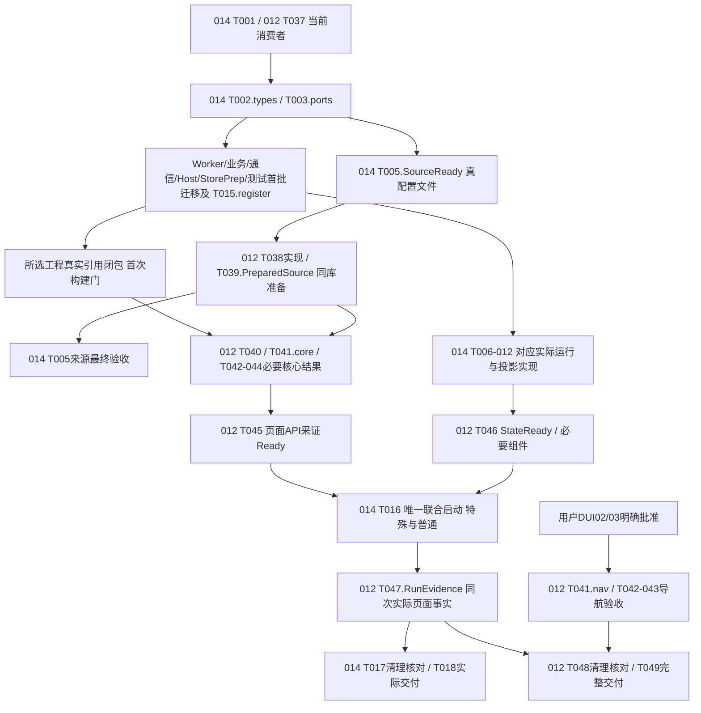

> 当前确认（2026-10-06）：DUI02/03已获明确批准，原预览只读；严格按navigation-approval-20261006.md推进剩余六项。下文此前“待审/未批”是当时记录，不再作为当前阻塞。实施/验收状态以本轮实际回执更新，批准不等于Passed。

# 功能任务清单：配方制作、保存与前端弹窗

**输入**：[spec.md](spec.md)、[plan.md](plan.md)、[data-model.md](data-model.md)、[editor-ui](contracts/editor-ui.md)、[读写API](contracts/recipe-authoring-api.md)、[共同接入](contracts/shared-integration.md)、[quickstart](quickstart.md)。  
**原25项共同基线（历史）**：recipe-contract/1.3 RC01—08；station01-execution/1.0；011-verification/1.1；宪章8.0.0。本轮必要共同增量为[recipe-contract/1.4](../011-plc-interaction-update/contracts/recipe-contract.md) RC09、正文3/历史正文2。  
**日期**：2026-10-03  
**规格范围**：现有弹窗制作/真实保存/重读/编辑→011 F唯一匹配及冻结运行→现有界面真实阶段/处置/异常槽显示；保存不要求设备在线，不增加页面或生产批准。  
**旧范围状态（历史）**：2026-10-03已获012实施授权。G-01及I1—I4设计闭合，前轮7份和定向修订4份文档均已核011实际接收记录及主项目摘要。原25项仅在全部完成判据具备实际证据后勾选；共同代码按稳定批次另行接收，不把文档接收当代码交付。截至2026-10-04，旧25/25已具备012软件范围实际条件，逐项证据见final-20261004/task-completion.json；当时主项目产品集成及011总审仍独立待接收，不把Test软件结果称现场通过。

**本轮当前状态（2026-10-05）**：独立根E:/dzk/gaode-012-ui-fix；仅追加T026—036，本次11项软件完成条件见verification-ui-fix-20261005.md和ui-fix-handoff-20261005.md。旧勾选不改，architecture全部原勾选保留；当前增量未合入。参数请求/适配调用有证据，真机SDK/光源应用和夹爪PLC选择未验证。

## 拆解规则与责任

所有T编号任务的唯一实施负责人为**012**；原T001—025表中011交付仅是外部前置和共用证据，不是指派012修改011文件或复制011任务。RecipeEndpoints.cs、Program.cs、RecipeEnvironmentDecoder.cs、SemanticRecipeInputProvider.cs始终012唯一编辑。原任务共同类型、正文序列化、身份/摘要、校验、IRecipeStore/IRecipeCatalog定义、匹配/绑定/冻结/执行/通信及真实投影由011提供。本次T026—036按用户授权，由012在独立副本修改必要共同字段/唯一校验/序列化/planner/采集消费，并交011统一集成；不改013通信、在制源码或冻结输入。细分文件归属见shared-integration和本轮handoff。

以下路径相对完整012独立源码根，绝不在主项目直接写入。原设计标“新增”的文件按任务落实；证据路径中的`<batch>`使用实际唯一批次目录，不覆盖历史报告。有效共同合同与正文版本可逐项接收，不等待无依赖的机械/现场延期项。

每项的需求、宪章、依赖、完成判据及验证见后方追溯表；不能只完成清单行就忽略表中义务。[P]仅表示注明前置全部满足后文件不重叠的机会，不自动启动代理，也不允许并行修改同一Host或runtime文件。

**分批与验证依赖**：测试定义就绪、对应实现可构建、实际验证通过分别记录。T009/T011/T015/T016/T020/T021所引用的测试前置仅为T007/T008/T014/T018的定义就绪，不要求尚未实现能力先测试通过；相关任务最终验证义务仍由T013/T017/T022/T024承接，不把写完测试当软件通过。T019首批与后续是同一任务的里程点，不新增任务ID或复选框；首批交付不能勾选整个T019。

任何Host、StorePrep或相关后端测试的首次实际构建/执行前，按该工程实际编译引用完成T019必需首批迁移，并接收011所属必要共同消费者迁移；Host直接调用/DI的命中由T010等对应项承接，StorePrep不虚构无引用的Host前置。逐文件确认，不因源码已复制或接口声明已交付就判具备验证条件。此条件不阻止先编写测试和不依赖缺项的实现，也不要求等待整个运行链。

## Phase 1：必要准备

- [X] T001 准备完整012独立源码副本并记录实际基线，核对backend/src/Gaode.Host/Gaode.Host.csproj、frontend/package.json及global.json，在specs/012-recipe-authoring/plan-handoff.md登记复制范围。

- [X] T002 接收D011-common-code-1.3共同基础部分并核对Application共同类型/端口/序列化交付，在specs/012-recipe-authoring/plan-handoff.md记录实际文件、版本及接收范围。

- [X] T003 核查旧目录、UI及适配器真实消费者，在specs/012-recipe-authoring/plan-handoff.md的清理表记录调用/装配/配置/脚本与历史读取承接。

## Phase 2：共同基础接入准备

- [X] T004 [P] 落实最小Recipe.Write权限映射，修改backend/src/Gaode.Host/Api/Station01Authorization.cs与backend/src/Gaode.Host/Api/TestAuthenticationHandler.cs。

- [X] T005 [P] 实现独立配方SQLite存储结构及有限配置，新增backend/src/Gaode.Infrastructure/Recipes/RecipeStoreDbContext.cs、RecipeStoreOptions.cs及该目录Migrations/配方专用迁移。

- [X] T006 承接配方库受控prepare/inspect入口，修改backend/tools/Gaode.StorePrep/Program.cs并调用配方专用schema检查。

T004/T005可在T002/T003后并行；T006的代码编写等T005，其工具构建/运行另须T019首批及相应011消费者迁移。T019首批在已取得所需RC08类型/序列化和迁移清单、完成T003相应核查后即可推进，不等T009、绑定、查询通知或联合链。D011-common-code-1.3缺实际代码只限制相关实现，不将设计写成代码已交付。

## 当前阶段范围与完成证据（P13）

| 项目 | 对应规格位置 | 任务或证据 |
| --- | --- | --- |
| 起点与终点 | US1弹窗→US2重读编辑→US3保存内容F消费及冻结隔离 | T007—T022；MVP为T001—T013并承接T019首批及相应011消费者迁移，完整功能仍须US2/US3 |
| 必须参与组件 | 前端实际交付脚本、Host、011共同定义/校验、012SQLite；联合追加011真实设备/算法/运行事实 | T009—T013、T015—T022；虚拟组件必须走真实调用并标来源 |
| 必要验证 | FR-006—012/015/020及SC-001—008 | QV-01—05映射M01/M03—M11；构建仅受影响入口 |
| 完成证据 | 实际页面请求、保存正文/Version/摘要、库提交、F/run冻结/动作事实、原型/架构拒绝 | 本批manifest、authoring、reread、joint-reference、verification、cleanup，引用011同次联合报告 |
| 延期 | 自动恢复、复杂合并/版本/审批、导入导出、全部面数组合/全历史专项、无关UI | plan既有延期项；只记录待办，不新增实现或验收门槛 |

## Phase 3：US1 在现有弹窗制作并保存配方（P1，MVP）

**目标**：原弹窗三部分完成真实新建、检查和保存；保全共同字段与既有风格。  
**独立完成条件**：设备不在线时，正式页面经Host和实际SQLite保存并完整GET；必要校验、重复码、授权/写失败真实拒绝，关闭不提交；保存不自动生产批准。  
**相关需求/原则**：FR-001—007/010—015/017—020；P02/P03/P04/P05/P08/P09/P11/P12。

### 适用的软件验证定义

- [X] T007 [P] [US1] 新增最小真实存储/API合同回归backend/tests/Gaode.Integration.Tests/Storage/RecipeAuthoringCreateTests.cs。

- [X] T008 [P] [US1] 新增弹窗必要组件回归frontend/tests/us1/recipe-authoring.test.ts。

### 当前范围实现与独立验证

- [X] T009 [US1] 实现共同IRecipeStore/IRecipeCatalog的单一提供者backend/src/Gaode.Infrastructure/Recipes/SqliteRecipeStore.cs（新增）。

- [X] T010 [US1] 接入catalog、完整GET、validate和POST新建，修改backend/src/Gaode.Host/Api/RecipeEndpoints.cs与backend/src/Gaode.Host/Program.cs。

- [X] T011 [US1] 在frontend/src/pages/a.html与frontend/src/runtime.js实现原recipeModal制作、检查和保存，绑定editor-ui的全部RC08字段。

- [X] T012 [US1] 落实精确授权原型差异，修改frontend/scripts/verify-prototype.ps1及frontend/tests/us1/prototype-console.test.ts、frontend/tests/prototype-all-pages.test.ts，新增frontend/scripts/recipe-authoring-012-differences.json。

- [X] T013 [US1] 运行US1必要验证并记录artifacts/recipe-authoring-012/<batch>/us1-authoring.json与manifest.json（实施后生成）。

## Phase 4：US2 完整重读并编辑已有配方（P1）

**目标**：持续读取和更新真实保存内容，保留未修改/未展示字段，条件更新不覆盖另一保存。  
**独立完成条件**：US1正式保存对象经编辑/重开/Host正常重启仍完整重读；原读取ETag准确还原ExpectedVersion，冲突拒绝；不依赖设备或浏览器缓存。  
**相关需求/原则**：FR-005—009/011/014/015；P04/P07/P08/P12。

- [X] T014 [US2] 新增完整重读/并发更新回归backend/tests/Gaode.Integration.Tests/Storage/RecipeAuthoringUpdateTests.cs，并扩展frontend/tests/us1/recipe-authoring.test.ts的编辑状态用例。

- [X] T015 [P] [US2] 接入完整PUT更新与条件响应，修改backend/src/Gaode.Host/Api/RecipeEndpoints.cs。

- [X] T016 [P] [US2] 实现完整载入与编辑交互，修改frontend/src/runtime.js及frontend/src/pages/a.html。

- [X] T017 [US2] 验证编辑后完整持久重读与正常Host重启，在artifacts/recipe-authoring-012/<batch>/us2-reread.json追加同批证据，并在specs/012-recipe-authoring/plan-handoff.md交付D012-store-api-1.3供011接入。

## Phase 5：US3 F使用已保存配方且冻结运行不串版（P1）

**目标**：把012提供者/接口接011共同绑定及运行，现有页面显示真实状态。  
**独立完成条件**：实际保存供F精确唯一匹配；运行冻结期间编辑保存不改旧运行，下一F读新内容；未匹配保留公共准备/F事实并阻断产品动作。更多面/可选E及三区/异常槽的实际动作与显示对账复用011同次链。  
**相关需求/原则**：FR-003/004/008—013/016—020；P02/P03/P05/P07/P08/P11/P12/P13。

- [X] T018 [US3] 新增目录/F消费的必要接入回归backend/tests/Gaode.Integration.Tests/Station01/RecipeAuthoringBindingTests.cs。

- [X] T019 [US3] 分批完成RC08必需消费者迁移、持久目录接入及有效清理，修改backend/src/Gaode.Infrastructure/Recipes/RecipeEnvironmentDecoder.cs、SemanticRecipeInputProvider.cs、RecipeCatalogFactory.cs及JsonRecipeCatalog.cs和实际命中的目录/适配测试；首批提前满足首次后端构建条件，整项不提前勾选。

- [X] T020 [P] [US3] 接入011共同plan/bind与F持久来源，修改backend/src/Gaode.Host/Api/RecipeEndpoints.cs、backend/src/Gaode.Host/Program.cs。

- [X] T021 [P] [US3] 绑定真实运行投影并移除旧阶段/版本推断，修改frontend/src/runtime.js、frontend/src/pages/a.html的必要现有区域及frontend/tests/us1/runtime-007.test.ts和frontend/scripts/recipe-authoring-012-differences.json。

- [X] T022 [US3] 准备页面/API采证后参与011唯一启动的联合链，运行后交付D012-ui-joint-evidence，在artifacts/recipe-authoring-012/<batch>/joint-reference.json对账同次运行与实际保存证据。

## Phase 6：收尾、实际删除与最小证据收敛

- [X] T023 完成替代后实际删除核查，按specs/012-recipe-authoring/plan-handoff.md清理表核012拥有的目录/解码/端点/前端及受影响测试，并记录artifacts/recipe-authoring-012/<batch>/cleanup.json。

- [X] T024 收敛受影响构建、原型和架构门禁，在artifacts/recipe-authoring-012/<batch>/verification.json汇总quickstart的实际命令与结果。

- [X] T025 整理最终实际交付与剩余限制，更新specs/012-recipe-authoring/quickstart.md及plan-handoff.md，并交011逐文件集成清单。

T023/T024可在T022所需外部运行输入受限时先处理无依赖部分；T022未完成必须保持未勾。同批证据固定实际代码/合同身份；后续有效变更只更新受影响证据，不把旧运行冒充新代码通过。

## 当前规格的关键规则覆盖

| 当前适用规则及来源 | 对应任务ID | 必要验证/边界 |
| --- | --- | --- |
| FR-001/002/014：原弹窗、三部分、现有风格、关闭不提交 | T008/T011/T012/T013/T016 | QV-01/04；归档/无关页面保护不取消 |
| FR-003/004/013/017/018/019：对象/槽、配置XYZ、更多面、E及三区 | T002/T007/T009/T011/T014/T019/T021/T022 | RC08完整字段往返；工艺校验与执行仅011，M04/M05共证 |
| FR-005/006/007/011：唯一校验、实际保存/读取/失败、批准分离 | T004—T017 | QV-01/02/M08；Saved/冲突/失败/未知不能混淆 |
| FR-008/009：F唯一与保存生效、冻结/历史关联隔离 | T009/T014—T022 | QV-03/M08，原F与新旧Version/DefinitionDigest/快照关联 |
| FR-010/012：前端API边界、共同业务/唯一来源、无协议/测试特权 | T009/T010/T019—T024 | QV-04/M10正负例；不建012规划/匹配/执行器 |
| FR-015：请求/保存阶段/失败结构化日志 | T009/T010/T013/T015/T024 | QV-02，持久诊断和实际失败可关联，不以日志代提交 |
| FR-016/020：唯一负责人、消费者核查后实际删除、保有效义务 | T001—T003/T012/T019/T020/T023—T025 | QV-05/M11；历史失败证据/勾选不删改 |
| 设备真实反馈、安全/取消/原期限与运行保存 | T020/T022消费011共同保护 | 012不另实现设备动作；M03—M09共用，现场缺项只限制相关动作/联合证明 |

## 任务追溯与依赖

所有表项负责人均012；外部列D011仅表示依赖交付。清单行提供精确文件，表中补对应判据。

| 任务ID | 当前需求/来源 | 宪章 | 真实前置依赖 | 完成条件 | 必要验证/证据 |
| --- | --- | --- | --- | --- | --- |
| T001 | FR-016；plan结构与职责 | P01/P10/P13 | 调度后续实施安排；下一阶段analyze先完成 | 由调度明确独立源码根，保留012文档，复制实际backend/frontend/必要desktop/scripts及工程配置；排除密钥、运行库、bin/obj/artifacts和嵌套workcopies，核源码身份及文件负责人。仅后续实施时执行；当前文档副本不得视作可构建。 | 准备记录与实际文件/基线摘要 |
| T002 | FR-003/004/011/012/016 | P03/P05/P10 | T001；D011-common-code-1.3共同基础（011 T003—T005按实际文件分批交付） | 核RecipeContracts.cs、ExecutionInputs.cs、RecipeDefinitionIdentity.cs、RecipeDefinitionSerialization.cs、RecipeDefinitionValidator.cs、RecipeAdmission及IRecipeStore/IRecipeCatalog/结果类型的实际源码、签名和RC08一致性；记录后端形成/解析信息和011拥有的必需消费者迁移清单。按实际已交范围接收，缺项仅限依赖批次。Matcher/深冻结在T018按用途接收；协调器/绑定注册和查询通知不列入共同基础交付。 | 实际源码身份、签名及消费者清单；合同可读不等于代码可用，011共同消费者仍由011迁移 |
| T003 | FR-020；RC08.4 | P01/P05/P08 | T001 | 逐项覆盖runtime.js、a.html、Program.cs、RecipeCatalogFactory/JsonRecipeCatalog、RecipeEnvironmentDecoder/SemanticRecipeInputProvider及相关测试；标明替代任务和有效保留用途，不仅按文件名或失败判废。011共同消费者由其交付清单补齐。 | QV-05/M11消费者清单；此步只核查，替代后实际删在对应任务/T023 |
| T004 | FR-006/010/011；API最小权限 | P05/P12 | T002、T003 | 写权限仅既有ProcessEngineer/SystemAdministrator；读取Run.Read、检查Config.Validate，401/403由后端执行。Station01Test仍如实标明，不授新生产批准或增加认证平台。 | T007/T013的必要授权拒绝；QV-02 |
| T005 | FR-006/009/011 | P04/P06/P08 | T002、T003 | RecipeHead与RecipeSavedContent按共同RecipeId＋Version关联，FCode原文BINARY全局唯一；完整DefinitionJson/DefinitionDigest/ContractVersion与审计字段可持久。独立路径及正有限预算，不加SaveId、审批/回滚表，不改运行库schema。 | T007/T013实际SQLite准备/提交及唯一约束；QV-01/02 |
| T006 | FR-006/011；research R05 | P04/P08 | T005 | 落实quickstart约定的配方库新目录准备及检查，拒绝覆盖已有数据；Host仅检查不自动建库/迁移。旧运行库工具与门禁保持，无库/错误schema不得回退Review/File。 | T013/QV-01/02使用真实工具；首次工具构建/执行须T019首批及其引用的011消费者迁移齐备，本轮不运行 |
| T007 | US1-A/B/C；FR-005/006/007/011/015 | P02/P04/P08/P09 | T004、T006 | 先编写真实SQLite新建/完整GET、唯一共同校验、重复FCode、必要缺项/四面非法、无写权和受控实际写失败的最小测试定义；T009仅以定义就绪为前置。实际构建/执行等T019首批、011必要共同消费者及T009/T010对应实现；T013收敛真实结果。保存不依赖设备、不提升批准；不预置成功。 | QV-01/02/M08；记录定义就绪与实际发现/通过/失败分别状态，不要求测试先通过才编写实现 |
| T008 | US1-A/B/C/D；FR-001/002/005/007/014 | P02/P08/P12 | T004、T006 | 先定义三部分输入保留、关闭不提交、只读元数据/完整字段、在途及共同错误定位、CommitUnknown与已提交但重读失败的组件预期；T011仅依赖定义就绪，实际执行等对应页面实现。替身只作组件证据，T013提供正式API/页面补证。 | QV-01/02；T013提供正式页面补证 |
| T009 | FR-003—009/011/012；RC04/RC08 | P03/P04/P06/P07/P08 | T007验证定义就绪；T002共同基础及T005存储结构，不要求T007先运行通过 | SaveAsync在写入串行边界内取当前视图、核TargetRecipeId/ExpectedVersion、调用011身份/版本/摘要及ValidateForSave，统一Serialize写完整正文并原子切Head；支持后续编辑所需条件更新。COMMIT确认才Saved；失败/未知如实，取消不冒称回滚。GetSnapshot从同库一致读取完整值，正文2/目录1，后续可见、无活动文件回退。 | T007与US2条件更新回归；QV-01/02、M08 |
| T010 | FR-005—008/010/011/015 | P02/P05/P08/P09 | T009、T004 | 先按011基础批清单迁移本文件实际命中的共同签名/直接调用与DI，含旧plan/bind直接类型引用；这只是首次Host可构建所需消费，不冒称T020完整绑定能力。薄端点只调共同类型/校验/Store；DI一个实例服务保存/目录/F。完整正文用011序列化，HTTP只处理格式/写权；服务器身份/批准不能由候选授予。ETag封装RecipeId/Version，错误复用共享信封；配置正有限预算、CORS/ETag及结构化持久诊断，删除失效默认Review正式装配。 | T007/T013真实HTTP＋库；QV-01/02 |
| T011 | FR-001—007/010/013/014/017—019；US1 | P02/P03/P05/P08/P11/P12 | T008验证定义就绪、T010；不要求T008先运行通过 | 同弹窗/现有样式；基础信息、检测Coordinates、用途点/逐阶段Flip、独立E、三区输入按共同字段保留，不给默认数值、不生成设备计划/业务校验。真实检查/保存/GET刷新及授权/失败显示；选配置内嵌完整值与来源。替代后删除无用途演示输入/监听、localStorage配方保存或假成功，保留有效run引用用途。 | T008及T013正式弹窗；QV-01/02 |
| T012 | FR-002/010/016/020；SC-006 | P01/P05/P12 | T011 | 差异条目按归档原文/需求/精确替换核对，覆盖实际构建交付资源；保ZIP/三页/未授权区域，不能整页或script免检。替代并删除失效全页不变/浅标志断言，保有效负例和历史失败；采证路径使用本次根，修掉覆盖旧us1-report的输出。 | QV-04；授权变更正例和未列差异拒绝 |
| T013 | US1-A—D；SC-001/002/005/006 | P02/P08/P09/P12/P13 | T007/T008定义及T009—T012对应实现；T019首批、011所属必要共同消费者迁移已实际接收 | 确认首次Host/StorePrep/相关测试构建的RC08消费者已迁移后，只准备受影响构建，执行T007/T008及正式弹窗→真实API/SQLite保存/完整GET；记录三部分/关闭行为、重复码/校验/无权/受控实际写失败与日志。证明设备不在线也能合法保存且受生产限制；不等T019后段目录接入、T020运行接线或联合证据，不绕过必需编译迁移。 | QV-01/02/04，发现/失败/Skip/源码/合同/HTTP/实际保存身份全部如实 |
| T014 | US2-A/B/C；FR-006/007/009/011 | P04/P07/P08 | T013 | 先定义完整字段含只读/未展示/nullable/字典的保真、正常重启重读、两编辑基线412、缺If-Match的428、实际读取失败及保存后刷新失败/无回执未知不自动重发；T015/T016仅以定义就绪为前置，实际执行等对应实现与必要迁移。后两类组件替身仅证UI，提交事实用真实库证明。 | QV-01/02；最小代表不按每字段建整链 |
| T015 | US2-B；FR-006/007/009/011 | P04/P07/P08 | T014验证定义就绪；不要求T014先运行通过 | TargetRecipeId取路由，ExpectedVersion只取原GET ETag，调用T009同一SaveAsync；保留RecipeId、返回新Version/完整正文。只读元数据不授权，Conflict/失败/未知使用共同结果；不从最新Head反填版本、不自动合并或隐式新建。 | T014实际HTTP/库更新及旧ETag拒绝；QV-01/02 |
| T016 | US2-A/B/C；FR-005—009/014 | P07/P08/P12 | T014验证定义就绪；不要求T014先运行通过 | 目录选项先完整GET，表单与未展示有效字段保持同一正文；编辑携原ETag，不覆盖冻结运行状态。保存后重开/重读、读取不可用/未知/迟到响应按真实事实处理，不以V3或浏览器缓存兜底。 | T014组件与T017正式页面；QV-01/02 |
| T017 | US2-A/B/C；SC-002/004/005 | P07/P08/P13 | T015、T016；T019首批及011必要共同消费者迁移已接收，T014实际执行条件满足 | 复用US1保存对象，编辑有业务差异后保存、关闭重开、Host正常重启完整GET，核有效字段/来源/身份与并发拒绝。提前交D012-store-api-1.3的真实保存/完整重读子集：实际文件/调用、Version/ETag、必要证据及未完成范围。T019后段适配和T020运行接线分别按完成情况补交，不等T022、不声称整包运行能力就绪。无设备依赖，不重跑同义US1序列。 | QV-01/02/M08；保存记录、版本/摘要、HTTP和页面一致 |
| T018 | US3-A/B/C/D；FR-008/009/011/012 | P03/P05/P07/P08 | T017；D011-common-code-1.3中实际使用的Matcher/深冻结（011 T005） | 先定义实际保存及同一GetSnapshot调用共同Matcher/冻结消费者的必要接入回归：精确F唯一、未匹配、观察版本不锁新内容、旧快照不串版。按实际用途接收011 T005源码及其依赖，不等待无关查询通知或整个运行链；需要真实绑定回执的部分等T020所接D011-runtime-binding-1.3。T020/T021只引用定义就绪，实际执行在对应实现齐备后完成，不另写匹配器/执行器或伪回执。 | QV-03/M08；Matcher/冻结组件与运行绑定证据分开，完整动作复用T022，保护不放宽 |
| T019 | FR-003/004/012/020；RC08.4 | P03/P05/P08/P11 | 首批：T001、T003相应核查及已实际交付的RC08类型/唯一序列化/消费者迁移清单（通过T002登记）；后续：首批＋T009及该接入实际依赖交付 | 同一任务分批：①首批迁移012所有的旧PointRefs、RecipeStage构造、测高/Flip等实际编译消费者，同批迁移所选项目中实际命中的012目录/适配测试输入和正确断言，接收011所属共同消费者的必要迁移；仅按真实用途适配，不依赖T009、绑定或状态整包。②后续在真实SqliteRecipeStore可用后接入目录/提供者、删除失效回退/换码旁路及剩余无用途配置，按实际消费者补齐接线。各批记录文件和未完成范围，按T019单独补交并关联T017保存读写交付；首批完成不勾整项。缺真实新用途输入不得补零；保有效适配/历史读取/保护，不保旧字段执行兼容、不移出正式编译来凑通过。 | QV-05/M11及对应窄组件；首批是Host/StorePrep/相关测试首次构建前置，后段是其实际接入和T020前置；全部义务及必要验证完成才勾T019；每批分列源码交付、项目可构建状态及软件证据，未运行如实NotRun |
| T020 | FR-008—012/016/020 | P05/P07/P08 | T018验证定义就绪、T019后段接入齐备；D011-runtime-binding-1.3（011 T011/T012）及实际注册调用清单 | 接收011的协调器/RecipeBindingReceipt、真实Intent/Bound/Handoff、原期限/取消及注册调用后，在012两Host文件接线；同实例提供者供一次Match/深冻结，删除被替代内联业务/旧ACK/无效占用。按T020单独补交实际运行接线范围并关联T017保存读写交付，不倒算T017已交。独立bind无检测续接许可，Matched不冒称Bound，型号不由旧PlcRecipeId下发；不代改011共同文件。 T010已承接的直接签名/DI早批只核接收，不重复改写；早批不等于本项完成。 | T018及T022/QV-03/M08/M09；真实回执保护沿用 |
| T021 | US3-B—F；FR-008/009/010/017—020 | P05/P07/P12 | T018验证定义就绪、T019相应迁移；D011-runtime-state-1.0（011 T015）实际查询/通知已交付 | 编辑当前内容与run冻结引用分开；用executionPhase、slotStates、覆盖、异常槽号、results/movements及allowedActions实际事实。删除先下料后分拣推断、过期选择Version锁和无用途S1/P01限制；保有效sameRecipeRef/准入/取消。null/Unknown不猜正常，不增加页面/轴监控；授权差异更新不放宽无关保护。 | QV-03/04定向组件；页面/API接线及采证准备完成可参与T022，最终同次页面/动作证据在联合运行后形成 |
| T022 | US3-A—F；SC-003/004/007/008 | P02/P03/P05/P07/P08/P13 | 参与前置：T020/T021接线及页面/API采证准备、T017保存读写与T019/T020适用交付、双方适用必要清理（012 T023相关范围）、011统一驱动/其运行前置及实际输入；不等T024最终汇总或最终联合证据 | 011唯一负责联合启动：其T025完成驱动接线与输入准备，T027在相应前置满足后启动，012同期采集页面/API并对账。运行后形成D012-ui-joint-evidence及同批run/保存/F/冻结/动作关联；该最终证据不是启动该运行的前置。共用单面/多面代表证明新旧冻结、更多面/E、OK原槽/NG/Pending目标/姿态异常；必要差异组件复用011 M04实际动作。不另起同义链；证据不足或失败保持T022未完成。 | 完成证据：QV-03/M03—M09实际同次报告与页面/API/保存记录；注明未覆盖/Blocked及真实或虚拟来源，新3D缺项只限对应段 |
| T023 | FR-020 | P01/P05/P08/P13 | T020、T021 | 核T003每项消费者已由T010/11/12/19/20/21承接，实际删除残余无用途分支、配置和错误测试；不能用注释/永久开关/备用实现保留，不以失败删正确测试或历史证据。011拥有的共同清理只收交付证据，不跨文件改。 此项可在依赖设备链尚阻塞时先推进；若删除改变已取证的有效路径，相关证据在T024定向更新，不能继续引用失效报告。 | QV-05/M11；实际删除位置、保留理由与受影响窄回归 |
| T024 | FR-010/012/015/016/020；SC-005/006 | P02/P05/P09/P12/P13 | T023; 011维护的RecipeExecutionBoundary门禁及共享M10证据 | 只对最新改动执行必要Host/StorePrep/前端构建及窄组件回归；已有同源码/合同证据直接引用，无变化不重跑。原型精确差异正负例、frontend/tests/security-boundary.test.ts及011维护的backend/tests/Gaode.Rules.Tests/Architecture/RecipeExecutionBoundaryTests.cs承接新存储/API路径，错误架构仍须拒绝；不关闭保护或零发现通过。 | QV-01—05/M01/M10/M11；漏跑/失败/Skip/阻塞逐项真实统计 |
| T025 | FR-016/020；SC-001—008 | P01/P10/P13 | T024 | 记录实际代码/合同版本、最终文件/负责人、QV/M同次证据位置、删除承接及未验证限制；不把局部/虚拟结果称全站或生产通过。仅在实际完成后更新对应任务状态；主项目仍011集成，未有回执保持待交接。 T022如因明确外部输入阻塞，单独列未完成任务/证据，不因此把整个功能标完成。 | 证据manifest、实际结果、逐文件交接；不新建审批/恢复平台 |

### 外部交付与局部限制

| 交付/限制 | 明确来源与版本 | 只限制的任务/联调 | 可继续范围 |
| --- | --- | --- | --- |
| D012-G01-receipt-1.3 | 011最新tasks-handoff已确认前轮7份实际接收合入 | 原设计接收已闭合，本轮依赖修订是新的待交增量 | G-01保持关闭，不重开G-02/G-03 |
| D011-common-code-1.3 | 011 T003—T005：共同类型、身份/摘要、序列化、校验、端口及Matcher/深冻结 | T002接共同基础；T018已接实际Matcher/深冻结；基础源码001—006及绑定003共享测试消费者已按稳定批接收，当前保存/Matcher回归10项通过 | US1/US2不等无关运行状态；T019首批所需已交类型可先消费，011所属必要编译迁移须同步交付 |
| D011-runtime-binding-1.3 | 用户已指定011 T011/T012：绑定协调、回执、移交和注册调用 | T020实际接线；不再挂在共同基础包内 | 按实际发布清单接收，正式说明待核状态见shared-integration；不影响独立保存 |
| D011-runtime-state-1.0 | 011 T015：EX04/05实际查询/通知与状态输出 | T021接线及T022页面对账 | 状态001—007实际源码已接；页面组件/新事件/轴/分拣映射已交，multi03同期证明有据，历史终态补证20项已实际满足，保留原Incomplete |
| D012-store-api-1.3及独立后续交付 | T017交真实保存/完整重读/Version及必要证据；T019适配、T020运行接线分别按原任务补交 | 各交付列实际文件、调用及未完成范围；011联合启动另核适用接线齐备 | T017不等T022，也不代表T019/T020已交；不用假响应/测试配方填补 |
| D012-ui-joint-evidence | T022参与011唯一启动的同次代表后形成 | 是完成/页面通过证据，不是011启动该运行的前置 | 先提供页面/API就绪及采证准备，运行后交最终证据，缺项保持未完成 |
| 真实新3D、正式地址/ASCII等原延期 | 011 EX01.1与原DEP，仍由011负责 | T022实际依赖的新观察/机械动作；不限制无设备正常保存 | T013/T017及无依赖收敛可继续；不编值或恢复路径 |

### 依赖图与用户故事顺序

~~~mermaid
flowchart TD
 A[T001 独立源码] --> C[T003 消费者核查]
 A --> B[T002 按实际接收共同基础]
 B --> D[T004/T005 基础及 T006工具代码]
 B --> M[T019首批 RC08必需迁移]
 C --> M
 X[011所属必要共同消费者迁移] --> M
 D --> DEF[T007/T008验证定义]
 DEF --> IMP[T009-T012保存和页面实现]
 IMP --> V[T013实际构建和验证]
 M --> V
 V --> U2[T014定义后 T015/T016实现]
 U2 --> SAVE[T017实际重读及首批交付]
 M --> AD[T019后段目录接入与清理]
 IMP --> AD
 SAVE --> MAT[T018 Matcher和冻结验证定义]
 MAT --> HOST[T020运行接线]
 AD --> HOST
 RB[011 T011/T012绑定和注册交付] --> HOST
 MAT --> UI[T021现有界面接线]
 M --> UI
 RS[011 T015实际状态交付] --> UI
 HOST --> READY[T022参与准备]
 UI --> READY
 READY --> RUN[011统一启动 012同期采证]
 RUN --> EVID[T022运行后最终证据]
 HOST --> CLEAN[T023适用必要清理]
 UI --> CLEAN
 CLEAN --> RUN
 CLEAN --> GATE[T024必要门禁及证据汇总]
 GATE --> HAND[T025实际交付]
 EVID -. 实际结果或未完成状态 .-> HAND
~~~

图展示主要里程点，具体前置以表为准：T019首批不等T009/后段运行；T019后段才依赖真实提供者。测试定义可先编写，实际构建/执行须相应实现及必要消费者迁移，不能反向要求测试先通过。T023依T020/T021，不因T022现场阻塞而停下无依赖清理；T025记录T022实际状态，不把未完成改成通过。011负责实际绑定/状态/驱动，无012第二业务实现。

### 条件满足后的并行例

| 场景 | 先完成 | 可并行任务及不重叠文件 |
| --- | --- | --- |
| 基础 | T002/T003 | T004权限两文件 ∥ T005配方库结构/配置/迁移 |
| US1 | T004/T006 | T007后端CreateTests ∥ T008前端recipe-authoring组件测试 |
| US2 | T014验证定义就绪 | T015 RecipeEndpoints ∥ T016 runtime.js/a.html；T017实际验证等待二者及首次构建前置 |
| US3 | T018验证定义就绪、T019各自所需批次及对应绑定/状态交付齐备 | T020 Host两文件 ∥ T021前端绑定/其测试/差异清单；T022参与准备等待二者，不等最终联合证据 |

同文件后继必须串行：RecipeEndpoints T010→T015→T020；Program T010→T020；runtime/a.html T011→T016→T021；组件测试T008→T014；原型差异T012→T021。测试运行与代码删除不能并行污染同次证据；T024只对因新变更失效的范围补证。

## 实施策略与最小验证

MVP为准备/基础＋US1，并提前承接T019首批及011必要共同消费者迁移：先形成真实弹窗新建/检查/SQLite保存/完整GET及必要失败。US2增加已有配方完整编辑和并发/重启读取；US3消费011正式匹配/冻结/实际投影，最终仍要覆盖全部三个故事，MVP不冒称整个012完成。

QV-01保存重读→T013/T017（M08）；QV-02必要拒绝/失败→T007/T014及其实际运行（M08/M09）；QV-03联合→T018/T022（M03—M09）；QV-04原型/架构→T012/T021/T024（M10）；QV-05清理→T003/T019/T023（M11）。只复用011的一条单面、一条多面完整链与必要差异组件；不另起同义整链，不做面数组合穷举、全量测试或009/010全历史重跑。

共同字段保真需少量涵盖实际类型/用途的代表，不按每字段建立完整链；更多面/独立E/三区/异常槽的动作由011实际证据证明。无权、缺必要输入、重复码、版本冲突、受控实际读写失败、取消/有限等待与提交未知的必要机制仍保留。组件mock只标组件，真实API/保存/F链不得替身通过。源码/合同/配置/组件来源、发现数及通过/失败/Skip/阻塞/旧报告分列；零发现不是通过。

## 客户确认原型检查（P12）

归档ZIP SHA-256为3DC791C1F8AB5EEDFA037F5DBAE450B2D20522FED654F86EA700C0284945E1E0，a.html/data-view.html/login.html原件只读。仅实现副本授权的配方弹窗与已有运行区域数据绑定变化，精确清单承接；没有新增页面、无关主题/导航修改或整页豁免。现WPF/WebView2承载保持，无变化不安排桌面重构/重建。

历史012收尾时点（2026-10-04，旧范围）：原任务生成时点未执行的结论保留在历史交接。当时已按实际证据完成012全部25项，architecture 24项原勾选及需求清单16项勾选不变；006所有历史任务ID/勾选不变。共同001—006、绑定001—030、状态001—007已逐SHA接收（该轮36批、349份文件投递记录、19项实际删除）。当时完整Integration/Host/StorePrep构建18零警告错误，源架构10九项通过0Skip；共同006后A02按固定1项证明复用、其余8条不变，四个保存/序列化负例同源复用，错误架构不放行。

当前runtime33项、authoring11项及17适配组件按实际范围通过/复用；前端构建/typecheck02通过。原型正例及5变更拒绝已过，安全边界首次错误cwd ENOENT保留，只正确cwd补跑该一项通过。012孤立人工换面消费已实际删除，共同030已接；原冻结/阶段/结果/分拣/终态映射精确未变，与原同run页面匹配范围明确。

011单面05、多面03软件链及多面03原页/18项对账有效；首个Final时点和旧历史查询Incomplete均保留。状态007修后同multi03库仅GET/正常退出补读20项满足、13项后端历史GET满足，零新Run；当前030再次原run13项GET/旧端点404也有稳定证据。更多面/E、Pending与异常槽差异仅用011具名必要组件，不冒称另一设备链或穷举。

T023006已由011实际接收，6份文档已合主项目，3前端代码/测试/差异清单只在011副本。最终004的7份012文档/27证据已获011实际接收，文档已合主项目；本次共同006接收增量另交，主项目产品未合入。正式外部3D、地址/型号承载/安全校准等原延期仅限制现场相关段；012不提供猜值、批准或恢复旁路。

## 2026-10-04增量：原型纠偏与两项新增（旧25项仅历史）

当前依据：ui-fix-20261004.md、ui-fix-design-20261004.md、contracts/capture-and-gripper.md；本轮源码与证据仅E:/dzk/gaode-012-ui-fix。下列新任务从未完成起，完成后按verification-ui-fix-20261005.md实际证据更新；旧勾选/证据不改。唯一负责人本会话，增量待统一合入，不写主项目或013。

### 准备与共同基础

- [x] T026 核当前基线并准备完整独立源码副本，记录artifacts/recipe-ui-fix-012/baseline-manifest.json；核013测量状态后才验证。完成：来源、排除、摘要、共享冲突可核查。（全部新增前置）
- [x] T027 定向同步spec.md、plan.md、data-model.md、contracts/editor-ui.md/capture-and-gripper.md、006及011直接受影响合同；保留原型对应表ui-fix-20261004.md及checklists/architecture.md当前Notes，做只读analyze。完成：FR-021—024/SC-009—012有任务、无第二模型或未授权UI。（依T026；仅文档）

### US5逐次采集关联

- [x] T028 [US5] 在backend/tests/Gaode.Integration.Tests/Storage/RecipePerCaptureTests.cs、RecipeCaptureAdapterTests.cs及backend/tests/Gaode.Contracts.Tests/Workflow/ConfiguredDetectionExecutionTests.cs中定义少量槽/成员/面/相机/E差异的保存、规划、捕获入口及冻结组件，定义历史摘要保护和缺关联拒绝。测试定义不等实现先通过；执行依T029/T030/T031。（FR-022/024）
- [x] T029 [US5] 扩展backend/src/Gaode.Application/Recipes/ExecutionInputs.cs、RecipeContracts.cs、RecipeDefinitionValidator.cs、RecipeDefinitionSerialization.cs、RecipeRunPlanner.cs，并核现有RecipeCatalogSnapshots.cs深冻结承接（复用，无需修改）：局部坐标/EScan profile引用，正文3新写/正文2历史读取，深冻结及唯一校验。完成：参数按实际项送现有步骤/请求，不回退新正文公共参数。（依T027/T028；FR-022/024）
- [x] T030 [US5] 更新backend/src/Gaode.Infrastructure/Recipes/SqliteRecipeStore.cs、必要Host authoring消费及backend/tools/Gaode.StorePrep保持整包真实读写与新旧合同处理；新建后台配置映射不借测试/演示，缺正式来源仅限制依赖部分。完成：SQLite/API重读保真、版本拒绝，正常重启可读，历史无伪造值。（依T029；FR-022/024）
- [x] T031 [US5] 在backend/src/Gaode.Infrastructure/Devices/Cameras/ICameraSdkGateway.cs、ILightGateway.cs、CameraCaptureAdapter.cs及必要组件承接本请求设置应用入口，沿原CaptureRequest与有限等待/取消。完成：实际适配调用用此次参数，声明组件与硬件证据区分；无真机不称Applied。（依T029；FR-022）

### US6配方级夹爪

- [x] T032 [US6] 在共同RecipeDefinition/RecipeRunPlan/唯一校验/planner及上述SQLite/API测试携入SortingGripperId，定义1/2保存/读取/冻结及缺项/非法拒绝；历史null不写入序列化、不补1。完成：原快照不变，PLC/Sorting动作没有新增信号。（依T029/T030；FR-023/024）

### US4三步原型界面

- [x] T033 [US4] 替换frontend/src/recipe-authoring.js中的模型递归表单，更新frontend/src/pages/a.html弹窗专用布局及必要样式/监听。实现基础+概览、区域/对象/成员/面三栏与直接点位卡片、检查汇总/缺项返回；仅卡片三参数和基础夹爪新增。保留真实会话API、If-Match、取消/未知提交，完整隐藏字段不丢。完成：无技术来源/Pattern/摘要/高级项、无新页面/本地保存/工艺校验。（依T027/T029/T030/T032；FR-021—024）
- [x] T034 [US4] 更新frontend/tests/us1/recipe-authoring.test.ts及必要实页检查、frontend/scripts原型定向差异、009/010实际职责扫描清单；删除替代后无消费者的技术表单/监听及仅断言错误架构的测试，保留保存/权限/冲突/冻结/历史保护。完成：新技术字段/嵌套编辑器/错误参数关联负例拒绝，无整弹窗豁免。（依T033；FR-020/021）

### 最小验证与交付

- [x] T035 在013正式测量之外执行ui-fix-20261004.md七类最小验证，证据在artifacts/recipe-ui-fix-012；受影响构建、真实API/SQLite读写/编辑、必要拒绝、少量参数关联/夹爪冻结、实际三步渲染截图及009/010门禁/完整性。完成：发现/执行/失败/Skip/复用范围如实，组件不冒称硬件，同义链不重复。（依T028—034实现条件齐备；缺真实配置/硬件仅对应范围未验证）
- [x] T036 更新plan-handoff.md和增量manifest：新增/修改/删除、基线/输出SHA、共享冲突和逐文件合入顺序、三步截图/对应表、数据路径证据及硬件未验证/实际限制。完成：仅本增量包，待统一合入，不覆盖主项目/013；T035欠证范围不勾完成。（依T035实际验证；FR-021—024/SC-009—012）

顺序：T026→T027→T028定义→T029→T030；T031与T032各自文件核后可独立推进；T033→T034→T035→T036。共享模型文件串行；测试写入不要求尚未实现路径先通过，测试构建/执行等待对应实现。无全量、面数组合、009/010全部历史或正式PLC验收。

## 2026-10-05本增量实际完成依据

T026基线1409文件/独立根及013只读协调；T027定向六阶段文档/只读分析；T028—032真实存储、共同参数路径及夹爪组件；T033—034最新三步实页page-09、final02正负例及实际清理；T035受影响构建/类型检查、真实保存重启读取、必要拒绝/冻结、172脚本6正负例及C#9当前门禁。详见verification-ui-fix-20261005.md。T036基线/输出/主项目SHA、53文件增量及唯一扫描表冲突按delivery-20261005记录。旧25项勾选保持；新增完成仅本次软件范围，硬件参数/PLC夹爪未验证，增量未合入。

## 2026-10-05已确认需求同步（待后续设计落型）

所有配方共用原弹窗三步和手动10×10实际布局，槽数量仅统计；第二页保原位/空位、区内独立编号及高亮。稳定格位+区域关联点位/成员/每次拍照，取消/改区只清本格，显示重编号不串值。OK号决定阶段内检测序，跳过保号；普通面/成员序、翻面和整盘统一分拣保持。特殊属于场景1，独立两用途抓手、共用工位取放/两组绝对角及逐槽本件原始OK槽的放料关联，逐件闭环由014共同执行负责。

旧已实现count自动生成/顺序依数组/旋转不可执行/分拣抓手只存不接PLC是基线事实，不再是本轮目标；特殊OK不得套普通NoMoveRequired。旧任务ID/勾选和旧证据不改，不用旧完成证明新增需求。合同/字段/版本/接口与实际消费者、历史缺布局策略、DUI-02/03导航需后续设计对齐，相关代码修改前必须完成plan/tasks承接；本轮未生成新plan/tasks或接口签名。没有新的012模型、业务校验/匹配器或执行路径。014主责必要共同和通信增量，012只编辑保存和界面消费。

## 2026-10-05本次增量任务（设计审查后，当前活动安排）

本段更新上文“待后续设计落型/本轮未生成新plan/tasks”的当前阶段，旧段仅按其历史时点保留；T001—T036正文/勾选原样保存。当前根E:/dzk/gaode-1；显式SPECIFY_FEATURE_DIRECTORY=specs/012-recipe-authoring，不使用旧独立副本，也不沿用历史“011统一合入/012不回写”责任。本会话014共同后端/012配套统一负责，采用当前已集成源码及共同RC10/1.5、正文4/记录1.5/冻结3设计；本段没有实施事实。

依据spec FR-025—031/SC-013—016/US7/US8、现plan/layout-design/data-model、API-L00/L01/L01a及014 verification/cleanup/design-review。I01—I05设计关闭；DUI02/03尚未确认，只限制对应导航表达实现/验收，不阻共同类型/来源/真实保存/HTTP/普通特殊核心。

### 本增量边界与完成证据（P13）

| 项目 | 本次义务 |
| --- | --- |
| 起点/终点 | 原三步弹窗真实新建/手动100格/点位参数→检查/真实保存全读/编辑→F冻结及真实运行显示 |
| 唯一共同来源 | 014模型/校验/serializer/identity/planner/Matcher和同SQLite Store/Catalog；012薄映射，不复制业务 |
| 实际完成 | 页面/HTTP/库/Frozen及同run事实；填写状态与保存/质量/到位分开，导航须已批准并真实验收 |
| 固定最小集合 | V14-01—07、INPUT、CONTRACT，和014共用一特殊/一普通链，不再跑QV同义整链 |
| 局部限制 | DUI02/03对应导航，DEP01—04对应动作/定位/硬件；保存不要求设备在线，不默认历史布局抓手 |

新13项由012唯一负责、全部未勾。同任务可先交Core/编译或接线批次，整任务义务/证据齐才勾；旧36项完成不表示新增13项完成。

## 本增量 Phase 1：消费准备

- [x] T037 在specs/012-recipe-authoring/increment-consumers-20261005.md核当前012直接消费者、真实来源及替代删除对象。

  负责人012；依014:T001公共基线。不复制旧副本/重复整基线，交编辑/布局/API中间态/完整字段/历史/目录/provider/监听/状态/测试消费者表，各文件唯一归任务。old count/首槽克隆/技术字段/阶段推断的替代与保留保护可定位；DUI仅对应导航子交付前置，不扩大范围。（FR-025—031/FR-020；P01/05/12/13）

## 本增量 Phase 2：同库与真实来源准备

- [x] T038 在backend/src/Gaode.Infrastructure/Recipes/SqliteRecipeStore.cs及唯一provider/decoder/catalog/schema文件消费共同正文4/记录1.5。

  负责人012；依T037、014:T002 C14-types/serializer/validator。交C12-store首批签名/nullable/版本消费者迁移，后交同IRecipeStore/IRecipeCatalog完整共同JSON/Head事务和提交后可见。布局/关联/抓手/工位/Stage/参数/Origin/digest全保存，不建第二目录/文件回退。历史2/3真读、缺项未配置；新写4，ExpectedVersion/唯一F/Unknown原规则不改。保存离线可用；无DDL需求不造额外版本平台，Host不静默建库改表；失效provider替代后核消费者实际删。（FR-028/030/031；SC-014/015；V14-01/06/CONTRACT）

- [x] T039 在backend/tools/Gaode.StorePrep/Program.cs实现并交付合法来源同库准备。

  负责人012；编写依T037/014:T002，实际准备依T038及014:T005真来源。先交C12-prep直接签名迁移，再沿现工具 --prepare-authoring-source <recipeRoot> <definitionFile> <expectedSha256> 同serializer/validator/store写完整4并inspect/全读。保原运行库维护/不覆Head/不升批准，不另建模板目录/导入平台。完成必须有普通/特殊真来源落同SQLite/摘要结果，不能只交Unavailable；缺实值只局部限制，不默认补。首次构建需实际引用闭包齐。（FR-029—031；SC-015；I01；API-L00/V14-01）

## 本增量 Phase 3：US7 实际布局、完整编辑与保存（P1）

独立验收：弹窗→真实API/SQLite往返与稳定矩阵Core，导航待批部分单列，不作保存前置。

- [x] T040 [US7] 唯一修改backend/src/Gaode.Host/Api/RecipeEndpoints.cs、RecipeEndpoints.Authoring.cs及backend/src/Gaode.Host/Program.cs，实现API-L00/L01/L01a和完整读写/目录/检查。

  负责人012；依T037/014:T002及T038实际稳定签名；注册使用014:T012 C14-host调用清单，来源正例需T039。先交C12-http入口/DI编译迁移，再交真实API。Model/ScenarioId/UnitKind/InspectionKind/合法Route一次Snapshot精确来源；指定SourceRecipeId错/不兼容明确拒，不回退普通/首项。同型号普通特殊不混。
  响应definition+authoringContext，JsonElement未填null可编辑，新格隐藏能力来自相同SourceId/Version；source变化显式重读，正式保存唯一严格校验，不补0/第二模型。StageId+格/对象/Material/LocalFace/Camera定位同面两组；保空位/只清本格，删除count克隆/猜物理号/错源回退。完整GET不丢合法字段，If-Match仅映ExpectedVersion，SourceVersion不是第二保存锁；保权限/期限/取消/迟到/CommitUnknown。实际HTTP读写先交不等联合链，运行注册按真实批次补，不提前称整包就绪。（FR-025—031；SC-013—015；I01/I02/I04/I05；V14-01/CONTRACT）

- [x] T041 [US7] 唯一修改frontend/src/recipe-authoring.js和frontend/src/pages/a.html，实现原三步弹窗稳定矩阵/直接卡片及分批导航。

  负责人012；Core依T040实际API/T038共同值；DUI导航子交付另需用户分别明确确认DUI02/DUI03及批准差异。先交C12-editor-core：第一页NG/OK/Pending勾格/同区取消/改区，count仅统计；第二页同100位置/holes/区内row-major从1/高亮/未选禁填；第三页真实检查/保存/全读。
  CellId+Region绑定坐标及逐件/面/次/相机参数，重编号不串件，改区仅清本格。场景1特殊才显示两显式抓手/工位/两组角/原槽取放关联；无任意OK目标/回原槽开关/技术编辑器/新页/浏览器存/前端计划或业务校验；隐藏正式字段全保留，不自动复制取料值。
  CoreReady不依DUI即可先交普通特殊保存；成组独立成员/半成品整体部位合法能力保留，待批准后在同文件同任务落实最小导航并验收。未批不得以预览当批准、勾整项或称三类型全部UI通过。（FR-025—031；SC-013—016；US7/US8-A/B；V14-01/02）

- [x] T042 [US7] 在frontend/tests/us1/recipe-authoring.test.ts迁移弹窗必要组件和数据关联正负例。

  负责人012；定义按共同类型/T040接口可先做，Core执行依T041 CoreReady；导航断言另等DUI确认/NavReady。少量辨识输入核三区同号/holes/改区局部清/重编号不串参数、两Stage同面隔离、类型切换清来源/迟到响应、逐相机独立三参数、隐藏字段/保存真实反馈/冲突Unknown。组件替身仅组件，不作为正式API/SQLite/联合链证据；删除错误count/技术表单/当前旧版本期望，保权限/期限/取消/合法历史保护。交发现/执行/失败及未批范围，不把NotRun当通过。（FR-025—031；SC-013—016；I02/I04/I05；V14-02/CONTRACT）

- [x] T043 [US7] 在frontend/scripts/verify-prototype.ps1、recipe-authoring-012-differences.json和specs/012-recipe-authoring/prototype-implementation-map-20261005.md登记精确授权及原型门禁。

  负责人012；依T037/只读确认稿；Core实页核对依T041 CoreReady，DUI差异必须确认后登记/执行。交原型位置→真实实现位置→操作→精确授权差异及正负例；真渲染三步/矩阵/导航/坐标/摘要核对，不以自身摘要一致宣布原型符合。重加技术字段/任意OK目标/通用嵌套编辑器/错误关联仍拒，保归档/未授权区域，不能整弹窗豁免/缩扫描。架构清单由014:T015唯一登记，本任务不重编辑。待批预览不计通过。（FR-025—030；SC-013/014/016；P12/V14-02/07）

- [x] T044 [US7] 在backend/tests/Gaode.Integration.Tests/Storage/RecipeAuthoringCreateTests.cs、RecipeAuthoringUpdateTests.cs、RecipePerCaptureTests.cs和RecipeCaptureAdapterTests.cs定义并执行真实保存/来源/参数必要回归。

  负责人012；定义依014:T002和T040稳定合同；首次构建等真实引用消费者迁移/登记，执行依T038/T039/T040及对应冻结/采集实现，不把未实现测试先通过当编写前置。实际独立SQLite/API save→GET→edit→正常重启GET，当前4/记录1.5全部字段、历史2/3真读但拒新写。非法/缺抓手拒绝、同Model不同kind不混/指定错ID不退；中间态不补0，同面两Stage不串。
  保Head/唯一F/ETag冲突/Unknown真实结果；改变格/参数/抓手不改原Frozen。既有CaptureRequest/适配入口取得辨识参数，request携带/设备Applied分列；共同绑定测试归014:T015，完整链不在本任务另跑。（FR-028—031；SC-014/015；FR-021—024有效保护；I01—05；V14-01/06/CONTRACT）

- [x] T045 [US7] 在scripts/014-012-ui-capture.mjs、artifacts/recipe-layout-012/page-api-readiness.json及save-read-ledger.json交实际保存/弹窗证据和联合采证准备。

  负责人012；依T038—T044相应实际实现/核心结果，首建遵014任务的真实引用闭包门；真来源按T039。Core不等运行硬件或DUI审批。交前端类型/受影响build、实际弹窗→API→SQLite全保存/全读/编辑/重启/必要拒绝/三步截图，源码/输入SHA及页面/API/采证Ready。
  截图对照原型/原槽授权，填写✓不称提交/检测/设备到位；采证脚本只观察正式页面/API/run，不生成流程/假反馈。Ready可先交，使014:T016启动；最终run页面证据在T047运行后形成，不能反作Ready前置。DUI未批单列，不能勾T041全任务或宣称完整012通过。（FR-025—031；SC-013—016；V14-01/02/07）

## 本增量 Phase 4：US8 共同框架与真实运行显示（P1）

- [x] T046 [US8] 唯一修改frontend/src/runtime.js绑定真实阶段、原槽回放、安全位与件/盘状态。

  负责人012；依T037及014:T012已实际交稳定状态/通知，不以设计合同冒输出；不等T047最终证据。交C12-state-ready现界面绑定，CellId/区号/entity/StageId/origin/return/safe直接API/通知消费。普通NoMoveRequired与特殊真实回放区分，质量OK不称放回完成，失败无件完/后件/盘完；异常原物理号保持。删旧Stage/步骤数/质量推断及孤立监听，保权限/取消/期限/连接/运行隔离；无新页或PLC访问。组件/旧报告不冒同run页面证据。（FR-029—031；SC-015/016；US8-C/D；V14-03/04/07）

- [x] T047 [US8] 在artifacts/014-012-joint/ui-ledger.json及artifacts/recipe-layout-012/joint-verification.md参与014唯一启动的同次代表链并对账。

  负责人012；参与前置=T045页面/API采证Ready+T046 StateReady，完成证据在014:T016实际运行后产生；导航最终验收另需DUI批准及T041/T042/T043 NavReady。至少两实际OK各自placed/safe再后件，AB/AB Stage/参数和普通无多余OK搬运，对应同run实际后端/SQLite/Frozen事实；使用014共用ledger，不另起链或拿组件替身作正式页面证据。
  三类型条件字段/获批导航须实页对照才能完成相关验收；未批/NotRun/Skip/缺事实保未完成。软件模拟/硬件结论分列，不反要求最终证据才能启动。（FR-028—031；SC-014—016；US8-A—D；V14-01—07/INPUT）

## 本增量 Phase 5：实际清理与完整交付

- [x] T048 在specs/012-recipe-authoring/cleanup-implementation-receipt-20261005.md核实际替代删除、消费者与保护承接。

  负责人012；依T037盘点、T038/T039/T040/T041/T046实际替代/必要证据，导航删除等批准实现。源删除由各唯一源任务实施，此任务只核文件/SHA/消费者，不第二次编辑源码；引用014:T017共同清理而不重复一套。old count/克隆/任意OK目标/技术表单/阶段推断/失效目录/错误测试实际删除，保历史/适配/权限/冲突/Unknown/期限/保存/冻结。无消费者才删、不凭失败或名称；未批导航不先删合法成员/部位能力，旧失败证据只读。（FR-020/025—031；SC-016；V14-07）

- [x] T049 汇总specs/012-recipe-authoring/implementation-handoff-20261005.md及artifacts/recipe-layout-012/delivery-manifest.json，核本次完整增量。

  负责人012；依新各任务实际判据、T045/T047证据、T048清理；引用014:T016共用run，不等待014:T018最终报告。交新增/修改/删除/SHA/共享冲突/真实数据路径/三步截图、用例发现执行、失败NotRun/硬件限制。旧T001—T036不改/不冒新需求通过，DUI未批/未验仍未完成；真实保存可先交，CoreReady不能代完整012。保013带限制收口与偏差，不建新集成者/私有模型。（FR-025—031；SC-013—016；P09/12/13）

## 本增量唯一文件责任及直接依赖

同名短文件沿最近完整目录；只有下面012任务编辑本功能产品/测试文件，其他功能引用真实交付。14共同字段/校验/serializer/identity/冻结F/执行/通信/后端真实投影只由014任务编辑；共享表完整见014 tasks。

| 唯一任务 | 文件/直接交付范围 |
| --- | --- |
| T038 | backend/src/Gaode.Infrastructure/Recipes/RecipeEnvironmentDecoder.cs、SemanticRecipeInputProvider.cs、RecipeCatalogFactory.cs、JsonRecipeCatalog.cs、RecipeStoreOptions.cs、RecipeStoreSchema.cs、RecipeStoreDbContext.cs及任务主SqliteRecipeStore.cs |
| T039 | backend/tools/Gaode.StorePrep/Program.cs，014:T005只交真实来源 |
| T040 | RecipeEndpoints.cs、RecipeEndpoints.Authoring.cs、Host Program.cs；014:T012只交Composition调用清单，不重复编辑 |
| T041 | recipe-authoring.js与a.html完整编辑含Core/待批导航后批，不能另任务重复改这两个文件 |
| T042/T043 | 原frontend组件与精确原型脚本/差异清单；全局架构清单归014:T015 |
| T044 | 指定四个Storage测试；共同F绑定测试归014:T015，不重复第二集成链 |
| T045 | 仅页面采证脚本/Ready/save ledger，无业务流程 |
| T046 | runtime.js；后端真实投影归014:T012 |
| T047/T048/T049 | 同次页面证据/删除核对/交付记录，不再次编辑上列产品文件 |

### 首次构建与分批消费

C14-types/ports/worker/binding/host分别为014:T002/T003/T004/T006/T012实际稳定阶段产物；C12-store/prep/http为T038/T039/T040阶段产物，**不是**整任务勾选或仅设计接口。

- T037/014:T001核所选Host/StorePrep/测试的真实ProjectReference闭包；全部命中类型/nullable/schema/枚举/switch/Worker消息/decoder/provider/Host入口/测试/脚本迁移、014:T015职责扫描首批齐后才能首次实际build/run。T044/T045不能绕过。
- 014:T006/007/009/010/011/012所需首批只依稳定types/ports及真正命中签名，不机械等待整项运行、T005真来源或DUI。测试可以先定义，不能要求未实现测试先通过；不能补0/保错误旧字段/移除编译文件/假存储解依赖。
- T038/T039/T040实现及T041 Core/T042/T043/T044相应结果齐后，T045提前交真实保存/全读/版本及页面采证Ready，不等T047同run最终证据。
- 后端实际运行/状态Ready与T045/T046齐，014:T016唯一启动；T047运行后形成最终页面证据，不反作启动前置。最终014:T018与T049互用已形成证据但不互等最终报告。
- DUI02/03确认只控制T041.nav及T042/T043/T047相应导航验收；未批可继续公共后端/来源/保存/API及普通特殊核心，相关整任务不得提前勾。

精简顺序：消费盘点→共同types/ports→真实命中消费者/消息/扫描首批→首次编译门→合法同库来源+HTTP/矩阵Core→真实保存全读/重启拒绝提前交→共同运行/真实显示→源任务替代后实际清理+必要组件→Ready/唯一特殊普通链同run→原型/门禁/完整性/完整交付。实际阶段成果不当全功能完成。

### 条件并行

不预设无条件[P]，每项有前置且含后续验证。共同类型就绪后T038与014消息/通信首批可分文件并行；T039工具与T040 HTTP文件不重叠，但真实消费前要签名就绪；T041编辑器与014后端实现可并行，014:T012真实输出后T046 runtime与T041不同文件。联合采证与014启动属于同run，不各跑链；两最终交付文档无互等循环。构建/DB/运行按资源协调。

## 本增量需求与最小验证追溯

| 当前条款 | 实质承接 | 可核验证 |
| --- | --- | --- |
| FR-025/026；SC-013 | T040薄映射/T041勾格归属/count统计，014:T002共同布局 | T042/T043/T045实际三步/100格 |
| FR-027；SC-013 | T041原位holes/独立号/高亮/未选禁写 | T042/T045逐格对照，不只数编号 |
| FR-028；SC-014 | T038/T040/T041稳定格位区域、只清本格；014:T002/T006深冻 | T044/T045辨识参数/全读/原Frozen不变 |
| FR-029；SC-016 | T040准确类型/T041共框架条件字段；导航批准后实现，T046实际状态 | T042/T043/T047三类型实页；DUI未批保持未完 |
| FR-030 | T038/T040/T041两抓手/共享工位/逐组相机/原槽点；执行只014:T007/T009—T011 | T044参数/抓手冻、014:T016原槽/重复组 |
| FR-031；SC-015 | T038/T039同库来源/T040全HTTP，014:T002/T006 F/OK序/Origin冻 | T044/T045 API/库/重启/版本，T047同run |
| US8-C/D | T046真实通知/API件盘/原槽safe，不推断完成 | T047与014:T016同run对账 |
| FR-017/020及FR-021—024/SC-008—012有效保护 | T038/T040历史/真实保存并发，T041参数与禁技术字段，T046真实状态，各源任务实际清理 | T042/T043/T044/T048；旧证据仅按未变源码/输入精确范围复用 |
| I01—05实施 | T039来源、T040类型/正文4/null/Stage、T041卡片上下文；014提供唯一结构消息 | T044正负来源/版本/两Stage，T047两个OK/重复组共用证据 |

固定仅V14-01—07/INPUT/CONTRACT：受影响build/前端type/必要组件、真实弹窗API/SQLite全读/编辑拒绝/重启/F冻、三类型矩阵/条件字段/空位/独立号/重编号不串参；014唯一特殊至少两实际OK各原槽放料/safe后下一件、至少一重复组优先AB/AB每件四/两件八、一个普通原节奏/OK无多余搬运；NG/Pending/错误反馈/保存或回放失败优先必要组件；009/010持续门禁/原型授权差异/必须用例发现执行。两功能共用同次证据，不全量/穷举/全部历史/013性能重测，错误架构/漏行/Skip/NotRun/无关旧报告不通过。

局部限制：DUI02/03具体导航表达尚待批准；DEP01正式地址/型号、DEP02真实3D格位成员关联、DEP03安全/固定取料角/容差、DEP04硬件实际应用只限制对应动作/结论。缺合法配置是真来源准备/首次新建正向交付限制，不能用Unavailable代完成；普通实现可继续，不编参数/默认批准/历史假布局抓手，不改013冻输入/门槛/轮询。

新增13项：基础3、US7六项、US8两项、收尾两项，T037—T049全部[ ]；原36项勾选保持。本轮接着只读analyze并停止，不执行任务/构建/测试/设备/数据库或自动implement。

## 来源阶段与同次证据的精确依赖补充

014:T005.SourceReady是合法共同正文文件、配置依据及SHA已经实际交付，尚不含落库最终验收；012:T039.PreparedSource仅依SourceReady+T038实际存储，完成同库准备/重读后为T005最终验收提供结果。不得反要求T005整项已含T039落库通过才能启动T039，亦不把仅来源文件交付记为T005完整完成。源文件命名是部署准备资产，不是第二运行目录。

012:T047.RunEvidence是014:T016启动后形成的特殊/普通同run页面对账，不包含待批成组/部位导航的最终验收。014:T018消费对应RunEvidence，不要求T047整项或DUI导航批准才交后端成果；012:T049完整完成仍需要其本功能全部当前任务/导航验收实际满足。未确认导航只限制对应实现/验收和完整012完成声明。

任务ID顺序按故事组织，不表示后段测试/扫描定义要等前段整链完成。014:T015的契约迁移/扫描登记首批在首次受影响构建前准备；T008/T013/T014及012:T042/T044定义可先行，实际构建/运行才等所引用实现，不形成测试先通过才准写实现的循环。

## 阶段产物依赖图（不是整任务已完成声明）

图中迁移/验证按真实工程范围细分，编写测试与源码不需要D节点先通过；D只是首次实际构建/执行的门。source验收SV不回指P的启动，最终页面EV不回指J的启动；DUI未批不控制U/UR/E/J或014已具备的后端交付。源文件替代后实际删除由其唯一任务在相应Ready前完成，不等最终审计才首次删除。

## 2026-10-05阶段实施回执（历史时点）

历史阶段记录（2026-10-05）：F01故事标签已定向修复；本段更新生成阶段“尚未执行”的当前状态，不改历史事实。已完成项仅按本次实际证据勾选，其他项含稳定阶段成果但不代表完整完成。详见implementation-handoff-20261005.md及artifacts/014-special-part-rotation/current-task-status.json。联合特殊/普通代表在公共准备阶段通信不可用，T016及同run证据未完成；DUI02/03仍未批准，只限制对应导航及完整012验收。当前L07门禁73/73通过，零Skip；此前失败保留。

## 2026-10-06当前完成判定

本增量7/13；本轮仅新增T046完成（实际状态/API/通知/页面）。T041/042/043核心已交，导航后批仍未获DUI02/03确认；T047.RunEvidence已完成但导航验收未完，T048核心清理已核但导航后批未完，T049全012未完。六项整任务保留[ ]，不把旧36项或已通过代表链当13/13。

## 2026-10-06获批导航最终完成回执

用户明确批准DUI02/03，严格按原只读预览实现；本次六项逐项按artifacts/recipe-layout-012/navigation-20261006/task-completion.json及final-index.json判定。新增T037—T049共13/13完成，历史T001—T036原文/勾选不改。当前前端构建/typecheck、17/17必要组件、精确原型/实页保存全读/重开重启/SQLite对账以及最终73/73持续门禁通过，零Skip；014两条代表链及同run页面只按原有效范围复用，不重跑。DEP01—04/硬件Applied仍未验证，软件完成不等于真机/生产批准。此前7/13及未批准/失败记录按其时点保留。

## 新016直接相关增量（2026-10-06）

本次仅承接[新016共同合同](../016-public-preparation-tray-check-unload/contracts/public-tray-flow.md)的直接相关边界。公共上下料与3D位置沿整机公共配置，配方不重复坐标；初次3D完整观察后空盘/介入可不执行F并合法下料、人工确认和结束；正常首次继续才F绑定。姿态异常是独立处置依据，跳过后续检测，最终从原槽真实Pending分拣，不伪造算法结果；复查保留已完成事实。组内每实际零件有独立位置。后端拥有单次10秒决策及原始截止，前端只显示/提交；本盘结束不表示全部检测完成。协议/实际取料提交门/反馈/保存及未知保护不变。

- [ ] T016-I01 定向同步与消费本功能直接相关公共配置/观察/处置/下料边界，产物以新016 tasks T002及对应共同代码任务追踪；原历史编号和勾选不改。
