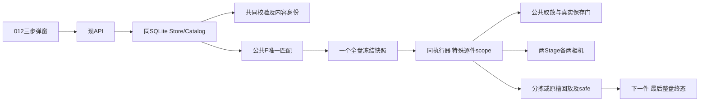

# 技术方案：抓手选择与特殊旋转零件闭环

**功能标识**：014-special-part-rotation（Spec Kit功能标签，无Git分支创建）  
**日期**：2026-10-05；**根**：E:/dzk/gaode-1  
**规格**：[spec.md](spec.md)；**宪章**：9.0.0  
**状态**：Phase 0研究、Phase 1设计已形成，等待设计与012导航审查；无软件验证。014新plan，012仅配套增量；不生成tasks或改历史勾选。

## 方案摘要

正式公共3D/F绑定SQLite已保存共同配方并冻结后，特殊场景1按OK格号逐件进旋转工位、两组四次拍照、共同算法判定/必要保存、实际分拣或原槽回放、安全位确认。当前件闭环后才下一件，最后整盘下料及最终保存。沿现ThreeStageWorkflowExecutor、RecipeDetectionExecutor、SortingMapper/Allocator、公共取放、LatestProtocol适配；共同合同RC10是字段唯一定义。普通阶段节奏保持，只有阶段内部按OK格号遍历。

| P13阶段边界 | 当前设计 |
| --- | --- |
| 起点/终点 | 正式人工上料/启动→公共观察/F→冻结→全部参与件闭环→整盘下料/最终保存及原人工取盘门 |
| 参与组件 | 原弹窗/API、唯一配方校验/身份/SQLite/目录/F/冻结、现业务执行/PLC公共取放、相机光源/算法及实际保存/投影 |
| 必要验证 | 最少两件实际OK各回原槽的特殊链、一条受影响普通链、必要组件及受影响持续门禁；不以计划生成为完成 |
| 完成证据 | 同run origin/区域号/entity/stage/camera/选择/运动/采集/算法/pick提交/放料/safe/下料/Final，明确模拟或硬件来源 |
| 延期 | 未批准安全恢复平台、任意流程编程、全组合/全历史测试、发布版本平台、013性能重测 |

## 技术上下文（Technical Context）

| 项目 | 当前选择 | 来源/状态 | 局部限制 |
| --- | --- | --- | --- |
| 后端 | 现.NET SDK10.0.401/net10.0/ASP.NET Core | 主项目global.json/工程，沿用不升级 | 本轮不构建 |
| 数据 | 现独立SQLite配方库/EF Core10.0.12，现运行事实库分离 | 012已集成真实提供者及维护工具 | 正文4/记录1.5/冻结3尚未实现；Host不静默迁移 |
| 前端/宿主 | 静态a.html、recipe-authoring.js、runtime.js及既有WPF/WebView2 | 006/012已批准 | DUI02/03导航预览待确认，其他页面不改 |
| 算法/采集 | 现端口/CaptureRequest/Worker，StageId贯通组身份 | 当前源码粒度研究R05 | 真机配置应用证据未具备，Host NotIntegrated保护保留 |
| PLC | 同IPlcStageActionPort与LatestProtocol适配、Pump唯一采样 | 正式原件+009/010/013成果 | 正式地址/安全/角容差/固定取料角缺项仅限制对应动作 |
| 性能/期限 | 原绝对期限、取消、代次和批准成本；扩特殊真实工作量 | RecipeExecutionBudget及013-acceptance/2 | 不新增性能承诺/猜硬件耗时，不重开013 |
| 验证 | verification V14-01—07 | 本次最小集合 | 仅计划，执行数0，未生成新测试或入口 |

研究与替代见research.md。软件架构选择已收敛；DEP仅现场输入/硬件结论，DUI仅具体导航表达，不补成默认规则。

## 宪章检查（设计前/后）

| 原则 | 检查点 | 设计前 | 设计后 | 依据/具体受限部分 |
| --- | --- | --- | --- | --- |
| P01 | 最新确认及来源冲突 | 符合 | 符合 | spec/source记录；任意OK目标被用户原槽规则替代，来源不改 |
| P02 | 前端仅API/后端设备与保存 | 符合 | 符合 | 012 API与同SQLite，EX14正式端口；未运行 |
| P03 | 配方/场景与实体 | 待补充，仅类型设计 | 符合 | RC10稳定CellId/两抓手/Stage/实体区分，普通节奏保持 |
| P04 | 安全/有限终态/事实 | 待补充，仅现场输入 | 待补充，仅所列实际运动 | EX14完成门已设计，DEP01/03限制正式派发，不阻保存 |
| P05 | 唯一业务/端口/Host | 待补充，仅scope接入 | 符合 | 同executor/validator/store，现注册点，无第二引擎 |
| P06 | 单源/有界资源 | 符合 | 符合 | Pump/WaitGroup/预算沿用，预建键空间迁移承接，不新poller |
| P07 | 身份/质量/处置分离 | 待补充，仅原槽与组关联 | 符合 | 全盘Frozen/scope、StageId、picked/placed/safe，scope≠盘完成 |
| P08 | 保存门/冻结 | 待补充，仅新增负载 | 符合 | RC10版本读取/深复制，真实pick gate、短事务/未知提交保留 |
| P09 | 共同逻辑/日志与证据 | 符合 | 符合 | EX14关联日志，虚拟与实际证据分列，verification完整性拒绝漏跑 |
| P10 | 局部未知不造值 | 符合 | 符合 | DEP01—04及DUI02/03，不默认抓手/映射/参数 |
| P11 | 配置与新增能力 | 待补充，仅特殊接入 | 符合 | 现能力内组/角/参数配置，新增动作沿原端口，非产品名分支 |
| P12 | 原型只读/精确差异 | 待补充，仅其他合法导航 | 待补充，仅DUI02/03 | 012原型对应和两个预览，未批准不实现导航，不计全设计通过 |
| P13 | 最小闭环真实证明 | 符合 | 符合 | verification/quickstart：计划不代实际动作，本轮仅设计 |

无原则豁免。局部待补不意味着正式硬件已通过，也不阻已明确保存/界面设计。012不因历史checklist勾选推全部新增满足。

## 结构与职责

| 现文件/模块 | 唯一责任/依赖方向 | 修改设计 |
| --- | --- | --- |
| Application/Recipes/RecipeContracts、ExecutionInputs、Serialization、Identity、Validator、Snapshots、Planner、Admission | 本会话014共同后端 | RC10唯一字段/校验/身份/冻结；012仅消费 |
| Application/Ports/StagePortContracts、CaptureAlgorithmMessages | 014共同语义 | scope/参数/StageId/安全事实，不含raw地址 |
| Workflow/ThreeStageWorkflowExecutor、RecipeDetectionExecutor、Coordinator、SortingMapper、Allocator、Workload/Budget、WholeTrayWorkflowOrchestrator | 014共同执行 | 同全盘Frozen的逐件scope、实际原槽/全盘聚合 |
| Infrastructure/Devices/Plc现适配及Protocol定义 | 014通信 | 抓手/绝对R实际反馈，沿009/013单源/扫描 |
| Infrastructure/Recipes/SqliteRecipeStore及decoder/provider、Host/Api/RecipeEndpoints.Authoring.cs、RecipeEndpoints.cs、Program.cs | 本会话012配套保存/HTTP | 同store/catalog，无第二模型/校验；共同增量调用不并行覆盖 |
| Host/Composition/AdapterBindings、Station01Registration、实际结果/状态投影 | 014业务注册/012显示消费同会话协调 | 保单一注册；件事实与盘终态分开 |
| frontend/src/recipe-authoring.js、pages/a.html、runtime.js | 012 | 同弹窗矩阵/真实读取，导航待批准；不执行业务计划 |

详见012shared-integration和本功能cleanup-and-consumers。未新建工程、常驻服务或通用编辑器；本轮不改上述代码。

## 数据、契约与状态

准确类型唯一在011 recipe-contract/1.5 RC10；014data-model引用关系；EX14-01—05给scope/动作/通信消费；012API给HTTP信封；verification给最小证据。

实体/成员与点位由CellId稳定关联；显示号重编号不移动值；正式3D映射与实际TrayId在运行冻结后明确。历史原始负载不补假布局，不以当前目录重写在途输入。

## 配方共用与动作隔离

保持所有场景共享新建/读取/编辑/检查/保存/F/准入/计划/冻结。更多面、可选E和成员能力保留；特殊只场景1类型，不以产品名分支。旋转两Stage及逐次参数配置化，工位Pick/Place共享但原槽Source/OriginPutBack逐件独立。

### P11配置与新增能力

已有配置变化使用RC10；新增TransferToRotation/Rotate和原槽return消费沿现IPlcStageActionPort/适配器，注册在既有Composition。业务请求引用有效能力/来源，不执行脚本。唯一校验核引用兼容，实时算法异常按既有有限终态，不能单独变成全局安全许可。动作准入缺正式机械证据时局部拒绝。

## 并发、资源与异常出口

| 路径 | 所有者/期限 | 失败与资源 |
| --- | --- | --- |
| HTTP保存 | 012有界短事务，沿现ReadWrite/锁预算 | 冲突不写；COMMIT不明保Unknown，不自动重发/加批准 |
| F/冻结 | Application一次一致读取与原绑定期限 | 未匹配不产品动作；公共准备仍合法，缺映射不造Origin |
| 运动/选择 | 同现动作租约、epoch及绝对deadline | 错反馈/超时/取消不后继；未知持料不放料 |
| 采集/算法 | 现有限资源和租约/释放，按StageId事实 | 少一个相机不推进；算法失败沿合法有限状态，不假OK |
| 原槽回放/保存/safe | 同Allocator/公共取放/pick receipt | placement或safe失败不完成scope，不下一件；保关联日志 |
| 控制/心跳 | 013 Pump与独立控制路径 | 不等UI/算法/磁盘；闭环不重选抓手，无重复采集线程 |

## 保存与恢复

SQLite Head+完整正文短事务与原维护互斥；Host不建库改表。pick保存门、必要结果提交/媒体、位置与安全证据、全盘最终保存依原路径；质量≠放回≠提交。每scope不能重开总预算或以测试免保存。

旧2/3正文及冻结2真实读取、不转写、不改旧运行库或013输入；历史任意OK出口保原事实但不授新动作。新编辑缺布局/抓手需明确填，不能伪造生产准入。未知动作不盲重发，恢复平台延期。

## 软件验证与证据计划

V14-01—07及必需V14-INPUT见contracts/verification.md：受影响build/type/components；矩阵与类型；保存完整重读/版本/F/冻结；至少两件实际OK各自原槽回放/safe，必含AB/AB或CD/CD重复组的特殊同run及一条普通；必要抓手、重复组、NGPending、safe/pick保护；009/010持续门禁与精确原型/用例完整性。只用必要组件与代表，不全量/历史/穷举，不重测013。当前执行0。

## OPEN、依赖与决策

软件字段/作用域/保存/版本/端口设计在research与RC10已经收敛。DEP01正式地址/型号承载，02格位3D映射，03安全/固定取料角/容差，04硬件应用，各局部限制正式派发或硬件结论；不影响离线完整保存设计。DUI02/03只限制对应导航落实。后续共享代码前须完成任务承接和编译消费者迁移，本轮不生成任务。

## 客户确认原型（P12）

只读HTML SHA256 `5ce8fa6bfeb73561860d2a40119e3d21f065e20e8ba43c934ec291cc8466c2a3`，路径及精确授权见012 prototype-baseline。ZIP SHA256 `3DC791C1F8AB5EEDFA037F5DBAE450B2D20522FED654F86EA700C0284945E1E0`，a.html/data-view.html/login.html保护保持。012两个导航HTML是待确认设计预览，无保存API/默认坐标或业务执行，不是客户原稿/产品实现。本轮不浏览器验收、不修改来源，停止设计审查。

## 本轮设计审查定向修订

特殊首次新建：012 API-L00给精确类型请求、同型号来源隔离、完整可编辑共同JSON及真实来源准备责任；API-L01a承接未填中间态和StageId定位。014准备合法后端来源，012用同SQLite/StorePrep/共同保存落地，非第二模板库。版本唯一当前目标新写正文4/冻结3，历史正文2/3和旧冻结原版本保真；历史1.4的正文3不是本次新写约束。代表链必需两件实际OK原槽/safe及重复组，其他处置/失败优先组件。清单审查不代表软件通过。

### 2026-10-05 action feedback recovery (014 T007/T008)
Special continuation-09 reached F/freeze but missed the 500ms real XY Moving observation: the last start-write await resumed after the simulator had already progressed, and X sampling was enabled only then. Keep the same acquisition pump and periods. Arm the existing X group before start writes and latch only actual Moving samples from the same epoch whose field sampling starts after that axis actual acknowledged response completion tick. Retain one action-scoped bounded watch (one entry per commanded axis), clear it on exit, and still require current Arrived, actual coordinates, original deadline/cancellation and safety. An unsent command, pre-dispatch/stale/foreign-epoch sample or arrival alone cannot establish Moving. No additional polling source or successful feedback synthesis. Contracts tests must reject those cases; representative remains actual TCP/Worker/SQLite/page evidence.

014 T012/T013 projection recovery: sorting-evidence/1 SortingAssignmentInTransit carries PickCompletionEvidence, not DeviceActionEvidence. Parse full action evidence only for its declared completed kind (SortingAssignmentOccupied or RotationReached); committed pick remains Executing, never physical place/safe/whole-tray completion. Keep notification/query live and add the exact persisted pick-shape regression, valid digest/run/plan association and completion rejection.

014 T011/T013 scoped event recovery: per-unit calls already carry the frozen DetectionExecutionScope and original detection IdempotencyKey. Namespace wrapper stage-event keys by that scope (unit and slot), including intent/start/completion/retry/pause boundaries. Whole-tray and ordinary scope-null keys remain unchanged. Distinct units cannot conflict at SQLite, and repeated same-unit/same-key/different-content still conflicts. Do not randomize event keys, weaken store idempotency, swallow Conflict or add retry. Existing ThreeStageWorkflowExecutorTests belongs to T013; two-unit component and actual shared representative must cover this.

014 T007/T008 completion recovery: ordinary continuation-02 actual P transaction2 completed queue/I/O within78ms, then Submit resumed about1056ms after arbiter completion; original absolute check rejected1135ms. Remove the scheduler explicit asynchronous completion handoff; publish every normal/cancelled/expired completion outside the arbiter lock, preserving one wire drain and the original final absolute/cancellation check. No extra retry, deadline start change or new executor. Bounded completion timestamp means immediately before signaling, separate from return after any inline consumer. Audit direct transport consumers (only existing PlcSignalAccessor); cancellation/reentry and original deadline tests plus both representatives are required.

2026-10-06 T007/T008 first-fault preservation: a subsequent reconciliation rejection must retain its distinct refusal meaning but must not replace the first actual wire/deadline cause in the business failure latch. Keep the first unusable-connection cause internally, cleared only by the existing explicit reset; current 1000ms origin, epoch, cancellation, no replay and raw exchange journal remain unchanged. Required regression: actual dropped response followed by refused reads retains the original cause; ordinary and special acceptance remain separate. No new business recovery path or diagnostics-as-success.

## 新016直接相关增量（2026-10-06）

本次仅承接[新016共同合同](../016-public-preparation-tray-check-unload/contracts/public-tray-flow.md)的直接相关边界。公共上下料与3D位置沿整机公共配置，配方不重复坐标；初次3D完整观察后空盘/介入可不执行F并合法下料、人工确认和结束；正常首次继续才F绑定。姿态异常是独立处置依据，跳过后续检测，最终从原槽真实Pending分拣，不伪造算法结果；复查保留已完成事实。组内每实际零件有独立位置。后端拥有单次10秒决策及原始截止，前端只显示/提交；本盘结束不表示全部检测完成。协议/实际取料提交门/反馈/保存及未知保护不变。
