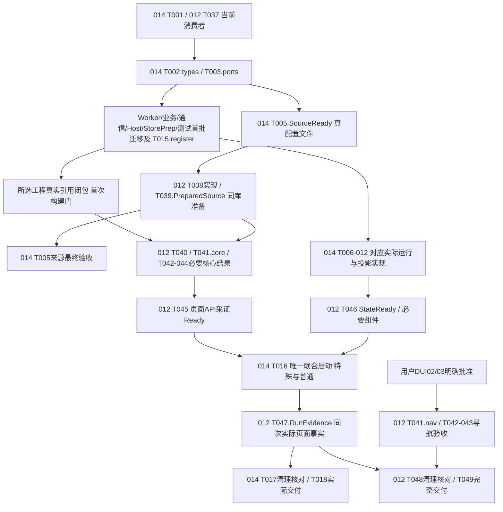

# 任务：014抓手选择与特殊旋转零件闭环

日期2026-10-05；根E:/dzk/gaode-1；显式SPECIFY_FEATURE_DIRECTORY=specs/014-special-part-rotation。功能标签不是Git分支，不改feature.json。依据当前spec/plan、共同recipe-contract/1.5 RC10、EX14、012 API-L00/L01/L01a、verification/cleanup/design-review；I01—I05设计关闭，不重做设计。新增18项尚未执行。

## 当前范围与完成证据（P13）

| 项目 | 本次义务 |
| --- | --- |
| 起点/终点 | 人工上料/公共3D/F真实保存唯一匹配→一个全盘Frozen→特殊OK序逐件闭环→全部参与/排除汇聚后下料/Final及原人工取盘门 |
| 必须参与 | 共同模型/校验/serializer/身份/SQLite/目录、现executor/公共取放/真实保存门、通信/采集/算法、012弹窗API及真实状态 |
| 证据 | 当前源码/输入SHA、必需用例发现执行、同run实际运动/采集/算法/保存/原槽/safe/盘事实，模拟与硬件分列 |
| 局部限制 | DUI02/03只限制对应导航；DEP01—04只限制其定位/动作/硬件结论，不阻离线保存；真实来源准备是交付义务 |
| 不扩展 | 全量/组合穷举/009010全历史/013性能重测、第二执行器/校验器/目录、恢复/发布平台 |

014唯一承接共同后端与通信，012唯一消费存储/HTTP/UI；同会话负责。每项文件范围见责任表。阶段产物可先交，不满足全部判据不得勾整项。测试定义可以先做，实际构建/运行等真实引用与实现，不把未通过测试当实施编写前置。

## Phase 1：当前源码与消费者准备

- [x] T001 核集成基线、真实来源、编译消费者和删除对象，记录specs/014-special-part-rotation/implementation-consumers.md及artifacts/014-special-part-rotation/implementation-baseline.json。

  负责人014；前置无。核真实ProjectReference、构造/switch、nullable物理号、历史decoder、Worker消息、Host/StorePrep、Python/脚本、扫描及测试消费者，不使用旧副本。交文件SHA/引用闭包/配置来源/删除分类，每个受影响文件归唯一任务；合法reader/保护与失效当前分支分开。完成是盘点，不是验证。（FR-016/SC-006；P01/05/12/13；cleanup）

## Phase 2：唯一共同字段、历史及消息基础

- [x] T002 在backend/src/Gaode.Application/Recipes/RecipeContracts.cs及责任表指定的配方文件落实RC10、正文4/记录1.5/冻结3与真实历史读取。

  负责人014；依T001。先交C14-types稳定签名/迁移清单，后交唯一serializer/validator/identity/planner/深冻结。落实CellId/Region/实体成员/nullable真实物理号、两用途抓手、共享工位/两Stage、逐次相机参数、NG/Pending单源目标引用和OriginPutBack。新写4/冻结3，历史2/3及旧冻结按原版本/字节身份保真；不造历史布局/默认抓手/物理号，不复制全部取料值。OK按行列号、跳过保号，保普通面/成员/批次节奏；替代后删当前任意OK目标/数组顺序/容量猜号/非法特殊整体准入。签名可先交，整项需契约与真实冻结证据。（FR-001—005/007/008/012/015/016；SC-001/003/005；RC10/V14-CONTRACT）

- [x] T003 在backend/src/Gaode.Application/Ports/StagePortContracts.cs及共同端口/域文件实现scope、动作语义和实际反馈合同。

  负责人014；依T002 C14-types。交C14-ports准确类型/消费者表。同DetectionExecutionScope/全盘Frozen、TransferPurpose、TransferToRotation/Rotate、safe/AngleReachedEvidence，DeviceStageContract/result switch支持明确；StageId/业务ID不当PLC原码。Scope只限定原全盘步骤，件Completed不代盘Completed；原绝对deadline/取消/epoch/关联保持，无第二动作端口。（FR-006—014；SC-002—005；EX14-01—05）

- [x] T004 在backend/src/Gaode.Application/Workflow/FaceResultAggregator.cs及工作量/Worker/算法消费者贯通StageId。

  负责人014；依T002/T003实际稳定签名。先交C14-worker编译/消息迁移，再交融合/预算与必要组件。相同Material/LocalFace两Stage仍独立，每件四采集；StageId贯通Worker输入/输出/融合，不伪造CoordinateEpoch。Transfer/Rotate/Return纳原总预算，不每件重开deadline/猜耗时；旧合法消息/历史含义保留。现Python Worker只迁移正式消息，不能成为新执行器或预置OK实现。（FR-003/006/007/013/015；SC-003；V14-06/CONTRACT）

## Phase 3：US1 真实来源、保存与F冻结（P1）

独立验收：012真实保存/全读、共同F精确匹配、编辑不改原冻；保存不要求设备在线。

- [x] T005 [US1] 准备真实后台来源，交configuration/recipe-authoring/source-manifest.json、ordinary-source.json、special-rotation-source.json的配置、依据及SHA。

  负责人014；依T001真实来源核查/T002结构及所需真实输入。三个拟建文件仅为现维护工具的部署准备输入，运行只读同SQLite，不是第二模板库/目录。交同Model普通/特殊合法ScenarioId/UnitKind/InspectionKind/Route、已有相机光源/算法/姿态及特殊两组工位来源，供012:T039实际落库。值来自有效部署或具名软件输入，不复制原型示例/默认坐标/假OK，不授生产批准。完成须真来源及同库准备结果，不能只交Unavailable；缺配置只限制对应类型，无依赖准备继续。（FR-001/003/015；I01/I04；API-L00；V14-01/CONTRACT）

- [x] T006 [US1] 在backend/src/Gaode.Application/Recipes/RecipeApplicationCoordinator.cs及Matcher/公共入口/冻结reader接通F绑定与原始槽冻结。

  负责人014；首批依T002/T003，SQL/F证据另需012:T038。交C14-binding首批迁移/调用清单，再交同IRecipeCatalog/Matcher一次匹配与一个全盘Frozen。取料前关联TrayId/OK CellId/Region/行列/SlotId/实体及有依据PhysicalSlotIndex；显示号不代原槽/3D号。保存后F新提交、在途不变；缺映射仅限制产品定位，不挡保存，不单件重冻结/改digest/自动补历史。证据复用T015、012:T044和T016。（FR-004/005/008/013/015；SC-001/002/005；EX14-01）

## Phase 4：US3 抓手选择与旋转通信（P1）

独立验收现通信入口/唯一采集源的选择R/safe及mask；软件模拟不冒正式PLC结论。

- [x] T007 [US3] 在backend/src/Gaode.Infrastructure/Devices/Plc/LatestProtocolStageActionAdapter.cs及协议/设备/mask/虚拟PLC生产者落实真实选择、R与safe。

  负责人014；首批依T001/T003，实际派发使用对应批准协议/机械输入。交C14-comm首批枚举/签名/mask消费者迁移，再交同端口选择：闭环开始对应抓手，有效同号0新发/0新等，首次/换号/失效本次确认，正常保选择，flip不握手。核本次R到位+实际角，不造完成信号；transfer Completed核真实src/tgt/safe。
  UInt128覆盖全部FieldMask/字典/Key/RequireOwned及实际有限预建集合，保原SignalId、旧低位和新增高位键；仍同Pump/WaitGroup/013策略，不新poller/重测性能。正式地址/安全/容差缺项保局部拒绝；具名虚拟映射不授生产。不集成保护不能先删，失效协议/免搬旁路替代后核消费者实际删。（FR-002/009—014/016；SC-004/006；EX14-03/04）

- [x] T008 [US3] 在backend/tests/Gaode.Communication.Tests/Devices/LatestPlcProtocolTests.cs及现通信/协议测试定义并执行必要分支。

  负责人014；定义依T003，首次构建等C14-comm/登记，执行等T007对应实现。核旧低位/新增高位mask、Owned/未知ID拒绝、有限read计划；同号复用/换号/epoch失效重建、错反馈阻断/翻面0选择、本次R/safe门。保原期限/取消断言，交非零发现执行/当前输入及结果；失败/Skip/零发现不可勾。不重跑全部通信历史。（SC-004/006；V14-05/07）

## Phase 5：US2 特殊逐件闭环与真实状态（P1）

组件验收scope/Stage/原槽/保存/safe；实际完整链由T016唯一启动。

- [x] T009 [US2] 在backend/src/Gaode.Application/Workflow/RecipeDetectionExecutor.cs、RecipeDetectionExecutor.Observation.cs、RecipeExecutionCoordinator.cs和FaceEstablishment.cs实现同执行器scope与四次真实采集。

  负责人014；首批依T002/T003，消息依T004 C14-worker，实际动作依T007对应能力。交C14-detection编译迁移，再交同全盘Frozen/PlanRevision只筛本件步骤/期望：实际上工位→组1本次R/两相机齐→组2本次R/两相机齐，Stage/相机局部参数不覆盖；E仅原扫码安排。替代就绪才删blanket RotationNotStarted/错误关联，机械未配仍拒依赖动作；缺采集/结果不假OK、不重开期限。（FR-003/005—007/011/013/015/016；SC-002/003；V14-03/06）

- [x] T010 [US2] 在backend/src/Gaode.Application/Workflow/RecipeSortingMapper.cs和SortingTargetAllocator.cs落实固定原槽回放、真pick保存与safe门。

  负责人014；首批依T002/T003，实际动作依T007，scope依T009。交C14-sort编译迁移和普通NoMoveRequired/特殊ReturnToOrigin分离。特殊OK分拣抓手工位pick→真实提交→转运→本件冻结原槽placed→safe，任一失败无本件Completed/无下一件；保占据/reservation/UnknownHeld/上料腾空原槽和普通源保护。NG/Pending沿既有目标/分配，不造策略。替代后实际删任意OK目标/特殊免搬，真历史reader保持。（FR-006/008/013/016；SC-002/005；V14-03/05）

- [x] T011 [US2] 在backend/src/Gaode.Application/Workflow/ThreeStageWorkflowExecutor.cs及盘编排/事实/保存reader落实OK序闭环与盘终态。

  负责人014；首批依T002/T003，实际行为依T006/T009/T010。交C14-orchestration迁移，前件上料/两组/判定必要保存/处置placed/safe齐后后件；全部参与/排除对账后一次Unload/Final及原人工取盘门。scope完不代盘完，日志关联run/origin/entity/Stage/operation/epoch/receipt。删specialExits免搬/最后件代盘，保HistoricalHandlingEvidence/SpecialExitCompleted历史含义与实际保存保护。（FR-005/006/008/012/013/016；SC-002/005/006；V14-03/04）

- [x] T012 [US2] 在backend/src/Gaode.Host/Composition/AdapterBindings.cs、Station01Registration.cs及真实投影/查询/通知落实唯一注册与状态输出。

  负责人014；首批依T002/T003及所引用T004/T006签名，实际行为依T007/T009—T011。交C14-host编译/注册调用清单和真实CellId/区号/origin/entity/StageId/return/safe投影；件与盘终态分开，旧缺项null不从当前目录补。012:T040唯一编辑Program消费调用，T046消费实际输出；普通无搬与特殊真实回放不混，设计字段不称已收到代码。（FR-006/007/008/013/015；SC-002/003/005；EX14-05）

- [x] T013 [US2] 在backend/tests/Gaode.Contracts.Tests/Workflow/RecipeSortingMapperTests.cs及检测/融合/编排/状态测试定义并执行必要特殊组件。

  负责人014；定义依T002/T003，首次构建等消费者迁移/登记，运行等T004/T007/T009—T012对应实现。交同面两Stage身份/参数、scope≠盘、原槽placed/safe先于下一件、NG/Pending/异常保号及pick提交/回放/safe/错反馈/取消epoch必要失败证据。保LegacySpecialExitCannotExemptCurrentNgSorting等正确负例；错误测试替代承接保护，不放宽期望/少行。无第二完整链，零发现/Skip/漏行未完成。（FR-003/005—008/011/013/016；SC-002/003/005/006；V14-03/05/06）

## Phase 6：US4 普通节奏保持（P1）

- [x] T014 [US4] 在backend/tests/Gaode.Contracts.Tests/Workflow/RecipeOrdinaryPreservationTests.cs补必要普通、成组与半成品节奏组件。

  负责人014；定义依T002/T003，运行依T009—T011；无DUI导航前置。拟建组件核阶段内OK序/原面序/成员序/整盘后分拣，成组独立成员与半成品整体搬运保持；普通OK无额外搬运，但检测期必要移动/翻面/回放仍有。源代码只由T002/T009—T011修改，真实普通代表复用T016。（FR-005/008/012/013；SC-005；V14-04）

## Phase 7：最小验证、实际清理及交付

- [x] T015 在backend/tests/Gaode.Contracts.Tests/Recipes/RecipeDefinitionSerializationTests.cs及直接测试消费者、009/010扫描/脚本清单迁移契约与门禁。

  负责人014；首批依T001/T002/T003及各真实引用，定义/登记不要求未实现测试先通过。交C14-registry首批测试编译/实际职责登记，再执行受影响构建/契约/持续轻量正负例：当前4/记录1.5/冻结3正例，2/3拒当前写但历史原版本/摘要读正确；nullable不补0。
  Host/StorePrep/所选测试首次构建前核真实引用闭包全部类型/Worker/Host/provider/消息/脚本/测试迁移，不移除正式编译文件。新增源码/合同/脚本准确登记，扫描不缩，错误架构/错旧结构/漏必需用例/Skip/零发现/无关联旧报告仍拒绝。不跑全历史或013性能。（FR-014/015/016；SC-001/006；V14-01/07/CONTRACT）

- [x] T016 唯一启动共用联合代表，维护scripts/014-012-joint-verification.ps1、backend/tests/Gaode.Integration.Tests/Support/RecipeExecution010RunHarness.cs及RecipeExecution010Expectations.cs，登记artifacts/014-012-joint/input-manifest.json和run-ledger.json。

  负责人014；启动需实际来源/保存/F/执行/投影与必要组件就绪、012:T045页面/API/采证Ready和T046 StateReady；不等012:T047最终页面证据/T049报告。只一特殊和一受影响普通，012同次采证。
  特殊至少两件实际算法OK，按OK序各pick/提交→工位→两Stage四实际采集→判定必要保存→本件原槽placed/safe；后件晚于前件safe/必要提交，最后才盘下料/Final。优先同链AB/AB，stage:1/2各两相机、每件4/两件至少8独立captureId，跨件/组/相机参数可辨；仅按V14-INPUT允许既定CD/CD必要组件承接不可省的重复组实例，不另起同义特殊链。正式Worker不能用ExpectedClassification/预置OK代替真结果；普通保原节奏及OK无多余搬运，NG/Pending/失败优先组件。输入SHA/事实/虚拟或正式来源可核，页面最终证据运行后形成。（SC-001—006；V14-01—06/INPUT）

- [x] T017 核替代后的实际删除、消费者及有效义务，填写specs/014-special-part-rotation/cleanup-implementation-receipt.md。

  负责人014；依T001和各源任务对应替代/相关组件联合证据。本项只核文件SHA/消费者/承接，不再编辑源；实际删除由T002/T004/T006/T007/T009—T012及012源任务完成。无当前任意OK目标/假目录/旁路/特权/第二引擎，不靠注释/永久禁用/无用兼容保留。合法历史reader、正确占据/提交/持料/期限/取消/并发/冻结和失败证据保持，无消费者才删。（FR-016/SC-006；cleanup/V14-07）

- [x] T018 汇总specs/014-special-part-rotation/implementation-handoff.md和artifacts/014-special-part-rotation/delivery-manifest.json，核全任务真实完成。

  负责人014；依必要完成证据、T016共用run及012:T047相应实际页面证据；不等012:T049最终报告。列真实文件/SHA/构建范围/发现执行/失败NotRun/删除/限制。阶段代码可先交，不因此勾整任务；未批导航/现场输入/Applied未验分清，不拿旧25/25或设计审查当软件通过，保013带限制收口/偏差。（FR-001—016/SC-001—006；P09/12/13）

## 唯一文件编辑责任表

路径以项目根解析，同行短文件名沿最近完整目录，不是同名全库扫描。只按实际影响修改，不要求无关文件强制改。T001发现额外直接消费者后，修改前归真实职责的已有唯一任务并登记；另一功能仅引用产物。拟建资产在实施时才创建。

| 唯一任务 | 除任务主文件外的范围 |
| --- | --- |
| T002 | backend/src/Gaode.Application/Recipes/ExecutionInputs.cs、RecipeDefinitionSerialization.cs、RecipeDefinitionIdentity.cs、RecipeDefinitionValidator.cs、RecipeCatalogSnapshots.cs、RecipeStageIdentity.cs、RecipeRunPlanner.cs、CoordinateResolver.cs、RecipeAdmission.cs |
| T003 | backend/src/Gaode.Application/Ports/CaptureAlgorithmMessages.cs；backend/src/Gaode.Application/Workflow/WholeTrayCompletionContracts.cs；backend/src/Gaode.Domain/Station01/DeviceSemantics.cs |
| T004 | backend/src/Gaode.Application/Workflow/RecipeWorkload.cs、RecipeExecutionBudget.cs；backend/src/Gaode.Infrastructure/Algorithms/WorkerMessages.cs、WorkerProtocolCodec.cs、WorkerImplementation.cs、WorkerProcessSupervisor.cs、PythonWorkerAdapter.cs、IWorkerProcess.cs；scripts/010-content-sample-worker.py；scripts/tests/test_010_content_sample_worker.py；backend/tests/Gaode.Contracts.Tests/Algorithms/WorkerProtocolTests.cs；backend/tests/Gaode.Integration.Tests/Station01/WorkerTwoInputTests.cs |
| T006 | backend/src/Gaode.Application/Recipes/RecipeMatcher.cs、IndependentRecipeApplication.cs、IndependentBindingEventWriter.cs、RecipeBindingReceipt.cs、CommittedRecipePlanReader.cs；backend/src/Gaode.Application/Station01/StartPublicPreparation.cs、PublicPreparationHandoffV2.cs、RunExecution.cs |
| T007 | backend/src/Gaode.Plc.Protocol/Signals.cs、SignalCodes.cs、ProtocolDefinition.cs、Float32Codec.cs；backend/src/Gaode.Infrastructure/Devices/Plc/PreparedPlcReadPlans.cs、LatestProtocolPlcDevice.cs及.Stages.cs/.Semantics.cs/.Polling.cs/.Axes.cs/.Acquisition.cs/.FailureEvidence.cs、LatestProtocolStageActionAdapter.Transfer.cs、PlcMechanicalConfiguration.cs、ProtocolActionState.cs；backend/src/Gaode.Infrastructure/Integrations/NotIntegratedStagePorts.cs；VirtualPlc/VirtualPlcEngine.cs、VirtualPlcEngine.Axes.cs、SimulationModels.cs、DeviceActionAudit.cs |
| T008 | backend/tests/Gaode.Communication.Tests/Devices/ProtocolDefinitionAdmissionTests.cs、VirtualPlcLatestProtocolTests.cs；backend/tests/Gaode.Communication.Tests/ProtocolOracle/ProductionDefinitionTests.cs、OracleSourceTests.cs |
| T011 | backend/src/Gaode.Application/Workflow/WholeTrayWorkflowOrchestrator.cs、StageEventing.cs；backend/src/Gaode.Infrastructure/Persistence/StageEventStore.cs、WholeTrayCompletionStore.cs、RecipeApplicationProjection.cs、RecipeApplicationHistoryReader.cs、DeviceHistoryProjection.cs |
| T012 | backend/src/Gaode.Application/Station01/RuntimeObservationProjection.cs；backend/src/Gaode.Host/Api/CommittedResultProjection.cs、DeviceSemanticProjection.cs、QueryEndpoints.cs、RunEndpoints.cs、Station01ApiContracts.cs、Station01NotificationService.cs |
| T013 | backend/tests/Gaode.Contracts.Tests/Recipes/FaceResultAggregatorTests.cs；backend/tests/Gaode.Contracts.Tests/Workflow/ConfiguredDetectionExecutionTests.cs、ThreeStageWorkflowExecutorTests.cs、WholeTrayWorkflowOrchestratorTests.cs；backend/tests/Gaode.Contracts.Tests/Station01/RuntimeObservationProjectionTests.cs；backend/tests/Gaode.Integration.Tests/Api/CommittedResultProjectionTests.cs、CommittedDispositionProjectionTests.cs、DeviceSemanticProjectionTests.cs |
| T015 | backend/tests/Gaode.Contracts.Tests/Recipes/RecipeRunPlannerTests.cs、RecipeCommonFoundationTests.cs、RecipeCatalogTests.cs、RecipeBindingSaveProtectionTests.cs、RecipeEnvironmentDecoderTests.cs、SemanticRecipeInputProviderTests.cs、CommittedRecipePlanReaderTests.cs、PublicPreparationTargetResolutionTests.cs、JointInputDefinitionTests.cs；backend/tests/Gaode.Contracts.Tests/Station01/RecipeApplicationContractTests.cs；backend/tests/Gaode.Integration.Tests/Station01/RecipeAuthoringBindingTests.cs；backend/tests/Gaode.Rules.Tests/Architecture/RecipeExecutionBoundaryChecker.cs、RecipeExecutionBoundaryTests.cs、ProtocolBoundaryChecker.cs、ProtocolBoundaryTests.cs、ProtocolRepositoryBoundaryTests.cs、009-boundary-inventory.json、009-public-shapes.json、009-test-obligations.json、010-test-obligations.json；scripts/workflow/recipe_execution_010.py、test_recipe_execution_010.py、010-required-cases.json、010-lightweight-cases.json；scripts/architecture/010-script-boundary-cases.json、009-script-boundary-cases.json、009-process-cases.json；scripts/verify-009-protocol-isolation.ps1、scripts/check-009-script-boundary.py |
| 012:T038 | 唯一SQLite/store/schema/provider/decoder/catalog，详012任务，014不建另一目录 |
| 012:T039 | backend/tools/Gaode.StorePrep/Program.cs；014:T005交真实来源，不同时编辑工具 |
| 012:T040 | backend/src/Gaode.Host/Api/RecipeEndpoints.cs、RecipeEndpoints.Authoring.cs及backend/src/Gaode.Host/Program.cs；014:T012只交调用清单 |
| 012:T041/T046 | T041独占frontend/src/recipe-authoring.js和frontend/src/pages/a.html（包括待批导航后批），T046独占frontend/src/runtime.js |
| 012:T042/T043/T044/T045 | 前端组件/精确原型/存储API测试/页面采证分别唯一负责；共同绑定测试和架构清单仍014:T015 |

## 直接阶段依赖与首次实际构建门

Txxx.types/compile/core/ready是同任务可核阶段产物，不是新增任务ID或整项完成；收到实际文件/签名/清单才消费，设计接口不冒代码交付。

| 产物/门 | 直接前置 | 继续条件 |
| --- | --- | --- |
| C14-types / ports | T001→T002.types→T003.ports | 可开展全部直接类型迁移，无测试先通过或设备前置 |
| C14-worker | T002/T003→T004.compile | 原Worker/融合/预算/脚本按真实引用迁移 |
| C14-binding/comm/detection/sort/orchestration/host | T006/007/009/010/011/012各取types/ports及所引用worker/binding签名 | 先交nullable/schema/构造/枚举/消息首批，不等整个运行/来源/导航批准；行为另等实际能力 |
| C12-store/prep/http | 012:T038/039/040消费共同serializer/types、store/注册稳定签名 | Host入口/StorePrep/provider直引先迁移；来源正例另需T005/012:T039真实准备 |
| C14-registry | T015受影响测试/版本构造和新增职责登记，012:T043精确原型登记 | 测试定义先行≠通过，不删编译文件或缩扫描 |
| 首次Host/StorePrep/所选测试构建 | T001/012:T037所列每工程真实ProjectReference闭包的全部首批及相应登记 | 核类型/端口/Worker消息/decoder/Host/StorePrep/测试/脚本命中项；不等全部运行任务整项，亦不漏消费者；T008/T013/T014/T015及012:T044/T045不能绕过 |
| 保存/页面Ready | 012:T038/039/040实际能力、T041.core及必要T042/043/044结果→T045 | 真实保存全读/编辑/重启/版本及采证准备提前交，不等联合证据或DUI审批 |
| 联合Ready | 实际后端来源/绑定/执行/投影与必要组件，012:T045 Ready+T046 StateReady | T016唯一启动，T047最终页面证据在运行后形成，不能反作前置 |
| 导航验收 | 用户DUI02/03明确批准→012:T041.nav→T042/T043实际导航结果→T047导航验收 | 未批不得落实/勾整项，不阻共同后端/保存/普通特殊核心 |
| 最终报告 | T018取T016/T047已产生证据，012:T049亦取实际证据 | 两报告不互为完成前置 |

首批编译迁移依据阶段签名/真实闭包，不把所有014整任务或所有UI批准堆为保存前置。不得用旧字段当前兼容、补0、移除正式文件、假保存/第二模型消除编译失败。

## 需求、设计问题与验证追溯

| 条款 | 实质承接 | 证据任务 |
| --- | --- | --- |
| FR-001/002/003；SC-001 | T002校验/字段，T005源，T006冻，012实际编辑保存 | T015契约、012:T044/T045 HTTP/库与参数/gripper冻结 |
| FR-004/015 | T002/T006同目录匹配/全盘冻，012:T038/T040全包 | T015、012:T044、T016 F/Frozen |
| FR-005；SC-002 | T002行列序/T006原身份/T009/T011及T014普通 | T013/T014、T016两件保号按序 |
| FR-006/008；SC-002/005 | T009/T010回放safe、T011全盘 | T013失败保护、T016两OK各原槽safe与普通代表 |
| FR-007；SC-003 | T002/T003/T004/T009两Stage独立，T012查询 | T013、T016 AB/AB每件4两件8，012:T044局部参数 |
| FR-009/010/011；SC-004 | T003语义/T007选择R事实 | T008/T013必要分支、T016 |
| FR-012 | T002排序/T009检测/T010普通不搬/T011盘节奏 | T014组件、T016普通链 |
| FR-013 | T004原预算/T006绑定/T007epoch/T010pick保存/T011Final | T008/T013/T016，不弱期限取消持料 |
| FR-014 | T007同源mask/通信，T012注册 | T008低高键/T015门禁 |
| FR-016；SC-006 | 源任务替代后实际删，T001/T017消费者核 | T015/T016非零执行/错架构拒绝、T017删除核 |
| I01 | T005+012:T039真实来源/T040准确类型解析 | 012:T044/T045正向保存与错来源拒绝 |
| I02 | T002/T015+012:T038/T040版本 | V14-CONTRACT当前4/历史2-3/旧冻原版本 |
| I03 | T009/T010/T011/T016两个实际OK与必需重复组 | 原槽placed/safe/Stage/Capture事实 |
| I04 | 012:T040中间态同源初始化，T002/T005供结构/源 | 012:T042/T044无默认/不丢字段，SourceVersion非保存锁 |
| I05 | T004/T012+012:T040/T041精确Stage上下文 | T013/012:T042/T044同面两组隔离 |

固定V14-01—07/INPUT/CONTRACT：受影响build/前端类型/必要组件；实际弹窗→API→SQLite保存全读/编辑拒绝/重启/F冻；三类型矩阵/条件字段/空位/独立号/重编号不串参；一特殊>=2实际OK+必需重复组，一普通原节奏；NG/Pending/异常/必要失败组件；009/010持续门禁/原型差异/发现执行。两功能共用同次证据，不各跑整链。NotRun/Skip/缺行/错架构/无关旧报告不可过，不全量/穷举/全历史/013性能重测。

## 条件并行与实施顺序

无无条件[P]标记：每项有真实前置且多数含后段验证。条件满足、文件不重叠才并行，构建/运行/DB按资源协调：

- T002/T003签名就绪，T004消息/T007通信首批/012:T038存储迁移可分文件并行。
- 签名和实际引用就绪，T009检测/T010排序各先做首批；012:T039工具与T040 API不同文件，真实互用前核交付。
- API稳定后012:T041编辑器与后端运行可并行；T012真实输出后012:T046 runtime与T041不重叠。
- T016唯一运行/012:T047同期采证属于同run；两最终报告不互等。

顺序：盘点→共同字段/版本/端口→命中消息/消费者/扫描首批→真实引用首次编译门→同库合法来源/原弹窗保存先交→共同逐件/通信/回放safe/投影→替代源任务实际删+必要组件→页面/API采证Ready→唯一特殊普通代表同run对账→原型/门禁/执行完整性与完整交付。首批成果不能冒完整014/012。

DUI02/03仅阻导航实现/验收；DEP01正式地址型号、DEP02格位/成员真实3D关联、DEP03安全/固定取料角/角容差、DEP04真机应用仅限制对应动作/硬件结论。缺配置是T005/T039实际交付限制，不用Unavailable代完成；不编参数/映射/默认批准，不让无设备保存停止，不修改013冻结输入/门槛/轮询/偏差。

新增18项：基础4、US1两项、US3两项、US2五项、US4一项、收尾4项，全部[ ]。随后仅只读analyze，不执行任务或自动implement。

## 来源阶段与同次证据的精确依赖补充

014:T005.SourceReady是合法共同正文文件、配置依据及SHA已经实际交付，尚不含落库最终验收；012:T039.PreparedSource仅依SourceReady+T038实际存储，完成同库准备/重读后为T005最终验收提供结果。不得反要求T005整项已含T039落库通过才能启动T039，亦不把仅来源文件交付记为T005完整完成。源文件命名是部署准备资产，不是第二运行目录。

012:T047.RunEvidence是014:T016启动后形成的特殊/普通同run页面对账，不包含待批成组/部位导航的最终验收。014:T018消费对应RunEvidence，不要求T047整项或DUI导航批准才交后端成果；012:T049完整完成仍需要其本功能全部当前任务/导航验收实际满足。未确认导航只限制对应实现/验收和完整012完成声明。

任务ID顺序按故事组织，不表示后段测试/扫描定义要等前段整链完成。014:T015的契约迁移/扫描登记首批在首次受影响构建前准备；T008/T013/T014及012:T042/T044定义可先行，实际构建/运行才等所引用实现，不形成测试先通过才准写实现的循环。

## 阶段产物依赖图（不是整任务已完成声明）

图中迁移/验证按真实工程范围细分，编写测试与源码不需要D节点先通过；D只是首次实际构建/执行的门。source验收SV不回指P的启动，最终页面EV不回指J的启动；DUI未批不控制U/UR/E/J或014已具备的后端交付。源文件替代后实际删除由其唯一任务在相应Ready前完成，不等最终审计才首次删除。

## 2026-10-05阶段实施回执（历史时点）

F01故事标签已定向修复；本段更新生成阶段“尚未执行”的当前状态，不改历史事实。已完成项仅按本次实际证据勾选，其他项含稳定阶段成果但不代表完整完成。详见implementation-handoff.md及artifacts/014-special-part-rotation/current-task-status.json。联合特殊/普通代表在公共准备阶段通信不可用，T016及同run证据未完成；DUI02/03仍未批准，只限制对应导航及完整012验收。当前L07门禁73/73通过，零Skip；此前失败保留。

014 T007/T008 recovery obligation: arm the existing X acquisition before axis start dispatch; action-scoped Moving latch requires the same epoch and field sampling at or after that axis actual acknowledged response completion. Unsent/stale/foreign-epoch/Arrived-only cannot satisfy acceptance. Clear at exit; current arrival, coordinates, safety, cancellation and original windows remain required. No new sampler. See plan action feedback recovery; actual chain remains pending.

014 T012/T013 projection recovery: sorting-evidence/1 SortingAssignmentInTransit carries PickCompletionEvidence, not DeviceActionEvidence. Parse full action evidence only for its declared completed kind (SortingAssignmentOccupied or RotationReached); committed pick remains Executing, never physical place/safe/whole-tray completion. Keep notification/query live and add the exact persisted pick-shape regression, valid digest/run/plan association and completion rejection.

014 T011/T013 scoped event recovery: per-unit calls already carry the frozen DetectionExecutionScope and original detection IdempotencyKey. Namespace wrapper stage-event keys by that scope (unit and slot), including intent/start/completion/retry/pause boundaries. Whole-tray and ordinary scope-null keys remain unchanged. Distinct units cannot conflict at SQLite, and repeated same-unit/same-key/different-content still conflicts. Do not randomize event keys, weaken store idempotency, swallow Conflict or add retry. Existing ThreeStageWorkflowExecutorTests belongs to T013; two-unit component and actual shared representative must cover this.

014 T007/T008 completion recovery: ordinary continuation-02 actual P transaction2 completed queue/I/O within78ms, then Submit resumed about1056ms after arbiter completion; original absolute check rejected1135ms. Remove the scheduler explicit asynchronous completion handoff; publish every normal/cancelled/expired completion outside the arbiter lock, preserving one wire drain and the original final absolute/cancellation check. No extra retry, deadline start change or new executor. Bounded completion timestamp means immediately before signaling, separate from return after any inline consumer. Audit direct transport consumers (only existing PlcSignalAccessor); cancellation/reentry and original deadline tests plus both representatives are required.

2026-10-06 T007/T008 first-fault preservation: a subsequent reconciliation rejection must retain its distinct refusal meaning but must not replace the first actual wire/deadline cause in the business failure latch. Keep the first unusable-connection cause internally, cleared only by the existing explicit reset; current 1000ms origin, epoch, cancellation, no replay and raw exchange journal remain unchanged. Required regression: actual dropped response followed by refused reads retains the original cause; ordinary and special acceptance remain separate. No new business recovery path or diagnostics-as-success.

## 2026-10-06当前完成判定

本功能18项逐项按task-completion-20261006.json登记实际完成依据；最终特殊14/普通05及同run页面对账、当前73/73门禁与必要回归成立。软件范围在记录的进程运行时条件下完成，不代表默认环境长期稳定或真机批准。历史生成/旧失败表述仅反映其时点，失败证据保留。

## 新016直接相关增量（2026-10-06）

本次仅承接[新016共同合同](../016-public-preparation-tray-check-unload/contracts/public-tray-flow.md)的直接相关边界。公共上下料与3D位置沿整机公共配置，配方不重复坐标；初次3D完整观察后空盘/介入可不执行F并合法下料、人工确认和结束；正常首次继续才F绑定。姿态异常是独立处置依据，跳过后续检测，最终从原槽真实Pending分拣，不伪造算法结果；复查保留已完成事实。组内每实际零件有独立位置。后端拥有单次10秒决策及原始截止，前端只显示/提交；本盘结束不表示全部检测完成。协议/实际取料提交门/反馈/保存及未知保护不变。

- [ ] T016-I01 定向同步与消费本功能直接相关公共配置/观察/处置/下料边界，产物以新016 tasks T002及对应共同代码任务追踪；原历史编号和勾选不改。
