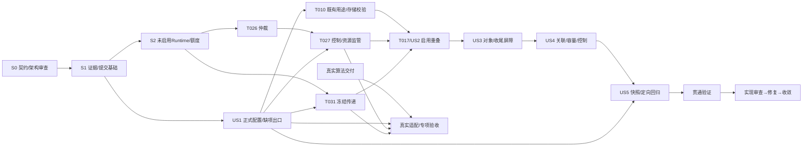

# 功能任务清单：真实算法接入与采集检测流水线

**输入**：[spec.md](spec.md)、[plan.md](plan.md)、[data-model.md](data-model.md)、[research.md](research.md)、[quickstart.md](quickstart.md)及[contracts/](contracts/)  
**宪章版本**：9.0.0；Q1=A、Q2=B、Q3=A保持  
**日期**：2026-10-09（Asia/Shanghai）  
**工作树/基准**：D:/gaode-022-real-algorithm-pipeline；022-real-algorithm-pipeline；eb85aa4b2985e61171b9d1d749af346207282d9f  
**本轮状态**：2026-10-09按后续speckit-tasks授权仅定向修订本任务文档，保留先前plan修订及原任务ID；任务均未执行、未勾选，未写产品/测试代码、运行软件/硬件或迁移数据库。

## 拆解规则

路径均相对工作树根；“拟新增”只是未来产物，当前不存在不视为任务完成。每项列需求/原则、真实依赖、验收证据；编号是追溯次序，执行以依赖为准。已确认行为不重问，不让代码定义新业务规则。依用户要求采用“契约/架构审查→最小实现→定向验证→实现审查→收敛”，不强制TDD或模板工程初始化。

[US1]真实提供者分支的任务正文以ExternalDependency标记，仍保标准任务标签；该分支Blocked不阻断离线US2–US5。所有测试替身、假坐标/媒体/固定判定/测试Worker均在测试装配范围；真实模式不据测试名称/GUID/fixture/env分支。正式虚拟联调用途保留。无需新平台/插件/分布式服务、页面/桌面改动、部署、全量回归或异常组合。

[P]仅表示在各自前置完成后无文件/状态冲突，不能跨未完成依赖并行；共享文件同批一个修改者，测试使用独立临时目录/SQLite。标记不授权启动多代理。

## 本次执行顺序及子项范围（保留40原ID）

旧S0–S5/用户场景分组是追溯标记；本次执行优先按A/B/C及正文子项依赖，不按ID数字顺序。-A表示同ID的基本接入子项，不生成新任务ID；-C是保留延期的优化子项。父任务只有全部适用子项真正完成才勾，A收口须按子项证据，不能伪称40任务完成。

| 顺序 | 任务子范围 | 验收与回退 |
| --- | --- | --- |
| A0 契约/架构→基础 | T001→T002→T003对应共享文档同步→T004→T005/T006→T007→T008 | 分层/真实保存及I1业务身份隔离；保差异/原文件，旧二进制回匹配离线副本不降新库 |
| A1 配置/媒体/受管前置 | T009/T031-A→T010；T015-A→T016-A；T005/T015→T026；T009/T016/T026→T027；T009/T015→T031 | R2实际读取及拒绝、已知PNG/PLY源值/归属、唯一仲裁、R1实际Host监管/U2原截止、冻结重读；未启用C，回匹配配置/库保Unknown文件 |
| A2 原链接入/定向验证 | T023-A→T024-A→T025-A；T028-A/T029-A→T030-A；T032-A/T033-A→T034-A；T035-A→T036-A→T037-A→T038-A→T039-A→T040-A | 五模块受管同步消费者、真实文件/SQLite与原分拣/Final贯通；Test仅软件，实际Real调用仍B依赖。保原同步链及已知媒体引用，未确认资源不换版重跑 |
| B 交付/真实激活及验收 | T011分模块核交付→T012对应真实适配→T013→T014真实审查；T014软件审查可先做 | 激活依T010/T026/T027/T031及T024-A/T035-A/T036-A/T037-A软件证据。真实程序/模型/格式/标定/样本/释放及适用实测预算未提供则局部Blocked，不拿Test通过替代 |
| C 后续重叠（本轮禁止入口） | T015-C/T016-C及前置证据→T017→T018→T019→T020/T021→T022；T024/T028/T029/T032/T035–T040对应C集成子项依实际C入口后补 | 保T006/T010/T015/T016/T026/T027/T031全部必要前置，SRT-SAFETY只阻对应增量映射配置；真实用途仍须实际Ready。未授权不启用，不删除原设计或改完成状态 |

R1在T027原异常终态Unknown夹具直接验证实际Host，不另建硬件Host；R2在T009/T010/T031/T023/037贯通实际读取/冻结重读/真实消费者；R3统一T010→T017且C入口延期。I1/G1/G2/U2设计闭合待实现；I2启用设计保留、入口本阶段不触达；U1-A必需，U1-C批次预约延期。真实缺失是ExternalDependency；基本软件错误是SoftwareDefect；C是Deferred，不混称修复。

requirements只读，旧34项需求质量勾选不代表新目标/PNG-PLY/R1-R3已实现验收；本轮不会改勾选。所有40项仍未执行，后续等待implement授权。

## 当前阶段范围与完成证据（P13）

| 项目 | 对应规格 | 任务/证据 |
| --- | --- | --- |
| 起点/终点 | 正式配置/配方冻结到原Final及可靠资源结束 | T035/T036贯通，T040分栏收口 |
| 必须参与 | 配方、采集、媒体、算法端口、SQLite、运动/分拣/收尾、Host | T004–T034最小实现；真算法T012/T013独立 |
| 必要验证 | A转换/配置/关联/Host/冻结/原屏障贯通；B真实专项；C重叠延期 | T007/T010/T016-A/T024-A/T027/T028-A/T029-A/T032-A/T033-A/T035-A/T036-A；T018仅C |
| 完成证据 | 文件/DB重读、完整键/偏序、峰值/期限、判定/资源/Final | validation.md/review.md，Test/虚拟/Real分别标记 |
| 延期 | 真实交付/现场/精度节拍/部署 | 本文依赖表，不冒充软件通过 |

## 必要准备：契约与架构审查（S0）

**目标**：确认已有基线和五项契约，形成后续共享改动的唯一消费者清单。沿已有工程开展，不初始化、不安装替代工具。  
**独立验收**：T001–T003的审查记录可复核；无未解决业务规则被交给实现自行决定。DEP-DOC-08只阻断受影响共享文件同步，不挡独立模块。  
**可回退边界**：备份022文档及隔离工作树差异；返回原D:/gaode不覆盖现场，不创建未经授权提交/标签。

- [x] T001 核对隔离HEAD/原工作区差异/feature选择及基线保全，记录实际回退点和文档范围；路径：`specs/022-real-algorithm-pipeline/review.md（拟新增）`；追溯：FR-024；P01/P13；依赖：无；验收：记录eb85aa4基准、原145文件/feature核对；不reset/clean/覆盖。

- [x] T002 审查五项契约的分层、窗口证据、管线句柄、预算/租约及分拣安全等价性，列出实际调用/装配/保存消费者和每个共享文件唯一修改者；路径：`specs/022-real-algorithm-pipeline/contracts/；specs/022-real-algorithm-pipeline/review.md`；追溯：FR-003/FR-004/FR-006/FR-010/FR-015/FR-024；P03/P05/P06；依赖：T001；验收：采集/窗口Operation分开；无假Completed；SRT-SAFETY只限制具体配置；记录结论后才改依赖。

- [ ] T003 完成直接共享接口的文档同步清单，逐条列008–011维护位置及009/010/011/019/020/021受影响spec/contracts/plan/tasks条款、消费者和状态；仅处理022必需衔接，不擅改来源或旧任务勾选；路径：`specs/022-real-algorithm-pipeline/review.md；specs/022-real-algorithm-pipeline/plan.md；specs/022-real-algorithm-pipeline/contracts/`；追溯：FR-024；P01/P10；依赖：T002；对应项DEP-DOC-08；验收：维护位置缺失或实质冲突记局部Blocked；对应共享代码前必须完成合法定向同步，不把清单当已同步。

## 共同基础：最小证据、提交与持久登记（S1）

**目标**：只补本管线必要模型和保存边界，为后续动作与后台并发提供可信证据。  
**独立验收**：类型/必要消费者可构建；保存与窗口语义有真实重读和错误证据拒绝；每Run并发提交不竞争revision，旧记录缺项不被补成成功。  
**可回退边界**：保S0差异和隔离库副本；必要迁移仅隔离副本，旧版本使用匹配旧库副本，不降级新库或删除输入。

- [ ] T004 按C022-ACQ/PIPE/DATA/ALG定义采集完成、完整任务键、对象判定及管线句柄模型；先落共享签名与持久payload，不改变旧ExecuteAsync整体完成含义；路径：`backend/src/Gaode.Application/Ports/IAcquisitionCyclePort.cs；backend/src/Gaode.Application/Ports/CaptureAlgorithmMessages.cs；backend/src/Gaode.Application/Ports/IMediaStore.cs；backend/src/Gaode.Application/Ports/StagePortContracts.cs；backend/src/Gaode.Application/Workflow/StageEventing.cs`；追溯：FR-004/FR-008/FR-018/FR-020；P04/P07；依赖：T003对应同步项；验收：类型化回执区分窗口/采集及媒体所有权；按C022-DATA I1区分业务Event/Operation/PLC连接身份与LifecycleEvent/Call/WorkerSession；声明Status、CurrentOperationId、ConnectionEpoch、LastEventId及持有/人工复核/UpdatedAt不变，只有流游标/资源投影按契约推进；定义U2一次释放起点/截止及预算引用payload；新入口启用与全消费者迁移同批完成。 本次阶段：A定义生命周期/采集/转换来源与逐输入关联payload；C对象句柄/ProductionEnded基础类型可未启用独立开展或延期，不能因此阻断A。

- [ ] T005 实现每Run短提交协调及生命周期/消费者投影、查询和必要增量迁移；覆盖主动作与后台的读revision→提交→有效回执以及StageEvent序号；落实I1业务/资源重读重放分流及RecoverAsync分组前过滤，资源首事件不得初始化机械身份；落实G1有限分页未回收查询，不按Run终态或旧Run链接排除；保存U2 ReleaseObservationStarted/Expired和原时限；路径：`backend/src/Gaode.Application/Workflow/RunFactCommitCoordinator.cs（拟新增）；backend/src/Gaode.Application/Station01/RunExecution.cs；backend/src/Gaode.Infrastructure/Persistence/TraceWriter.cs；backend/src/Gaode.Infrastructure/Persistence/StageEventStore.cs；backend/src/Gaode.Infrastructure/Persistence/TraceQuery.cs；backend/src/Gaode.Application/Ports/ITraceQuery.cs；backend/src/Gaode.Application/Workflow/StageEventing.cs；backend/src/Gaode.Infrastructure/Persistence/Migrations/RealAlgorithmPipeline.cs（拟新增）；backend/src/Gaode.Infrastructure/Persistence/Station01DbContext.cs；backend/src/Gaode.Infrastructure/Persistence/Station01EntityConfigurations.cs；backend/src/Gaode.Infrastructure/Persistence/Migrations/Station01DbContextModelSnapshot.cs`；追溯：FR-008/FR-017/FR-019/FR-020/FR-021；P07/P08/P09；依赖：T004；验收：固定ID对账、不自动重写；异常Run终态后的释放事实仍可持久追加；Cancelled/Failed/TimedOut仍能查任务未Reclaimed、未释放消费者、未知执行/派发/取消回调及超期Unknown，投影缺项不当空结果；迁移/历史读取在隔离副本可核。 本次阶段：A必须包含原始/转换来源、五类调用/逐输入及独立资源投影/查询；ProductionEnded及新增对象级后台事实只C使用。

- [ ] T006 接通可靠采集保存证据构造/核验和窗口正式结束；迁移公共3D/F、复查、检测、Motion、真实/显式虚拟PLC直接消费者；路径：`backend/src/Gaode.Application/Acquisition/CaptureEvidenceGate.cs；backend/src/Gaode.Application/Acquisition/CameraAcquisitionService.cs；backend/src/Gaode.Application/Acquisition/AcquisitionCoordinator.cs；backend/src/Gaode.Infrastructure/Media/MediaStore.cs；backend/src/Gaode.Application/Motion/MotionCoordinator.cs；backend/src/Gaode.Application/Station01/Steps/ThreeDStep.cs；backend/src/Gaode.Application/Station01/Steps/FScanStep.cs；backend/src/Gaode.Application/Workflow/RecipeDetectionExecutor.cs；backend/src/Gaode.Application/Workflow/RecipeDetectionExecutor.Observation.cs；backend/src/Gaode.Infrastructure/Devices/Plc/LatestProtocolPlcDevice.Acquisition.cs；backend/src/Gaode.Infrastructure/Simulation/SimulatedPlc.cs`；追溯：FR-004/FR-005/FR-007/FR-022；P04/P05/P08；依赖：T004/T005；验收：Media/CaptureFact真实提交并接管后关窗口，可靠Released保存后才推进；保算法结果屏障，删除仅验非空writeId旧调用形态。 本次阶段：A同步迁移类型化采集/保存证据及全消费者，但保原算法await位置；C再利用采集证据提前窗口释放。

- [x] T007 定向验证基础保存/释放：真实临时文件与SQLite重读、一项错误关联或错误回执拒绝、并发保存及CommitUnknown原ID核对；复用原采集完整周期断言；路径：`backend/tests/Gaode.Communication.Tests/RealAlgorithmPipelinePersistenceTests.cs（拟新增）；backend/tests/Gaode.Communication.Tests/AcquisitionBusinessRegressionTests.cs`；追溯：FR-004/FR-005/FR-008/FR-020/FR-022；SC-001/003/006；P04/P08；依赖：T005/T006；验收：缺AlgorithmFact仍可合法关窗口，但无采集/提交证据不放行；业务阶段终态后追加释放，SQLite重读/重放/Operation恢复保Status、CurrentOperationId、ConnectionEpoch、LastEventId等业务字段；资源投影独立可见，无新业务恢复或动作。

- [x] T008 审查S1实现与证据，核对所有共享消费者及历史读取，登记实际差异/库副本摘要和回退边界；路径：`specs/022-real-algorithm-pipeline/review.md；specs/022-real-algorithm-pipeline/validation.md（拟新增）`；追溯：FR-023/FR-024；P01/P13；依赖：T007；验收：阻断性软件缺陷解决后进入依赖本基础的任务；外部未交付不计软件失败。

## 用户场景 US1：正式配置与真实提供者路径（P1，S4独立分支）

**目标**：先完成正式配置校验和明确未集成出口；已知PNG/PLY转换可先实施；真实wire/模型及未确认格式待对应交付，软件主线不等待该分支。  
**独立验收**：独立软件验收是正式配置用途/能力/缺项拒绝正确，Test/Commissioning保持；真实验收另需实际程序/输入/版本/结果/释放证据，不能以替身勾完成。  
**可回退边界**：保原模式配置和S1匹配版本；真实实例可靠结束后才回退，缺提供者保持未集成，禁止虚拟补成功。

- [ ] T009 [US1] 实现正式算法配置引用、用途/能力/预算校验和Host分模式装配；沿C022-ALG G2保原两种Test和原模拟联调用途；Production继续未支持/未批准拒绝且不得打开Test存储，不新增用途/Profile或自动迁移；Real能力注册和角色Ready分开，真实联调用途本次已授权，真实Host激活仍受交付/Ready及A必要证据限制；路径：`backend/src/Gaode.Host/Program.cs；backend/src/Gaode.Infrastructure/Configuration/RealAlgorithmConfigurationLoader.cs（拟新增）；specs/022-real-algorithm-pipeline/contracts/real-algorithm-host.schema.json（拟新增）；backend/src/Gaode.Host/Composition/Station01RuntimeOptions.cs；backend/src/Gaode.Host/Composition/Station01Registration.cs；backend/src/Gaode.Host/Composition/CapabilityRegistration.cs；backend/src/Gaode.Application/Station01/StartupReadiness.cs；backend/src/Gaode.Infrastructure/Configuration/ApprovedExecutionCostProvider.cs；backend/src/Gaode.Infrastructure/Persistence/StoreAccessGuard.cs；backend/src/Gaode.Infrastructure/Persistence/StoreCompatibilityProbe.cs；backend/src/Gaode.Infrastructure/Persistence/StoreSchemaInspection.cs；backend/src/Gaode.Domain/Configuration/RuntimePurposes.cs；backend/src/Gaode.Domain/Station01/RunIdentity.cs；backend/src/Gaode.Infrastructure/Configuration/ConfigurationLoader.cs；backend/src/Gaode.Application/Configuration/PublicConfigurationValidator.cs；backend/src/Gaode.Domain/Configuration/PublicConfiguration.cs；backend/src/Gaode.Domain/Configuration/BusinessBudget.cs`；追溯：FR-001/FR-003/FR-012/FR-019；P02/P05/P11；依赖：T008；正式预算数值另受DEP-CAP-06限制；验收：不复用测试Worker路径当Real、不新增绕过开关；T009软件子范围为既有用途/存储/能力及缺项拒绝，不等待真模型；守根/Manifest Profile/schema/锁与维护闩，不自动迁移、不改用途、不得读写现场库为Test；Ready按依赖角色局部核验，不把能力注册当真实加载或全局启动许可。 本次阶段：A；R2按C022-ALG实际入口添加Gaode:RealAlgorithmConfigPath/string与RealAlgorithmConfigSha256/string，从Program实际读取→Options→Registration→独立严格Loader；逐字段类型/成对键/摘要/引用校验，拒未知属性/重复键/数字字符串，不扩大001公共schema。模块声明/绑定与模型加载Ready分开。真实选择用独立描述的commissioning/public/budget来源元信息，旧CommissioningPath仅模拟选择必需，不要求固定Slots/RawCodes/Results；原CodeRule/光源/存储保护与预算保持。PublicConfigurationValidator仅为已批准联调用途的合法Real算法binding做条件化，能力消费者须覆盖五Purpose，真实组件缺失准确拒绝对应路径。

- [ ] T010 [P] [US1] 验证模式/版本引用和缺真实提供者明确受限，确认原Test/模拟Commissioning无静默改变；核用途/Profile/隔离根/维护闩及未知Real拒绝，Production拒绝且无Test库读写；真实用途正向验收另受真实交付/Ready及A证据限制；路径：`backend/tests/Gaode.Communication.Tests/RealAlgorithmPipelineConfigurationTests.cs（拟新增）`；追溯：FR-001/FR-003/FR-023；U1-2；P02/P05；依赖：T009/T031-A；验收：仅解析/校验和离线装配，禁止连接设备；分别记录旧两种Test与旧模拟联调的解析/准入、用途/Profile/根/维护错配拒绝、未知Real/未Ready局部拒绝及Production拒绝且存储打开次数0；缺能力不返回Real成功，不用伪装Ready证明真实正向准入。 本次阶段：A拒绝与消费链；B真实正向；通过Program提取的共享读取方法（拟Station01RuntimeOptionsReader，若提取则Program必须实际调用）或实际配置入口构造Options/AddStation01，不能仅new DTO验证。断言实际注册/Freezer/能力及就绪消费者；成对键缺一、错误摘要/字段/未知属性、缺组件、能力错配、未Ready拒绝及Production存储打开次数0。该读取方法不得创建第二套Host或测试专用行为。正向Real能力/模型通过须真实交付，不用Test伪Ready。

- [ ] T011 [P] [US1] ExternalDependency（当前真实交付Blocked）：核对实际算法交付并定稿真实联调对接补充，逐项记录启动身份、输入格式/规则、版本应用、取消/释放/执行结束及资源依据；未交付就保Blocked；路径：`specs/022-real-algorithm-pipeline/contracts/algorithm-provider.md；specs/022-real-algorithm-pipeline/review.md`；追溯：FR-001/FR-002/FR-018/FR-019；P05/P10；依赖：T002；真内容依DEP-ALG-01/FMT-02/CAL-03/RULE-04/VER-05/CAP-06；验收：不猜wire、单位或SDK；缺项不阻断T009/T015–T034。 本次阶段：B（资料核对可先A）；核V0.3实际交付形式/入口、PNG8位灰度支持、PLY编码/RGB/同capture配套PNG、标定/单位/无效点/槽位/F设备定位；只联签必要核心与IPC桥字段，未提供保持逐模块ExternalDependency。不将已有离线像素/XYZ一致证据改称算法验收。

- [ ] T012 [US1] ExternalDependency（当前真实交付Blocked）：交付齐备后实现真实IAlgorithmPort适配及本机进程/SDK监督、消费媒体适配层已保存PNG/PLY、实际模型版本绑定/应用核验和可靠退出；接入Host真实装配；路径：`backend/src/Gaode.Infrastructure/Algorithms/RealAlgorithmAdapter.cs（拟新增）；backend/src/Gaode.Infrastructure/Algorithms/WorkerProcessSupervisor.cs；backend/src/Gaode.Infrastructure/Algorithms/WorkerProtocolCodec.cs；backend/src/Gaode.Host/Composition/Station01Registration.cs`；追溯：FR-001/FR-002/FR-003/FR-018/FR-019；P02/P05/P06；依赖：T009/T011对应模块交付/T015-A/T016-A/T026/T027/T031；依实际交付；端口适配子项与Host激活子项分开；真实Host激活另需T010/T031启用前证据、已批准RealDeviceCommissioning用途及对应真实就绪，Production不在本轮支持范围；验收：IPC/SDK留算法适配层，原始媒体转换留媒体适配层，常驻复用；InputReleased不等执行结束、EOF不等OS退出；Test白名单/来源不放宽。 本次阶段：A桥接契约/未集成拒绝；B具体真实桥接/激活；V0.3不是Worker/2.0；保IAlgorithmPort及现五Purpose，按交付形式仅实现实际需要的核心到端口映射/IPC监督，不把测试worker改Real或引入插件平台。Host激活除正文前置还需T024-A/T035-A/T036-A/T037-A软件证据；每模块按实际文件/能力/预算/加载状态受限，Production拒绝。

- [ ] T013 [US1] ExternalDependency（当前真实交付Blocked）：交付后验证真实程序读取提供的合法真实文件、实际计算/版本应用、结果落库重读及可靠释放、连续常驻复用；无设备连接；路径：`backend/tests/Gaode.Communication.Tests/RealAlgorithmProviderIntegrationTests.cs（拟新增）；specs/022-real-algorithm-pipeline/validation.md`；追溯：FR-001/FR-002/FR-019；SC-007；P02/P08/P13；依赖：T012适配子项/T031；真实用途正向另依T012 Host激活子项及真实就绪/A必要证据；真实输入和程序交付，执行范围授权；验收：实际提供者不能用Test替代；记录冷/稳态资源，仅真算法专项结论，不勾实机T055/T056。 本次阶段：B；核同RealDeviceCommissioning独立根/原Profile/显式虚拟光源的实际配置读取及真实算法正向装配/模型应用；有预期样本覆盖实际交付3D/F/E/单图及必要融合的结果、SQLite重读与释放。离线算法可调用文件，真实设备运行需另行授权；不启动现场程序。

- [ ] T014 [US1] 分别审查US1软件配置出口和真实交付分支，记录可完成/Blocked清单及真实准入状态；路径：`specs/022-real-algorithm-pipeline/review.md；specs/022-real-algorithm-pipeline/validation.md`；追溯：FR-001/FR-023/FR-024；P10/P13；依赖：软件审查T010；真实审查另依T013；验收：可先关闭软件审查，真实子项保未完成；T011–T013未交付不得卡住其他US。 本次阶段：A软件审查/B真实分栏；部分软件通过不勾有B子项的整任务。

## 用户场景 US2：缺陷后台与后续采集/原序动作重叠（P1，S2/S3）

**目标**：在可靠采集保存与窗口结束后提交后台，原序推进许可步骤；未齐融合不占推理位。  
**独立验收**：后图实际采集保存和许可翻放/旋转发生在前图Result之前；同键融合正确且无配图自锁，3D/F/E及动作条件保留。  
**可回退边界**：先关闭新准入、核可靠释放再回S1匹配源码/库/配置；未知任务保原管理者和文件，不通过换版自动重算。

- [ ] T015 [US2] 扩展AlgorithmRuntime/IsolatedAlgorithmCall覆盖产品单图/融合/E/复查及共享Worker池，建立有限C/Q/准入与唯一原截止，业务终态和执行回收分开；按C022-PIPE U2首个匹配结果/失败、派发普通异常、原超时或取消/故障/关闭受理固定一次释放Start/Due，复用公共WorkerReleaseGrace/产品InputReleaseWaitMs，不等AlgorithmFact保存；路径：`backend/src/Gaode.Application/Algorithms/AlgorithmRuntime.cs；backend/src/Gaode.Application/Algorithms/IsolatedAlgorithmCall.cs；backend/src/Gaode.Application/Algorithms/RecipeAlgorithmPipeline.cs（拟新增）；backend/src/Gaode.Application/Workflow/RecipeExecutionBudget.cs`；追溯：FR-005/FR-008/FR-012/FR-013/FR-015/FR-016/FR-017/FR-020；P04/P06/P07；依赖：T008；不依T011–T013；验收：排队/执行无隐藏无界Task，输入/会话全键；超时未知仍占执行位，原业务/释放预算不重置，Start/Due/Trigger/ClockId/UTC及预算版本先锁定后按T005原ID持久核对；释放Expired仍保Unknown/占用和管理者，迟到可靠释放可回收，不授权Final；不改正常暂停继续消化政策。 本次阶段：A基本受管调用/U2；C批次后台排队优化；A覆盖所有实际单图/双图/E/复查消费者但保同步await；同池实际执行/准入有限并复用正式预算，未交付实测不得填C/Q数值。不依赖T017才可完成结果/取消/退出监管；C新增重叠队列优化未执行，不因有受管Task允许运动提前。

- [ ] T016 [US2] 实现从采集预约到排队/执行/待配图的连续租约和U1三类额度（逐帧采集内存、工作文件保留、实际持久磁盘），按A整批后B整批冻结顺序预留可完成配图容量；路径：`backend/src/Gaode.Infrastructure/Media/AlgorithmInputConverter.cs（拟新增）；backend/tests/Gaode.Communication.Tests/RealAlgorithmInputConversionTests.cs（拟新增）；backend/src/Gaode.Application/Algorithms/AlgorithmLeaseSupervisor.cs；backend/src/Gaode.Application/Algorithms/RecipeAlgorithmPipeline.cs（拟新增）；backend/src/Gaode.Infrastructure/Media/MediaLeaseRegistry.cs；backend/src/Gaode.Infrastructure/Media/MediaCapacity.cs；backend/src/Gaode.Infrastructure/Media/MediaStore.cs；backend/src/Gaode.Application/Acquisition/CaptureEvidenceGate.cs`；追溯：FR-012/FR-013/FR-014/FR-018；P06/P08；依赖：T015；验收：单图释放不解除融合引用；待配图不占执行槽、不改A/B顺序、不丢必要图；批次只预约工作额度/必要写入容量，逐帧另取内存；交接无零持有空档，多输入取租约失败仅回收未转移部分；最后消费者释放只减工作保留，不减仍存在文件的磁盘；保存/派发未知保原持有和实占，磁盘不足按原准入期限阻断，不增清理/软停/复位。 本次阶段：A转换/租约/三类额度基本部分；C批次预约；A实施已知Mono8→原尺寸Gray8 PNG及原Float32 XYZ→binary little-endian XYZ PLY；实际算法是否接收该PLY仍B格式依赖。编码/RGB/伴图按确认局部扩展，未知位深/布局明确拒绝，不造RGB/删点/改坐标单位。原媒体保存后转换，保raw租约→完整产物/sidecar/索引与转换来源提交→逐输入派发租约，失败或CommitUnknown不得派发。源/产物Capture、Media、SHA256、长度、转换版本/参数及原元数据SQLite重读；PNG解码像素/XYZ字节一致，磁盘分别计raw/derived/sidecar实际占用，消费者结束不得减仍存文件磁盘。复用MediaCapacity/Registry/Store，不新平台；多输入租约失败回滚本次未移交部分。测试样本仅独立副本，D:/Data只读，不能复制现场库作Test。

- [ ] T017 [US2] 实现受管生产句柄并接入RecipeDetectionExecutor：窗口Released保存后提交缺陷，原序采集/翻放/本件旋转继续，齐备融合后台执行，现ExecuteAsync保持真正整体完成语义；路径：`backend/src/Gaode.Application/Workflow/RecipeDetectionExecutor.cs；backend/src/Gaode.Application/Ports/StagePortContracts.cs；backend/src/Gaode.Application/Algorithms/RecipeAlgorithmPipeline.cs（拟新增）`；追溯：FR-005/FR-006/FR-009/FR-020；P03/P04/P05；依赖：T006/T010/T015/T016/T026/T027/T031及三项启用前最小验收/审查记录；验收：ProductionEnded和Completion独立，无部分Completed；动作仍由唯一生产者派发，E同步不延期；启用前逐项引用T026仲裁、T027控制/关闭/资源及释放预算、T031冻结传递的实际Test证据和无未关闭阻断缺陷结论；缺证据只允许未启用组件继续，不能靠生产绕过开关或后续测试批准入口。 本次阶段：C延期；本轮禁止启用；R3保持T010及仲裁/Host/冻结全部实际证据前置；不能用A串行软件通过代替重叠专项，入口无授权不得启用。

- [ ] T018 [US2] 用明确Test替身和共同执行链验证同面采集及普通原序翻放/特殊本件下一旋转重叠、同面双图与保存链；建立可复用离线时序夹具；路径：`backend/tests/Gaode.Communication.Tests/RealAlgorithmPipelineOverlapTests.cs（拟新增）；backend/tests/Gaode.Communication.Tests/Fixtures/RealAlgorithmPipelineFixture.cs（拟新增）`；追溯：FR-005/FR-006/FR-009/FR-014/FR-023；SC-001；P03/P08/P13；依赖：T017；验收：前保存/窗口结束<后采集/许可动作<前Result，后图文件/SQLite实存；不只断言Task创建。 本次阶段：C延期；保原设计及前置/验收，未执行不勾选；A保现ExecuteAsync整体完成及原批次映射/机械次序，不依本项启用。

- [ ] T019 [US2] 审查US2调度/持有者和保存偏序，记录S2及S3生产改动的实际验收与回退边界；路径：`specs/022-real-algorithm-pipeline/review.md；specs/022-real-algorithm-pipeline/validation.md`；追溯：FR-003/FR-006/FR-014/FR-018/FR-024；P05/P13；依赖：T018；验收：无脱管任务/原始协议渗入业务/测试特权；所需软件缺陷收口后推进。 本次阶段：C延期；保原设计及前置/验收，未执行不勾选；A保现ExecuteAsync整体完成及原批次映射/机械次序，不依本项启用。

## 用户场景 US3：对象分拣与必要结果/收尾屏障（P1，S3）

**目标**：完成普通全盘生产后按原序逐对象判定分拣和特殊逐件出口，保同步E/3D/F及原安全预约。  
**独立验收**：缺必需结果无依赖动作；当前对象完整判定后不等无关计算；特殊本件分拣安全后下一件；资源未结束不Final。  
**可回退边界**：S3完整验收前不作为稳定回退点；可靠结束后回S2匹配版本，保已有判定/动作/预约事实，未知时不能重派。

- [ ] T020 [P] [US3] 从冻结计划推导物理对象必检集合并保存完整判定，增加对象级映射入口，保成员/组/整体及PosePending原规则；路径：`backend/src/Gaode.Application/Workflow/RecipeSortingMapper.cs；backend/src/Gaode.Application/Algorithms/RecipeAlgorithmPipeline.cs（拟新增）`；追溯：FR-008/FR-009/FR-010/FR-011/FR-016；P03/P07/P08；依赖：T019；验收：NG不省必检项，未分析不假Pending；映射保位置/classification/观察覆盖和提交引用。 本次阶段：C延期；保原设计及前置/验收，未执行不勾选；A保现ExecuteAsync整体完成及原批次映射/机械次序，不依本项启用。

- [ ] T021 [P] [US3] 实现全盘冻结目标/抓手/源占用/容量安全证据及当前对象唯一预约，保持原批次拒绝条件与累计占位；不能证明等价的具体配置局部受限；路径：`backend/src/Gaode.Application/Workflow/SortingTargetAllocator.cs；backend/src/Gaode.Application/Recipes/RecipeSortingGripperSelection.cs`；追溯：FR-010/FR-022；P04/P06/P08；依赖：T019/T002；对应SRT-SAFETY证明；验收：无共享依赖不等无关结果，有实际共享容量依赖先证安全；保取料提交回执决定放料。 本次阶段：C延期；保原设计及前置/验收，未执行不勾选；A保现ExecuteAsync整体完成及原批次映射/机械次序，不依本项启用。

- [ ] T022 [US3] 将ThreeStage/WholeTray接入ProductionEnded→原序对象屏障→正式分拣→Completion；特殊scope本件分拣/OK回放安全后下一件，保下料/允许取盘/人工Final链；路径：`backend/src/Gaode.Application/Workflow/ThreeStageWorkflowExecutor.cs；backend/src/Gaode.Application/Workflow/WholeTrayWorkflowOrchestrator.cs；backend/src/Gaode.Application/Workflow/RecipeExecutionCoordinator.cs`；追溯：FR-010/FR-020/FR-022；P03/P04/P13；依赖：T020/T021；验收：不提前写Detection.Completed；不跳拣/跨件提前上料，最终保真实资源结束。 本次阶段：C延期；保原设计及前置/验收，未执行不勾选；A保现ExecuteAsync整体完成及原批次映射/机械次序，不依本项启用。

- [ ] T023 [US3] 核对并接通复查/公共3D/F及同步E到受管调用，保结果处理、输入释放、绑定/问题保存、RequiredForOk和原姿态/配方规则；路径：`backend/src/Gaode.Application/Workflow/RecipeDetectionExecutor.Observation.cs；backend/src/Gaode.Application/Workflow/RecipeDetectionExecutor.cs；backend/src/Gaode.Application/Station01/Steps/ThreeDStep.cs；backend/src/Gaode.Application/Station01/Steps/FScanStep.cs`；追溯：FR-007/FR-011/FR-019；P04/P07；依赖：T006/T010/T015-A/T016-A/T026/T027/T031；验收：无默认姿态/码/坐标；E缺码按原内部身份和问题处理，不改为必须有码才所有步骤继续。 本次阶段：A实际同步消费者；C句柄迁移后补回归；公共/复查3D/F、E、单图及融合全部使用受管Runtime和媒体适配已保存PNG/PLY；原await及ExecuteAsync整体完成保留，不依T022。扩展每输入CaptureId关联以支持同键两图且不串Capture。路径另含backend/src/Gaode.Application/Station01/StartPublicPreparation.cs与现ICommissioningRunInputs消费者；真实选择通过正式Freezer/已保存ExecutionInputs冻结，不调用CommissioningAlgorithm的预置Slots/码文/结果或配方CommissioningFPosition替代3D定位；模拟选择保原FreezeRun/BindRecipe/ReleaseRun。真实F定位取本次有效3D/标定来源，不使用默认坐标；真实配方选择/F绑定及既有观察完整性准入保持。所有RequestAsync直接调用点完成消费者清单核对，不只改接口。 A直接消费者还包括backend/src/Gaode.Application/Workflow/ThreeStageWorkflowExecutor.cs的TimedOut/Disconnected整段重试入口：已有未知算法调用/动作不可新Attempt重采重发，沿原确认失败/Pending及资源监管；只有原许可且明确未派发的安全通信重试保持，不等待C的T022。

- [ ] T024 [US3] 验证3D/F/E、当前物理对象完整判定、普通/特殊顺序和Final屏障；定向核一次安全预约/容量与实际取放保存条件；路径：`backend/tests/Gaode.Communication.Tests/RealAlgorithmPipelineBarrierTests.cs（拟新增）`；追溯：FR-007/FR-010/FR-011/FR-020/FR-022；SC-002/006；P04/P08/P13；依赖：T023；验收：必需依据缺项时相应动作0，当前件齐备不额外等无关计算，资源未完无Final；保原NG/Pending明细。 本次阶段：A原屏障；C对象增量部分延期；A只验证原3D/F有效结果及保存、E同步/原无码规则、当前物理件完整判定及普通整盘/特殊逐件分拣、可靠输入/执行及Final；“当前件齐备不等无关计算”与对象级安全预约仅C验证，A不为此启用T020–T022。

- [ ] T025 [US3] 审查US3实际作用域/必检集合、安全等价证明及阶段完成矩阵，记录原序/回退证据；路径：`specs/022-real-algorithm-pipeline/review.md；specs/022-real-algorithm-pipeline/validation.md`；追溯：FR-010/FR-020/FR-024；P01/P13；依赖：T024；验收：共享安全条件不能静默删；软件失败修复，SRT-SAFETY只保具体受限路线。 本次阶段：A屏障审查/C优化审查分别记录；A审查无需C共享安全等价证明，因为未修改批次排序/预约；C影响配置时仍局部阻断。

## 用户场景 US4：连续运行、有界容量及代表超时/停止（P1，S2/S3）

**目标**：防串轮和脱管，完成正常暂停消化队列、取消/故障/关闭监管，验证一项代表超时而非异常组合。  
**独立验收**：完整键及唯一终态正确；C/Q及输入占用有限、配图可继续；暂停不动设备且任务原截止不重置，取消/未知仍受管。  
**可回退边界**：关闭准入、保生命周期/租约登记及文件；核原调用可靠结束后回前稳定版本，异常终态不能自动重发旧任务。

- [x] T026 [US4] 贯通唯一结果仲裁/旧重复迟到诊断与持久查询，核逐输入键、会话、原截止及已保存终态，可靠迟到释放可回收原资源；路径：`backend/src/Gaode.Application/Algorithms/RecipeAlgorithmPipeline.cs（拟新增）；backend/src/Gaode.Application/Algorithms/IsolatedAlgorithmCall.cs；backend/src/Gaode.Infrastructure/Persistence/TraceQuery.cs；backend/tests/Gaode.Communication.Tests/RealAlgorithmPipelineCorrelationTests.cs（拟新增，前置用例）`；追溯：FR-008/FR-015/FR-016/FR-018/FR-021；P07/P09；依赖：T005/T015；前移S2，在未启用Test受管组件验证错关联/旧重复迟到拒绝和唯一终态后才允许T017；验收：旧结果不绑新Run/对象/面/轮，不二次融合分拣，不覆盖技术终态；未启用受管内部入口的一条代表调用验证错误完整键/会话拒绝、重复/迟到不覆唯一终态，真实临时文件/SQLite可重读；证据写review.md/validation.md后才交T017；T028只补两Run/双图正式链集成，不另抄同一仲裁单测。 本次阶段：A必需；C复用；T023任何真实激活/实际受管消费者前须唯一终态和完整关联前置证据，不以C延期同时延期仲裁。

- [ ] T027 [US4] 接通正常暂停、取消/安全故障/Host关闭及恢复资源检查的统一后台登记；按合同关闭准入→监督释放/退出→持久排空，未确认保Unknown；G1启动独立扫描已终态Run资源，资源核对不注册成可运行业务，现人工核对只录可靠原会话证据；U2首次Host停止通知固定冻结HostOptions.ShutdownTimeout窗口，外部Token仅更早截短等待，不能改Call截止；路径：`backend/src/Gaode.Host/Lifecycle/Station01HostedService.cs；backend/src/Gaode.Host/Lifecycle/VirtualWorkerHostedService.cs；backend/src/Gaode.Host/Composition/Station01Registration.cs；backend/src/Gaode.Application/Station01/CommissioningRecoveryService.cs；backend/src/Gaode.Application/Algorithms/RecipeAlgorithmPipeline.cs（拟新增）；backend/tests/Gaode.Communication.Tests/RealAlgorithmPipelineLifecycleTests.cs（拟新增，前置用例）`；追溯：FR-017/FR-018/FR-020/FR-021/FR-022；P04/P06/P09；依赖：T009/T016/T026；前移S2，未启用Test组件须先验证暂停/取消/关闭与异常终态资源独立扫描后才允许T017；验收：暂停已提交继续但不采不动；取消未派发只回本地持有，已进入不早释放；关机超期保状态，不新增复位/自动重发；未启用Test调用验证正常暂停仅消化已提交任务、取消/关闭关新派发及超期保Unknown；复用一个异常/关闭用例，在Cancelled/Failed且资源Unknown时重建监管并读SQLite，仍发现原任务/消费者/预算，不续算/运动，不凭旧PID不存在归零；合并一次超时→迟到结果→关闭断言Call Start/Due不变、Host预算独立且无假回收；不启动设备Host，证据/审查记录先交T017。 本次阶段：A必需，R1实际Host验收；直接升级原Cancelled/Failed+Unknown异常/关闭用例：隔离Test DI临时SQLite和媒体调用实际Station01HostedService.InitializePersistenceAsync；断言实际Host资源消费者登记终态Run/Call/输入但不注册为可运行业务。驱动实际ApplicationStopping通知及StopAsync消费同一登记，原Call ReleaseObservationStart/Due/Trigger/Clock/预算引用不变，Host整体截止独立，未确认资源关闭后持久可查；算法续算/重发/机械派发0，设备HostedService Start次数0，不连硬件。不能仅new scanner通过；T029引用此用例不重复。实际Registration中CommissioningRecoveryService的resourcesReleased predicate消费统一持久未回收监管，不以Runtime计数0漏掉旧Unknown任务，也不新增复位动作。

- [ ] T028 [P] [US4] 复用T026仲裁断言，补连续两Run同名对象/同面双图乱序及旧重复迟到回调的实际执行链验证，实际文件/SQLite重读完整键；路径：`backend/tests/Gaode.Communication.Tests/RealAlgorithmPipelineCorrelationTests.cs（拟新增）`；追溯：FR-008/FR-009/FR-023；SC-003；P07/P08；依赖：T027/T023-A；验收：不串对象/面/轮，不重复融合或分拣；全部Test媒体/身份留测试。 本次阶段：A连续Run/真实文件关联；C乱序重叠集成延期；A通过现正式同步链验证连续两Run同名对象和同面双图的PNG/PLY来源与结果SQLite重读；原旧/重复/迟到断言复用T026，C后才补实际重叠乱序，不依T018。

- [ ] T029 [P] [US4] 复用T027前置控制/异常资源/唯一释放预算用例及断言，补实际生产句柄的小C/Q满载、A批后B配图/三类额度及代表超时的集成；正常暂停和一项取消/关闭经实际消费者留证；不再新建相同监管重建/计时单测，不组合穷举；路径：`backend/tests/Gaode.Communication.Tests/RealAlgorithmPipelineLifecycleTests.cs（拟新增）`；追溯：FR-012/FR-013/FR-014/FR-015/FR-016/FR-017/FR-018；SC-004；P04/P06；依赖：T027/T023-A；验收：峰值受限，无配图自锁；原截止、单一终态、未知保槽、迟到可靠回收；暂停不动且不自动恢复；引用T027异常终态重建证据并核实际生产链确实生成/保存这些任务状态、收尾消费者能查询，不重复同一重建用例；三类额度分开，消费者结束不减真实文件磁盘占用；超时后结果/取消/关闭不重设释放Start/Due。 本次阶段：A同步链资源收尾/一个代表超时；C满载/批次配对延期；A核实际同步消费者生成/保存原始与转换输入/Call状态，结果晚到不覆终态、相关租约/执行未完不Final；引用T027实际Host原截止/停止证据，只补执行链和实际文件三类计数。C小C/Q满载、A批后B配图及后台暂停集成延期，不依T018。 A代表超时必须经实际ThreeStage消费返回终态，断言未知调用/动作不被整段重试（派发次数不增），原Call/输入/释放截止重读可查；与既有代表超时共用，无新增组合。

- [ ] T030 [US4] 审查US4任务/输入状态与Host收尾，记录软件失败或外部缺项及S2/S3资源回退证据；路径：`specs/022-real-algorithm-pipeline/review.md；specs/022-real-algorithm-pipeline/validation.md`；追溯：FR-017/FR-018/FR-021/FR-024；P09/P13；依赖：T025/T028/T029；验收：无无人管理后台；释放事实在异常业务终态后仍保存，测试失败不得归咎未交付算法。 本次阶段：A审查/C再集成审查分别记录；A依T025-A/T028-A/T029-A即可，不借C延期放宽Unknown监管；保软件缺陷/外部缺失分栏。

## 用户场景 US5：在途快照与既定流程定向回归（P1，S3/S4）

**目标**：保持旧轮冻结版本，后轮使用新保存版本，只回归直接受影响保存/握手/汇总及收尾。  
**独立验收**：两轮全调用/融合版本正确；021最新规则、质量和Final未被调度改变，真实模型实际加载另Blocked。  
**可回退边界**：旧轮绑定不得回写；保新旧配置/库副本及输入引用，可靠结束后回匹配版本，不用活动配置覆盖旧轮。

- [ ] T031 [US5] 贯通公共/产品原冻结点到排队、单图/融合和provider绑定，保旧模型参数/转换标定版本，新保存只作用后轮；不能服务旧版本明确受限；路径：`backend/src/Gaode.Application/Recipes/IndependentRecipeApplication.cs；backend/src/Gaode.Application/Station01/StartPublicPreparation.cs；backend/src/Gaode.Application/Configuration/ConfigurationFreezer.cs；backend/src/Gaode.Application/Recipes/RecipeCatalogSnapshots.cs；backend/src/Gaode.Application/Recipes/CommittedRecipePlanReader.cs；backend/src/Gaode.Application/Recipes/RecipeAdmission.cs；backend/src/Gaode.Application/Algorithms/RecipeAlgorithmPipeline.cs（拟新增）；backend/tests/Gaode.Communication.Tests/RealAlgorithmPipelineSnapshotTests.cs（拟新增，前置用例）`；追溯：FR-002/FR-019；SC-005；P08/P11；依赖：T009/T015；前移S2，未启用Test组件先证排队/派发/融合只消费冻结快照，新保存不替换在途版本后才允许T017；验收：内部版本不同于真模型加载证据，离线只证冻结/关联，真实应用仍DEP-VER-05；未启用Test内部入口读取真实保存配置/配方，排队中保存新版本，旧Call及待融合只用旧冻结引用、后续Run按原冻结点用新引用；证据/审查记录先交T017，T032只补完整两轮配方/采集/调用链，不复制快照单测。 本次阶段：A基本冻结/持久重读；C排队场景延期；独立Host描述原JSON/Digest、模型参数文件版本/摘要纳入公共FrozenConfiguration SnapshotId及原冻结Audit，产品绑定沿原F匹配冻结点；IndependentRecipeApplication重读FrozenPublicConfiguration时恢复当时算法快照/原摘要，不读取当前Host描述补旧Run。真实分支核commissioning/public/budget/codeRule而非模拟结果，模拟分支原CommissioningJson不变。A旧Run同步调用/融合用原冻结、保存新版本后新Run用新引用；排队等待更新场景仅C。内部版本不等真实已加载应用，B单列。

- [ ] T032 [P] [US5] 复用T031前置冻结断言，补实际配方/采集/算法链在途旧轮期间共同保存新配方/参数并启动后轮，核旧轮队列/调用/融合和新轮实际保存引用；路径：`backend/tests/Gaode.Communication.Tests/RealAlgorithmPipelineSnapshotTests.cs（拟新增）`；追溯：FR-019/FR-023；SC-005；P08/P11；依赖：T031/T030；保持启用前快照最小证据与启用后的完整双轮集成验证分开；验收：旧/新各自全链绑定正确，不只比较内存版本字符串。 本次阶段：A完整两轮同步快照；C重叠队列部分延期；A不依T017或T018，复用T031并核实际保存/重读配置-采集-调用-结果全链。

- [ ] T033 [P] [US5] 仅执行/补足受影响采集释放、完整周期、轴反馈/请求释放/同坐标/复位、质量汇总及任务收尾回归；复用未改有效证据；路径：`backend/tests/Gaode.Communication.Tests/AcquisitionBusinessRegressionTests.cs；backend/tests/Gaode.Communication.Tests/RecipeCommissioningChainTests.cs；specs/022-real-algorithm-pipeline/quickstart.md`；追溯：FR-022/FR-023；SC-006；P01/P13；依赖：T031/T030；验收：实际定向用例记录，不全量重跑009/010，不勾020 T055/T056。 本次阶段：A直接影响回归；C影响后再补；不得为未实施C自动重跑全部历史测试；020 T055/T056未验证保持。

- [ ] T034 [US5] 审查US5快照及回归证据，核未扩大动作权限/测试范围，完成S3离线稳定边界记录；路径：`specs/022-real-algorithm-pipeline/review.md；specs/022-real-algorithm-pipeline/validation.md`；追溯：FR-019/FR-022/FR-024；P01/P13；依赖：T032/T033；验收：已测范围、未运行和真实Blocked分栏，不将Test加载身份当模型已应用。 本次阶段：A审查/C再审查分栏；原S3离线稳定范围按本次A执行子项解释，未完成C不勾整项。

## 贯通验证、实现审查与收敛（S5）

**目标**：验证实际完整链并审查最终实现差异，修复本功能软件缺陷，收敛有效消费者；真实分支保交付状态。  
**独立验收**：离线SC-001至006证据完整且实现审查无未解决阻断缺陷；真实SC-007和现场T055/T056按实际状态保留。  
**可回退边界**：保整套源码差异/匹配配置/SQLite副本与证据；未知资源先核对，不删除文件或重发；未授权不创建提交/推送。

- [ ] T035 构造最小贯通验收：同一正式后端入口/共同配置加载→F配方绑定冻结→可靠采集和文件保存→有限派发/结果→SQLite重读→普通对象屏障分拣与特殊逐件出口→可靠资源收尾/原Final；测试替身只在Test装配；路径：`backend/tests/Gaode.Communication.Tests/RealAlgorithmPipelineEndToEndTests.cs（拟新增）；backend/tests/Gaode.Communication.Tests/Fixtures/RealAlgorithmPipelineFixture.cs（拟新增）`；追溯：FR-001/FR-004/FR-005/FR-006/FR-007/FR-008/FR-009/FR-010/FR-011/FR-012/FR-017/FR-019/FR-020/FR-021/FR-023；SC-001至006；P02/P08/P13；依赖：T010/T023-A/T025-A/T030-A/T034-A；验收：普通批采换面代表+特殊两组旋转代表覆盖差异，保一套共用输入/保存夹具，不穷举面/配方/异常组合。 本次阶段：A原同步链贯通；B真实组件后补；C重叠另延期；A从实际Host配置读取链/公共及产品冻结、采集raw→已知PNG/PLY转换和来源保存→五模块受管调用/Test替身→结果/SQLite重读→原批次与特殊本件分拣→资源及Final，禁止只mock MediaStore或独立adapter返回成功。两种机械差异代表复用夹具；A不要求下一采集早于前Result。B正向用真实交付，同用途实际Ready，真实设备另授权；C才依T019/T022及其后续集成。

- [ ] T036 执行贯通和必要定向测试，逐项记录Run/Call/Capture/对象/面/轮、文件摘要/SQLite重读、动作/结果偏序、预算峰值、终态及租约释放；真专项有交付才另执行；路径：`specs/022-real-algorithm-pipeline/validation.md；specs/022-real-algorithm-pipeline/quickstart.md`；追溯：SC-001至006，SC-007独立Blocked；P08/P09/P13；依赖：T035；T013仅真专项，非离线前置；验收：不是仅Task创建/调用次数；配置到Final可追溯，同一次路线证据有效，不拼旧通过。 本次阶段：A软件验证/B真实验收/C优化偏序分别记录；A不宣称SC-001或完整SC-004通过；R1实际Host验收证据和R2实际读取链必须引用实际调用/DB记录。

- [ ] T037 对最终差异做实现审查，追查配置→保存→派发→结果→分拣→收尾全消费者及分层/测试边界，核原协议规则和无未知重发；路径：`specs/022-real-algorithm-pipeline/review.md；backend/src/Gaode.Application/；backend/src/Gaode.Infrastructure/；backend/src/Gaode.Host/`；追溯：FR-003/FR-017/FR-018/FR-020/FR-022/FR-023/FR-024；P01/P05/P13；依赖：T036；真实分支审查有交付才加T014真子项；验收：发现项明确SoftwareDefect/ExternalDependency/NotExecuted及依赖任务，不靠放宽条件收口。 本次阶段：A实现审查；B/C独立再审查；追查Program/Options/Loader/Registration、IndependentRecipeApplication冻结重读、StartPublicPreparation真/模拟消费者、恢复资源predicate及所有实际RequestAsync调用；软件审查不等待C，真实分支审查不冒充缺交付已实现。

- [ ] T038 修复仅本功能阻断性软件审查发现，先同步所影响022契约，再改明确登记文件并只重跑失败/直接受影响验证；路径：`specs/022-real-algorithm-pipeline/review.md；specs/022-real-algorithm-pipeline/contracts/；backend/src/Gaode.Application/；backend/src/Gaode.Infrastructure/；backend/tests/Gaode.Communication.Tests/`；追溯：对应发现的FR/SC；P01/P04/P13；依赖：T037；验收：每发现列实际文件/修复/复验，未发现则记录无修复；真实未交付不能改成测试成功。 本次阶段：A实际发现修正；B/C后续对应修正；仅失败/直接影响复验，外部缺失不能通过生产绕过消除。

- [ ] T039 核对最终调用/装配/配置/脚本消费者，删除已被本功能替代且无用途的串行算法旁路/错误窗口重载/测试生产特权；保正式虚拟实现与历史失败证据；路径：`backend/src/Gaode.Application/Workflow/RecipeDetectionExecutor.cs；backend/src/Gaode.Application/Ports/IAcquisitionCyclePort.cs；backend/src/Gaode.Host/Composition/Station01Registration.cs；specs/022-real-algorithm-pipeline/review.md`；追溯：FR-003/FR-004/FR-023/FR-024；P05/P13；依赖：T038；验收：只删除证实无用途旧分支，不删除必要ExecuteAsync整体语义；如有改动重跑直接受影响测试并补最终审查。 本次阶段：A基本消费者收敛；C串行旁路替换延期；本阶段同步await/现ExecuteAsync仍有效，不删未被C替代的串行分支；只删除已有替代并验证且确无用途的错误重载/测试特权。

- [ ] T040 收敛spec/plan/contracts/tasks/验证记录，逐项勾选有证据任务，保真实Blocked和现场未验；复核原工作区/feature、无损回退、最终差异及剩余责任；路径：`specs/022-real-algorithm-pipeline/tasks.md；specs/022-real-algorithm-pipeline/spec.md；specs/022-real-algorithm-pipeline/plan.md；specs/022-real-algorithm-pipeline/validation.md；specs/022-real-algorithm-pipeline/review.md`；追溯：FR-024；SC-001至007；P10/P13；依赖：T039及其必要复验/再审查；验收：离线可独立收口，未完成真适配仍不勾；无安装/设备连接/部署/提交推送。 本次阶段：A子范围收口；B/C未执行继续保留；有A/B/C子项的整任务不得因A通过而勾整项，分别记录子项证据/Blocked/Deferred；40原ID及未执行事实保持。

## 当前规格的关键规则覆盖

2026-10-09审查修订约束（与正文依赖一并有效，不新增任务ID）：

| 问题 | 直接任务/消费者补充 | 最低验收/局部门禁 |
| --- | --- | --- |
| I1 | T004/T005同步StageEventProjection.Apply/Initial、StageEventStore.Append/Recover和TraceQuery；T007定向验证 | C022-DATA I1的业务四字段及UpdatedAt保持，资源游标/事件身份独立；阶段终态后释放重读/重放/业务恢复不改动作身份 |
| G1 | T005的未回收资源查询不按Run终态过滤；T027的Host启动/关闭、CommissioningRecoveryService和既有人工核对入口 | 资源核对不把Cancelled/Failed改为可运行；T027先完成异常终态Unknown独立扫描最小验证，T029再验证与完整执行链集成；无自动续算/动作，旧PID消失不等全释放 |
| I2 | T026/T027/T031前移S2，各先完成最低前置验证；T017显式依赖三者及证据 | T026在RealAlgorithmPipelineCorrelationTests、T027在RealAlgorithmPipelineLifecycleTests、T031在RealAlgorithmPipelineSnapshotTests完成各自正文列出的未启用组件最小断言并记录审查结论；使用T007隔离保存基础及各自Test端口，不依T018夹具或T017。以后T028/T029/T032复用这些用例并补完整链，不重复生成镜像测试；未有证据不启用 |
| G2 | T009额外核StoreAccessGuard/StoreCompatibilityProbe/StoreSchemaInspection、ApprovedExecutionCostProvider、RuntimePurposes/RunPurpose及StartupReadiness；T010校验消费者；T012真实Host激活 | C022-ALG的既有用途/Profile/隔离根及Production拒绝保持；G2-MODE本次已确认；交付/就绪只阻断真实激活/正向验收，不能借预算或交付齐备放行Production |
| U1 | T016同步MediaCapacity/MediaLeaseRegistry/MediaStore及CaptureEvidenceGate三类额度交接；T029同一批采用例 | 逐帧内存、工作文件保留和实际磁盘分别计；实际文件存在不因消费者释放减磁盘，批次预约不占整批内存，不改AB顺序/丢图 |
| U2 | T015的IsolatedAlgorithmCall/Runtime及T027的Host一次起点/截止，T005保存/查询ReleaseObservationStarted/Expired；T029同一代表超时用例 | 原WorkerReleaseGrace/InputReleaseWaitMs冻结引用；后到结果/超时/取消/关闭不重开；Host仅截短等待，超期仍Unknown且资源可查 |

S2前置证明只覆盖入口启用所必需的已确认正确性，不扩大全量测试；相关测试代码在未来获实现授权后编写，本轮未写或执行。T026/T027/T031编号保留，编号不是执行顺序。

### T017启用证据与验证复用

| 先完成并审查的任务 | 启用前最低证据 | 后续任务只补的集成证据 |
| --- | --- | --- |
| T004/T005→T007→T008 | I1业务终态后追加释放，真实SQLite重读/重放及Operation恢复保业务四字段，资源投影独立 | T035/T036核同一实际生产链的资源事实与Final，不重写投影单测 |
| T009→T010 | 原用途/存储保护和拒绝规则实证，Production不打开Test存储，未知Real如实拒绝 | T035/T036贯通采用同一共同配置/校验入口；真实用途已确认，正向仍待交付/就绪 |
| T005/T015→T026 | 未启用受管调用完整键、原会话/期限、唯一终态仲裁及必要持久引用 | T028补两个Run/同面双图乱序的实际采集→派发→保存→对象屏障，不重复仲裁单测 |
| T009/T016/T026→T027 | 正常暂停消化已提交工作，取消/关闭关新派发；异常业务终态Unknown独立查询/重建；一次Call释放窗口与独立Host期限 | T029补真实生产句柄/保存消费者的满载、配图、三类额度及代表超时/控制调用顺序，引用前置重建和时限断言 |
| T009/T015→T031 | 真实保存/重读的配方参数在未启用队列、派发和融合间保持冻结引用；新保存只影响后轮 | T032补实际两轮运行、采集媒体/调用/SQLite保存链的版本引用，不再列相同快照单测 |

每项前置任务最低验证与审查结论均写未来review.md/validation.md，含任务ID、合同、源码差异摘要、Test来源、实际文件/SQLite引用和结果；缺任一实际证据或有未关闭阻断性软件发现，T017不得启用。不为拆分验证另建第二套Worker/媒体夹具；前置调用不依赖T018尚未创建的全链夹具，后续将有效帮助方法接入T018共用夹具后复用。发生新代码变动才重跑直接受影响前置用例，不能把旧证据拼为当前全链通过。

### 可继续与局部阻断

| 条件 | 可继续的任务子范围 | 仍阻断的范围 |
| --- | --- | --- |
| 真实程序/格式/版本/资源实测未交付 | T004–T010可信基础/原用途拒绝、T015/T016未启用组件、T026/T027/T031前置Test验证及之后独立离线工作 | T011实际交付核验、T012对应真实适配、T013真实专项、真实用途预算定数；不把软件缺陷归为交付缺失 |
| T026/T027/T031有组件或最低验证未完成 | 已确认契约的基础类型/保存/未启用组件及Test验证 | T017启用及依赖其入口的T018以后实际重叠验证；不能提前勾启用任务 |
| G2-MODE本次已确认 | T009/T010同RealDeviceCommissioning的真实选择配置/读取/拒绝与冻结衔接可以开展 | T012真实激活/T013正向依实际交付/Ready/A必要证据；Production持续拒绝 |
| DEP-DOC-08或SRT-SAFETY未闭合 | 已合法同步的独立共享模块、已有安全证明的配置路线 | 仅对应共享代码文件或特定共享目标/容量路线，不变成全部022门禁 |

T012内部将“交付后端口适配”和“批准用途Host激活”分开记录；T013独立算法端口专项仅需T012适配子项、T031、相应真实输入/程序交付及执行授权，涉及Host用途的正向验收另需激活子项和G2-MODE。仍保原ID，只有其全部适用子项有证据才勾整项；不可因Host用途未确认阻断无关端口工作，也不可用端口专项通过冒充Host用途已通过。T014继续分别记录软件/真实审查状态。

| 规则/来源 | 任务 | 验证/限制 |
| --- | --- | --- |
| 正式入口配置/配方→采集保存→算法→SQLite→分拣→Final | T009/T017/T022/T031/T035/T036 | 正式业务链、文件/SQLite重读；Test替身仅证明软件 |
| 采集/窗口释放依据与3D/F/E等待分别表达 | T004/T006/T007/T023/T024 | C022-ACQ，不能借AlgorithmFact或错误ID放行 |
| 原序翻放/特殊本件旋转可重叠，分拣前完整结果 | T017/T018/T020–T025 | Q2=B；普通全采、特殊逐件；共享资源准入保留 |
| 队列/实际执行/准入/媒体有界，配图不自锁 | T015/T016/T029 | C022-PIPE，生产C/Q不猜数 |
| 全关联、原截止、旧重复迟到、未知不重发 | T015/T026/T028/T029 | 旧业务结果拒绝，可靠释放仍消费 |
| 生命周期真实保存/异常Run终态后资源监管 | T005/T027/T029/T030 | C022-DATA，不覆盖原Stage状态，不早Final |
| 旧轮快照、新保存后轮、真实加载证据分开 | T009/T031/T032；真实T011–T013 | C022-ALG，真实模型应用受交付限制 |
| 021最新完整周期/轴/复位/同坐标和NG/Pending | T006/T024/T033 | 只定向回归，020 T055/T056保持未验 |
| 业务/通信/算法适配/测试分层与共享文档前置 | T002/T003/T037–T040 | FR-003/FR-023/FR-024，P05/P12；UI/API新增不适用 |

## 原重叠方案任务追溯与依赖（C保留；A顺序见本次表）

每项任务正文已经列出需求/原则、产物路径、依赖及验收，不另复制40行相同追溯表。源头对照：US1=SC-007/U1，US2=SC-001/U2，US3=SC-002及收尾/U3，US4=SC-003/004/U4，US5=SC-005/006/U5；贯通T035/T036合并验证六类离线条件。

| 阶段 | 实际入口依赖 | 可独立完成与边界 |
| --- | --- | --- |
| S0审查 | T001→T002→T003 | T003按实际共享文件同步项核定，不假称已更新008–011 |
| S1基础 | T004→T005→T006→T007→T008 | 全消费者一致及基础保存证据后进入软件主线 |
| US1软件 | T008→T009→T010；T014软件子项 | 不等待真实T011–T013 |
| S2启用基础 | T008→T015→T016；T005+T015→T026；T009+T016+T026→T027；T009+T015→T031 | 仲裁/控制监管/冻结传递三项各有未启用Test最小验收 |
| US2 | T006+T010+T015+T016+T026+T027+T031及前置证据→T017→T018→T019 | 不等真provider；没有前置证据不启用 |
| US3 | T019→T020/T021→T022→T023→T024→T025 | SRT-SAFETY具体配置局部限制，不扩成全局 |
| US4完整集成 | T027+T018→T028/T029；T025+T028+T029→T030 | T026/T027已前移，保完整连续运行/控制验证 |
| US5完整集成 | T031+T030→T032/T033→T034 | 配方保存及冻结真实调用，真加载证据单列 |
| 贯通/收敛 | T010+T019+T025+T030+T034→T035→T036→T037→T038→T039→T040 | 清理导致改动时必要复验/再审查，再收口 |
| 真提供者独立分支 | DEP齐备→T011；T009+T011+T015+T027→T012适配子项；T012适配+T031→T013端口专项→T014真实子项 | Host激活另需T010/T031及本次A必要证据、实际交付/真实就绪（用途已批准）；仅对应子范围Blocked，不让其他US等真算法 |

图只表达主要阶段依赖；具体任务依赖以正文为准。不同作用域是否同批实施由文件冲突和验收边界决定，不能以故事独立为由跳过前置。

## 并行执行示例（按本次A/B/C子范围）

| 场景 | 前置完成后可并行 | 文件/状态隔离 |
| --- | --- | --- |
| US1 | T010配置测试 ∥ T011交付合同核对 | 测试文件与合同/审查文件不同；缺真实输入只T011受阻 |
| US2 | 无并行实现标记 | T015–T017共享Runtime/Pipeline及租约状态，顺序实施 |
| US3 | T020对象集合/映射 ∥ T021安全预约 | Pipeline/Mapper与Allocator不同；T022汇合后集成 |
| US4 | T028关联测试 ∥ T029容量/生命周期测试 | 两个测试文件与独立临时库；A夹具来自T007/T016/T027已完成部分并由T035汇合，C夹具后续由T018提供；不同时修改 |
| US5 | T032快照测试 ∥ T033定向回归 | 各自文件/临时库；审查/validation统一在T034记录 |

只有完成上游后才启动标记任务；不在同一SQLite副本或review/validation文件同时写。共享生产文件变更与审查不并行。

## 真实依赖、软件缺陷与未执行的分开记录

任务保持未勾选，另在未来review.md/validation.md逐项记录状态：NotStarted、SoftwareDefect（软件未满足已确认合同）、ExternalDependency（具体交付缺项）、NotExecuted（未授权/未执行）、Verified（有实际证据）。验证状态不等业务运行状态，不在生产新增同名状态枚举。真实组件缺失不记作测试失败，Test链失败也不能推给真实组件缺失。

| 依赖 | 来源/缺项 | 只限制任务或部分 | 可继续 |
| --- | --- | --- | --- |
| DEP-ALG-01 | V0.3真实程序/模型/能力/入口/取消释放 | T011/T012/T013及T014真实子项 | T009/T010和T015–T040离线 |
| DEP-FMT-02 | V0.3算法PNG位深支持、PLY编码/RGB/3D伴图选择 | T011/T012/T013对应真实输入激活；T016仅未确认格式扩展 | 已知Mono8 PNG/Float32 XYZ PLY转换、原值与SQLite归属验证 |
| DEP-CAL-03 | 3D标定/坐标/物理槽 | 相应真实定位接受/真输入验收T011–T013 | 观察合同/屏障与Test夹具，不猜生产坐标 |
| DEP-RULE-04 | F/E/缺陷/融合真实规则及输出 | T011–T013相应真实输出 | 原质量/追溯/结果关联 |
| DEP-VER-05 | 生产wire与加载应用证据 | T011/T012/T013真版本验证 | T009/T031/T032冻结关联 |
| DEP-CAP-06 | 实测耗时/资源/节拍/正式预算 | T009已批准真实用途资源参数、T011–T013真性能/常驻；不授权Production | 有界结构及显式Test小容量 |
| DEP-SITE-07 | 021复位/轴现场，020 T055/T056 | 实机/现场验收不纳入本轮可执行任务 | 全部已授权离线工作；不得替勾现场 |
| DEP-DOC-08 | 008–011spec维护位置/资料可移交 | T003对应共享文档项及依赖其变更的代码文件 | 已同步契约的独立模块可继续，不能拿清单代替同步 |
| SRT-SAFETY | 既有共享目标/容量等价性证明 | T021/T022/T024特定配置路线 | 安全独立目标/特殊scope及采集计算重叠 |
| G2-MODE | 本次用户已批准沿既有RealDeviceCommissioning显式真实选择 | 不再阻断用途设计；T012激活/T013正向仍需实际交付/Ready/A必要证据 | T009用途条件化/独立读取/拒绝，冻结/媒体/关联/监管可实施；不扩Production |

若T003核对发现需要写本轮未授权的来源/其他功能内容，仅记录具体条款和局部阻断，不自行扩大文档权限；确认已有授权能覆盖的必要直接衔接继续执行，不重复索要已授权行动确认。实际冲突不能留给实现猜。

## 原重叠最小实现与增量交付（C设计保留；当前A不按此启用）

先完成T001–T008的可信基础及T009原用途/拒绝规则，再完成S2的T015/T016、前移T026/T027/T031及各自启用前最小验收，才启用T017并沿US2→US3→US4/US5完成实际编排集成验证。最小可验收软件切片为“共同配置/配方→一条普通原序采集重叠→媒体/SQLite→当前对象判定/分拣屏障→可靠收尾”，随后补特殊逐件差异和剩余最小场景，汇合T035/T036。不能把只完成US1配置拒绝当整个022已交付；真接入验收仍需独立T011–T014证据。

每阶段先最小实现、后定向验证与审查，必要失败场景复用同夹具，不为实现每条方法写镜像测试。基础/阶段审查未通过的下游不可勾选；后续发现改变接口，先同步本功能spec/契约/plan/tasks，再修代码。旧串行旁路只在替代链承接并验证后清理，保ExecuteAsync必要整体等待语义和正式虚拟用途。

## 收尾与证据

T035–T040承担贯通、实现审查、发现修复、有效消费者清理和收敛。尚未授权硬件/安装/部署/提交推送；未来执行测试仅隔离环境。任务与文件虽列出不表示已创建实现或通过测试。只有实际验收成立才勾选，真实Blocked仍未勾选，离线可单独形成范围明确的软件收口记录。

## 客户确认原型检查（P12）

不适用：本功能后端，不新增前端/桌面/客户原型任务，不触碰来源归档。后端Host装配及现API/通知边界保持。

## 本轮生成核查

共40项：共同基础/准备8项，US1=6、US2=5、US3=6、US4=5、US5=4，贯通/收敛6项。所有任务按标准未勾选清单格式生成，正文含路径/追溯/依赖/验收；并行只限8项标记（T010/T011、T020/T021、T028/T029、T032/T033）。真实交付受阻任务T011–T013明确标记，T014拆软件/真实审查状态。没有新增全量测试、部署/页面/硬件任务，所有任务当前未执行。

生成核对结果：T001–T040连续且唯一、40项格式有效、8项并行标记、全部24项FR有任务追溯；现有路径和声明拟新增路径均可对应，相对文档链接可解析。原工作区145项文件摘要及feature.json原字节未变，隔离已跟踪文件无差异，HEAD仍eb85aa4；tasks前后hooks为空。本轮没有执行任务、产品/测试程序、Host、数据库迁移或硬件动作。

上述生成核对为历史记录。2026-10-09审查后plan修订保持40项ID/未勾选状态与8项并行标记；前移T026/T027/T031作为T017前置，T030汇合T025与完整关联/生命周期验证，T032/T033保完整集成后依赖。修订文档不能记作实现通过，真实交付/用途激活仍分范围受限。

2026-10-09后续speckit-tasks定向修订：仅本tasks.md内容变化，其余022文档SHA256与本轮前一致；原任务ID/40项未勾选状态/8项并行标记保留，正文依赖无环且无不存在的任务引用，文档链接可解析。六项问题已落实到任务正文的产物/消费者/最小验收，T017还须T010的用途/存储验证；前置用例由T026/T027/T031负责，后续T028/T029/T032补实际集成，不重复建同一单测。真实端口适配/专项与批准用途Host激活分别记录，缺项只阻断对应子范围。共同准备/基础8项、US1=6、US2=5、US3=6、US4=5、US5=4、贯通/收敛6项均未执行。

本轮修改前tasks副本与022文件摘要保存在`C:\Temp\gaode-022-tasks-before-20261009-b2207ee1f4654d91829a512902a8992c`；回退仅逐项比较任务文档差异并保后来修改，不覆盖工作区。实际分支/feature仍022，HEAD仍eb85aa4，已跟踪文件无差异；原工作区145项摘要/原feature字节保持。setup-tasks只提供既有模板/路径，未套模板重建；前后hooks为空。未改产品/测试代码、spec/plan/contracts/requirements或其他功能，未执行测试/Host/硬件/数据库迁移/部署/提交推送。本段仅记文档检查，不构成软件验收。

本次文档修订：保原T001–T040及全部未勾选，未写产品/测试代码，未执行软件/Host/迁移/硬件。requirements只读；完整修改前副本与摘要在C:/Temp/gaode-022-target-before-9a8a199496e44dbc850dc5982ccc60a9。旧生成/审查记录中“只tasks变化”等指其当时轮次，当前本次修订按授权同步spec/plan/contracts及直接配套文档。

A基础共享实现衔接：生命周期沿StageEvents权威流独立分页查询/重建资源投影；只含资源时不建立虚假业务投影行，业务DTO LastEventId可缺项，既有业务行schema保持；RunFactCommitCoordinator覆盖短提交。见contracts/persistence-lifecycle.md的A阶段增量及review.md，不启用C句柄，不自动迁移现场库。
T004/T005/T016-A增量：按A媒体增量签名覆盖PNG/PLY来源、Media保存/重读，未知格式拒绝；MediaCapacity分别观察内存/工作保留/实际文件（含元数据及失败部分），不启用C批次。
T015-A/T023-A受管增量：逐一迁移四处原RequestAsync到DispatchSynchronousAsync，实际Host装配同一Runtime/Supervisor；独立构造器兼容原端口测试，不按Test信息分支。调用前使用原绝对窗口，超时不重开等待/释放时限。
T004/T006/T007-A具体核验：CaptureCompletionEvidence重读实际Media/CaptureFact保存，不接受AlgorithmFact或未确认回执；同步原等待保留，测试夹具同步新签名，不保生产绕过。
T023-A直接消费者：StartPublicPreparation构造DetectionRequest、Runtime公共输入转换、检测/E/复查输入转换保存及融合双引用；ThreeStageWorkflowExecutor检查NoWorkStarted，未知不重发。T026验证原Request关联及迟到资源更新；T031验证审计恢复原描述。
T028-A/T035-A验证正式Test配方消费PNG的Media保存→受管调用→结果落库/重读→原同步分拣/收尾。Test提供者留测试目录，不升格Real；基础虚拟原NativeMedia路径保留。

A资源恢复增量：实际Host恢复未确认输入时，对已Ready的原输入重新取得工作保留租约（不增加/减少实际文件磁盘）；缺少输入仍明确Unknown并报告。未回收资源存在时Start公共准入在任何新采集/动作前拒绝AlgorithmResourcesUnconfirmed；不由重启或Test计数清空。资源核对不恢复业务执行。

A真实选择准入增量：独立真实描述选中时，实际能力未注册/不匹配或算法未就绪属于RealAlgorithmNotReady控制阻断，公共Start保存ConfigurationBlocked且不派发采集/机械动作；原显式虚拟分支原有算法问题分类保持。配置读入不等真实就绪。

T026/T038-A关联修正：已绑定WorkerSession的Call拒绝缺失或不同会话事件，匿名InputReleased/WorkerExited不能解除原占用；本调用的成功Exited任务仍是可靠执行结束证据。结果必须保持原FrozenModule模型/参数文件版本及摘要身份，不只匹配配置摘要。

T005/T027/T038-A分页修正：沿未回收查询补CallId稳定排序；复用同Operation生命周期用例增加两个未回收Call跨页无重漏，保异常Run终态查询条件及原截止。

## 2026-10-09 implement A实际状态（覆盖历史“全部未执行”的当时状态，不删历史证据）

已执行基本接入软件及最小定向验证；原40个ID保持。仅T001/T002/T007/T008/T026全任务本轮范围有实际证据，已勾选；T003原来源衔接项及含A/B/C子项的其他整任务仍未勾选。其A完成/部分/ExternalDependency/Deferred-C逐项见[validation.md](validation.md)，证据见该文目录/具体TRX。不得把未勾选等同A未实施，也不得把A通过当B真实已激活或C完成。

执行顺序为契约/基线→A采集及提交类型→配置/冻结和未集成拒绝→媒体适配/受管调用及仲裁→实际Host恢复关闭→同步消费者/原屏障→两个机械代表与两轮SQLite验证→独立只读审查S1/S2/S3→修复/定向复验→A证据记录。T017禁止启用；T018–T022及C批次/并发子范围延期；T011–T013实际真组件/验收待交付。没有新任务ID或现场/全量回归任务。

## Phase 1: Convergence

2026-10-09，限定A阶段，只读收敛结论：**tasks_appended，A尚不能收敛**。以下是对当前源码消费者的补充审查，不删除原验证或S1/S2/S3失败及复验历史，不把设计闭合等同实现完成。原T001–T040及勾选保持；T026原通过覆盖关联/重复结果等已验子范围，但不足以证明下列F3的结果/超时/取消统一仲裁。本节对原validation/review中“A可收敛/无剩余软件缺陷”的结论作范围修正，不否定已有通过用例。

核对基线：feature.json=022，分支022-real-algorithm-pipeline，HEAD=eb85aa4b2985e61171b9d1d749af346207282d9f；本轮修改前74项source-manifest内容与当前文件一致。已核对24项FR、7项SC及15个验收场景的A/B/C适用性，9类计划决定（用途/配置、分层、转换保存、同步屏障、关联仲裁、冻结、额度、生命周期恢复、预算关闭）和13项宪章原则。F1为contradicts/CRITICAL，F2–F4为partial/HIGH。本轮未构建、未重跑测试；读取已有TRX、转换verification和实际Host数据库/WAL。三种最终Host库内存重读integrity_check=ok，分别两Run Completed、两Final，Media共14/24/38；已有软件贯通证据有效，但其Result与Exited均立即完成的测试端口不能覆盖F1的释放等待情境。

- [x] T041 [A][CRITICAL][F1] 补齐公共3D/F同步调用可靠释放及本Run最终完成屏障，依据FR-004/007/018/020、SC-006、U3-3、宪章P04/P06/P08及capture-completion §10（contradicts）。当前`backend/src/Gaode.Application/Algorithms/AlgorithmRuntime.cs:259–286`收到Result后返回Success，finally只EndBusiness/Flush；`Station01/Steps/ThreeDStep.cs`和`FScanStep.cs`据结果保存并结束窗口，未等待InputAndExecutionEnded；`Workflow/WholeTrayWorkflowOrchestrator.cs:203–218`和`backend/src/Gaode.Infrastructure/Persistence/WholeTrayCompletionStore.cs:109–172`仅有既有业务/机械完成证据，未补本Run必要算法未回收约束。在原同步流程内使用该Call唯一释放观察剩余额度等待可靠输入及执行结束，不能用Result/Flush/业务终态替代释放；Unknown保监管，不推进依赖动作或提交Final/释放任务。核对公共3D/F后继及实际分拣/Final消费者，使本Run必要未回收资源不能从旁路完成；不等待无关Run，不引入C后台编排。最小验收：隔离Test实际Host端口发布合法公共3D或F结果、保持其Exited未完成，验证关联输入/执行Unknown持久可查，原同步依赖步骤不推进、Final和任务释放不成立；可靠结束后按原流程推进并SQLite重读。观察到期仍Unknown时仅形成原阻断，不假回收。保持业务投影身份、原释放起点/截止及真实文件磁盘占用。依赖T004/T005/T007/T015/T016/T023/T025/T027的已有A基础；闭合前禁止宣称A收尾已验，原任务历史勾选不改。

- [x] T042 [A][HIGH][F2] 关闭公共算法实际派发准入缺口，依据FR-017及pipeline-execution控制语义（partial）。`backend/src/Gaode.Application/Algorithms/AlgorithmRuntime.cs:214–215`实际Start的mayEnter仅查调用取消和Ingress截止，不像`AlgorithmRuntime.Synchronous.cs:77`检查资源监管关闭准入；Register后、适配器尚未进入时Host首次通知可关闭准入，但公共调用仍可进入。沿已有受管边界落实实际进入前的关闭判定与准入顺序，可靠区分未派发与已经进入/未知，不以取消回执回收未知资源。最小验收：仅测试范围可控进入时序，公共Call已登记未进入时经过实际ApplicationStopping/StopAsync关闭，验证算法端口新增调用为0；本地未转移输入可按证据回收，已进入/未知状态不伪释放，原观察截止不重开，无自动重发/运动。依赖T015/T026/T027-A，完成后定向复验公共和产品两个直接入口，不扩异常组合。

- [x] T043 [A][HIGH][F3] 统一同步受管调用的结果/失败/原截止超时/取消终态仲裁，依据FR-008/015/016、SC-004、U4-3及pipeline-execution结果接收规则（partial）。`backend/src/Gaode.Application/Algorithms/AlgorithmRuntime.Synchronous.cs:66–75`的resultWon只仲裁Result/Failed，原截止观察`93–100`和取消/异常路径未参与同一裁决，OnEvent未核原due且仍向业务consumer递送匹配迟到Result；生命周期投影已TimedOut不能自动阻止消费者接受成功。复用原绝对截止和单次调用权威终态，明确原截止先到后迟到内容只作诊断/原有限Pending依据，可靠迟到释放继续消费；不得让迟到结果形成正常成功、二次融合/分拣或覆盖已定技术终态。保留既有有限Pending前提，不删除其必要迟到诊断，不伪造结果。最小验收：一项可控原截止先到、同Call匹配Result后到并可靠释放的同步RecipeDetectionExecutor用例，沿实际保存/SQLite重读核技术终态、AlgorithmFact及最终质量一致，未形成迟到成功或二次动作，资源最后可靠回收且释放预算不重开；以确定顺序验证，不依赖线程计时运气。依赖T026已有关联校验及T015/T023-A，验证与原旧Run/匿名会话/模型关联用例互补，不重复全量运行。

- [x] T044 [A][HIGH][F4] 将实际Host资源阻塞等待限制在每Call原释放观察剩余预算内，依据FR-015/017/018及pipeline-execution U2（partial）。`backend/src/Gaode.Host/Lifecycle/Station01HostedService.cs:160–168`目前以Host整体Token等待starts/media/algorithms；`algorithms.WaitForIdleAsync`未组合Call剩余释放观察窗口，不满足契约Host等待=min(Host剩余,该Call剩余)，可能在Call已Expired后继续按Host完整剩余等待。沿现Supervisor/Host消费者组合原窗口，区分各Call引擎释放等待与Host必要事实保存/整体退出，不重开Call或Host预算；到期Unknown持久保留，ResourcesDrained不得写true，后续可靠证据及下次InitializePersistenceAsync仍可核对，不因旧进程消失或退出成功推定释放。最小验收：隔离Test实际Host包含一个已耗尽原释放观察窗口但执行/输入仍Unknown的Call，经过实际停止通知和StopAsync，证明资源等待不再获得完整Host/Call新窗口，旧Start/Due保持，未回收清单可新读取/重启发现，无续算/重发/假释放。只增加这一主动未结束调用情境，不重复原终态恢复查询测试。依赖T027-A及T015资源登记，结合T042准入关闭后验证。

执行与局部阻断：先T041/T042/T043各自修复及最小复验，再T044实际关闭消费复验；最后独立只读实现审查和A重新converge。共享接口确需变化时仍先同步本功能契约/plan/tasks再改实现，不自行定义新业务规则。四项均是确定软件工作，不依赖算法方资料，可在明确Test隔离环境实施；本轮只追加文档，未修复、未新增运行测试或改产品/测试代码。

阶段边界：A已验证的Mono8 PNG、候选binary little-endian XYZ PLY、实际配置拒绝/冻结、原同步Test链、持久重读、终态资源恢复及三类额度继续保留。T011–T013真实桥/程序/模型/标定/格式接受及真实正向验收仍未完成；已有接口/候选格式并非真实激活。T017禁止启用；T018–T022及其他C并发/批次子范围继续延期，不因本节追加转为A。含B/C任务不整项勾选，020 T055/T056继续现场未验证，requirements保持只读。算法方仍需交付运行程序/依赖与启动协议、各Role实际能力/合法输出、模型参数和摘要版本/实际应用证据、PNG位深及3D PLY编码/RGB/配套PNG确认、单位坐标与标定/阈值规则、取消/输入释放/执行退出协作、合法样本及实测资源/时限；这些只阻断对应真实桥/激活/预算与B验收，不替代上述软件修复。

### T041–T044实施前契约同步

2026-10-09：先同步spec/plan/C022-PIPE/C022-SRT上述最小消费者细化，再修改共享ManagedAlgorithmCall及实际公共/检测/Final/Host代码。四项旧ID及原验收保持；本轮不接算法包桥、不将精度/真实模型验收列为前置，不更改B/C任务勾选。

T043实现审查修正记：权威Result外的消费者结果计时器也是二次裁决，须移除；仍保原控制Token和独立释放/阶段窗口，并复验直接消费者。不是新增任务或改变业务规则。

### T041–T044本轮实际完成

2026-10-09，四项已有实际实现、最小定向验证和修复后只读审查证据，标记完成。最终构建0警告0错误，component-reviewed 12/12、host-reviewed 7/7，共19不同用例；范围/源码/历史失败/回退详见validation.md和review.md新增节及artifacts/022-T041-T044-7db5b1d250354e8f8dcb56a31eac2307/final-test-index.json。保留原T001–T040状态、F1–F4发现依据及旧失败；此前“A不能收敛”是追加时结论，本轮具备重新converge条件，不自行宣布A/B/C整体收敛。T017禁用，B/C和020 T055/T056未验保持；未实施算法包桥接，后续接口联调/结果模拟不以真实精度、质量/模型验收为四项前置。

## Phase 2: Convergence

2026-10-09，A限定再次收敛：**tasks_appended，A尚不能宣布收敛**。本次只读核对现有源码及T041–T044证据，未构建或运行测试、未修改产品/测试代码。既有任务ID、勾选、回退副本、历史失败及通过证据保持；T042原完成记录不改写，由本节记录其尚未覆盖的实际进入竞态。

核验：最新final-source-manifest的17份文件与现状SHA256一致；component-reviewed TRX 12/12与索引用例逐项一致，覆盖关联/冻结、实际Recipe PNG/E/融合/有限Pending、取消仲裁、生命周期投影、SQLite短提交及实际Host初始化/关闭。host-reviewed TRX 7/7覆盖原格式普通、PNG普通冻结两轮、PNG特殊逐件两组原序、公共3D/F可靠释放等待、3D释放观察超期及关闭前入口拒绝。host-resource-evidence 2/2仅复验其中两个已有实际Host用例以导出证据，不计额外覆盖。四份Host资源JSON保留原异常终态Unknown及原截止，主动超期用例资源未排空且执行仍1；后续重启仍能查询旧Unknown。晚到Recipe数据库重读证据为完整性ok、7 Call全部可靠回收、唯一TimedOut、9份Media。通过数量不能覆盖下述未受控时序。

T041：公共InvokeAsync等待InputAndExecutionEnded及原剩余额度，ThreeDStep/FScanStep据此保原同步后继；WholeTrayCompletionStore首次Final和Reconcile释放均查询本Run最新未回收事实，实际API拒绝/可靠释放后Final已有证据。T043：同步权威Result、LateResult和一次终态锁由实际单图/E/融合/复查消费，原截止后NG仅形成原有限Pending，取消不被迟到结果覆盖。T044：实际InitializePersistenceAsync/ApplicationStopping/StopAsync消费逐Call原截止；到期Unknown持久保留，不重新计时或自动续算。上述三项在已授权范围未发现新增确定缺口。T042已补关闭判定，但尚未将判定与实际进入排序，不能按现有通过用例宣布完整关闭。

- [x] T045 [A][HIGH][F5] 将算法实际进入许可与Host关闭准入串行化，依据FR-017、T042、plan:T041–T044最小消费者修复及C022-PIPE控制与失败（partial）。`backend/src/Gaode.Application/Algorithms/IsolatedAlgorithmCall.cs:49–52`先调用mayEnter，再独立登记Entered及调用RequestAsync；公共`AlgorithmRuntime.cs:230–231`和产品`AlgorithmRuntime.Synchronous.cs:120`虽检查AdmissionClosed，但都未与`AlgorithmResourceSupervisor.cs:64–70`的BeginShutdown共享进入裁决顺序。允许判定返回后、尚未登记进入时线程被暂停，Host可完成关闭准入，随后调用仍进入适配器；RegisterAsync的admissionGate不覆盖实际Start。沿现受管边界建立唯一可核对的进入许可与关闭线性顺序，关闭先成立的Call不得调用适配器；确已在关闭前取得进入许可的Call仍按已进入/未知保所有权和原释放窗口监管，不能改称NotDispatched或重发。不得在共享锁内等待适配器的阻塞RequestAsync/取消回调、SQLite保存或完整执行，不引入新调度平台/C并发。共享契约或接口必要细化仍先同步022契约/spec/plan/tasks后修改实现。最小验证仅补一个确定时序的隔离Test实际Host关闭与受管进入交接情境，覆盖公共3D/F和产品同步两个直接入口：暂停在当前允许判定至进入交接的边界，关闭先成立时端口新增调用为0；必要本地未派发证据、SQLite重读及原ReleaseStart/Due一致，未知不得假回收；保留现CloseBeforeEntry作为登记阶段的互补证据，不新增全量事件排列组合或真实设备Host。依赖现T015/T026/T027-A及T042，修复后定向复验并再次独立只读审查/converge。此为软件缺口，不依赖算法程序、模型、精度或标定交付；闭合前阻断宣称A收敛和依赖关闭准入保证的算法包激活，独立包资料审查/适配设计可继续。

本轮核对24项FR、7项SC、15个验收场景的A/B/C适用性、9类计划决定及13项宪章原则；新增发现仅partial/HIGH一项，其余missing/contradicts/unrequested为0，不以此统计宣称B/C已完成。后续可准备实际PNG/PLY输入、明确模拟结果的包资料审查，但算法包桥接尚未实施，新版包未审查，不能默认其核心调用字段、进程协议、输入接受格式、释放证据或模拟坐标/姿态/安全值已确认。需核包启动/依赖与实际接口、PNG位深及PLY编码/RGB/3D配套PNG、版本及结果身份、取消/输入释放/执行结束协作，以及模拟输出的显式用途与动作授权边界；真实精度/质量规则/模型和现场验收单独保留，不作为T045前置。现RealDeviceCommissioning/存储身份和Production拒绝门禁不变，Test替身不注册假Real就绪；真实媒体离线格式通过不等正式3D包调用通过。T017仍禁止启用，C延期、B真实验收未完成、020 T055/T056现场未验证；含B/C任务不整项勾选，requirements只读且旧阶段表述不作为本轮完成证据。

位置复核：本节F5/T045的实际行号以本次rg复核为准：IsolatedAlgorithmCall.cs:54–57（允许判定→Entered→资源观察→RequestAsync）；AlgorithmRuntime.Synchronous.cs:112（产品进入条件）；AlgorithmRuntime.cs:230–231（公共进入条件）；AlgorithmResourceSupervisor.cs:64–70（关闭准入）。上述位置修正不改变问题、范围或验收要求。
### T045实施前同步（2026-10-09）

本轮仅执行已有T045，编号、旧任务和B/C勾选保持。spec、C022-PIPE、plan已先补进入许可/关闭同门裁决、门外首次保存及可控诊断交接验证。实际落点为IsolatedAlgorithmCall、AlgorithmResourceSupervisor和两个AlgorithmRuntime入口；一次理论用例覆盖公共3D/F及产品同步的关闭先/许可先，并沿实际Host停止、新SQLite读取核查所有权和原期限。验证完成前T045不勾选，不把该修复计作真实算法桥接或整022完成。

### T045实施与验证完成（2026-10-09）

已实现两入口与Host关闭的共同准入裁决，门外保存并保原释放窗口。六项确定交接、原组件12项和实际Host7项分批通过，共25个不同用例；全部失败尝试保留，证据见validation/review及t045-handoff-20261009.md。只勾选T045；B/C及其他旧任务勾选不变，真实算法桥接仍未完成，T017/C未启用。
