# 制冷机零件缺陷智能检测设备 · 软件需求规格说明书

文档编号：GD-SRS-001　|　版本：V1.1（开发范围版）　|　现行条款更新：2026-10-03统一澄清及011接口更新；历史版本记录保留，文档同步不代表实现通过。

本版保留2026-09-20开发范围，第5章原有148条编号需求（145条本期功能、3条预留接口）继续沿用；2026-09-24新增第11章，补充三种检测场景、配方驱动的完整运动分支，并同步第7章最新版PLC交互信号及直接相关条款。原需求ID保留，流程编号M01—M19和差异编号D01—D12用于本次细化引用，不代表新增实现已完成。未提供的设备参数和交互细节明确列为待补充。

| 版本 | 更新说明 |
| --- | --- |
| V1.0 | 基于原始文件的资料整合版本，已归档。 |
| V1.1历史初版 | 当时采用固定坐标/3D高度，现行相关条款已由2026-10-03替代；固定对焦、算法有限等待与其余未冲突范围继续有效。 |
| V1.1业务确认（2026-09-26） | USR-20260926-D：本次最新用户确认（双端复位后整轮重启）；保留成组问题成员处置、NG优先留明细、下位机旋转职责、人工命令面、E用户确认复用F及现场参数延期；废止前次U05单指令重发，现为双端复位后整轮重启，旧证据保留。见[008确认记录](../specs/008-recipe-driven-inspection/business-decisions-20260926.md)。 |
| V1.1协议对齐（2026-09-26） | 唯一通信依据为20260925分区版，SHA256 405AC9EE2AE2D765951D9F523DC7195CC77F6CD1F38DBC0AD144A0013586C519；正文、Word、跟踪表按ID同步，不代表代码及新版运行通过。 |
| V1.1补充（2026-09-24） | 新增第11章：三场景、F码绑定配方、逐面AB/CD、19类运动/交互路径、22种面相机组序列、全部11张原图及总时序步骤引用；第7章同步指定最新版PLC信号（含Inspection_Status=0—4及Z_Reset_Status）和清零规则，列明资料差异。 |

## 1 本期范围与状态约定

当前冲突裁决以2026-10-03用户最终统一澄清及011 CR为准；历史决定中仍有效的核心接入、固定对焦、有限等待、真实保存和范围限制继续适用。新旧来源差异见11.13。

| 范围状态 | 当前含义 |
| --- | --- |
| 本期开发 | 按已明确的功能和流程实现，缺失的具体参数或分支列待补充。 |
| 仅预留接口 | 定义可替换的空适配入口和扩展字段；默认未接入，主流程无需等待。 |
| 暂不参与开发 | 从当前实现清单移除，后续需要时另行恢复，不保留为本期隐含要求。 |
| 已确认 | 本轮已给出的决策；不能继续列为未决策前置条件。 |
| 待补充 | 尚未提供的具体接口/数值/处理细节，统一登记；继续推进已明确部分。 |

### 1.1 本轮修改记录

| 编号/主题 | 状态 | 当前决定 |
| --- | --- | --- |
| DEC-01 坐标来源 | 已确认 | F扫码XY来自首次3D定位；A/B/C/D检测XY和检测Z来自配方/点位配置，各用途目标独立，现场值延期。依据：2026-10-03统一指令、011 CR。 |
| DEC-02 3D职责 | 已确认 | 首次识别OK区域有无、姿态及F绝对XY；翻转放回后统一复查姿态，异常槽位原位退出，F不重绑。依据：2026-10-03统一指令、011 CR。 |
| DEC-03 MES | 已确认 | 本期仅预留空接口；业务功能暂不参与开发。 |
| DEC-04 模型与样本 | 已确认 | 本期仅预留空接口；管理、标注、学习、发布等功能暂不参与开发。 |
| DEC-05 交付、培训、验收 | 暂不参与开发 | 从当前需求正文、开发清单和跟踪表移除对应要求与用例；交付与责任输入整章移除。 |
| DEC-06 算法异常 | 已确认 | 算法失败、超时、未配置或无结果不能阻塞主流程，记录明确异常/Pending后继续。 |
| OPEN-01 对焦方案 | 已确认 | 对焦事先固定，不由本软件进行对焦，不开发自动对焦或焦点搜索。 |
| OPEN-02 产品、组与面映射 | 已确认 | 按当前文档第3章映射作为开发基线，不再保留为待决策问题。 |
| OPEN-04 普通件调度粒度 | 已确认 | 沿用当前说明书普通件当前面整盘批采粒度；实际配置值缺失记待补充，不重新打开该决策。 |
| DEC-07 后续问题 | 已确认 | 其余未明确内容统一标为待补充；明确移除的项目暂不参与开发。 |

### 1.2 暂不参与开发的内容

| 范围编号 | 移除/缩减项 | 处理说明 |
| --- | --- | --- |
| SCOPE-01 | MES实际业务 | 本期仅EXT-MES-001空接口；联网/上传/缓存/重试/补传/对账/灯态业务暂不开发。 |
| SCOPE-02 | 模型与样本业务 | 本期仅模型/样本空接口；管理、标注、审核、训练、评估、发布和回滚业务暂不开发。 |
| SCOPE-03 | 交付、培训、验收及责任输入 | 本期移除对应功能要求、服务/责任条款与全部验收用例/追踪列。 |
| SCOPE-04 | 交付附属条目 | 许可证/组件交付清单、备份介质交付、合同审批主体和服务时间表暂不参与开发。 |
| SCOPE-05 | 自动对焦与无依据坐标推断 | 不开发自动对焦；保留首次3D提供F XY及姿态/有无；检测XYZ来自配置，不扩展其他无依据定位。 |

原“交付、培训与验收服务”“交付与责任输入”“验收计划与需求追踪”内容及验收用例不进入本版正文或开发跟踪表。当前跟踪表只记录需求、范围、决策与待补充项。保留本地备份、账户、数据记录等软件功能，不附带介质交付、服务责任或验收安排。

## 2 系统组成与运行约定

| 组成 | 本期功能 | 运行约定 |
| --- | --- | --- |
| 上位机 | 共同配方、业务校验、F绑定/冻结、执行与记录 | 通信细节隔离；012经共同合同保存及提供目录。 |
| PLC | 实体按钮、安全、夹紧、XY/各Z轴、翻面、旋转、取放料和反馈。 | 保持真实动作闭环和安全互锁，不保存业务任务进度。 |
| 3D相机/算法 | 首次有无/姿态/F XY，翻后姿态复查 | 有效观察来自真实采集调用；无结果不当正常或空槽。 |
| F / E相机 | F料盘编号 / E工件码 | F XY来自首次3D，E用扫码Z；配方表达额外E姿态。 |
| A/B、C/D | 普通及特殊零件缺陷图像采集。 | 固定对焦；按当前面和相机组执行采集与结果关联。 |
| MES、模型、样本 | 各预留空接口。 | 未接入不产生连接错误、不虚报成功、不参与主流程就绪和完成条件。 |

### 2.1 坐标来源与3D职责

首次3D观察OK区域有无、姿态并提供F扫码绝对XY；公共准备不依赖尚未F绑定的产品配方。A/B/C/D检测XY与检测Z来自配方或点位配置，E使用扫码Z。翻面取件、放回和分拣目标分别配置，不因料盘位置相同合并用途。

光学对焦固定，不增加自动对焦。现场点位、单位、基准及限值按有效配置核对，缺失仅阻断依赖动作；不填0、猜高度或拿测试坐标批准生产。翻转放回后统一复查3D姿态，F不重绑。

### 2.2 算法非阻塞约定

所有算法调用必须有明确结束状态和有限等待。缺陷/测量/质量算法失败、超时、未接入、未配置或无结果，保存异常并在无法给出有效结论时记Pending，继续下一可安全执行步骤或工件。F码是本次确认的配方绑定前提，失败时按11.2阻断产品相关路线；这不改变算法调用必须有限结束的要求。E码规则与高度失败分别按OPEN-03/26处理，不将算法异常写成机械成功。

当前运动按有效配置/定位及可靠设备反馈准入；无有效3D姿态/F定位时阻断依赖动作，不寻找替代高度或固定F点兜底。检测XYZ来自配置，缺陷算法Pending不表示机械可执行。

| 情况 | 当前记录/行为 | 待补充细节 |
| --- | --- | --- |
| 缺陷/测量/质量算法失败、超时 | 记录错误、图像和调用ID；结果Pending；继续后续工步。 | 有限超时、重试次数、具体错误码。 |
| 同面/多面结果不齐 | 达到有限等待后提交异常/Pending，继续；不无限等齐。 | NG与Pending混合的优先级。 |
| 工件码无结果或规范未提供 | 外部码空/异常，使用内部Part_ID，继续。 | 工件码内容、码制、校验及后补码规则。 |
| F料盘识别失败/配方不唯一 | 保存码、原始错误和绑定失败；禁止进入产品相关检测与运动，等待重新建立合法绑定。 | F码格式/登记数据见OPEN-09；不使用上一盘或默认配方。 |
| 3D观察/定位失败 | 记录异常、结束有限等待并阻断依赖动作；不能当空槽或正常 | 不补默认定位/姿态；恢复按既有延期范围 |
| 算法结果迟到 | 附加到原调用记录，不能串件或重新触发物理动作。 | 需要更正历史结论时的独立操作规则。 |
| PLC断联、未到位、安全门、急停等 | 按真实设备控制/安全规则处理。 | 相关PLC接口与恢复细节。 |

## 3 产品、组与面映射（已确认）

OPEN-02已确认。本版沿用上一版第3章已有型号/场景/面数矩阵，作为当前开发映射，不重新设置审批等待。具体固定点位数值另行补充；工件码规范与该映射决策分开管理。

| 场景 | 型号 | 物料与面数 | 身份/组关系 |
| --- | --- | --- | --- |
| 来料单品检 | A | 大底座4面；压缩端盖、电机外壳、冷指基座、冷指保护筒、阀钉各1面 | 同盘同物料；内部ID，不要求外部工件码。 |
| 来料单品检 | B/C/D/E | 大底座4面；压缩端盖、转子外罩、冷指基座、冷指保护筒、阀钉各1面 | 同盘同物料；内部ID。 |
| 来料单品检 | F/G/H/I | 气缸座、膨胀机底座、冷指基座、冷指保护筒、阀钉各1面 | 同盘同物料；内部ID。 |
| 装配前打包成组检 | A | 大底座4面；压缩端盖、电机外壳、阀钉各1面 | 按已确认成组配置；工件码规则待补充。 |
| 装配前打包成组检 | B/C/D/E | 大底座4面；压缩端盖、转子外罩、阀钉各1面 | 按已确认成组配置；工件码规则待补充。 |
| 装配前打包成组检 | F/G/H/I | 压缩机2面；阀钉1面 | 按已确认成组配置；工件码规则待补充。 |
| 入库前半成品检 | A/B/C/D/E | 大底座/半成品2面；阀钉1面 | Assembly_ID关联装配体及检测部位，整体搬运；工件码规则待补充。 |
| 入库前半成品检 | F/G/H/I | 压缩机、膨胀机底座、阀钉各1面 | Assembly_ID关联装配体及检测部位，整体搬运；工件码规则待补充。 |

大底座典型面包括压缩侧、电机侧、杜瓦侧、阀钉侧；相机A/B/C/D名称与物理Face_ID分别保存。成组场景建立Group_ID和各Part_ID。58类工装、每类3套及单盘≥15件为原资料范围背景，软件工装实例、NG/Pending容量和实际点位值见OPEN-14/26待补充。

### 3.1 普通件调度粒度（已确认）

OPEN-04已确认。当前面使用整盘批采粒度，沿用已有描述：A相机完成当前面全部有效槽位的采集，再由B相机完成同一批次采集，按工件融合；完成标记避免单件循环重复采集。本次补充CD同样按C完成当前批次后D完成当前批次；不同成员/面选择的组由冻结配方决定，具体固定点位值待补充，见11.3/11.5。

## 4 本期业务流程与状态

1. 登录、自检、检查PLC及当前任务恢复状态，加载公共准备配置和安全点位；产品配方在F成功后绑定。

2. 输入工单/批次/场景并人工上料、确认启动；核验PLC安全、实际位置和夹紧，完成公共区域配置握手。现场按钮与现行Host启动映射见11.13 D07。

3. 按正式公共流程完成首次3D有无/姿态/F定位，再到本次F XY以扫码Z读取料盘编号；独立轴反馈及必要保存保留。

4. 有效F料盘编号唯一匹配保存配方并冻结本盘计划；后续F绑定使用已真实保存的新内容，已冻结运行不变；不新增旧区域ACK前提。

5. 普通件按当前面整盘批采，孔缺陷目标使用AB、环状缺陷目标使用CD；按成员实际面数翻面，核验面号和确认清零后切换新面固定XY及合法依据的适用Z。缺陷算法有限等待后形成有效结果或Pending。

6. 配方要求旋转工位的实体按固定源/目标点搬入、按指定姿态旋转、逐相机到位采集；完成后按结果回原位或NG/Pending区。半成品整体搬运，散件组保留成员及组关联。

7. 按面、成员及单件/组/半成品汇总结果，执行相应物理处置；组策略见11.8，已完成特殊出口的实体不再盘末重复分拣。

8. 所有应检/应处置步骤及本地记录收敛、无未知在途件后，移动至下料位、解锁、提示人工取盘并保存确认；完成状态与质量结论及复核状态分别记录。

| 状态/事件 | 本期行为 | 后续条件 |
| --- | --- | --- |
| 就绪/待启动 | 已加载有效任务配置和安全点位，等待实体启动。 | 硬件互锁满足后动作。 |
| 运行 | 持续调度采集、算法调用和真实动作。 | 算法事件只更新项/件记录，不切成整盘停机。 |
| 算法异常 | 原调用失败/超时/未配置，质量结果Pending或相应信息为空。 | 立即退出算法等待；高度相关动作按已配置安全分支。 |
| 暂停/设备故障 | 人工暂停或PLC/存储/实际机构等故障按对应规则处理。 | 由现场与设备反馈决定恢复。 |
| Pending复核 | 独立队列查看、复核及留痕。 | 不占用主流程等待；物理待定区容量仍有效。 |
| 执行完成 | 所有计划项均有有效结果或明确异常/跳过记录，实际动作已闭环。 | 与质量结论、复核状态、外部接口状态分别保存。 |

## 5 本期编号需求

需求编号沿用V1.0，新增POS及EXT表示固定点位和预留接口。表内不再设置验收方法、测试数量或验收用例关联列。状态“含待补充项”表示已明确功能继续开发，缺失部分依第10章补充。

### 5.1 系统范围与职责

| 需求ID/名称 | 需求说明 | 范围、状态与依据 |
| --- | --- | --- |
| SYS-001 本期业务闭环 | 本期覆盖工单/批次、产品与料盘信息、配方、固定点位、图像采集、3D有无/姿态/F定位、缺陷/测量算法调用、多面结果、OK/NG/Pending、物理分拣及本地记录查询。MES、模型和样本模块仅预留接口。 | 本期开发；已按本轮调整。依据：USR-20260920：本轮开发范围与决策；SRC-01 §1、§2 |
| SYS-002 本期模块 | 开发HMI、任务调度、PLC与外设通信、固定坐标配置、采集与算法调用、分拣、本地数据、安全与运维。接口预留模块不包含MES业务实现、模型管理、样本库、标注和训练。 | 本期开发；已按本轮调整。依据：USR-20260920：本轮开发范围与决策；SRC-01 §2.1、§2.2；SRC-04 第2页 |
| SYS-003 坐标与3D职责 | 首次3D提供有无、姿态和F扫码XY；A/B/C/D检测XY/Z使用配方或点位配置，不以旧测高为前提。 | 本期已确认；依据：2026-10-03统一指令及011 CR，新接口原件；设计/实现未验收。 |
| SYS-004 PLC职责 | PLC执行运动、夹紧、翻面、旋转和取放料的机构闭环，处理实体按钮与硬件安全互锁，并反馈到位/异常。PLC不负责产品配方解析、检测判定或生产任务进度保存。 | 本期开发；沿用资料。依据：SRC-02 §1.6、§4.3；SRC-07 |
| SYS-005 无状态定义 | PLC不保存生产任务进度和配方业务状态，但维护轴位置、当前动作、安全互锁及故障反馈。固定点位表以PC配置为主；PLC是否临时缓存坐标及具体同步方式标为待补充（OPEN-05）。 | 本期开发；含待补充项。依据：USR-20260920：本轮开发范围与决策；SRC-02 §1.6、§2.4、§2.5。待补充：OPEN-05 |
| SYS-006 软件与设备边界 | 软件实现动作请求、状态检查、安全互锁、异常记录和恢复。设备机械性能与硬接线安全由相应设备系统承担。算法异常不得成为整盘任务暂停或停止的唯一原因；硬件互锁、通信故障及无效运动目标按设备控制规则处理。 | 本期开发；已按本轮调整。依据：USR-20260920：本轮开发范围与决策；SRC-01 §3；SRC-02 §1.3、§4.2 |

### 5.2 操作界面与实时监控

| 需求ID/名称 | 需求说明 | 范围、状态与依据 |
| --- | --- | --- |
| HMI-001 中文界面 | 全部生产、配置、报警、维护及帮助界面应使用中文，常用操作应适合非技术人员，无需编写代码。 | 本期开发；沿用资料。依据：SRC-04 第4页；SRC-01 §2.2.1 |
| HMI-002 生产主界面 | 应展示工单、批次、场景、型号、料盘码、零件/组标识、槽位图、当前工步和检测进度，以及OK、NG、Pending、缺件和未完成数量。 | 本期开发；沿用资料。依据：SRC-01 §2.2.1；SRC-04 第4页；SRC-05 |
| HMI-003 图像与结果展示 | 实时展示当前采集图像、检测面、点位、相机、检测项目、设定参数、缺陷位置/类型和三态结果；支持查看原图与标注图，避免仅靠颜色表达状态。 | 本期开发；沿用资料。依据：SRC-01 §2.2.1、§4.2；SRC-04 第4页 |
| HMI-004 运行状态 | 经后端API/通知展示真实运行阶段、3D姿态及异常物理槽号和必要结果；沿用既有页面，由012同步数据绑定。 | 本期已确认；依据：2026-10-03统一指令及011 CR，新接口原件；设计/实现未验收。 |
| HMI-005 操作入口 | 提供工单/任务、启停、暂停/恢复、受控取消、报警、人工复核、配方/固定点位、查询导出、示教与维护入口。模型/样本业务页面及MES操作页面本期不开发，可隐藏或展示不可操作的预留说明。 | 本期开发；已按本轮调整。依据：USR-20260920：本轮开发范围与决策；SRC-01 §2.2.1、§2.2.5相关功能条款 |
| HMI-006 参数与版本可见 | 展示当前软件、算法组件、配方、固定点位表和接口版本。模型版本仅保留可空字段或展示外部算法随结果返回的标识，不开发模型版本管理页面。 | 本期开发；已按本轮调整。依据：USR-20260920：本轮开发范围与决策；SRC-01 §4.3 |
| HMI-007 异常提示 | 提示应包含任务/工件/面、错误码、时间、原因及流程处理结果；明确显示“算法异常，流程继续”。算法异常不要求弹窗确认后才能继续。设备故障提示保留允许的恢复操作。 | 本期开发；已按本轮调整。依据：USR-20260920：本轮开发范围与决策；SRC-01 §2.2.1；SRC-02 §1.3 |

### 5.3 工单、批次与任务管理

| 需求ID/名称 | 需求说明 | 范围、状态与依据 |
| --- | --- | --- |
| TASK-001 三类场景 | 支持来料单品检、装配前打包成组检、入库前半成品检。产品/组/面映射已确认，沿用第3章现有场景矩阵；工件码的具体规范单独列为待补充。 | 本期开发；含待补充项。依据：USR-20260920：本轮开发范围与决策；SRC-01 §2.2.1；SRC-03 场景及物料。待补充：OPEN-03 |
| TASK-002 工单与批次输入 | 本期由上位机输入工单号、批次号及场景，建立有效任务配置后发起启动请求。MES工单下发仅保留未来接入位置，不作为任务创建依赖。 | 本期开发；已按本轮调整。依据：USR-20260920：本轮开发范围与决策；SRC-05；SRC-06 步骤1—3 |
| TASK-003 身份层级 | 应唯一关联工单、批次、任务、料盘、槽位、工件、组装组和检测尝试；同一外部编码的复检应保留独立检测记录，不能覆盖历史。 | 本期开发；沿用资料。依据：SRC-01 §2.2.4相关功能条款；SRC-04 第3页 |
| TASK-004 来料无单件码 | 来料检不要求记录物料外部编码；系统仍应为每件建立内部唯一标识，以任务/料盘/槽位绑定图像、结果和分拣。不得因无单件二维码而阻止合法来料检。 | 本期开发；沿用资料。依据：SRC-04 第3页；SRC-01 §2.2.4 |
| TASK-005 已确认的成组绑定 | 按已确认的产品/组/面配置建立Group_ID、Part_ID、原槽位及必检面的关系。工件码可空且规则待补充，后续接入时绑定既有内部身份，不覆盖原检测记录。OPEN-02已关闭，不再列为开发前待决策项。 | 本期开发；已确认。依据：USR-20260920：本轮开发范围与决策；SRC-04 第3页；SRC-03。待补充：OPEN-03 |
| TASK-006 整盘任务生成 | 依据本任务已确定的产品/工装/场景、槽位、固定点位与检测面计划生成采集和分拣任务。算法识别异常记录到对应对象并继续；不得把识别失败当作确认空槽或合格。真实空槽、物理错放与安全风险按已配置规则处理。 | 本期开发；含待补充项。依据：USR-20260920：本轮开发范围与决策；SRC-05；SRC-10；SRC-01 相关功能条款。待补充：OPEN-27 |
| TASK-007 生命周期 | 应保存任务创建、待启动、运行、暂停、异常、人工处理、完成和取消过程；未确认的检测/分拣步骤不得因暂停、取消或重启被标为完成。 | 本期开发；沿用资料。依据：SRC-01 §2.2.1、§4.2相关功能条款 |
| TASK-008 任务完成条件 | 每个计划检测项形成有效结果或明确的失败/超时/跳过记录后，调度可继续；算法异常件进入Pending处理。任务执行完成依据实际动作闭环、本地记录及应分拣任务反馈，独立于人工复核是否结束。MES、模型/样本预留接口和算法异常本身不阻止任务完成。 | 本期开发；已按本轮调整。依据：USR-20260920：本轮开发范围与决策；SRC-01 §4.1、§4.2；SRC-02 §4.4；SRC-05 |
| TASK-009 禁止重入 | 上一任务未闭环、同盘身份冲突或未处理的在途工件存在时，应阻止新的自动任务，防止串批、串盘和重复动作。 | 本期开发；沿用资料。依据：SRC-01 §2.2.1 |

### 5.4 身份识别与来料检查

| 需求ID/名称 | 需求说明 | 范围、状态与依据 |
| --- | --- | --- |
| ID-001 料盘信息绑定 | F按首次3D定位XY扫码；内容就是料盘编号，唯一对应已保存配方，不同配方不得占同一码；未匹配不进依赖配方产品动作，公共准备和F扫码仍按正式流程执行。料盘编号、配方身份及PLC产品型号分开。 | 本期已确认；依据：2026-10-03统一指令及011 CR，新接口原件；设计/实现未验收。 |
| ID-002 工件码采集位置 | E需扫码对象按SRC-03“场景及物料”K19/Q19及型号交叉，分别为S2/S3大底座；当前以下发扫码坐标对应位置为扫码面。码格式、真实贴码面和生产参数现场确认，不阻塞Test主流程。 | 本期开发；USR-20260926-C：本次用户业务确认，已明确规则待实现/验证；现场参数另列，不代表生产通过。 |
| ID-003 E扫码动作 | E按配方的扫码时机和姿态执行，使用扫码Z及已确认动作约束；支持四检测面后独立可选扫码姿态。缺码保留对象关联及问题，不伪造成功，不复用旧F专用原始握手。 | 本期已确认；依据：2026-10-03统一指令及011 CR，新接口原件；设计/实现未验收。 |
| ID-004 有无与姿态 | 首次3D识别有无与姿态；无料独立记录，不参加后续动作。有料姿态异常留原槽并退出后续检测/翻面/分拣，最终返回异常物理槽号；无结果不能当无料或正常。 | 本期已确认；依据：2026-10-03统一指令及011 CR，新接口原件；设计/实现未验收。 |
| ID-005 3D观察与F定位 | 首次3D输出有无、姿态和F码绝对XY；翻转放回后复查姿态。观察关联本盘、物理槽位及采集/调用，不将旧高度结果作为检测坐标前提。 | 本期已确认；依据：2026-10-03统一指令及011 CR，新接口原件；设计/实现未验收。 |
| ID-006 运动目标有效性 | F XY来自本次3D；检测XY和检测Z来自当前配方/点位配置，分别校验单位、坐标基准、对象/面、版本、来源及限值；不套用上一面/上一盘值，不用旧测高兜底。 | 本期已确认；依据：2026-10-03统一指令及011 CR，新接口原件；设计/实现未验收。 |
| ID-007 换盘与逐面关联 | 换盘建立新公共观察及F绑定；同盘相关对象翻转放回后统一3D姿态复查，异常槽退出、正常继续，不重绑F；原检测/动作事实保留。 | 本期已确认；依据：2026-10-03统一指令及011 CR，新接口原件；设计/实现未验收。 |

### 5.5 配方、参数与换型

| 需求ID/名称 | 需求说明 | 范围、状态与依据 |
| --- | --- | --- |
| RCP-001 产品配置匹配 | F码即料盘编号，唯一匹配保存配方；不同配方不能占同一码，未匹配不得进入依赖配方产品动作。公共准备/F扫码不依赖尚未绑定产品；配方身份与PLC型号不混用。 | 本期已确认；依据：2026-10-03统一指令及011 CR，新接口原件；设计/实现未验收。 |
| RCP-002 配置合法性 | 检查本任务的配方、固定点位、产品/场景/面和版本是否一致。无有效配置不得向设备下发不确定动作，这是配置/控制条件，不要求等待算法修复；在已有合法配置的任务中，单纯算法失败按非阻塞分支继续。 | 本期开发；已按本轮调整。依据：USR-20260920：本轮开发范围与决策；SRC-01 §2.2.1相关功能条款 |
| RCP-003 配方执行配置 | 表达场景/物理槽/对象、检测面序与AB/CD、检测和取放点位、采集/算法参数及处置目标；支持1/2/4外更多面，四面仍3CD＋1AB且AB位置由配方确定，不推导更多面组合。支持四检测面后可选独立E扫码姿态，是否需要及参数由配置表达；不新增相机组或通用流程编程平台。 | 本期已确认；依据：2026-10-03统一指令及011 CR，新接口原件；设计/实现未验收。 |
| RCP-004 编辑保存与生效 | 012负责编辑保存和目录提供，消费011共同模型及唯一业务校验；校验并真实保存成功后，后续F绑定使用新内容，冻结运行继续原内容。现有生产准入保持，不新增发布审批或复杂版本管理。字段、签名和存储技术留plan。 | 本期已确认；依据：2026-10-03统一指令及011 CR，新接口原件；设计/实现未验收。 |
| RCP-005 任务配置快照 | 启动冻结公共配置与预算；F唯一绑定时冻结本盘适用配方/点位/面序/参数及处置输入。保存后的新内容作用于后续F绑定，不能暗改已冻结运行或历史结果。 | 本期已确认；依据：2026-10-03统一指令及011 CR，新接口原件；设计/实现未验收。 |
| RCP-006 换型校验 | 换型应完成上一型号安全结束、工装/物料更换、自动识别、配方切换、坐标/区域更新、自检和首件就绪，最大时间≤0.25h；具体人工边界待补充。 | 本期开发；含待补充项。依据：SRC-01 表9；SRC-04 第8页。待补充：OPEN-18 |
| RCP-007 料盘兼容 | 应管理58种料盘/工装类型的配置及实例，按型识别布局；单盘容量基线≥15件，现协议1—15槽位和NG/待定各5点的上限需扩展确认。 | 本期开发；含待补充项。依据：SRC-01 表1及附录；SRC-02 §2.5.2。待补充：OPEN-14 |
| RCP-008 产品型号与配方身份 | 配方身份、F料盘编号、下发PLC的产品型号分别表达；上位机管理检测计划，PLC按型号和目标面执行内置机械程序。ASCII区分大小写已确认，承载格式仍待落表，不从旧Recipe_ID显示字段推定型号。 | 本期已确认；依据：2026-10-03统一指令及011 CR，新接口原件；设计/实现未验收。 |

### 5.6 PLC通信、控制与示教

| 需求ID/名称 | 需求说明 | 范围、状态与依据 |
| --- | --- | --- |
| CTL-001 Modbus角色 | PC与PLC采用Modbus TCP，PC主站/客户端，PLC从站/服务端；网络地址、端口、站号、地址基准和功能码须在接口冻结时确认。 | 本期开发；含待补充项。依据：SRC-02 §1.1。待补充：OPEN-08 |
| CTL-002 轮询与心跳 | PLC扫描周期≤10ms，上位机轮询周期≤50ms；读PLC_Heartbeat_Req并响应PC_Heartbeat_Resp，连续3s未收到有效心跳变化视为断联。心跳翻转周期和PC失联检测细节待补充。 | 本期开发；含待补充项。依据：SRC-02 §1.2、§1.3、§2.1。待补充：OPEN-08 |
| CTL-003 启动及绑定边界 | 启动使用公共配置执行必要准备、首次3D和F扫码；唯一绑定保存配方后才执行依赖配方动作。安全与现场启动条件按有效合同，不新增旧信号确认门槛。 | 本期已确认；依据：2026-10-03统一指令及011 CR，新接口原件；设计/实现未验收。 |
| CTL-004 实体启动互锁 | 人工确认启动、安全条件和夹紧实际反馈是运动前提。原安全图为软件请求后等待现场实体/双手按钮，现行SRC-16由Host人工确认产生PC_Start_Cmd；现场按钮映射及夹紧触发先后按OPEN-10明确，模拟确认不视为真实按钮验证。 | 本期开发；场景和来源差异见11.13 D07。依据：SRC-02最新版、SRC-06/12/16。待补充：OPEN-10。 |
| CTL-005 动作前置条件 | 生产运动须同时满足就绪、自动模式、无阻断故障、无人工占用、正确夹紧/工位互锁及XYZ安全位置校验；PLC对每次动作独立执行安全校验。维护动作另按受控模式处理。 | 本期开发；沿用资料。依据：SRC-02 §1.5、§1.6、§2.3 |
| CTL-006 坐标下发 | 按本次用途取得合法目标：F XY取首次3D定位；检测XY/Z取配方或点位配置；翻面取放/分拣点按用途分别配置。按适用轴核对可靠反馈和实际位置，不跨轴代用、不将目标回显当实测。 | 本期已确认；依据：2026-10-03统一指令及011 CR，新接口原件；设计/实现未验收。 |
| CTL-007 动作闭环与超时 | 运动命令需经历下发、接收/执行、完成/失败反馈；后续依赖动作不得使用未完成状态。设备动作超时以可配置参数记录和处理，具体值待补充；本条不将算法调用超时当作运动故障。 | 本期开发；含待补充项。依据：USR-20260920：本轮开发范围与决策；SRC-02 §3相关功能条款。待补充：OPEN-18 |
| CTL-008 防重复与乱序 | 命令关联本轮运行/动作与反馈，保留清零、重复抑制及有限超时；普通翻面/分拣不新增序号寄存器。上位机和下位机均复位并恢复初始状态；初始状态成立后，由上位机重新下发启动命令，从完整流程起点重新执行公共准备、配方绑定及后续流程。不得从故障步骤续跑或仅重发故障指令，不自动无限重启；新运行不得复用旧完成标记、扫码绑定或检测结果。旧反馈不得充当新运行完成。 | 本期开发；USR-20260926-D：本次最新用户确认（双端复位后整轮重启）；业务规则已确认，设计及实现验证另行同步；生产参数延期，不代表生产通过。 |
| CTL-009 通信表示 | 地址、原始码、位运算、ASCII转换与内部握手仅归通信层；业务接收动作语义。未确认承载、单位和正式地址留对应依赖，不猜值。 | 本期已确认；依据：2026-10-03统一指令及011 CR，新接口原件；设计/实现未验收。 |
| CTL-010 多轴区分 | X、Y、检测Z、扫码Z、抓取/分拣Z分别触发、读取到位和实际位置。E用扫码Z。地址/原码/握手由通信层处理，业务不保留旧信号伪读取。 | 本期已确认；依据：2026-10-03统一指令及011 CR，新接口原件；设计/实现未验收。 |
| CTL-011 区域配置 | 同盘OK/NG/Pending三区，初始物料在OK区；区域布局和目标点由适用配置提供。旧Ready/Ack或容量信号未在新协议确认的部分不能伪实现，也不重新设额外握手确认前置。 | 本期已确认；依据：2026-10-03统一指令及011 CR，新接口原件；设计/实现未验收。 |
| CTL-012 示教边界 | 必要点位采集及真实保存沿用有效维护边界；新协议未确认的旧Teach信号不伪实现，不扩大示教功能或把它设为011前置。 | 本期已确认；依据：2026-10-03统一指令及011 CR，新接口原件；设计/实现未验收。 |
| CTL-013 用途点位配置 | 保留用途、对象/槽位/面、版本、单位/基准与来源，检测XY/Z及翻面取放/分拣目标按用途配置；F定位单独来自首次3D。分拣料盘与上料同位置不合并不同用途点位；字段结构留plan。 | 本期已确认；依据：2026-10-03统一指令及011 CR，新接口原件；设计/实现未验收。 |
| CTL-014 点位范围 | 现场点位与容量按有效配置核对，缺失仅限制相关动作；旧点号范围是原协议历史口径，不新增OK搬运目标要求，不以测试点号填补正式地址。 | 本期已确认；依据：2026-10-03统一指令及011 CR，新接口原件；设计/实现未验收。 |
| CTL-015 抓取抬升 | 新分拣按抓取Z目标执行取料后的抬升和放料后的再抬升，使用各自有效配置及可靠反馈；安全值不猜定，不以检测Z或旧3D高度替代。 | 本期已确认；依据：2026-10-03统一指令及011 CR，新接口原件；设计/实现未验收。 |
| CTL-016 外设连接 | 相机通过GigE等已约定设备接口由PC直接控制，光源/扫码支持设备实际TCP/IP、RS232接口；EtherCAT是否仅用于PLC内部运动网络须确认，不默认PC直控伺服。 | 本期开发；含待补充项。依据：SRC-01 表2/6；SRC-02 §1.6；SRC-04 第4页。待补充：OPEN-22 |

### 5.7 采集、成像与标定

| 需求ID/名称 | 需求说明 | 范围、状态与依据 |
| --- | --- | --- |
| ACQ-001 采集类型 | 实际采集首次3D有无/姿态/F定位、翻后姿态复查、F料盘码、E工件码及缺陷图像；相机、光源、算法和必要保存不能省略。 | 本期已确认；依据：2026-10-03统一指令及011 CR，新接口原件；设计/实现未验收。 |
| ACQ-002 触发归属 | PC在对应工位和适用Z轴可靠到位后控制光源与相机，PLC不负责相机/扫码算法触发；不到位、人工占用或安全异常时禁止采集流程继续。 | 本期开发；沿用资料。依据：SRC-02 §1.6相关功能条款；SRC-06 |
| ACQ-003 逐面采集 | 检测面序和AB/CD由配方表达，检测XY/Z来自该面配置；四面3CD＋1AB，支持更多面但不推导固定组合。正常槽位参与必要采集，姿态异常退出。 | 本期已确认；依据：2026-10-03统一指令及011 CR，新接口原件；设计/实现未验收。 |
| ACQ-004 已确认的普通件批采粒度 | 普通件按当前面/阶段整盘批采：AB组先A完成有效目标再B，CD组先C再D，逐对象同面融合。不同成员/面仅进入所配置相机组；已完成1面成员不参与其他成员的下一面翻转/采集。具体点位值待补充，既有批采粒度继续有效。 | 本期开发；已确认。依据：USR-20260920：本轮开发范围与决策；SRC-05；SRC-10。待补充：OPEN-26 |
| ACQ-005 独立采集标识 | 每次采集具有Capture_ID，绑定任务、工件、槽位、面、相机、固定Point_ID/版本、Z来源、参数及时间。迟到帧或算法回调不得写到下一件或覆盖已提交的处理记录。 | 本期开发；已按本轮调整。依据：USR-20260920：本轮开发范围与决策；SRC-01 相关功能条款；SRC-06 |
| ACQ-006 图像质量异常不阻塞 | 检查图像完整性和质量；质量算法失败、结果不确定或图像不可判定时，记录原因并将该检测项记为异常/Pending，继续后续任务。可进行有限重试，但不能无限等待或因重试耗尽停住整盘；阈值与重试次数待补充。 | 本期开发；含待补充项。依据：USR-20260920：本轮开发范围与决策；SRC-01 表6/7/10。待补充：OPEN-15, OPEN-18 |
| ACQ-007 图像处理 | 应支持去噪、增强、畸变/几何校正和ROI裁剪，并保留原图；处理参数及版本应随结果保存。 | 本期开发；沿用资料。依据：SRC-01 表2、表7 |
| ACQ-008 固定对焦 | 光学对焦事先固定，不实现自动对焦；必要运动Z由其用途配置提供，检测Z不强制依赖3D高度。 | 本期已确认；依据：2026-10-03统一指令及011 CR，新接口原件；设计/实现未验收。 |
| ACQ-009 标定与配置依据 | 保留实际采集和算法所需单位、坐标基准及版本依据；F XY由首次3D定位，检测XY/Z由配置提供。现场参数延期，不猜值，也不为检测强制旧3D高度映射。 | 本期已确认；依据：2026-10-03统一指令及011 CR，新接口原件；设计/实现未验收。 |
| ACQ-010 断线重连 | 相机/光源连接中断、超时或重连后应报警、确认参数与当前采集状态，避免重复采集、丢图或误用旧帧；恢复范围由未完成任务确定。 | 本期开发；沿用资料。依据：SRC-01 §4.3相关功能条款 |

### 5.8 缺陷、测量与结果融合

| 需求ID/名称 | 需求说明 | 范围、状态与依据 |
| --- | --- | --- |
| ALG-001 最小识别目标 | 保留最小可识别点0.01mm的原始功能目标；实际算法能力、参数和适用条件随算法接入补充。算法未达到要求或不能给出有效结果时按异常/Pending记录，主流程继续。 | 本期开发；含待补充项。依据：USR-20260920：本轮开发范围与决策；SRC-01 §2.2.2相关功能条款；SRC-04 第3页。待补充：OPEN-15 |
| ALG-002 凹坑阈值 | 点状凹坑直径≥0.1mm判NG，阈值等号归NG；阈值以下仍须检查其他项目，不能仅凭较小尺寸直接判整件OK。 | 本期开发；沿用资料。依据：SRC-01 §2.2.2相关功能条款 |
| ALG-003 划伤阈值 | 连续点状相连成线的划伤，长度≥0.2mm判NG；未经正式批准不得放宽为0.3mm。 | 本期开发；沿用资料。依据：SRC-01 §2.2.2相关功能条款；SRC-04 第3页 |
| ALG-004 加工纹理 | 非以检测面中心为圆心的非圆周加工纹理判NG；正常圆周加工纹路与异常纹理的样本、中心确定和容差需形成受控图册。 | 本期开发；含待补充项。依据：SRC-01 §2.2.2；SRC-04 第3页。待补充：OPEN-15 |
| ALG-005 脏污 | 与加工面明显颜色差异的点状或线状物作为脏污缺陷判定依据；色差、面积等量化规则未给出，应通过样件/规则表确认。 | 本期开发；含待补充项。依据：SRC-01 §2.2.2；SRC-04 第3页。待补充：OPEN-15 |
| ALG-006 其他缺陷 | 保留磕碰、毛刺/毛边、变形、装配偏移等缺陷类别的检测结果承载能力；具体模型能力、阈值和图册待补充。未配置项目返回未配置/无结果状态，不阻塞调度，也不输出伪造OK。 | 本期开发；含待补充项。依据：USR-20260920：本轮开发范围与决策；SRC-01 表2、表7。待补充：OPEN-15 |
| ALG-007 尺寸测量 | 保留尺寸、距离/间距、半径、平面度的算法调用与结果记录；量程、公差、精度、重复性、单位和标定参数待补充。无效测量按异常/Pending记录并继续，不将测量模块失败升级为整盘停机。 | 本期开发；含待补充项。依据：USR-20260920：本轮开发范围与决策；SRC-01 §2.2.2、表7。待补充：OPEN-15 |
| ALG-008 算法统一输出 | 返回Call_ID、Task_ID、Part_ID、Face_ID、算法执行状态、三态业务结果、缺陷/测量数据、错误码/原因、组件版本及耗时。必须区分算法成功的质量结果、调用失败/超时、未接入和未配置。空结果不得默认为OK。 | 本期开发；已按本轮调整。依据：USR-20260920：本轮开发范围与决策；SRC-01 §2.2.2、§2.2.4相关功能条款 |
| ALG-009 同面融合有限等待 | 融合按计划相机/ROI收集结果，采用有限等待；某相机结果缺失、超时或冲突时形成明确异常/Pending并推进，不无限等齐。回调带调用ID，超时后迟到结果保留日志，不能重复触发已执行动作。 | 本期开发；已按本轮调整。依据：USR-20260920：本轮开发范围与决策；SRC-06；SRC-09；SRC-01 表10 |
| ALG-010 多面融合与Pending | 全部必检有效且合格才OK；任一确认NG则汇总NG，同时保留具体NG面和未判定面；无NG但有缺面、无效测量、超时或未配置结果则Pending/异常。结果汇总不阻断无依赖后续，不用NG覆盖Pending明细。 | 本期开发；USR-20260926-C：本次用户业务确认，已明确规则待实现/验证；现场参数另列，不代表生产通过。 |
| ALG-011 质量统计目标 | 保留原资料在约定适用范围内OK/NG判定100%正确、Pending占比≤2%、明确判定占比≥98%的质量目标。本期记录实际OK/NG/Pending、算法失败、超时及无结果数量，不因为算法指标或Pending比例未达目标而暂停流程。适用范围和统计细节待补充。 | 本期开发；含待补充项。依据：USR-20260920：本轮开发范围与决策；SRC-01 表9相关功能条款；SRC-04 第3页。待补充：OPEN-15, OPEN-18 |
| ALG-012 完整性记录 | 对每件计划面/项目与实际记录进行核对，缺失或异常必须有明确状态和原因。允许以“任务执行完成、部分结果Pending/待复核”结束任务，不能将异常项目记为已有效检测或合格。 | 本期开发；已按本轮调整。依据：USR-20260920：本轮开发范围与决策；SRC-02 §3；SRC-01 §4.1 |
| ALG-013 算法有限等待 | 所有实际算法调用关联调用/采集/对象并有限结束；缺陷失败按既有Pending规则记录。无有效3D姿态或F定位不能当正常或空槽继续依赖动作；E缺码与F未绑定分开。 | 本期已确认；依据：2026-10-03统一指令及011 CR，新接口原件；设计/实现未验收。 |
| ALG-014 迟到结果与动作唯一性 | 超时或失败已转入后续工步后，迟到结果只能附加到相应调用记录，不能覆盖另一工件、回退主流程或再次触发翻面/分拣。需要复算或更正时以独立操作留痕。 | 本期开发；本轮确认的范围。依据：USR-20260920：本轮开发范围与决策 |

### 5.9 翻面与多面检测

| 需求ID/名称 | 需求说明 | 范围、状态与依据 |
| --- | --- | --- |
| FLP-001 已确认的检测面计划 | 按第3章已确认产品/组/面映射执行1面、2面或4面检测，记录面序与PLC实际面号。OPEN-02已确认，具体项目配置沿用该映射，不再作为待决策问题。 | 本期开发；已确认。依据：USR-20260920：本轮开发范围与决策；SRC-03 场景及物料；SRC-05/10 |
| FLP-002 翻转放回闭环 | 逐对象定位取件→下发型号和目标面执行翻转→定位放回→放回；翻转完成不等于放回完成。通信内部使用新有效反馈，不强加已关闭的额外实际面号或旧ACK；可靠动作和保存门禁保留。 | 本期已确认；依据：2026-10-03统一指令及011 CR，新接口原件；设计/实现未验收。 |
| FLP-003 用途取放点 | 料盘不翻面；当前实体的取件和放回位置分别按用途配置，PLC按型号执行内部机械程序；坐标、机械含义和生产参数不得编造。 | 本期已确认；依据：2026-10-03统一指令及011 CR，新接口原件；设计/实现未验收。 |
| FLP-004 翻后姿态复查 | 本轮相关零件完成翻转与放回后统一3D复查，姿态异常退出后续动作并留原穴位；正常槽位按下一面配置检测，不重绑F，不删除之前结果。 | 本期已确认；依据：2026-10-03统一指令及011 CR，新接口原件；设计/实现未验收。 |
| FLP-005 人工介入与恢复范围 | 人工占用禁止相关动作，实际人工完成与安全事实分别记录；不伪造设备实测面号。新协议恢复、安全控制保持延期，不将旧实际面号/ACK或旧Retry直接移植为新门禁；取消、有限等待和历史保留继续有效。 | 本期已确认；依据：2026-10-03统一指令及011 CR，新接口原件；设计/实现未验收。 |
| FLP-006 扫码与面记录 | 在已配置的工件扫码工步调用E相机，将有效编码绑定既有工件。工件码规则未补充或算法读码失败时以内部ID记录并继续下一面，不能等待扫码算法恢复。 | 本期开发；已按本轮调整。依据：USR-20260920：本轮开发范围与决策；SRC-05/10；SRC-06 |

### 5.10 特殊零件旋转检测

| 需求ID/名称 | 需求说明 | 范围、状态与依据 |
| --- | --- | --- |
| SPC-001 特殊类型路由 | 按已配置普通/特殊路线执行；特殊旋转角度及机械细节由下位机内部负责，上位机发动作并等待对应结果。Test接入先同步共享合同，生产映射现场确认；不以现场角度缺失阻断虚拟主流程。 | 本期开发；USR-20260926-C：本次用户业务确认，已明确规则待实现/验证；现场参数另列，不代表生产通过。 |
| SPC-002 特殊固定参数 | 保存原槽、旋转工位、目标位置及相机组的版本化Test配置；生产逐面相机、摆放、坐标高度与区域容量现场确认。旋转角度由下位机内部程序负责，不要求上位机提供角度数值。 | 本期开发；USR-20260926-C：本次用户业务确认，已明确规则待实现/验证；现场参数另列，不代表生产通过。 |
| SPC-003 单件搬运到旋转位 | 保存工件原位和在途身份，PLC取料并移至旋转位放料，收到可靠完成反馈后方可旋转；旋转工位占用冲突、抓取失败或物理状态不明应锁停。 | 本期开发；沿用资料。依据：SRC-15；SRC-01 §4.2 |
| SPC-004 旋转闭环 | 上位机提交旋转动作并等待下位机结果，具体角度/方向由下位机完成；VirtualPlc实际接收请求并返回相关模拟结果，Host不写死成功。等待有限，超时记录并限制依赖步骤；生产地址不从普通Flip臆造。 | 本期开发；USR-20260926-C：本次用户业务确认，已明确规则待实现/验证；现场参数另列，不代表生产通过。 |
| SPC-005 特殊零件算法调用 | 旋转机构到位后按相机组执行固定点位采集和算法调用；采用有限等待。缺陷算法失败、未接入或超时，当前件记Pending并进入配置好的后续放料步骤，不停在旋转位等待算法修复。 | 本期开发；已按本轮调整。依据：USR-20260920：本轮开发范围与决策；SRC-15；SRC-06 步骤83—113 |
| SPC-006 按结果闭环放料 | OK件由旋转位取回原槽位，NG放NG区，Pending放待定区；PC下发目标，PLC整体执行取放。仅在可靠反馈后更新该工件位置、分拣及完成状态。 | 本期开发；沿用资料。依据：SRC-14/15；SRC-06 步骤114—121 |
| SPC-007 避免二次分拣 | 特殊零件已在单件闭环完成NG/Pending转移后，整盘末分拣计划必须识别其完成状态并排除，避免再次从原位抓取。 | 本期开发；沿用资料。依据：SRC-06；SRC-15；SRC-01 §4.2 |

### 5.11 分拣、料位与下料

| 需求ID/名称 | 需求说明 | 范围、状态与依据 |
| --- | --- | --- |
| SRT-001 同盘结果处置 | 同盘OK、NG、Pending三区，初始物料在OK区；分拣阶段OK原槽不搬，NG/Pending各到对应区配置点。姿态异常独立原槽退出并返回物理槽号；成组/整体身份保持，不以组NG搬走OK成员。 | 本期已确认；依据：2026-10-03统一指令及011 CR，新接口原件；设计/实现未验收。 |
| SRT-002 用途点位分拣 | 分拣时料盘与上料时处于同一位置；各工件检测、翻面取放、分拣目标分别配置。OK分拣原槽不影响检测期间必要翻面、放回、扫码；NG/Pending使用本盘对应区域的合法配置目标。 | 本期已确认；依据：2026-10-03统一指令及011 CR，新接口原件；设计/实现未验收。 |
| SRT-003 料位状态 | 应管理槽位空闲、预留、占用和异常未知状态；分配目标后预留，可靠放料确认后占用，失败/中断不能自动释放未知槽位。 | 本期开发；沿用资料。依据：SRC-01 §4.2；SRC-02 §2.4 |
| SRT-004 分步取放 | 定位取料XY、下降、取料、抬升、XY搬运、下降、放料、再抬升；取料事实及必要在途保存成功后才能放料，不把Sequence当物理槽号。新分拣反馈由通信翻译为取料成功/放料完成/失败，不泄漏原码到业务。 | 本期已确认；依据：2026-10-03统一指令及011 CR，新接口原件；设计/实现未验收。 |
| SRT-005 完成判定 | 取料、放料、抬升各按新有效反馈确认，不沿用旧状态2=取料、3=放料或旧ACK。当前反馈/对象/动作和真实保存成立才能记完成；未知不自动重发、不释放未知占用。 | 本期已确认；依据：2026-10-03统一指令及011 CR，新接口原件；设计/实现未验收。 |
| SRT-006 满盘处理 | Sorting_Exec_Status=5为满盘，Sorting_Cmd=3为满盘报警；当前盘目标区已满时锁停相关分拣，不能因报警等级1而继续放料。清盘/恢复业务条件仍按OPEN-12确认。 | 本期开发；2026-09-26协议对齐，代码待实施。依据：SRC-02分区版§2/§3.1.5—3.1.7；相关OPEN仅保留未定义子问题。 |
| SRT-007 失败与重试 | 抓取空、卡滞、超时或部分完成保留故障及实际处置证据，不虚标已分拣。上位机和下位机均复位并恢复初始状态；初始状态成立后，由上位机重新下发启动命令，从完整流程起点重新执行公共准备、配方绑定及后续流程。不得从故障步骤续跑或仅重发故障指令，不自动无限重启；新运行不得复用旧完成标记、扫码绑定或检测结果。复位仅清理当前执行状态，旧故障、日志、图片和结果保持；新一轮启动与旧故障运行可追溯关联。 | 本期开发；USR-20260926-D：本次最新用户确认（双端复位后整轮重启）；业务规则已确认，设计及实现验证另行同步；生产参数延期，不代表生产通过。 |
| SRT-008 本地分拣一致性 | 结果、目标槽位、动作指令、实物反馈与本地数据相互关联；未获可靠完成反馈不记成功。MES结果及对账本期仅预留数据接口，不加入分拣事务。 | 本期开发；含待补充项。依据：USR-20260920：本轮开发范围与决策；SRC-01 §4.2相关功能条款；SRC-02 相关功能条款。待补充：OPEN-24 |
| SRT-009 分拣后下料 | 所有适用分拣完成且必要保存成立后再到人工下料位；到位、允许取盘、人工取盘和最终保存各是独立事实，下一轮由人工上料确认启动。不编造旧锁紧/解锁反馈。 | 本期已确认；依据：2026-10-03统一指令及011 CR，新接口原件；设计/实现未验收。 |

### 5.12 人工复核与处置

| 需求ID/名称 | 需求说明 | 范围、状态与依据 |
| --- | --- | --- |
| REV-001 非阻塞Pending队列 | Pending进入独立复核队列，显示内部身份、原图、已知缺陷或算法错误原因、参数及上下文。常规待定区域有容量时按规则分拣，人工复核不阻塞后续生产任务；容量或动作故障按设备条件处理。 | 本期开发；已按本轮调整。依据：USR-20260920：本轮开发范围与决策；SRC-01 §4.2；SRC-04 第3页 |
| REV-002 复核记录 | 保留原算法执行状态及结果、复核结论、复核人、时间、原因与证据，不能覆盖原始记录。MES更正通知与样本入库本期不实现，所需引用字段可空预留。 | 本期开发；含待补充项。依据：USR-20260920：本轮开发范围与决策；SRC-01 §4.2、§2.2.5。待补充：OPEN-16 |
| REV-003 复核后去向 | 复核结论与实际处置/重检/报废位置必须有记录；人工改结论不能自动假定实物已重新分拣，必要时执行受控搬运及回执。 | 本期开发；沿用资料。依据：SRC-01 §4.2；SRC-02 §4.3 |

### 5.13 数据、报告与追溯

| 需求ID/名称 | 需求说明 | 范围、状态与依据 |
| --- | --- | --- |
| DAT-001 单件本地记录 | 保存工单/批次、内部工件与组ID、外部工件码（可空）、场景、托盘/槽位、检测面、固定Point_ID/版本、3D观察及来源、配方/算法参数、执行状态、质量结论、缺陷/测量、原图/结果路径、分拣、操作员和异常。MES/模型/样本只保留可空扩展字段。 | 本期开发；已按本轮调整。依据：USR-20260920：本轮开发范围与决策；SRC-01 §2.2.4 |
| DAT-002 原始与结果文件 | 保存实际产生且与判定相关的原始图像、点云/视频、标注图和算法输出；原始文件与结果文件分开，不得以压缩/标注图覆盖原图；不强制未配置的视频采集。 | 本期开发；沿用资料。依据：SRC-01 §2.2.4；SRC-04 第4页 |
| DAT-003 文件组织与命名 | 检测记录自动写入设备数据盘，按统一命名和目录组织，业务数据与系统文件分开；文件名须避免重复覆盖并能定位任务、工件、面、相机和采集尝试。最终规范须冻结。 | 本期开发；沿用资料。依据：SRC-01 §2.2.4；SRC-04 第4页 |
| DAT-004 记录与报告 | 每件输出基础信息、项目、参数、结果及图片；NG/Pending展示已知异常区域或无法判定原因，算法失败时不伪造缺陷位置。输出整盘检测与分拣汇总；本地报告模板/导出字段按OPEN-28待补充。 | 本期开发；含待补充项。依据：USR-20260920：本轮开发范围与决策；SRC-04 第4页；SRC-05。待补充：OPEN-28 |
| DAT-005 本地查询导出 | 按批次、工件、产品/场景、时间、结果、缺陷、配方、固定点位和算法组件版本查询，关联采集、动作及异常记录。MES回执查询与模型/样本业务查询暂不参与开发。 | 本期开发；已按本轮调整。依据：USR-20260920：本轮开发范围与决策；SRC-01 §2.2.4相关功能条款 |
| DAT-006 生产统计 | 记录当前型号、工序、数量、历史生产与异常；统计有效件、OK/NG/Pending、各类缺陷、漏检/误判、节拍和设备停机。空位/取消/重检应按批准口径单列。 | 本期开发；沿用资料。依据：SRC-04 第4页；SRC-01 相关功能条款 |
| DAT-007 本地事务与完整性 | 保持图像索引、算法执行/质量状态、物理动作及分拣记录一致；算法异常可形成完整的异常记录并继续，文件或数据库写失败不能假报保存成功。MES上传状态不纳入本期业务事务。 | 本期开发；已按本轮调整。依据：USR-20260920：本轮开发范围与决策；SRC-01 表10、§4.2相关功能条款 |
| DAT-008 日志与时间 | 记录采集、算法调用/超时/迟到回调、调度推进、动作序号、故障和操作，关联任务/工件及统一时间。PLC与PC日志应可对照；MES时间与回执本期仅预留字段。时间偏差上限待补充。 每次动作须可关联查询完整目标XYZ、实际XYZ、动作所用Z轴及关键握手。相同值未出现在变化日志中不等于无实际读写；保留两端请求/接收/反馈依据，区分通信缺漏与显示省略。问题1—5根因待运行核验，不凭源码关闭。 | 本期开发；含待补充项。依据：USR-20260920：本轮开发范围与决策；SRC-01 §4.1相关功能条款；SRC-02。待补充：OPEN-18 |
| DAT-009 数据留存 | 保留本地原图、结果、质量争议、NG/Pending、算法异常和指定冻结记录，受权限保护。保留期、归档、删除审批与容量阈值待补充。 | 本期开发；含待补充项。依据：USR-20260920：本轮开发范围与决策；SRC-01 §2.2.4。待补充：OPEN-20 |
| DAT-010 容量预警 | 监控图像盘、数据库、缓存及备份容量，达到批准阈值时预警；不足以可靠保存检测证据时禁止继续产生无法落盘的结果，并保留当前任务。不能自动删除受保护数据。 | 本期开发；含待补充项。依据：SRC-01 表10、§2.2.4；SRC-04 第4页。待补充：OPEN-20 |

### 5.14 报警、安全与异常恢复

| 需求ID/名称 | 需求说明 | 范围、状态与依据 |
| --- | --- | --- |
| SAF-001 系统状态 | 至少管理待机、自检、就绪、运行、暂停、报警、人工复核、维护和安全停机状态；各状态允许命令须定义，状态变化应留痕。 | 本期开发；沿用资料。依据：SRC-01 §2.2.1 |
| SAF-002 硬件安全独立 | 急停、光栅和门锁等由PLC硬接线安全回路处理，不依赖PC应用或网络；PC读取故障、阻断新动作、显示和记录，不能通过界面解除硬件联锁。 | 本期开发；沿用资料。依据：SRC-02 §1.3、§1.6、§4.2 |
| SAF-003 断联锁定 | PLC/PC心跳断联3s内锁定PC生产操作并报警，PLC自主软停机并切断伺服使能；网络恢复不得自动继续，必须人工复位和任务核对。PC崩溃不能依赖其再发送停机指令。 | 本期开发；含待补充项。依据：SRC-02 §1.3相关功能条款、§4.3。待补充：OPEN-11 |
| SAF-004 软停与急停区分 | 软停、受控暂停和物理急停须独立表达；软停是否自动回位与停止/断伺服存在原文矛盾，依OPEN-11由机构/安全方案确认，不能在故障状态盲目回位。 | 本期开发；含待补充项。依据：SRC-02 §1.3、§2.1、§4.2。待补充：OPEN-11 |
| SAF-005 设备报警与算法事件 | 设备报警按PLC等级处理；算法调用失败、超时、低置信、未接入/未配置记录为非阻塞事件并推进流程，不复用设备等级2/3触发暂停/停机。硬件安全及通信故障仍按实际设备条件处理。 | 本期开发；含待补充项。依据：USR-20260920：本轮开发范围与决策；SRC-02 §2.7；SRC-01 §2.2.1。待补充：OPEN-13 |
| SAF-006 异常范围 | 覆盖PLC/运动、相机与光源、夹紧、翻面/旋转、抓取/分拣、满盘、安全、气压、固定点位、采集、算法、存储和备份。算法异常与设备故障分别归类；固定对焦没有软件调焦故障，MES/模型/样本预留模块不产生断线停机。 | 本期开发；已按本轮调整。依据：USR-20260920：本轮开发范围与决策；SRC-01 相关功能条款；SRC-02 §2.7；SRC-06 |
| SAF-007 报警事件管理 | 支持发生、持续、确认、恢复和关闭记录。同一持续故障可合并重复报文；故障已恢复后再次触发必须产生新事件，不能因防抖漏记真实独立故障。 | 本期开发；含待补充项。依据：SRC-02 相关功能条款；SRC-01 §4.1。待补充：OPEN-13 |
| SAF-008 复位流程 | 上位机和下位机均复位，清理当前执行状态并恢复初始状态；PC请求System_Reset_Cmd后等待PLC就绪及实际反馈。初始状态成立后才可重新下发启动；复位不删除故障、日志、图片或结果，不绕过安全/位置互锁。生产回零与硬件初始化细节由现场设备合同确认，不编造信号。 | 本期开发；USR-20260926-D：本次最新用户确认（双端复位后整轮重启）；业务规则已确认，设计及实现验证另行同步；生产参数延期，不代表生产通过。 |
| SAF-009 人工确认恢复 | 上位机和下位机均复位并恢复初始状态；初始状态成立后，由上位机重新下发启动命令，从完整流程起点重新执行公共准备、配方绑定及后续流程。不得从故障步骤续跑或仅重发故障指令，不自动无限重启；新运行不得复用旧完成标记、扫码绑定或检测结果。复位仅清理当前执行状态，旧故障、日志、图片和结果保持；新一轮启动与旧故障运行可追溯关联。人工换面后的继续独立遵守占用、确认清零及命令默认面要求。 | 本期开发；USR-20260926-D：本次最新用户确认（双端复位后整轮重启）；业务规则已确认，设计及实现验证另行同步；生产参数延期，不代表生产通过。 |
| SAF-010 部分动作恢复 | 抓取中、翻面中、旋转中或分拣中断时，应保存动作意图、最后反馈和未知物理状态；支持PLC单步复位等受控处置，松夹/回退的具体安全条件须由PLC保证。 | 本期开发；含待补充项。依据：SRC-02 §4.1、§4.3；SRC-01 §4.2。待补充：OPEN-11 |
| SAF-011 算法故障隔离 | 算法异常/无响应不能占住调度线程或动作队列；到达配置的有限等待时间后记录异常/Pending并继续，支持后台恢复算法服务。数据库、真实采集硬件和PLC故障按各自控制规则处理；算法就绪不作为恢复生产的强制前置。 | 本期开发；已按本轮调整。依据：USR-20260920：本轮开发范围与决策；SRC-01 §4.3相关功能条款 |
| SAF-012 安全停机后的界面 | 锁定应阻止危险启动/运动与参数绕过，同时保留只读故障信息、日志和授权人员受控复位入口；消音/确认不等于消除故障。 | 本期开发；沿用资料。依据：SRC-02 §1.3、§2.7；SRC-01 §2.2.1 |

### 5.15 账户、权限与部署安全

| 需求ID/名称 | 需求说明 | 范围、状态与依据 |
| --- | --- | --- |
| SEC-001 角色权限 | 保留操作员、设备工程师、工艺工程师和系统管理员角色，对生产、固定点位/配方、阈值、复核、维护及账户实行权限隔离。模型/样本管理和MES业务权限本期不配置可操作入口。 | 本期开发；含待补充项。依据：USR-20260920：本轮开发范围与决策；SRC-01 §2.2.5相关功能条款。待补充：OPEN-23 |
| SEC-002 认证策略 | 使用密码登录，支持密码复杂度、修改提醒、连续失败锁定、闲置退出、账户禁用及账户有效性管理；具体策略值须配置确认。 | 本期开发；含待补充项。依据：SRC-01 §2.2.5相关功能条款。待补充：OPEN-23 |
| SEC-003 本期操作审计 | 记录登录、账户权限、固定点位、配方、阈值、结果复核、备份恢复和维护操作；普通用户不能删除审计记录。MES补传、模型发布和样本处理本期不产生业务操作。 | 本期开发；含待补充项。依据：USR-20260920：本轮开发范围与决策；SRC-01 §2.2.5。待补充：OPEN-23 |
| SEC-004 运行配置与账户 | 管理本期软件端口、服务、账户、计划任务和权限配置，保留变更记录；使用受控账户，不设置隐藏账户或绕过审计的维护通道。 | 本期开发；已按本轮调整。依据：USR-20260920：本轮开发范围与决策；SRC-01 §2.2.5 |
| SEC-005 远程维护 | 远程维护须按次授权、限时限权、全过程留痕，结束后关闭并由需方确认；禁止隐藏远程停机、删除、改参或自动更新通道。 | 本期开发；沿用资料。依据：SRC-01 §2.2.5 |
| SEC-006 离线运行 | 核心检测调度、PLC控制、本地存储和查询能够在局域网环境运行，不依赖互联网或MES/模型样本管理服务在线。 | 本期开发；已按本轮调整。依据：USR-20260920：本轮开发范围与决策；SRC-01 §2.1.1、§2.2.5相关功能条款 |

### 5.16 备份、恢复与运维

| 需求ID/名称 | 需求说明 | 范围、状态与依据 |
| --- | --- | --- |
| BAK-001 本地备份 | 保留每日备份与一键备份/恢复功能，覆盖本期应用配置、数据库、配方、固定点位和账户权限。模型/样本库及MES业务数据本期不纳入功能范围；备份范围、路径和保留时间待补充。 | 本期开发；含待补充项。依据：USR-20260920：本轮开发范围与决策；SRC-01 §2.2.5；SRC-04 第4页。待补充：OPEN-20 |
| BAK-003 本地恢复能力 | 提供已备份本地数据库、配方、固定点位、应用和权限配置的恢复功能，恢复后核对本期软件与设备连接状态。恢复需方见证、实操考核或签署流程本期不设置。 | 本期开发；已按本轮调整。依据：USR-20260920：本轮开发范围与决策；SRC-01 §2.2.5相关功能条款 |
| BAK-004 备份可验证 | 记录备份类型、时间、范围、版本、大小、校验值、结果和恢复点，监控容量/失败并报警；恢复前检查介质完整性和基线兼容。RTO/RPO待补充。 | 本期开发；含待补充项。依据：SRC-01 表10、§2.1.2相关功能条款。待补充：OPEN-20 |
| BAK-005 维护与回退 | 本期软件、配置、数据库和算法组件变更应保留版本、配置备份及回退入口；MES业务、模型管理和样本管理的更新流程暂不实现。 | 本期开发；已按本轮调整。依据：USR-20260920：本轮开发范围与决策；SRC-01 §4.3、§5.1 |

### 5.17 性能、稳定性与环境

| 需求ID/名称 | 需求说明 | 范围、状态与依据 |
| --- | --- | --- |
| NFR-001 单面节拍目标 | 保留单密封面完整周期≤10s的原功能目标，记录运动、采集、算法等待及本地输出耗时。算法等待必须有上限，失败应及时推进；具体超时和计时边界按OPEN-18/26待补充。 | 本期开发；含待补充项。依据：USR-20260920：本轮开发范围与决策；SRC-01 表9相关功能条款。待补充：OPEN-18 |
| NFR-002 换型与辅助时间 | 最大换型≤0.25h（15min），每托盘上下料及整理辅助时间≤0.1h（6min）；人工、扫码、首件和故障处理计时边界须书面确认。 | 本期开发；含待补充项。依据：SRC-01 表9。待补充：OPEN-18 |
| NFR-003 运行稳定性 | 保留7×24h运行和设备可用率≥95%的原目标；HMI及任务调度不能因算法服务异常、无结果或未接入预留模块崩溃、死锁或持续阻塞。可用率统计规则待补充。 | 本期开发；含待补充项。依据：USR-20260920：本轮开发范围与决策；SRC-01 相关功能条款。待补充：OPEN-18 |
| NFR-004 并发与响应 | 本期采集、算法调用、运动调度、界面、存储与查询应相互隔离；算法线程失败或超时不能阻塞UI和调度。队列容量、响应时限及并发数待补充，不包含MES压力或模型训练负载。 | 本期开发；含待补充项。依据：USR-20260920：本轮开发范围与决策；SRC-01 相关功能条款。待补充：OPEN-18 |
| NFR-005 设备定位参数 | 原资料有XY重复定位±0.005mm与±0.01mm@3σ两种说明，最终设备指标标为待补充（OPEN-17）。本期软件按预设固定坐标下发，不在上位机实现实时坐标求解来替代设备精度。 | 本期开发；含待补充项。依据：USR-20260920：本轮开发范围与决策；SRC-01 表1、表9。待补充：OPEN-17 |
| NFR-006 部署硬件基线 | 工控机基线i7-13700、32GB内存、32TB存储；方案另列1TB SSD+16TB HDD×2、3060或5060显卡、8网口、2串口，2D相机5120×5120。最终BOM、可用容量、GPU和驱动兼容需确认。 | 本期开发；含待补充项。依据：SRC-01 表1；SRC-04 第4页。待补充：OPEN-22 |
| NFR-007 模块边界 | HMI、任务调度、采集、算法调用、PLC通信、数据及维护具有独立接口；算法执行采用非阻塞任务/结果通道。MES、模型、样本设置可替换空适配器，仅返回未接入状态，不发起真实网络请求或训练动作。 | 本期开发；已按本轮调整。依据：USR-20260920：本轮开发范围与决策；SRC-01 §2.1.3 |
| NFR-008 运行平台待补充 | 操作系统、数据库、开发语言、运行框架、相机SDK、PLC型号和固件等运行环境具体选型统一列为待补充；保留兼容性与离线运行需要，不预设未提供的产品选型。 | 本期开发；含待补充项。依据：USR-20260920：本轮开发范围与决策；SRC-01 §2.1.1、§5.1相关功能条款。待补充：OPEN-22 |

### 5.18 固定点位与Z高度

| 需求ID/名称 | 需求说明 | 范围、状态与依据 |
| --- | --- | --- |
| POS-001 坐标来源 | F XY来自首次3D定位；A/B/C/D检测XY和检测Z来自配方/点位配置；取放与分拣目标按用途配置，不强制旧高度结果。 | 本期已确认；依据：2026-10-03统一指令及011 CR，新接口原件；设计/实现未验收。 |
| POS-002 目标校验 | 校验本次目标的对象/物理槽/面、用途、单位/基准、版本、来源、限值及对应轴反馈，不复用旧盘目标或用测试值批准生产。 | 本期已确认；依据：2026-10-03统一指令及011 CR，新接口原件；设计/实现未验收。 |
| POS-003 缺失输入 | 无有效姿态/F定位不能当正常/空槽/固定F继续；检测配置缺失阻断相关动作，不以默认高度或0补齐。缺陷算法Pending不替代定位与动作准入。 | 本期已确认；依据：2026-10-03统一指令及011 CR，新接口原件；设计/实现未验收。 |

### 5.19 仅预留接口

| 需求ID/名称 | 需求说明 | 范围、状态与依据 |
| --- | --- | --- |
| EXT-MES-001 MES空接口 | 预留MES适配器入口和扩展数据结构，默认未接入，返回NotIntegrated；不进行实际联网、认证、上传、缓存、重试、补传或对账。主流程不等待此接口，调用占位结果不表示上传成功。具体协议和字段待补充。 | 仅预留接口；含待补充项。依据：USR-20260920：本轮开发范围与决策。待补充：OPEN-19 |
| EXT-MDL-001 模型空接口 | 预留模型信息/模型引用适配入口和可空版本字段，默认NotIntegrated；不实现模型库、训练、评估、发布、升级或回滚业务。已有检测算法组件的调用保留，模型管理空接口不作为算法调用或任务启动依赖。 | 仅预留接口；含待补充项。依据：USR-20260920：本轮开发范围与决策。待补充：OPEN-28 |
| EXT-SMP-001 样本空接口 | 预留检测记录转样本引用的接口和数据引用字段，默认NotIntegrated；不实现样本库、导入、标注、审核、增强或训练流程，复核记录保持为本地检测记录。 | 仅预留接口；含待补充项。依据：USR-20260920：本轮开发范围与决策。待补充：OPEN-28 |

## 6 数据与接口预留

### 6.1 本期逻辑数据

| 对象 | 主要字段/内容 | 规则 |
| --- | --- | --- |
| 任务/盘/组/工件/半成品 | Task_ID、TrayRun_ID、Group_ID、Part_ID、Assembly_ID、成员/部位ID、场景、型号、源/目标槽位、物理检测面、外部码（可空）。 | 检测、判定与搬运单位按11.1/11.8对应；F配方绑定及计划版本另行保存，E码规则待补充。 |
| 固定点位 | Point_ID、配方/面/槽位/工位、固定X/Y、Z_Source、固定Z适用项、版本和修改人。 | 现场值待补充；原始固定配置与实际使用值均可追溯。 |
| 3D观察记录 | 本盘、物理槽位、有无/姿态/F XY、采集/调用及来源/有效性 | 翻后复查另存实际观察，异常物理槽可追溯；旧高度记录承接有效历史读取，不设检测前提。 |
| 采集记录 | Capture_ID、相机、物理面、Point_ID/版本、Z来源、参数、时间、原图/结果路径。 | 重复/迟到数据不串件。 |
| 算法结果 | Call_ID、Success/Error/Timeout/NotConfigured等执行状态、OK/NG/Pending、错误原因、缺陷/测量数据。 | 执行状态与质量结果分开；失败不默认OK。 |
| 动作/分拣 | Action_ID、源/目标点位、命令与反馈、当前位置、区域占用、执行状态。 | 只有可靠反馈才记录成功；算法失败不等于动作失败。 |
| 复核/审计 | 原始结果、复核后结论、用户、时间、原因及物理处置。 | 本地保存；不生成样本库业务或MES更正请求。 |
| 外部扩展 | MES状态、模型引用/版本、样本引用及扩展字典。 | 默认空或NotIntegrated，不产生未实现业务记录。 |

### 6.2 预留接口约定

下表为需求层面的接口内容建议，接口名称/签名待补充，不指定具体技术语言、真实API地址或实现SDK。仅预留接口需能被后续实现替换，当前返回明确“未接入”；主流程不能因其未实现而等待或报整机故障。

| 类别/入口 | 输入建议 | 输出建议 | 本期行为 |
| --- | --- | --- | --- |
| MES预留：MES适配器 | Task_ID、Part_ID、结果记录引用、扩展字段 | NotIntegrated、说明 | 不开真实网络、不产生上传成功或回执；不等待。 名称/字段/协议待补充 |
| 模型预留：模型引用适配器 | 外部算法引用、可空模型ID/版本、扩展字段 | NotIntegrated、说明 | 不训练、不加载发布管理业务、不阻止现有算法调用。 具体签名待补充 |
| 样本预留：样本引用适配器 | 检测记录/图像引用、可空标注引用 | NotIntegrated、说明 | 不建样本库、不复制/上传样本、不阻止复核记录。 具体签名待补充 |
| 本期算法：3D观察定位 | 本次3D媒体/范围与调用关联 | 有无/姿态/F绝对XY及有效性/原因，实际物理槽关联 | 有限结束；无结果不当空槽/正常，不猜定位；具体字段留plan。 |
| 本期算法：缺陷/测量/质量/E编码 | Call_ID、工件/面、相机、图像引用及参数 | 执行状态、质量结果/编码（可空）、原因、耗时 | 失败记录Pending/E码空及原因，继续可安全执行步骤；迟到结果不重复动作。具体参数待补充。 |
| 本期算法：F料盘码 | 本次F采集/调用/媒体 | 实际料盘编号及原候选/解码状态 | 唯一匹配保存配方，失败不进产品动作；编号、配方身份、PLC型号分开。 |

### 6.3 本地文件与日志

按任务、工件、面、相机和采集ID组织本地原图/结果/记录，固定点位版本和Z来源写入日志。算法异常、有限等待结束、继续到下一步及迟到回调都应可定位；原图不被结果图覆盖。文件名、报告模板、保留期和容量阈值统一待补充。

## 7 PLC与设备接口基线（最新版同步）

当前011接口依据为`高德_文档/new/PLC与上位机通信接口协议__20261001-最终版.docx`及`上下位机通讯交互信号表.xlsx`，结合[011已确认需求](../specs/011-plc-interaction-update/spec.md)。20260925分区版及本章原地址/原码表作为历史来源保留在原件中，不再是新接口开发或断言依据。原件不修改；正式地址、型号承载及未定字段只限制相应通信落地。

### 7.1 握手/系统

PC为Modbus主站、PLC为从站。启动/停止、心跳、占用及动作完成使用新协议有效语义；旧信号不存在时不得伪读或伪造反馈，已关闭的额外握手不重新设为前置。安全与恢复按延期范围处理。

### 7.2 运动/定位与检测清零

X、Y、检测Z、扫码Z、抓取Z各自目标、实际值、触发和到位按其用途处理，不能以单一到位代替所有轴，也不能把目标回显当实测。F XY来自首次3D，检测XY/Z来自配置。通信内部处理有效完成/清零步骤；业务不操作地址、原码或内部握手。

### 7.3 翻面/人工介入

按对象定位取件→下发产品型号和目标面执行翻转→定位放回→放回；翻转成功与放回完成是不同事实。相关对象放回后统一复查姿态，异常原槽退出、正常进入后续配置面，不重绑F。独立实际面号和旧Flip_OK ACK不再作为新协议前提。

### 7.4 动态分拣/料盘

同盘OK/NG/Pending三区、初始料在OK区；OK分拣留原槽，NG/Pending各去配置目标。姿态异常独立原槽退出并返回物理槽号。移动链为源XY→抓取Z下降→取料→抬升→目标XY→下降→放料→再抬升。新信号表中1=取料成功、2=放料完成、3=失败仅供通信映射；业务使用语义反馈，不能沿用旧2=取料、3=放料或Sorting_OK ACK。取料反馈及必要保存必须先于放料；全部适用分拣及保存后再到下料位。

### 7.5 示教

本轮不扩展示教；适用点位来源及维护准入保留，旧Teach字段不得假定在新协议存在。缺少的现场映射不阻断无依赖工作。

### 7.6 配方与产品型号

F内容是料盘编号，唯一匹配保存配方；配方身份、料盘编号与PLC产品型号不同。型号大小写敏感ASCII已确认，承载格式延期；通信层负责转换。PLC依型号和目标面执行内部机械程序，不能接管上位机配方业务。

### 7.7 报警寄存器与等级

有效报警语义及分类诊断保留；新来源方向/类型差异按011 DEP-06登记，不用旧位表猜新字段。

### 7.8 报警位与预留地址

正式地址及未定义位意义保持延期，不把测试地址、表格初值或建议当现场协议。地址、位运算和原始编码只存在通信层及通信测试。

### 7.9 检测、扫码与清零时序

检测面与E扫码姿态分开。支持四检测面之后按配方选择额外E姿态，使用扫码Z与已确认动作约束；“第5个姿态”不是PLC原码。F/E、采集/算法和必要保存各保留有限等待、关联及取消门禁。旧Inspection_Status=3/4与复位表不直接套用新协议。

### 7.10 信号责任与主流程对应

011负责共同配方模型、唯一业务校验、冻结/F绑定、通信与执行；012负责编辑保存、目录提供、API及界面绑定。Test和真实设备共用业务流程，设备差异由适配和输入承担。VirtualPlc通过真实通信接收命令后反馈，不能按测试编号或媒体路径决定业务，不伪造保存/完成/生产批准。

## 8 运行、异常与权限约束

| 类别 | 本期处理 |
| --- | --- |
| 算法失败/超时/未接入 | 缺陷算法记录异常/Pending并继续可安全执行步骤；高度见OPEN-26、E码见OPEN-03；F绑定失败按11.2禁止产品路线。所有调用均有限结束。 |
| 模型/样本/MES空接口 | 返回NotIntegrated，不联网、不训练、不建上传缓存、不阻塞任务。 |
| E工件码失败或无结果 | 源Excel扫码对象及用户确认复用F的规则已明确；保留内部身份、记录问题并继续具备条件的后续。F唯一配方绑定门禁不变；机械未知、复位失败或必要保存失败仍受限。 |
| 动作不到位/PLC断联 | 禁止使用虚假完成反馈进入依赖动作，按设备故障恢复。 |
| 急停/门禁/光栅 | PLC硬件联锁与PC指令互锁持续有效。 |
| 磁盘/数据库写入失败 | 保存失败不能虚标成功，按本地存储恢复规则处理。 |
| 备份与恢复 | 本地软件功能保留；备份范围、路径和恢复参数待补充。 |
| 四类角色 | 保留生产、点位/配方、工艺、系统管理权限；模型/样本/MES业务入口本期不可操作。 |

保留单面≤10s、换型≤15min、托盘辅助≤6min、7×24h稳定运行及可用率≥95%等原资料功能目标；具体运行统计参数待补充。本版不附带试验次数、盲测计划、签署或验收通过条件，也不以算法质量指标未达目标为整盘停机条件。

## 9 已确认决策

| 原编号 | 主题 | 状态 | 已确定内容 |
| --- | --- | --- | --- |
| OPEN-01 | 对焦方案 | 已确认 | 对焦事先固定，不由本软件进行对焦，不开发自动对焦或焦点搜索。 |
| OPEN-02 | 产品、组与面映射 | 已确认 | 按当前文档第3章映射作为开发基线，不再保留为待决策问题。 |
| OPEN-04 | 普通件调度粒度 | 已确认 | 沿用当前说明书普通件当前面整盘批采粒度；实际配置值缺失记待补充，不重新打开该决策。 |

已确认内容不再进入“待补充事项”表。具体数值、接口字段和失效分支尚未提供时，使用独立待补充项记录，不能反向把已确认决策改回未确认。

## 10 待补充事项

状态按子问题分别记录已确认、待实现或现场延期；已确认业务不再列作外部等待。已移除的交付/服务类原OPEN-21、OPEN-25不进入本期开发待办。责任分派、完成日期未提供时跟踪表留空。

| 编号/主题 | 待补充内容 | 本期范围 | 主要关联需求 |
| --- | --- | --- | --- |
| OPEN-03 工件码规范与载体 | 对象已按源Excel K19/Q19明确；扫码面暂按下发坐标，E缺码记录继续。真实码格式/贴码面/重复码后续现场确认。 | 当前规则已确认；现场信息延期 | ID-002, ID-003, TASK-005, TASK-001, ACQ-001 |
| OPEN-05 点位与通信边界 | 旧Zone_Config_Ack等额外握手已关闭，不重新作为前置；新协议有效字段在通信层处理。 | 已关闭事项保持；不猜旧信号 | CTL-011/013 |

| OPEN-06 翻面/分拣动作接口 | 翻转→定位放回→放回→统一姿态复查；分拣按新分步取放及可靠反馈，旧ACK不移植。 | 语义已确认，正式地址延期 | FLP-002/004、SRT-004/005 |
| OPEN-07 特殊类型和旋转接口 | 旋转角度与机械细节由下位机负责，Host发动作等结果；Test命令/结果接入先由003明确，生产地址/工位实际反馈现场确认。 | 职责已确认；Test设计待实施，现场映射延期 | SPC-001, SPC-002, SPC-004 |
| OPEN-08 三类Z轴和Modbus定义 | 各Z轴状态/位置、目标字段、地址基准/进制、功能码、站号、端口、字/字节序及单位。 | 本期开发 | CTL-001, CTL-009, CTL-010, CTL-002 |
| OPEN-09 F与初始配置 | F内容即料盘编号、唯一匹配保存配方，F XY来自首次3D；公共准备无需尚未绑定的配方。 | 业务已确认；现场参数/字段结构分别留配置及plan | ID-001、RCP-001 |
| OPEN-10 启动与复位接口 | 实体按钮形式及生产回零/初始化的实际接口边界现场确认；双端复位后整轮重启规则已明确，初始状态判据须在plan阶段按现有协议和反馈核对。 | 恢复业务已确认；生产按钮/硬件细节延期 | CTL-004, SAF-008 |
| OPEN-11 设备停机和回位 | 当前故障恢复采用上位机和下位机均复位、初始状态成立后从完整流程起点启动；具体硬件断使能、回零与持件清理由现场设备方案负责，不猜测初始状态或盲派发。 | 整轮重启已确认；现场硬件细节延期 | SAF-003, SAF-004, SAF-010 |
| OPEN-12 满盘和机械失败 | 故障不从原步骤续跑或只重发故障指令；双端复位后满足初始状态再整轮启动。NG/Pending现场区域个数、满盘及复杂卡滞细节后续确认；保留已有能力和证据，不新增容量扩展测试或完整故障矩阵。 | 整轮重启已确认；现场容量及非阻塞边界延期 | SRT-006, SRT-007 |
| OPEN-13 报警接口 | 新Word与信号表方向/类型差异按011 DEP-06登记，不套用旧位表。 | 延期，仅限制相关报警控制 | SAF-005/007 |
| OPEN-14 工装和点位容量 | 真实料盘/工装布局及NG/Pending容量现场见到料盘后确定；当前沿用合法版本化Test配置跑OK主流程，不要求先提供全部58类容量。 | 现场配置延期；不阻断Test主链 | RCP-007, CTL-014, SRT-001 |
| OPEN-15 算法细节与测量参数 | ROI、缺陷规则/阈值、尺寸量程/公差/单位、像素标定、图示尺寸方向及具体算法能力；参数未给出按未配置异常继续。 | 本期开发 | ALG-004, ALG-005, ALG-006, ALG-007, ACQ-009, RCP-003, ALG-001, ALG-011, ACQ-006 |
| OPEN-16 融合和复核规则 | NG与Pending并存有NG即汇总NG，分别保留NG面和未判定面；复核角色及结果修订仍按后续需求处理。 | 优先级已确认；复核扩展延期 | ALG-010, REV-002 |
| OPEN-17 设备定位指标 | 设备采用哪一重复定位参数及运行条件；软件保持固定点位下发。 | 设备参数待补充 | NFR-005 |
| OPEN-18 运行时间与统计参数 | 算法调用有限等待上限、换型/单面节拍边界、查询响应、可用率统计和时钟偏差等具体值。 | 本期开发 | NFR-001, NFR-002, NFR-003, NFR-004, DAT-008, RCP-006, CTL-007, ACQ-006, ALG-011, ALG-013 |
| OPEN-19 MES接口定义 | 未来MES协议、接口名、字段、请求响应、认证与业务状态；当前仅空接口，不安排业务联调/实现。 | 仅预留接口 | EXT-MES-001 |
| OPEN-20 本地存储与恢复参数 | 本期数据保留、目录、容量预警、备份范围/路径/保留、恢复目标；不包含介质交付、验收演练或MES离线缓存。 | 本期开发 | DAT-009, DAT-010, BAK-001, BAK-004 |
| OPEN-22 运行环境 | 最终工控机/GPU、OS、数据库、运行框架、PLC/相机型号、SDK、驱动和网络配置。 | 本期开发 | NFR-006, NFR-008, CTL-016 |
| OPEN-23 账户与权限参数 | 密码策略、登录锁定、闲置退出、复核/维护授权和审计保留的具体值。 | 本期开发 | SEC-001, SEC-002, SEC-003 |
| OPEN-24 动作反馈 | 新有效反馈及实际坐标是动作事实依据；不要求已关闭的额外实际面号或旧ACK。恢复/安全控制保持延期。 | 正常动作已确认；现场映射延期 | FLP-002、SRT-005 |
| OPEN-26 现场参数 | 初始摆放、生产点位、限值等现场输入延期；F XY来自首次3D、检测XYZ来自配置已确认，不再等待测高映射。 | 仅限制依赖动作，不伪造生产值 | POS-001/003、ID-005/006 |
| OPEN-27 有无与姿态 | 首次3D提供有无/姿态及F XY；翻后3D复查姿态，异常原槽退出并返回物理槽号。 | 业务已确认；具体输出字段留plan | ID-004/005 |
| OPEN-28 本地报告与接口字段 | 本地报告模板/导出字段、最终空接口签名，以及模型/样本扩展数据字段；具体功能仍遵守本期范围。 | 本期报告；模型/样本仅预留接口 | DAT-004, EXT-MDL-001, EXT-SMP-001 |
| OPEN-29 E扫码 | E用扫码Z及已确认动作约束；四检测面后可选独立扫码姿态由配方表达，不用旧3/4原码编排业务。 | 已确认；生产参数延期 | ID-003、ACQ-001 |
| OPEN-30 逐面相机组与组处置 | 沿用源场景表成员/面数；S2仅问题成员处置，NG送同盘NG区并保留组/成员。真实逐面相机、初始摆放及布局现场确认，不重新等待组策略。 | 组策略已确认；生产逐面配置延期 | RCP-003, ACQ-003, TASK-005, SRT-001；第11章、D09 |

## 11 三种检测场景、配方驱动运动流程与上下位机交互补充

本章依据USR-20260924（本次用户场景说明及补充要求）、SRC-03场景工作簿、SRC-05至SRC-15全部11张图示，以及SRC-02最新版PLC协议编制。适用范围是三种场景中已经给出硬件能力的正常运动、结果处置、人工介入和必要故障出口；没有资料的特殊类型、角度、地址和机构内部动作不作为已确定事实。本文描述应实现的行为，不表示现有配方、代码、虚拟设备或真实设备已经完成相应能力。

### 11.1 场景、检测单位与物理搬运单位

| 场景 | 料盘组织与检测单位 | 面计划与结果归属 | 物理运动与处置 |
| --- | --- | --- | --- |
| S1 单个零件整盘检测（来料单品检） | 一盘装同一配方对应型号/物料的多个独立零件，每件有Part_ID和原槽位；不同型号/零件类型由不同配方描述。 | 每件按配方配置面计划（含1/2/4之外更多面）形成结果；单件结果再汇总整盘。具体物料面数沿用第3章。 | 普通件在盘内按面批采；确需旋转机构的零件按配方走特殊流程。逐件按OK/NG/Pending处理。 |
| S2 成组检（装配前打包成组检） | 一盘装多组相同组合类型的散件；每组有Group_ID，组内每个成员有Part_ID、成员位置和物料类型。组槽位与组内成员位置分别标识。 | 每个成员有自己的必检面、相机组和检测参数；成员结果归入本组，不能只检查代表件，也不能把不同组同名成员合并。 | 散件按自身工步执行；只搬有问题的成员，NG送本盘NG区，OK留原位；保留Group_ID、Part_ID、问题面、目标及反馈。组判定不覆盖成员明细，Pending送本盘Pending区配置点。 |
| S3 半成品检测（入库前半成品检） | 一盘装多个已由若干零件组合成的半成品；每个半成品有Assembly_ID，其成员/检测部位用于质量追溯。 | 针对装配后实际可检部位定义面计划，汇总为半成品结果；不能直接复用装配前散件全部面数。 | 搬运、翻转、旋转和分拣以完整半成品为单位，不能因存在多个成员记录而分别拆抓。是否需要旋转工位由工艺路线决定。 |

第3章型号矩阵是既有已知配置，不限定可配置更多面；不得按产品名硬编码。既有示例：大底座在S1/S2检4面，在S3检2面；压缩机在S2检2面，在S3检1面。成员的局部Face_ID必须同时带场景、型号/物料及所属检测单位。相机A/B/C/D名称不是Face_ID。一个组中4面成员完成下一面时，已经完成的1面成员不重复翻面或重复检测。

S1本次按第3章“同盘同物料”基线描述，型号差异由配方区分；没有据此新增任意混型号混装业务。S2多组内部组成相同，但各组身份、实际占用和结果独立。S3的组装身份与S2的散件组身份不可互换。

### 11.2 F码绑定配方与确定性检测计划

按正式流程完成必要公共准备、首次3D及F扫码。F XY由首次3D定位，不能依赖尚未绑定的配方。F内容就是料盘编号，唯一匹配已保存配方；不同配方不能占同一匹配码。未匹配或歧义不得进入依赖配方的产品动作，不影响匹配前必要公共步骤。

配方通过共同校验且真实保存成功后，后续F绑定使用新内容；已冻结运行保持原内容。保留生产准入，不新增发布审批或复杂版本平台。F绑定冻结本盘点位、对象/槽位、检测面序/AB或CD、算法、E姿态、处置输入和预算；字段、签名及存储选择留plan。

料盘编号、配方身份与下发PLC产品型号分别关联；内部运行/对象/采集/动作标识不能替代它们。PLC依型号与目标面执行内部机械程序，上位机仍负责共同业务计划。身份、质量、可靠反馈及真实保存不能由计划推定成功。

### 11.3 面类型、相机组与可扩展检测面配置

本次以AB为孔缺陷检测组、CD为环状缺陷检测组记录工艺映射。每个面在配方中明确Face_ID、特征类型、CameraPair、固定采集点、Z来源、光源/曝光/ROI及算法参数。具体型号各面属于环状还是孔状尚未逐面给出，须填写工艺映射，不得因现有虚拟配方全部使用AB就认定生产面全部属于AB。

相机组选择作用于当前成员的当前面。AB表示本面分别取得A、B图像/结果并按本面规则融合；CD同理。两台相机按已有时序分别到位、采集，不能把“双相机一组”解释成已确认允许同时运动或同时触发。普通件采用A整批后B整批、C整批后D整批的批采方式；特殊件采用当前工件A后B或C后D的方式。

支持1/2/4以外更多检测面，仅AB/CD，面序和组选由配方表达，不推导更多面的固定组合。四面后可选独立E扫码姿态，不计为检测面。下表保留22行供历史追溯；现行范围以2026-10-03确认标注。固定四面流程仅保留三个CD＋一个AB；全同组和二比二组合退出当前业务配方及必做验证范围。一面、两面规则保持；少数组所在面及执行位置由配方决定，不限定最后一面，不新增全排列实跑要求。成组成员和整体检测部位中的四面对象也须检查适用性；成组、整体、E扫码、旋转和人工换面等独立场景保留。“→”仍包含必要翻转、放回、可靠反馈及逐面配置目标，完成本轮相关对象翻转放回后统一复查3D姿态，F不重绑。允许表达的四面位置变体不等于要求全部排列逐条实跑；按四面3CD＋1AB及实际新增配置选取必要代表。

| 面数 | 相机组序列 | 运动展开 |
| --- | --- | --- |
| 1 | AB | 本面A/B采集，无后续换面。 |
| 1 | CD | 本面C/D采集，无后续换面。 |
| 2 | AB→AB | 第1面AB，换面后第2面AB。 |
| 2 | AB→CD | 第1面AB，换面后第2面CD。 |
| 2 | CD→AB | 第1面CD，换面后第2面AB。 |
| 2 | CD→CD | 第1面CD，换面后第2面CD。 |
| 4 | AB→AB→AB→AB | 退出当前业务配方及必做验证；仅保留历史序列和证据。 |
| 4 | AB→AB→AB→CD | 2026-10-03退出当前四面业务；仅保留历史序列与证据。 |
| 4 | AB→AB→CD→AB | 2026-10-03退出当前四面业务；仅保留历史序列与证据。 |
| 4 | AB→AB→CD→CD | 退出当前业务配方及必做验证；仅保留历史序列和证据。 |
| 4 | AB→CD→AB→AB | 2026-10-03退出当前四面业务；仅保留历史序列与证据。 |
| 4 | AB→CD→AB→CD | 退出当前业务配方及必做验证；仅保留历史序列和证据。 |
| 4 | AB→CD→CD→AB | 退出当前业务配方及必做验证；仅保留历史序列和证据。 |
| 4 | AB→CD→CD→CD | 当前适用：按配方面位置执行，不单独要求全排列实跑。 |
| 4 | CD→AB→AB→AB | 2026-10-03退出当前四面业务；仅保留历史序列与证据。 |
| 4 | CD→AB→AB→CD | 退出当前业务配方及必做验证；仅保留历史序列和证据。 |
| 4 | CD→AB→CD→AB | 退出当前业务配方及必做验证；仅保留历史序列和证据。 |
| 4 | CD→AB→CD→CD | 当前适用：按配方面位置执行，不单独要求全排列实跑。 |
| 4 | CD→CD→AB→AB | 退出当前业务配方及必做验证；仅保留历史序列和证据。 |
| 4 | CD→CD→AB→CD | 当前适用：按配方面位置执行，不单独要求全排列实跑。 |
| 4 | CD→CD→CD→AB | 当前适用：按配方面位置执行，不单独要求全排列实跑。 |
| 4 | CD→CD→CD→CD | 退出当前业务配方及必做验证；仅保留历史序列和证据。 |

上表不为任何零件推定90°/180°角度，也不推定每次都要进入旋转工位。初始朝向、目标物理面及翻面/旋转方式均由该配方给出；4面序列的3次转换不包含必要的首次上工位定向或末次回放恢复动作。多成员的组/半成品按每个成员或检测部位的序列组合成计划，共用一次整体姿态变化时只执行一次实际机构动作。

### 11.4 配方驱动的运动分支总表

| 流程编号 | 触发条件 | 完整运动/交互路径 | 退出依据与来源 |
| --- | --- | --- | --- |
| M01 上料与启动 | 人工放盘并确认 | 使用公共配置按有效新接口执行必要准备，不依赖未绑定配方；旧不存在信号不伪造。 | 当前有效反馈；恢复/安全控制延期。 |
| M02 公共3D | 首次及翻后规定时机 | 首次识别有无/姿态/F XY；翻后统一姿态复查，实际采集/调用与保存。 | 异常槽原位退出；F不重绑。 |
| M03 F料盘扫码 | 首次3D后 | 本次3D的F XY与扫码Z→扫码→保存→按料盘编号唯一绑定保存配方并冻结。 | 失败不进入依赖配方动作；编号/身份/型号分开。 |
| M04 普通AB批采 | 当前面选择AB | A逐有效目标定位/采集/清零→B逐同批目标定位/采集/清零→逐对象同面融合。 | 同一成员、面及批次的A/B证据或明确异常；SRC-05/09/10。 |
| M05 普通CD批采 | 当前面选择CD | C逐有效目标定位/采集/清零→D逐同批目标定位/采集/清零→逐对象同面融合。 | 同一成员、面及批次的C/D证据或明确异常；SRC-06步骤47—61、SRC-09。 |
| M06 自动翻面 | 仍需后续面且姿态正常 | 对象取件点定位→型号及目标面翻转→放回点定位→放回。 | 翻转不等于放回；不用旧ACK/独立实测面号前置。 |
| M07 人工介入 | 适用有效人工路线 | 按实际占用、人工完成和安全事实控制；不伪造设备反馈。 | 新恢复/安全控制保持延期。 |
| M08 翻后续接 | 相关对象都放回 | 统一3D姿态复查，异常原槽退出；正常按下一面配置检测XYZ继续，F不重绑。 | 保留之前结果、对象/槽位/面关联。 |
| M09 E扫码 | 配方配置需要 | 必要姿态及扫码Z→实际扫码/算法→保存码或问题；支持四检测面后的独立额外E。 | 姿态不是检测面或原始PLC码；不按产品名称硬编码。 |
| M10 特殊件进旋转工位 | 配方明确选择特殊类型流程 | 保存原槽位→源点到位→整体取料→PLC安全抬升→转移至旋转工位→放料→确认工位占用与搬运完成。 | 搬运及实物位置可靠反馈；SRC-06步骤76—79、SRC-14/15。 |
| M11 旋转及多姿态切换 | 旋转工位已可靠装载 | 下发旋转动作→下位机内部执行角度/机械过程→读取对应完成结果→当前面AB或CD逐相机定位采集→有下一旋转步骤则重复。 | 旋转完成、当前面采集/算法证据；SRC-06步骤80—113、SRC-09/14/15。 |
| M12 特殊OK回原位 | 当前检测单位最终OK | 旋转工位取料→安全抬升→回原固定槽位→放料→确认旋转工位空闲。 | 实际回放完成；SRC-06步骤114/117—121、SRC-14/15。 |
| M13 特殊NG/Pending放料 | 当前检测单位最终NG或Pending | 旋转工位取料→安全抬升→选定NG或Pending目标点→放料→更新目标占用。 | 对应物理分拣完成，不进入盘末重复分拣；SRC-06步骤115—121、SRC-15。 |
| M14 盘末分拣 | 检测完成，待处置对象 | OK原槽；NG/Pending按各区配置点，源XY→下降→取料→抬升→目标XY→下降→放料→抬升。 | 取料/保存先于放料；姿态异常不搬；旧状态与ACK不适用。 |
| M15 成组处置 | S2组结果完成 | 只为问题成员生成处置；NG成员按M14或适用特殊出口送本盘NG区，OK成员留原位；保留组/成员/面及源目标关联。 | 本组所有应搬运成员完成；不能用一个成员完成替代整组完成。 |
| M16 半成品处置 | S3装配体结果完成 | 在盘检测后整体分拣，或经旋转工位后整体回放/NG/Pending放料；均以Assembly_ID对应实体搬运。 | 整体实体取放完成，部位结果不各自产生抓取任务。 |
| M17 下料取盘 | 适用分拣及保存完成 | 到人工下料位→到位/允许取盘→人工取盘→最终保存；下一盘人工确认启动。 | 每项独立事实，不伪造解锁或完成。 |
| M18 示教 | 授权维护且自动运行停止 | 进入示教→人工移动→选择点位→读取XYZ→确认→PC保存版本化坐标→重复或退出→重新检查就绪。 | 本地保存成功及维护退出；SRC-02 §2.5/5.1。 |
| M19 故障/恢复 | 故障、断联或未知物理状态 | 阻断依赖派发并保留可靠事实/旧故障；新协议恢复、安全控制保持延期，不能直接移植旧Retry。 | 不自动重发未知动作；无依赖主流程继续推进。 |

所有生产路线由M01—M19中适用的路径组成。已确认空槽记缺件/跳过，不发对应取料、翻面和拍照命令；识别无结果记未知，不能当空槽。无下一面则直接汇总；无E扫码要求则不插入M09；无NG/Pending则M14无实际动作；已在特殊件出口处置的对象不再执行盘末分拣。这些分支均保留原因与记录。

### 11.5 普通件整盘批采及混合面调度

普通流程以“当前阶段→当前相机组→组内相机→本阶段有效目标”为调度顺序。一个阶段内同时有AB与CD目标时，按冻结计划规定的组顺序执行；不得对未配置该组的对象补拍，或因为物料名称相同而串组。对每个目标读取其固定X/Y及本面有效Z，到位后完成采集、算法调用与记录，再按第7.9节完成必要复位后移到下一个目标。

例如S2一个组含4面大底座和若干1面成员：第一阶段检测各成员当前必检面；完成后只翻转仍需下一面的实体成员，再按M08解析当前面合法目标；后续阶段只检测这些成员。每个组重复同一组成模板，但以各组真实成员位置执行。普通半成品在盘内整体换面时，成员/部位共享装配体姿态，不能对内部成员逐个翻面。

同面A/B或C/D融合以TrayRun_ID、Unit_ID、Part_ID/部位ID、Face_ID及采集轮次关联。有限等待结束后保存有效结果或Pending及原始错误，继续具备安全运动条件的后续目标。运动未到位、目标面请求/关联不符、配置坐标缺失、适用轴反馈未成立或身份/物理位置不确定时，不得进入依赖动作。

### 11.6 翻面、逐面目标与E扫码的具体顺序

料盘不翻面。逐实体使用其用途配置取件点，提交产品型号及目标面完成翻转，再定位放回点并完成放回；相关实体均放回后统一3D姿态复查。正常实体继续后续面，姿态异常留原槽退出后续检测、翻面与分拣，保留已产生结果并返回异常物理槽号。已完成实体不重复翻面，整体对象不按内部部位重复抓取。F不重新绑定。

下一面A/B/C/D的XY及检测Z取当前冻结配置；不使用上一面坐标或强制旧高度映射。每次实际采集、动作及保存关联当前对象、物理槽位与面。

E是否需要、时机和参数由配方表达；四检测面之后可另有独立E扫码姿态，不增加检测面、不按产品名称或测试编号写死。E使用扫码Z及已确认动作约束，缺码记录问题及内部身份；不伪造工件码或F绑定。

### 11.7 场景1特殊旋转零件完整闭环（2026-10-05）

特殊旋转零件是场景1类型，不新增第四场景，不按产品名/测试配方号判定。普通、成组、半成品原有适用成员/面/相机/E和整盘检测后统一分拣保持；旧其他旋转路线提及没有因此获得本次完整工艺定义，不自动套用本流程。

公共人工上料→3D姿态检查→F扫码唯一匹配真实保存配方→冻结后，按OK区左→右/上→下号逐件：旋转上料抓手选择/复用→从该槽取料→共用工位放料及回安全位→第一组绝对角到位/实际角核验/两台实际拍照→第二组同样完成→算法判定和必要保存→立即用分拣抓手从工位取出到明确OK或既有NG/Pending目标→回安全位→下一件。全部参与件闭环完成才整盘下料和最终保存。

两组可AB→AB、CD→CD、AB→CD、CD→AB，重复组是独立实际拍照；工位取放点/两组绝对角共用，每槽取料、逐次相机XYZ/曝光/增益/亮度及本件原始OK槽的放料关联独立。OK目标不能自动复制取料点，不能使用普通OK原槽不搬语义。姿态异常独立原位退出；缺料/异常跳过保原号，不重编号。

上料和分拣抓手分别显式选1/2，可同可不同，无默认；闭环开始有效同号沿用不重发/等待，换号/首次/初始化/PLC重启/失效重新建立本次确认。闭环中不重发/核ID，正常保选择，清零不松手；翻面/翻面放料无选择握手。本次R到位和实际角度必须匹配，不造完成信号。共同执行/公共取放和真实取料保存门、期限/取消/代次/日志保持。尚未确认的地址/型号承载、安全/固定取料角和物理槽关联分别限制对应动作，不默认补齐。

### 11.8 面、成员、组和半成品结果与物理分拣

结果层级为检测项/相机→面→成员/部位→单件、组或整体→盘。有效且合格的必检证据齐全才是OK；NG优先于Pending但保留未判定明细。姿态异常是独立退出事实，不能转换成OK、空槽或一般Pending去搬运。

同盘OK、NG、Pending三个区域，初始待检料位于OK区。分拣时OK留原槽不搬运；NG和Pending分别去各自配置目标。姿态异常保留原物理槽并输出异常槽号。分拣时料盘与上料同位置，各工件检测、翻面取放、分拣目标仍按用途配置。OK原槽规则不省略检测过程中的必要翻面、放回和扫码。

S2按问题成员分别处置，不以组NG搬走OK成员；S3按整体实体搬运，不按内部部位重复抓取。已在有效特殊工序出口完成处置的对象不重复分拣。

每次取放保留真实源槽位、目标区域/点位、对象、结果、配方与动作关联。按7.4分步执行，可靠取料及在途保存先于放料；未知状态不能自动重发或释放占用，不把步骤序号当物理槽号。

### 11.9 上下料、示教、停止和恢复

检测完成→全部适用分拣及必要保存→人工下料位→到位/允许取盘→人工取盘→最终保存；各事实独立。下一轮由人工上料确认启动，不能提前记完成或伪造旧锁紧/解锁信号。

示教和人工介入按已有有效准入范围；新协议地址、恢复及安全控制继续延期，不把旧Retry或旧占用位当已确认新控制。取消不得继续派发依赖动作；已发生动作、失败、图像与结果真实保留。现场恢复实现未确认仅限制恢复能力，不阻断其他已确认主流程。

### 11.10 所有图示与时序步骤的覆盖关系

以下索引覆盖“高德_文档/上下位机对接”目录全部11组同名PNG/SVG。PNG与SVG为同一图的两种格式，不重复计算为22条工艺路线。原图保持只读，点击原图可查看完整细节；图中的旧字段或旧职责按11.13的差异说明解释。

| 来源 | 图示及原文件 | 本章对应内容 |
| --- | --- | --- |
| SRC-05 | [整体流程图 PNG](../高德_文档/上下位机对接/整体流程图.png)；[SVG](../高德_文档/上下位机对接/整体流程图.svg) | 公共准备、F绑定、普通批采、多面、盘末分拣、下料；M01—09、M14、M17。 |
| SRC-06 | [总时序图 PNG](../高德_文档/上下位机对接/总时序图.png)；[SVG](../高德_文档/上下位机对接/总时序图.svg) | 全部角色、轴组及普通/特殊两条路线，步骤1—137映射见下表。 |
| SRC-07 | [上下位机职责边界图 PNG](../高德_文档/上下位机对接/上下位机职责边界图.png)；[SVG](../高德_文档/上下位机对接/上下位机职责边界图.svg) | 上位机编排/配方/触发/结果，PLC机构/安全/反馈；其他特殊类型待补充。 |
| SRC-08 | [相机与轴组关系图 PNG](../高德_文档/上下位机对接/相机与轴组关系图.png)；[SVG](../高德_文档/上下位机对接/相机与轴组关系图.svg) | 3D/F/E/ABCD及XY、公用检测Z、E独立Z、取放料Z、夹紧/翻转/旋转机构。 |
| SRC-09 | [采集动作逻辑图 PNG](../高德_文档/上下位机对接/采集动作逻辑图.png)；[SVG](../高德_文档/上下位机对接/采集动作逻辑图.svg) | 3D、F、E、普通AB/CD及特殊旋转采集全部入口；M02—05、M09、M11。 |
| SRC-10 | [单零件检测闭环图 PNG](../高德_文档/上下位机对接/单零件检测闭环图.png)；[SVG](../高德_文档/上下位机对接/单零件检测闭环图.svg) | 缺件、当前面批采、翻面、扫码、下一面及结果分支；M04—09。 |
| SRC-11 | [分拣动作单独闭环图 PNG](../高德_文档/上下位机对接/分拣动作单独闭环图.png)；[SVG](../高德_文档/上下位机对接/分拣动作单独闭环图.svg) | OK留原位/配置OK通道，NG/Pending各自源/目标点及完成反馈；M14—16。 |
| SRC-12 | [安全与实体按钮处理流程图 PNG](../高德_文档/上下位机对接/安全与实体按钮处理流程图.png)；[SVG](../高德_文档/上下位机对接/安全与实体按钮处理流程图.svg) | 安全检查、人工启动、夹紧失败、运行故障；M01、M07、M19。 |
| SRC-13 | [特殊零件类型判断图 PNG](../高德_文档/上下位机对接/特殊零件类型判断图.png)；[SVG](../高德_文档/上下位机对接/特殊零件类型判断图.svg) | 配方选择普通或已定义特殊类型，完成后继续下一实体。 |
| SRC-14 | [特殊零件单个闭环流程 PNG](../高德_文档/上下位机对接/特殊零件单个闭环流程.png)；[SVG](../高德_文档/上下位机对接/特殊零件单个闭环流程.svg) | 类型1取料、旋转、AB/CD、OK/NG/Pending三个放料出口；M10—13。 |
| SRC-15 | [特殊零件单个检测闭环图 PNG](../高德_文档/上下位机对接/特殊零件单个检测闭环图.png)；[SVG](../高德_文档/上下位机对接/特殊零件单个检测闭环图.svg) | 原位追踪、逐相机运动、结果分流、实际放料确认；M10—13、M16。 |

| 总时序图步骤 | 业务/运动内容 | 本章覆盖及采用规则 |
| --- | --- | --- |
| 1—11 | 上料、工单、启动、安全检查、实体按钮、夹紧及故障处置 | 11.2、M01/M19；现场实体按钮与现行Host启动映射差异见11.13。 |
| 12—17 | 3D采集/观察 | M02；原图高度/固定F含义已替代，当前有无/姿态/F XY来自首次3D。 |
| 18—29 | F位移动、料盘码、配方有效/无效分支 | 11.2、M03；唯一绑定后进入产品计划。 |
| 30—46 | 普通件AB运动、两次Z到位、采集与融合 | M04、11.5；应用到当前面整盘批采。 |
| 47—61 | 普通件CD运动、两次Z到位、采集与融合 | M05、11.5；仅处理配方指定CD目标。 |
| 62—66 | 翻转与放回 | M06—08；使用新反馈，另定位放回后统一姿态复查，F不重绑；旧实际面号/Flip_OK条款退出。 |
| 67—75 | E独立Z扫码、身份绑定、当前件结果记录 | M09、11.6/11.8；码失败与缺陷失败分开记录。 |
| 76—82 | 特殊件源点搬运、旋转工位、旋转反馈 | M10/M11、11.7。 |
| 83—96 | 特殊件AB逐相机运动/采集/融合 | M11、11.7。 |
| 97—113 | 特殊件CD逐相机运动/采集/融合及判定 | M11、11.7/11.8。 |
| 114—121 | OK回原位、NG/Pending目标选择、整体放料 | M12/M13；S3整体实体、S2关联组处置。 |
| 122 | 工件不存在时记录缺件/跳过 | 11.4；未知不当空槽，不生成假采集。 |
| 123—130 | 整盘汇总、普通件NG/Pending分拣与状态更新 | M14—16、11.8；排除已完成特殊处置。 |
| 131—137 | 下料位、松盘、人工取盘确认及输出 | M17、11.9；完成事实分别保存。 |

### 11.11 计划数据、日志与主流程实现边界

本盘至少关联：工单/批次、场景、型号、料盘身份与TrayRun_ID、Recipe_ID/版本/计划摘要、Slot_ID、Group_ID或Assembly_ID、成员/部位ID、Face_ID、特征类型、CameraPair、Point_ID/点位版本、XYZ及Z来源/测量轮次、目标面/角度、光源/采集/算法参数、原槽位和目标区域/位置。计划中的检测对象、判定对象与搬运对象必须明确对应。

命令受理、配方绑定、阶段切换、运动下发/反馈、坐标核验、翻面/旋转、采集、算法、结果汇总、分拣、解锁、阻断、超时和失败均记录分级、分类、可关联且可持久查阅的结构化日志。适用记录包含任务/盘/单位/成员/面、步骤与动作ID、采集/调用ID、设备连接代次、命令值、目标/实际值、状态、原因和处置结果；异常保留原始上下文。高频心跳及轮询重复信息受控，不用刷屏代替关键事件。 E缺码、命令默认面、故障整轮重启及待现场确认项也须按run、配方版本、组/成员、面、步骤记录原因与处置，并通过已有结果/日志查询定位；保留历史证据，修复不改写原运行。

配方能生成某一步骤不等于该步骤已实现。公共准备、逐点运动、PLC完成反馈、实际采集、独立算法调用、结果保存和分拣不能用写死成功代替。虚拟PLC、虚拟相机和算法进程使用同一业务计划及正式端口，并明确记录模拟来源；真实硬件/算法未接入不能标记生产完成。AB/CD及多面联调素材应区分相机、面和成员，避免所有目标复用同一种输入却宣称路由已验证。

本期采用有限的普通批采与特殊旋转流程及其配方参数，优先跑通已定义主流程。前端通过后端API/通知展示状态，不直控PLC、相机或算法、不直写业务数据库；本章不增加客户原型之外的页面。实现涉及共享接口时，先在对应Spec Kit功能中更新spec、contracts、plan、tasks，再编写代码。

### 11.12 整盘预算与必要流程核对

有限预算按实际配方的对象、检测面、AB/CD采集、翻转取放与姿态复查、可选E、分拣、算法及保存核算。不能删面、假完成或猜生产等待值凑通过；更多面与额外E只增加实际所需步骤。

011/012共用同次联合代表链证据，证明真实保存/重读、F唯一匹配与冻结隔离、配置驱动更多面/额外E、OK/NG/Pending及姿态异常退出、必要失败保护和通信隔离/共同执行。仅受影响构建、组件回归、架构门禁及专项收敛；不跑全量、面数组合穷举或009/010全部历史专项。复用有关现有测试，不用无关联旧报告补齐。不能跳过失败、放宽正确断言或以零发现报通过。

替代实施完成后核对真实调用、装配、配置、脚本与历史读取消费者，承接保存、关联、取消、期限后实际删除无有效用途的旧分支/协议/测试特权/旁路/配置/测试/孤立代码；不能注释、永久关闭或兼容层保留错误逻辑。测试失败本身不是删除依据，历史失败证据保留。

### 11.13 资料差异与尚需补充的主流程参数

以2026-10-03用户最终统一指令及011变更请求、新接口原件为据，已直接修正现行正文；旧来源图和历史报告不改写。

| 编号 | 已消除冲突 / 当前规则 | 剩余影响 |
| --- | --- | --- |
| D01 | 旧固定F/3D仅高度被首次3D姿态、有无与F XY替代；检测XYZ来自配置 | 现场参数仅限相关动作 |
| D02 | F就是料盘编号，唯一匹配保存配方，保存生效与冻结隔离已确认 | 字段/存储留plan，012交接待接收 |
| D03 | 各轴独立目标/实际/到位，不以旧单一状态代替 | 正式地址延期 |
| D04 | E用扫码Z，可配置四检测面后的独立扫码姿态 | 姿态序号不是PLC原码 |
| D05 | 翻转后另行定位放回，复查姿态；分拣1取料/2放料/3失败只在通信翻译 | 废旧ACK与状态断言须迁移 |
| D06 | 特殊旋转按有效配方和动作反馈；不增加机械假设 | 现场机械映射延期 |
| D07 | 正常准备及人工启动按有效流程，旧不存在信号不伪造 | 新恢复/安全控制延期 |
| D08 | 产品型号与配方身份分离，PLC只执行内置机械程序 | ASCII承载未定，仅限相关通信 |
| D09 | 更多检测面由配置表达、AB/CD不变；四面3CD＋1AB | 生产面序/点位后续配置 |
| D10 | OK原槽，NG/Pending去对应区；姿态异常独立退出；分拣后下料 | 区域目标现场值延期 |
| D11 | Test与真实设备共同执行，原码/地址/内部握手留通信 | 旧旁路清理属实施义务 |
| D12 | 受影响最小回归、共享代表证据，不全排列/全历史重跑 | 本轮仅文档，无运行通过结论 |

### 11.14 原图引用

下列为原PNG的等比例显示，未重绘或修改原文件。长时序图与流程图请结合11.10步骤索引及原SVG放大阅读；Word版同时嵌入原PNG并保留原文件链接。

#### 图11-1 整体流程图（SRC-05）

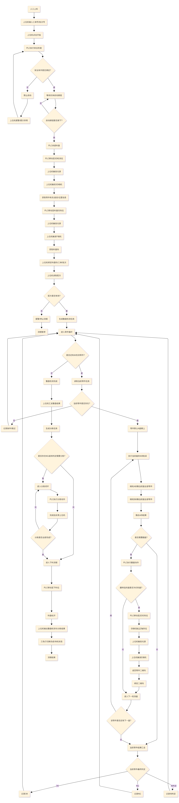

#### 图11-2 总时序图（SRC-06）

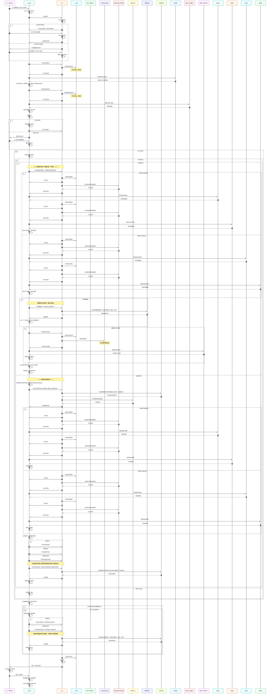

#### 图11-3 上下位机职责边界图（SRC-07）

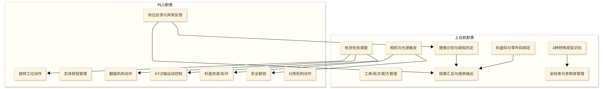

#### 图11-4 相机与轴组关系图（SRC-08）

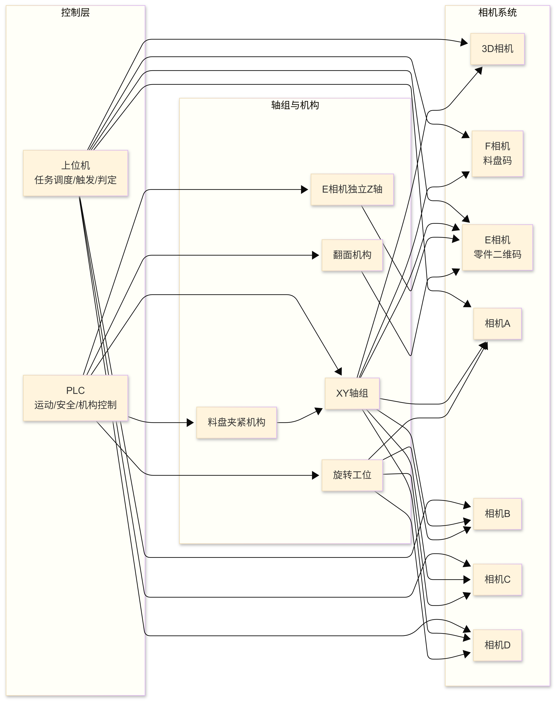

#### 图11-5 采集动作逻辑图（SRC-09）

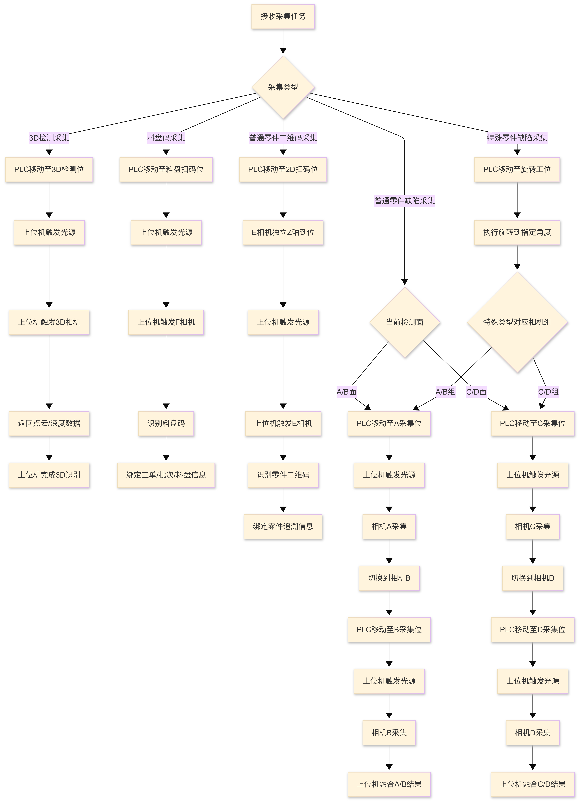

#### 图11-6 单零件检测闭环图（SRC-10）

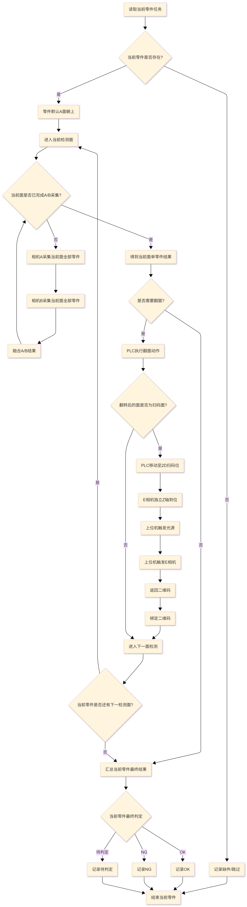

#### 图11-7 分拣动作单独闭环图（SRC-11）

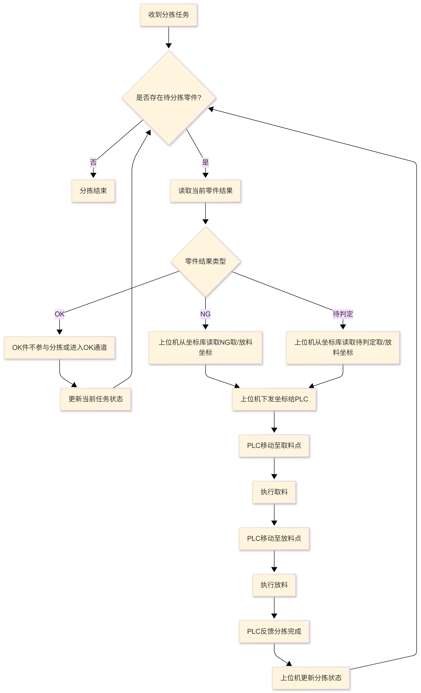

#### 图11-8 安全与实体按钮处理流程图（SRC-12）

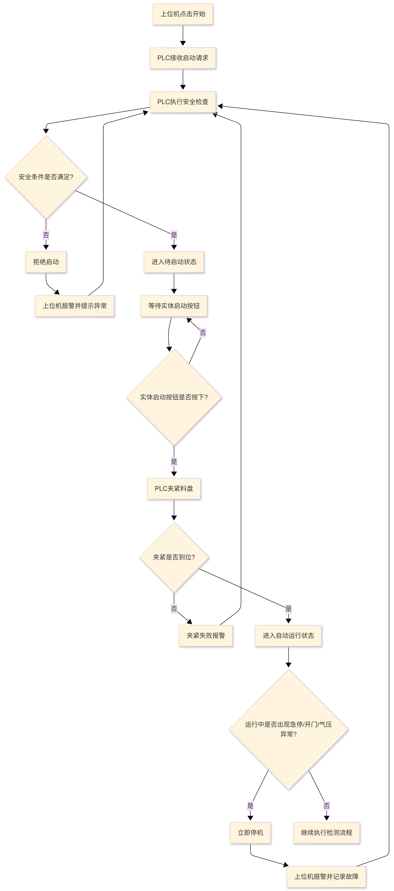

#### 图11-9 特殊零件类型判断图（SRC-13）

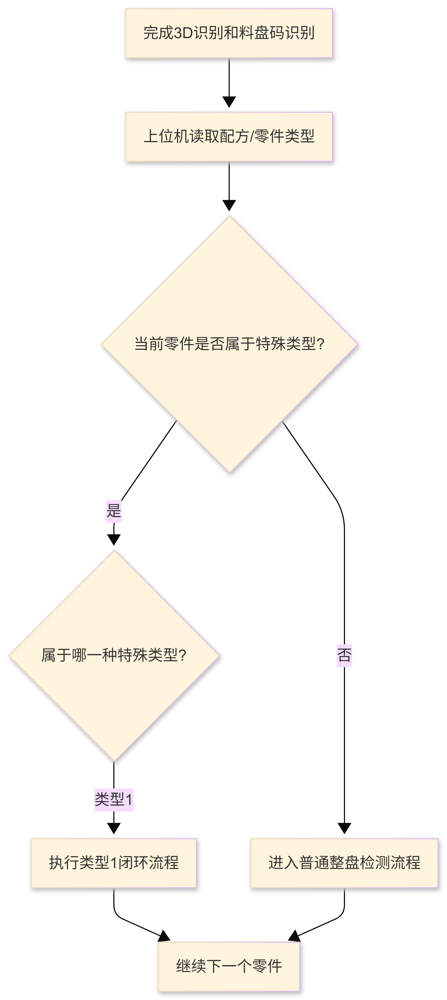

#### 图11-10 特殊零件单个闭环流程（SRC-14）

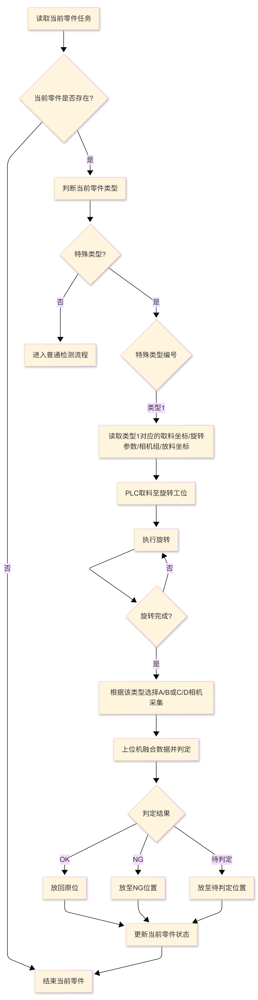

#### 图11-11 特殊零件单个检测闭环图（SRC-15）

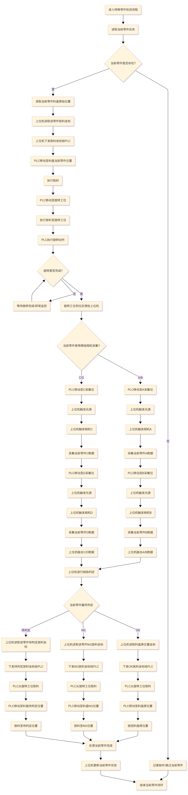

## 附录A 资料引用

USR-20260920为原9项开发范围调整；USR-20260924为本次三场景、按面AB/CD、F码配方绑定及全部运动/最新版PLC信号补充要求。适用优先级与差异见11.13。原文件名中的“验收”等仅是来源名称，不恢复本期已移除的交付验收范围。

| 来源 | 文件名 | 当前用途 |
| --- | --- | --- |
| SRC-01 | 软件算法系统技术规格书及验收标准V1.0 | 仅引用仍在本期范围的功能/参数，原交付和验收部分已排除。 |
| SRC-02 | [PLC与上位机通信接口协议_最新版_上下位机信号分区版.docx](../高德_文档/PLC与上位机通信接口协议_最新版_上下位机信号分区版.docx) | 本次指定接口来源；第7章同步地址、方向、类型、枚举和检测清零，差异见11.13。 |
| SRC-03 | [检测场景及零件整理(20260313).xlsx](<../高德_文档/检测场景及零件整理(20260313).xlsx>) | 型号/场景/成员/面数基线；第3章及11.1，逐面相机组具体值见OPEN-30。 |
| SRC-04 | 制冷机零件缺陷检测设备V0.5 | 参考原接口、场景或流程；与本轮说明冲突的条款按V1.1调整。 |
| SRC-05 | 整体流程图 | 参考原接口、场景或流程；与本轮说明冲突的条款按V1.1调整。 |
| SRC-06 | 总时序图 | 参考原接口、场景或流程；与本轮说明冲突的条款按V1.1调整。 |
| SRC-07 | 上下位机职责边界图 | 参考原接口、场景或流程；与本轮说明冲突的条款按V1.1调整。 |
| SRC-08 | 相机与轴组关系图 | 参考原接口、场景或流程；与本轮说明冲突的条款按V1.1调整。 |
| SRC-09 | 采集动作逻辑图 | 参考原接口、场景或流程；与本轮说明冲突的条款按V1.1调整。 |
| SRC-10 | 单零件检测闭环图 | 参考原接口、场景或流程；与本轮说明冲突的条款按V1.1调整。 |
| SRC-11 | 分拣动作单独闭环图 | 参考原接口、场景或流程；与本轮说明冲突的条款按V1.1调整。 |
| SRC-12 | 安全与实体按钮处理流程图 | 参考原接口、场景或流程；与本轮说明冲突的条款按V1.1调整。 |
| SRC-13 | 特殊零件类型判断图 | 参考原接口、场景或流程；与本轮说明冲突的条款按V1.1调整。 |
| SRC-14 | 特殊零件单个闭环流程 | 参考原接口、场景或流程；与本轮说明冲突的条款按V1.1调整。 |
| SRC-15 | 特殊零件单个检测闭环图 | 参考原接口、场景或流程；与本轮说明冲突的条款按V1.1调整。 |
| SRC-16 | [最新版PLC_VirtualPlc_第一工位配方接入说明.md](../高德_文档/最新版PLC_VirtualPlc_第一工位配方接入说明.md) | 现行公共准备、首次3D定位F、配置检测XYZ、F后冻结及分拣后下料接入说明；不是未定义现场信号的补充授权，旧历史顺序不作为新依据。 |

SRC-05至SRC-15全部原图的PNG/SVG相对链接、流程映射及图像见11.10/11.14。原始文件保持只读。Word/Markdown及Excel按本次直接受影响需求ID同步；历史开发状态不改为新版通过。V1.0仍为历史参考。

## 附录B 图示尺寸参考

原Excel中的尺寸标注仍作为几何参考保留，不是绝对运动点位，也不能据此自动生成X/Y坐标。单位、方向或含义不足的文字列待补充；具体生产固定坐标需单独提供。

| 单元格 | 机型 | 对象 | 原图文字 |
| --- | --- | --- | --- |
| C4 | A | 大底座压缩侧 | 45 |
| D4 | A | 大底座电机侧 | 52 |
| E4 | A | 大底座杜瓦侧 | 42 |
| F4 | A | 大底座阀钉侧 | 孔深13  孔径7 |
| G4 | A | 压缩端盖 | 外径30 |
| G4 | A | 压缩端盖 | 厚度5 |
| H4 | A | 转子外罩/电机外壳 | 外径40 |
| H4 | A | 转子外罩/电机外壳 | 43 |
| I4 | A | 杜瓦 | 此处外径最大40 |
| I4 | A | 杜瓦 | 检测面法兰外径26 |
| I4 | A | 杜瓦 | 88 |
| J4 | A | 冷指保护筒 | 法兰外径26 |
| J4 | A | 冷指保护筒 | 53 |
| C5 | B/C/D/E | 大底座压缩侧 | 52-58 |
| D5 | B/C/D/E | 大底座电机侧 | 45-50 |
| E5 | B/C/D/E | 大底座杜瓦侧 | 30-42 |
| F5 | B/C/D/E | 大底座阀钉侧 | 孔深13  孔径7 |
| G5 | B/C/D/E | 压缩端盖 | 长26-42；宽26-35 |
| G5 | B/C/D/E | 压缩端盖 | 厚度6-8 |
| H5 | B/C/D/E | 转子外罩/电机外壳 | 外径26-48 |
| H5 | B/C/D/E | 转子外罩/电机外壳 | 40-55 |
| I5 | B/C/D/E | 杜瓦 | 检测面；长30-40 宽30-40 |
| I4 | A | 杜瓦 | 检测面法兰外径26 |
| I5 | B/C/D/E | 杜瓦 | 此处外径最大50 |
| I5 | B/C/D/E | 杜瓦 | 90-100 |
| J5 | B/C/D/E | 冷指保护筒 | 检测面；长30-40 宽30-40 |
| J5 | B/C/D/E | 冷指保护筒 | 65-70 |
| K4 | A | 阀钉 | 外径6-8 |
| K5 | B/C/D/E | 阀钉 | 长度7-10 |
| F6 | F/G/H/I | 大底座阀钉侧 | 55-85 |
| F6 | F/G/H/I | 大底座阀钉侧 | 中部外径35-55 |
| G6 | F/G/H/I | 压缩端盖 | 厚度10-25 |
| G6 | F/G/H/I | 压缩端盖 | 外径30-40 |
| J6 | F/G/H/I | 冷指保护筒 | 外径30-40 |
| J6 | F/G/H/I | 冷指保护筒 | 40-65 |
| I6 | F/G/H/I | 杜瓦 | 外径30-50 |
| I6 | F/G/H/I | 杜瓦 | 70-100 |
| D11 | A | 半成品阀钉侧 | 阀钉孔在底侧 |
| C11 | A | 半成品杜瓦侧 | 83 |
| D11 | A | 半成品阀钉侧 | 90 |
| C11 | A | 半成品杜瓦侧 | 45 |
| D12 | B/C/D/E | 半成品阀钉侧 | 100-120 |
| C12 | B/C/D/E | 半成品杜瓦侧 | 70-80 |
| C12 | B/C/D/E | 半成品杜瓦侧 | 50-60 |
| D13 | F/G/H/I | 半成品阀钉侧 | 55-125 |
| C13 | F/G/H/I | 半成品杜瓦侧 | 外径25-45 |
| D12 | B/C/D/E | 半成品阀钉侧 | 伸出长度不超过65 |
| D11 | A | 半成品阀钉侧 | 伸出长度不超过65 |
| D11 | A | 半成品阀钉侧 | 阀钉孔在底侧 |

## 历史六项问题与当前承接（USR-20260926-E）

原问题及证据保留；新接口动作、四面3CD＋1AB、更多面和可选额外E及最小回归按当前第7/11章承接，不能以本节旧测试集合或原始协议值约束新实现。

本次依据USR-20260926-E（六项问题及四面范围确认）。协议原件为E:/dzk/gaode-1/高德_文档/PLC与上位机通信接口协议_最新版_上下位机信号分区版.docx；正文为上下位机信号分区版，修订日期2026年9月25日，SHA-256=405ac9ee2ae2d765951d9f523dc7195cc77f6cd1f38dbc0ad144a0013586c519。Office内置修订号2、修改时间2026-09-24T04:06:16Z仅为文件元数据，不代替正文修订日期；用户已确认该实际文件，不因口述名称差异重复确认。协议原件只读。

问题1—5为用户本地已观察、根因待运行核验的问题；不能凭源码存在逻辑直接关闭，也不能未经复现认定全部为通信缺漏。本次仅记录需求与验收，不声明复现、修复或运行通过。问题6为已确认范围变更，不是尚待复现的通信故障。

上位机与VirtualPlc均属于主项目，位置分别为E:/dzk/gaode-1/backend与E:/dzk/gaode-1/VirtualPlc；两端均须满足既有协议及以下验收要求，本次不修改任一端代码。

各动作按现有协议下发完整目标XYZ，读取本次实际XYZ并校验，使用该动作规定的Z轴；目标、实际坐标及关键握手须按运行、对象、面、步骤和动作关联查询。变化日志未显示相同值，不等于未实际读写；应以两端实际请求、接收及反馈证据区分目标或通信缺漏、实际反馈缺漏与日志显示省略。VirtualPlc必须实际接收指令并产生模拟反馈，Host不得伪造反馈。

问题1：扫码定位看不到完整XYZ下发。对应现行需求：CTL-006、CTL-010、DAT-008；003 FR04/FR15/FR19；008 FR-002/006/014。状态：用户已观察，根因待运行核验。

问题2：单面检测下发和返回缺Y。对应现行需求：CTL-006、ACQ-003、DAT-008；003 FR04/FR15；008 FR-002/014。状态：用户已观察，根因待运行核验。

问题3：第二拍照位下发只见X，返回缺Y。对应现行需求：CTL-006、ACQ-003、DAT-008；003 FR04/FR15；008 FR-002/003/014。状态：用户已观察，根因待运行核验。

问题4：下料下发缺Y，返回只见X。对应现行需求：SRT-009、CTL-006、DAT-008；003 FR15/FR16；008 FR-002/011/014。状态：用户已观察，根因待运行核验。

问题5：未观察到明确取料成功反馈后再进入放料。对应现行需求：SRT-004；003 FR19及同盘Sorting规范；008 FR-010。状态：用户已观察，根因待运行核验。

问题6：固定四面范围按最新确认收窄。对应现行需求：RCP-003、ACQ-003、第11.3节；003 FR06及成功条件；008 FR-004/015/018、SC-001。固定四面流程仅保留三个CD＋一个AB；全同组和二比二组合退出当前业务配方及必做验证范围。一面、两面规则保持；少数组所在面及执行位置由配方决定，不限定最后一面，不新增全排列实跑要求。成组成员和整体检测部位中的四面对象也须检查适用性；成组、整体、E扫码、旋转和人工换面等独立场景保留。

验收：对问题1—4逐动作核对完整目标、实际XYZ及轴归属，包含值相同和变化的情况；对问题5证明取料成功反馈在放料数据/命令之前，缺失或未知时不放料。检测、扫码、下料、翻面和清零复用第7章现行协议条款，不编造反馈或新信号。

USR-20260926-D故障完整新轮不变；RST-01/RST-02已关闭结论保留。旧Q编号、历史通过和失败证据不改写，范围退出不等于历史运行失效。

### 2026-10-05统一布局与检测顺序

固定10×10由操作员按NG/OK/Pending选择实际格位，左/中/右组织，不按数量生成矩形或补空位，槽数量只统计。第二页保持同位空格，各区左→右/上→下从1编号，格位+区域稳定关联点位和参数，取消/改区仅清本格，重编号不串其他格。OK号决定阶段内检测序，缺料/异常跳过保号；普通原面/成员/整盘统一分拣不改，特殊按11.7逐件闭环。行列/区域号/实体成员/3D物理槽的真实关联必须明确，不将显示号当PLC地址或推导NG/Pending分配。来源原件只读，其他合法场景显示差异见012 DUI-02/03。
